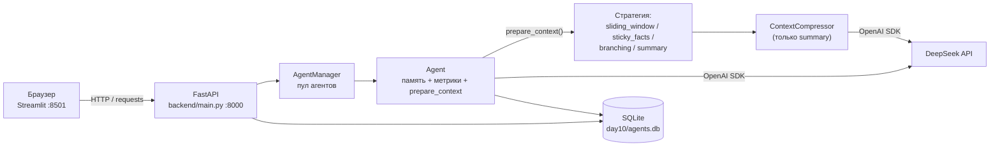

# Архитектура дня 10 — «Управление контекстом: стратегии»

День 10 развивает день 9 (`day9/` не изменяется) и добавляет **три новые
стратегии сборки контекста** поверх существующего сжатия истории, плюс
переключатель между ними. Всего стратегий четыре: `sliding_window`,
`sticky_facts`, `branching` и `summary` (сжатие из дня 9). Стратегия агента —
значение `Enum` (`backend/strategies.py`), сборка контекста — метод
`Agent.prepare_context()`, диспетчеризация по стратегии — его `_prepare_*`-ветки.

Стек: Python 3.14, FastAPI + uvicorn (порт 8000), Streamlit (порт 8501),
SQLite + SQLAlchemy 2.0, tiktoken, OpenAI SDK → DeepSeek
(`https://api.deepseek.com`), pytest.



## Стратегии управления контекстом

`Strategy` — перечисление (`backend/strategies.py`) со строковыми значениями;
поведение живёт в методах `Agent` (`prepare_context` → `_prepare_*`), а не в
Enum. Каждая стратегия формирует список сообщений для LLM по-своему:

| Стратегия | Что уходит в LLM | Плюсы | Минусы |
| --- | --- | --- | --- |
| `sliding_window` | system + последние `window_size` реплик + промпт | Дешевле всех, предсказуемо, один параметр | Вне окна теряется всё раннее — «память» равна окну |
| `sticky_facts` | system (+блок фактов) + последние `window_size` реплик + промпт | Детали не теряются: факты хранятся явно (таблица `facts`) | Блок фактов растёт и тратит токены; нужны явные формулировки «ключ: значение» |
| `branching` | system + вся история активной ветки + промпт | Ничего не теряет; позволяет ветвить диалог (таблица `checkpoints`) | Контекст растёт линейно; UI с деревом веток сложнее |
| `summary` | system (+конспект) + последние `keep_last_messages` непокрытых реплик + промпт | Хороший баланс «память/токены», работает автоматически | Качество зависит от суммаризации; точные значения могут «сплющиться» |

Сводка метрик по сценарию «собираем ТЗ» — в [`comparison.md`](../comparison.md).

## Компоненты

| Файл | Зона ответственности |
| --- | --- |
| `day10/app.py` | Streamlit-чат: переключатель стратегии (сайдбар), слайдер `window_size`, панель фактов, дерево веток, кнопка тестового сценария, панели сжатия/токенов и сравнения из дня 9 |
| `backend/strategies.py` | `Enum Strategy` (sliding_window/sticky_facts/branching/summary), `AVAILABLE_STRATEGIES`, `strategy_from_value` |
| `backend/fact_extractor.py` | Чистая эвристика `extract_facts`: «ключ: значение» / «ключ = значение» / «ключ — значение» |
| `backend/config.py` | URL и модели DeepSeek, дефолты агента, лимиты/тарифы, настройки сжатия, `DEFAULT_STRATEGY`/`DEFAULT_WINDOW_SIZE`, путь БД и `.env`, чтение ключа |
| `backend/context_fsm.py` | Стейт-машина процесса сжатия (Enum + паттерн State) — используется только стратегией `summary` |
| `backend/context_policy.py` | Чистая арифметика сжатия: `CompressionPolicy`, `CompressionPlan`, `plan_compression`, `split_uncovered` |
| `backend/database.py` | SQLAlchemy: движок, сессии, ORM-таблицы `agents`, `messages`, `summaries`, `token_usage`, `facts`, `checkpoints` |
| `backend/models.py` | Pydantic-схемы API: конфигурация/патч агента, `StrategySetRequest`, `StrategiesOut`, `BranchCreateRequest`/`BranchOut`/`BranchListOut`, `FactOut`/`FactsOut`, схемы дня 9 |
| `backend/compressor.py` | `ContextCompressor`: план сжатия, суммаризация, запись в `summaries` (только `summary`) |
| `backend/agent.py` | `Agent`: память, токены, `prepare_context` + `_prepare_*`, факты (`_upsert_facts`, `list_facts`), ветки (`create_branch`/`switch_branch`/`list_branches`), `generate`, `compare_modes`, `summary_state` |
| `backend/agent_manager.py` | `AgentManager` (синглтон): пул, `restore_from_db`, `set_strategy`, `create_branch`/`switch_branch`/`list_branches`, `get_facts`, PATCH, агрегаты `token_usage` |
| `backend/main.py` | FastAPI: 19 эндпоинтов, `GET /`, обработка 404/422/502 |
| `tests/` | Офлайн-тесты (фейковый клиент DeepSeek + временная SQLite) по всем слоям |

Схема потоков одного хода:

```
Streamlit app.py ──HTTP──▶ FastAPI main.py ──▶ AgentManager ──▶ Agent
                                                                │
                                               prepare_context()┤ (по стратегии)
                                                                ▼
                                         sliding_window ── последние N реплик
                                         sticky_facts  ── факты + последние N
                                         branching     ── вся активная ветка
                                         summary       ── ContextCompressor ──▶ DeepSeek
                                                                │
                                                                ▼
                                              SQLite agents.db (messages / facts /
                                              checkpoints / summaries / token_usage)
```

## Схема БД (`day10/agents.db`)

Шесть таблиц; от агента — пять связей один-ко-многим с каскадным удалением:

```
agents (1) ──< messages     (N)   полный диалог user/assistant (активная ветка)
    │        ──< summaries   (N)   конспекты, append-only (стратегия summary)
    │        ──< token_usage (N)   метрики каждого успешного хода
    │        ──< facts       (N)   факты «ключ → значение» (sticky_facts)
    └────────< checkpoints  (N)   снимки истории/ветки (branching)
             (agent_id FK → agents.agent_id, ondelete CASCADE, index)
```

**`agents`** — конфигурация агента.
`agent_id` (PK, String), `name` (String(100)), `model` (String(100)),
`temperature` (Float), `system_prompt` (Text, default `""`),
`max_tokens` (Integer), `created_at` (DateTime),
`summary_enabled` (Boolean, default `True`), `keep_last_messages` (Integer,
default `6`), `summarize_every` (Integer, default `10`),
`strategy` (String(32), default `"summary"`), `window_size` (Integer,
default `10`).

**`messages`** — реплики диалога.
`id` (Integer PK, autoincrement), `agent_id` (FK→`agents.agent_id`, CASCADE,
index), `role` (String(16)), `content` (Text), `timestamp` (DateTime).
Это **полная** история **активной ветки**: при сжатии реплики НЕ удаляются
(конспект заменяет их только в запросе), а при переключении ветки таблица
перезаписывается снимком выбранной ветки. Фронтенд помечает покрытые конспектом
реплики флагом `summarized`.

**`summaries`** — конспекты, **append-only** (стратегия `summary`).
`id` (Integer PK), `agent_id` (FK, CASCADE, index), `content` (Text),
`covered_from_message_id` / `covered_to_message_id` (Integer — границы и
watermark), `covered_messages`, `source_tokens`, `summary_tokens`,
`prompt_tokens`, `completion_tokens` (Integer), `cost` (Float),
`created_at` (DateTime).
Каждая успешная суммаризация добавляет новую строку, старые не изменяются;
**текущий конспект = последняя строка** (`ORDER BY id DESC`).

**`token_usage`** — одна запись на успешный ход.
Базовые поля дня 8: `id` (PK), `agent_id` (FK, CASCADE, index), `timestamp`,
`prompt_tokens`, `completion_tokens`, `total_tokens`, `history_tokens`,
`response_tokens` (Integer), `cost` (Float).
Поля дня 9: `mode` (String(16): `"full"`/`"compressed"` для summary, иначе имя
стратегии), `full_context_tokens`, `sent_context_tokens`, `saved_tokens`,
`summary_tokens`, `summarized_messages` (Integer), `summary_used` (Boolean).

**`facts`** — факты «ключ → значение» (стратегия `sticky_facts`).
`id` (Integer PK), `agent_id` (FK, CASCADE, index), `key` (String(200)),
`value` (Text), `updated_at` (DateTime). Пара `(agent_id, key)` уникальна
(`UniqueConstraint`): повторное извлечение того же ключа обновляет `value` и
`updated_at`, а не плодит дубли. Экстракция — эвристика `fact_extractor.py`,
сохранение — `Agent._upsert_facts` (ПОСЛЕ успешного хода).

**`checkpoints`** — снимки истории/ветки (стратегия `branching`).
`id` (Integer PK), `agent_id` (FK, CASCADE, index), `parent_id` (Integer,
nullable — от какого чекпоинта создана ветка, `NULL` у корня),
`messages` (JSON — список `[{"role", "content"}, …]`, полный снимок истории),
`created_at` (DateTime). Активная ветка хранится в памяти (`Agent.active_branch_id`)
и обновляется после каждого успешного хода (`_snapshot_branch_tip`); переключение
(`switch_branch`) перезаписывает `messages`-историю агента снимком ветки.

Каскады включены и на уровне ORM (`cascade="all, delete-orphan"`), и на уровне
БД (`PRAGMA foreign_keys=ON` в `make_engine`). `DELETE /agents/{id}` удаляет
агента вместе с `messages`, `summaries`, `token_usage`, `facts`, `checkpoints`;
`DELETE /agents/{id}/history` очищает их все, не трогая конфигурацию. Таблицы
создаются при старте бэкенда (`init_db` → `create_all`), файл `agents.db` в git
не попадает (правило `*.db`).

## Подготовка контекста (`prepare_context`)

`Agent.generate(prompt)` сначала кладёт реплику пользователя в память, затем
вызывает `prepare_context(prompt)`, который по `self.strategy` диспетчеризует в
одну из веток `_prepare_*` и возвращает словарь `{payload, context_tokens,
full_context_tokens, mode, summary_used, kept_messages, new_facts, …}`:

| Стратегия | `_prepare_*` | Состав payload |
| --- | --- | --- |
| `sliding_window` | `_prepare_sliding_window` | `_system_message()` + последние `window_size` реплик + промпт |
| `sticky_facts` | `_prepare_sticky_facts` | `_system_message(facts=merged)` + последние `window_size` + промпт |
| `branching` | `_prepare_branching` | `_system_message()` + вся история активной ветки + промпт |
| `summary` | `_prepare_summary` | `build_payloads(prompt)` (день 9: конспект + последние непокрытые) |

Пост-ходовые действия в `generate` по стратегии: `summary` → `compress_now()`;
`sticky_facts` → `_upsert_facts(new_facts + extract_facts(answer))`;
`branching` → `_snapshot_branch_tip()`. Аварийная обрезка `_emergency_trim`
применяется к любому собранному payload одинаково (реплики из БД не удаляются).

## Правило сжатия

Вся арифметика — в `context_policy.py`, без побочных эффектов.
`CompressionPolicy(enabled, keep_last, summarize_every)` — настройки агента,
`plan_compression(policy, uncovered_count)` считает:

| Величина | Формула |
| --- | --- |
| `backlog` | `uncovered_count − keep_last` |
| `should_compress` | `enabled and backlog >= summarize_every` |
| `summarize_count` (при сжатии) | `backlog` — самые старые непокрытые реплики |
| `keep_count` (при сжатии) | `keep_last` — последние непокрытые реплики |
| `summarize_count` / `keep_count` (без сжатия) | `0` / `uncovered_count` |

Инварианты проверяются явно: `uncovered_count < 0`, `keep_last < 1` или
`summarize_every < 1` → `ValueError`. `split_uncovered(rows, plan)` режет
последовательность на «в конспект» и «оставить» и требует, чтобы
`len(rows) == plan.uncovered_count` (иначе `ValueError`, а не молчаливая
потеря реплик).

**Пример расчёта** при `keep_last = 6`, `summarize_every = 10`,
`uncovered_count = 17`:

```
backlog = 17 − 6 = 11
should_compress = True   (11 >= 10)
summarize_count = 11     → 11 самых старых реплик уходят в конспект
keep_count = 6           → 6 последних уходят в запрос как есть
```

Граница среза выравнивается по паре реплик (`_compress_slice`): если первый
оставляемый остаток — ответ `assistant`, он тоже уходит в конспект, чтобы
«хвост» всегда начинался с реплики пользователя.

**Payload запроса при включённом сжатии:**

```
[system: system_prompt + «Конспект предыдущей части диалога …»]
+ последние keep_last НЕПОКРЫТЫХ конспектом реплик
+ новое сообщение пользователя
```

Конспект вкладывается в **существующее** system-сообщение, а не добавляется
вторым: так поведение не зависит от того, как провайдер обрабатывает несколько
system-сообщений подряд. Если нет ни конспекта, ни `system_prompt`, отдельного
system-сообщения в payload нет вовсе. Без конспекта и с выключенным сжатием
payload равен «системный промпт + вся история + промпт» — поведение дня 8.

## Стейт-машина сжатия

`ContextState`: `IDLE="idle"`, `TRACKING="tracking"`,
`SUMMARY_PENDING="summary_pending"`, `SUMMARIZING="summarizing"`,
`ERROR="error"`.
`ContextEvent`: `TURN_ADDED`, `THRESHOLD_REACHED`, `SUMMARY_REQUESTED`,
`SUMMARY_READY`, `SUMMARY_FAILED`, `RESET`, `DISABLED`, `ENABLED`.

| Состояние | TURN_ADDED | THRESHOLD_REACHED | SUMMARY_REQUESTED | SUMMARY_READY | SUMMARY_FAILED | RESET | DISABLED | ENABLED |
| --- | --- | --- | --- | --- | --- | --- | --- | --- |
| IDLE | TRACKING | — | — | — | — | IDLE | IDLE | IDLE |
| TRACKING | TRACKING | SUMMARY_PENDING | — | — | — | IDLE | IDLE | — |
| SUMMARY_PENDING | SUMMARY_PENDING | — | SUMMARIZING | — | — | IDLE | IDLE | — |
| SUMMARIZING | — | — | — | TRACKING | ERROR | — | — | — |
| ERROR | TRACKING | — | — | — | — | IDLE | IDLE | — |

Прочерк — не «тихое зависание», а явная ошибка `UnknownContextEvent`: базовое
состояние поднимает исключение для любого не переопределённого события. Пока
идёт вызов суммаризации, `SUMMARIZING` принимает только его исход
(`SUMMARY_READY`/`SUMMARY_FAILED`) — прерывать полёт нечем, поэтому даже
`RESET` в этом состоянии считается ошибкой.

Экспортируемые имена (`__all__`): `ContextState`, `ContextEvent`,
`UnknownContextEvent`, `ContextStateBase`, `IdleState`, `TrackingState`,
`SummaryPendingState`, `SummarizingState`, `ErrorState`, `ContextMachine`,
`STATE_BY_VALUE`, `STATE_CLASS_BY_STATE`, `state_from_value`.
`ContextMachine(state=None)` стартует в `IDLE`; методы — `dispatch(event)`,
`reset()`, `state_value()`, `is_idle()`; свойство — `state` (объект состояния).
`state_from_value(value)` восстанавливает объект состояния по строке и кидает
`ValueError` на неизвестное значение (никакого «тихого» отката в IDLE).

**Состояние НЕ хранится в БД.** Оно полностью выводимо из watermark
(`covered_to_message_id`), числа непокрытых реплик и порога, поэтому
рестарт бэкенда не может его «испортить». Синхронизацию выполняет
`Agent.refresh_context_state()`: выключенное сжатие → IDLE; план требует
сжатия → TRACKING и `THRESHOLD_REACHED` → SUMMARY_PENDING; есть непокрытые
реплики → TRACKING; иначе → IDLE. Метод вызывается при создании агента,
после `restore_from_db`, после PATCH и при чтении `summary_state()`.

## Поток одного запроса

`POST /agents/{agent_id}/generate` → `Agent.generate(prompt)`:

1. **Реплика пользователя** добавляется в `self.messages` (в памяти; в БД — не
   раньше успеха).
2. **Сборка контекста** (`prepare_context`): по `self.strategy` строится payload
   (окно / факты / ветка / конспект). Для `summary` дополнительно считаются два
   варианта (полный — «что было бы без сжатия», и сжатый — фактический) ради
   метрик экономии; для остальных стратегий `full_context_tokens` — оценка
   полной истории.
3. **Аварийный предохранитель** (`_emergency_trim`): если payload больше лимита
   модели, самые старые **целые пары** реплик не отправляются в этом запросе
   (`context.trimmed_messages`), но в БД остаются. Если и пустая история не
   влезает — `status: "error"` **без вызова API** и без изменения БД.
4. **Вызов DeepSeek.** При сбое (нет ключа, сеть, лимиты) реплика пользователя
   откатывается, ответ `status: "error"`, история не меняется.
5. **Сохранение.** При успехе считаются метрики (фактический `usage` API, иначе
   оценки tiktoken) и пара реплик `user`+`assistant` вместе с записью
   `token_usage` сохраняются **одной транзакцией**.
6. **Пост-ходовое действие по стратегии**: `summary` → `compress_now()`
   (FSM `TRACKING → SUMMARY_PENDING → SUMMARIZING → TRACKING` либо `ERROR`),
   `sticky_facts` → `_upsert_facts(...)`, `branching` → `_snapshot_branch_tip()`.
   Ошибка сжатия **не отменяет** ответ — она видна в `context.compression.error`.

## Экономика токенов

Для каждого хода считаются две величины:

| Метрика | Смысл |
| --- | --- |
| `saved_tokens` | `full_context_tokens − sent_context_tokens` (оценка tiktoken, не меньше 0) — сколько токенов контекста сэкономил конспект в этом запросе |
| `net_saved_tokens` | сэкономленные токены ходов минус собственные токены вызовов суммаризации (`prompt_tokens + completion_tokens` из таблицы `summaries`) |

Стоимость (`cost`) приблизительная и считается по тарифам `MODEL_PRICES`:

```
cost = prompt_tokens / 1_000_000 * IN  +  completion_tokens / 1_000_000 * OUT
```

(округление до 6 знаков). Для `deepseek-chat` — 0.27 / 1.10, для
`deepseek-reasoner` — 0.55 / 2.19 $ за 1 млн токенов.

При коротких репликах net-экономия может оказаться **отрицательной**: вызов
суммаризации сам тратит токены на вход (старые реплики + предыдущий конспект)
и выход (текст конспекта), а заменяемые реплики в демо-диалоге короткие. Это
ожидаемое поведение, а не ошибка: сжатие окупается на длинных репликах, а
порог `summarize_every` и `keep_last_messages` подбираются под их типичную
длину. В `/summary` обе метрики возвращаются рядом (`saved_tokens`,
`net_saved_tokens`), поэтому в интерфейсе видно и «грязную», и честную экономию.

## Интерфейс

Streamlit-приложение (`app.py`) ходит в бэкенд по
`DAY10_BACKEND_URL` (по умолчанию `http://127.0.0.1:8000`), таймаут 90 с
(сравнение с вызовами API делает два запроса к DeepSeek). Ключ фронтенду не
нужен — его читает бэкенд.

| Элемент | Что показывает / делает |
| --- | --- |
| Сайдбар «⚙️ Стратегия контекста» | Выпадающий список стратегии (Sliding Window / Sticky Facts / Branching / Summary) и слайдер `window_size` (2–50) для активного агента; кнопка «Применить стратегию» (`POST /agents/{id}/strategy`) |
| Сайдбар | Статус бэкенда, «🔄 Обновить список», форма нового агента (имя, модель, температура, системный промпт, `max_tokens`, настройки сжатия) |
| Список агентов | Подпись «имя · модель · N сообщений · стратегия» |
| Карточка агента | Индикация текущей стратегии, `window_size`, а для branching — активная ветка |
| Панель «📌 Факты диалога» | (sticky_facts) таблица фактов «ключ/значение/обновлено» в реальном времени |
| Панель «🌿 Ветвление истории» | (branching) дерево веток с отступами, активная ветка 🟢, кнопка «↩» переключения и «🌱 Новая ветка от текущего сообщения» |
| «🎬 Запустить тестовый сценарий» | Прогон сценария «собираем ТЗ» (12 реплик) текущей стратегией; для branching — с демонстрацией развилки |
| Панель «🗜 Сжатие контекста» | (summary) состояние процесса, конспект, экономика, кнопки «Сжать сейчас» и переключатель сжатия |
| Панель «📊 Токены диалога» | 4 метрики, прогресс контекста, график роста и экономии, таблица `token_usage` |
| «⚖️ Сравнить режимы» (expander) | Сравнение «без сжатия / со сжатием» (из дня 9) |
| Диалог | Чат + маркер сжатия на границе конспекта (для summary) |
| Сводка после хода | Одна плашка: время, токены, стоимость, `finish_reason`, предупреждения |

При недоступном бэкенде приложение не падает: сверху появляется
предупреждение с командой запуска
(`uvicorn backend.main:app --port 8000`), панели молча пропускаются.

## Тесты

Все тесты офлайн: фейковый клиент DeepSeek (`tests/support.py`), временная
SQLite-БД (фикстуры `session_factory` и `make_agent`). Всего **193** теста,
зелёные. Запуск из папки `day10`:

```
.venv/Scripts/python -m pytest -q
```

| Файл | Что проверяет |
| --- | --- |
| `tests/test_context_fsm.py` | Таблица переходов всех состояний, включая негативные (неизвестное событие → `UnknownContextEvent`), и `state_from_value` |
| `tests/test_context_policy.py` | Границы порога, инварианты плана, `ValueError` на некорректных входах |
| `tests/test_fact_extractor.py` | Эвристика `extract_facts`: форматы, нормализация ключей, кавычки, `merge_facts` |
| `tests/test_strategies.py` | `prepare_context` для всех четырёх стратегий, факты (извлечение/обновление/персистентность), ветки (снимок/форк/переключение), методы `AgentManager` |
| `tests/test_strategy_api.py` | Эндпоинты дня 10: `/strategy`, `/strategies`, `/branches`, `/branches/{id}/switch`, `/facts`, 404/422 |
| `tests/test_storage.py` | Таблица `summaries`, watermark, каскадное удаление, метрики |
| `tests/test_compressor.py` | План сжатия, вызов суммаризации, деградация при сбое |
| `tests/test_agent_compression.py` | Сборка payload, экономия, FSM, аварийный предохранитель |
| `tests/test_api.py` | Контракты эндпоинтов дня 9 через `TestClient` |

## Сценарий демонстрации (видео)

1. Создать агента `deepseek-chat` (стратегия по умолчанию — `summary`).
2. В сайдбаре «⚙️ Стратегия контекста» показать переключатель: сменить на
   «🪟 Sliding Window», задать `window_size = 5`, нажать «Применить».
3. Нажать «🎬 Запустить тестовый сценарий» — 12 реплик «собираем ТЗ». Показать,
   что финальный ответ «видит» только последние реплики (ранние требования
   потеряны) — дешево, но с потерей деталей.
4. Сменить стратегию на «📌 Sticky Facts» и снова прогнать сценарий: панель
   «📌 Факты диалога» наполняется, все 12 фактов сохраняются, контекст компактен.
5. Сменить на «🌿 Branching»: прогнать сценарий, затем нажать «🌱 Новая ветка от
   текущего сообщения» и показать дерево веток + переключение «↩».
6. Вернуть «🗜 Summary» и показать панель сжатия (конспект, экономия), затем
   «⚖️ Сравнить режимы».
7. Открыть `day10/agents.db` в SQLite-клиенте: таблицы `facts`, `checkpoints`,
   `summaries`, `token_usage`.

Сводная таблица метрик — в [`comparison.md`](../comparison.md).

## Ограничения

- **Один процесс бэкенда и один файл `day10/agents.db`.** Несколько процессов
  на одну базу не рассчитаны (менеджер — синглтон в памяти).
- **Активная ветка не переживает рестарт.** `Agent.active_branch_id` хранится в
  памяти процесса: после перезапуска бэкенда дерево веток в `checkpoints`
  остаётся, но активная ветка сбрасывается (продолжается ствол).
- **Переключение ветки перезаписывает таблицу `messages`.** История — снимок
  активной ветки; остальные ветки сохраняются только в `checkpoints`.
- **Извлечение фактов — эвристика.** `fact_extractor.py` ловит явные
  «ключ: значение», а не произвольный текст; LLM-извлечение фактов не
  реализовано (потребовало бы отдельного вызова на каждый ход).
- **Оценки tiktoken приблизительны.** Используется кодировка `cl100k_base`,
  тогда как у DeepSeek свой токенизатор. Для запроса и ответа приоритет —
  фактические значения `usage` API; локальные оценки нужны там, где API их не
  вернул, и для сравнения режимов без вызова сети.
- **Лимиты контекста демонстрационные:** `MODEL_TOKEN_LIMITS` — 8 000 для
  `deepseek-chat` и 32 000 для `deepseek-reasoner`. Реальный контекст шире.
- **`deepseek-reasoner`** может игнорировать `temperature`, а его скрытые
  рассуждения попадают в `completion_tokens`. Суммаризация всегда идёт на
  `deepseek-chat` (`SUMMARY_MODEL`).
- **Сжатие коротких реплик невыгодно** (net-экономия может быть отрицательной).
- **Стоимость приблизительная:** тарифы `MODEL_PRICES` не учитывают кэширование
  и скидки провайдера.
