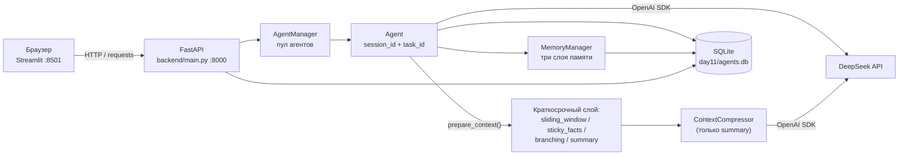

# Архитектура дня 11 — «Трёхслойная модель памяти агента»

День 11 развивает день 10 (`day10/` не изменяется): единая история диалога
заменена **тремя явными слоями памяти** — краткосрочной (диалог сессии),
рабочей (данные задачи) и долговременной (профиль, предпочтения, решения,
знания). Хранилищем слоёв заведует `MemoryManager` (`backend/memory.py`), а
`Agent` при сборке контекста решает, что взять из каждого слоя, и возвращает
разбивку токенов по слоям. Стратегии сборки контекста из дня 10
(`sliding_window`, `sticky_facts`, `branching`, `summary`) сохранены и
управляют **краткосрочным** слоем; стратегия агента — значение `Enum`
(`backend/strategies.py`), сборка контекста — `Agent.prepare_context()`,
диспетчеризация по стратегии — его `_prepare_*`-ветки.

Стек: Python 3.14, FastAPI + uvicorn (порт 8000), Streamlit (порт 8501),
SQLite + SQLAlchemy 2.0, tiktoken, OpenAI SDK → DeepSeek
(`https://api.deepseek.com`), pytest.



## Стратегии управления контекстом

`Strategy` — перечисление (`backend/strategies.py`) со строковыми значениями;
поведение живёт в методах `Agent` (`prepare_context` → `_prepare_*`), а не в
Enum. Каждая стратегия формирует список сообщений для LLM по-своему:

| Стратегия | Что уходит в LLM | Плюсы | Минусы |
| --- | --- | --- | --- |
| `sliding_window` | system + последние `window_size` реплик + промпт | Дешевле всех, предсказуемо, один параметр | Вне окна теряется всё раннее — «память» равна окну |
| `sticky_facts` | system (+блок фактов) + последние `window_size` реплик + промпт | Детали не теряются: факты хранятся явно (таблица `facts`) | Блок фактов растёт и тратит токены; нужны явные формулировки «ключ: значение» |
| `branching` | system + вся история активной ветки + промпт | Ничего не теряет; позволяет ветвить диалог (таблица `checkpoints`) | Контекст растёт линейно; UI с деревом веток сложнее |
| `summary` | system (+конспект) + последние `keep_last_messages` непокрытых реплик + промпт | Хороший баланс «память/токены», работает автоматически | Качество зависит от суммаризации; точные значения могут «сплющиться» |

Сводка метрик по сценарию «собираем ТЗ» — в [`comparison.md`](../comparison.md).

## Компоненты

| Файл | Зона ответственности |
| --- | --- |
| `day11/app.py` | Streamlit-чат: панели трёх слоёв памяти (вкладки), блок «🗂 Задача и сессия» (переключатель задачи, «🆕 Новая сессия»), индикатор слоёв перед диалогом, переключатель стратегии, панели фактов/веток/токенов, кнопка тестового сценария |
| `memory_layers_demo.py` | Сценарий «собираем ТЗ» на трёх слоях: маршрутизация реплик, доказательства после `new_session()`, запись отчёта `memory_layers_comparison.md` |
| `backend/memory.py` | `MemoryManager` (сессии/задачи/категории), `Enum MemoryCategory`, чистые `query_keywords`, `render_working_block`, `render_long_term_block` |
| `backend/strategies.py` | `Enum Strategy` (sliding_window/sticky_facts/branching/summary), `AVAILABLE_STRATEGIES`, `strategy_from_value` |
| `backend/fact_extractor.py` | Чистая эвристика `extract_facts`: «ключ: значение» / «ключ = значение» / «ключ — значение» |
| `backend/config.py` | URL и модели DeepSeek, дефолты агента, лимиты/тарифы, настройки сжатия, `DEFAULT_STRATEGY`/`DEFAULT_WINDOW_SIZE`, константы слоёв (`DEFAULT_TASK_ID`, `LONG_TERM_LIMIT`, лимиты записей), путь БД и `.env` |
| `backend/context_fsm.py` | Стейт-машина процесса сжатия (Enum + паттерн State) — используется только стратегией `summary` |
| `backend/context_policy.py` | Чистая арифметика сжатия: `CompressionPolicy`, `CompressionPlan`, `plan_compression`, `split_uncovered` |
| `backend/database.py` | SQLAlchemy: движок, сессии, ORM-таблицы `agents`, `short_term_messages`, `working_memory`, `long_term_memory`, `summaries`, `token_usage`, `facts`, `checkpoints` |
| `backend/models.py` | Pydantic-схемы API: конфигурация/патч агента, стратегии, ветки, факты, тела и ответы эндпоинтов памяти, `MemoryInfo` в ответе генерации |
| `backend/compressor.py` | `ContextCompressor`: план сжатия, суммаризация, запись в `summaries` (только `summary`) |
| `backend/agent.py` | `Agent`: `session_id`/`task_id`, слои памяти (`new_session`, `set_task`, `build_memory_context`, `memory_state`), токены, `prepare_context` + `_prepare_*`, факты, ветки, `generate`, `compare_modes`, `summary_state` |
| `backend/agent_manager.py` | `AgentManager` (синглтон): пул, `restore_from_db`, стратегии, ветки, факты, обёртки слоёв памяти, агрегаты `token_usage` |
| `backend/main.py` | FastAPI: 29 эндпоинтов, `GET /`, обработка 404/422/502 |
| `tests/` | Офлайн-тесты (фейковый клиент DeepSeek + временная SQLite) по всем слоям |

Схема потоков одного хода:

```
Streamlit app.py ──HTTP──▶ FastAPI main.py ──▶ AgentManager ──▶ Agent
                                                                │
                                          build_memory_context()┤ рабочая + долговременная
                                                                │ (blocks → system message)
                                               prepare_context()┤ краткосрочный слой по стратегии
                                                                ▼
                                         sliding_window ── последние N реплик
                                         sticky_facts  ── факты + последние N
                                         branching     ── вся активная ветка
                                         summary       ── ContextCompressor ──▶ DeepSeek
                                                                │
                                                                ▼
                                     SQLite agents.db (short_term_messages / working_memory /
                                       long_term_memory / facts / checkpoints / summaries /
                                       token_usage)
```

## Слои памяти агента

Три слоя (`backend/memory.py`) отличаются не только содержимым, но и ключом, к
которому привязаны записи, — поэтому у каждого свой жизненный цикл.

| Слой | Таблица | Ключ | Что хранит |
| --- | --- | --- | --- |
| 👤 Краткосрочная | `short_term_messages` | `agent_id` + `session_id` | реплики текущего диалога: `role`, `content`, `created_at` |
| 🗂 Рабочая | `working_memory` | `agent_id` + `task_id` + `key` | данные активной задачи: цель, ограничения, решения, критерии приёмки |
| 🧠 Долговременная | `long_term_memory` | `agent_id` + `category` + `key` | `profile`, `preference`, `decision`, `knowledge` + `confidence` (0..1) |

Активные `session_id` и `task_id` хранит строка `agents`
(`current_session_id` / `current_task_id`) — это источник правды при рестарте
бэкенда, поэтому диалог и задача восстанавливаются вместе с агентом.

`MemoryCategory` — `Enum` категорий долговременного слоя; значение (строка)
попадает в БД, API и UI без дополнительного маппинга.

### Методы `MemoryManager`

| Метод | Что делает |
| --- | --- |
| `add_short_term(agent_id, session_id, role, content)` | INSERT реплики; пустые `session_id`/`role`/`content` → `ValueError` |
| `get_short_term(agent_id, session_id, limit=None)` | реплики сессии по возрастанию `id`; `limit` — хвост (последние N) в хронологическом порядке |
| `count_short_term`, `clear_short_term` | число реплик сессии / удаление реплик сессии (возвращает число удалённых, 0 — не ошибка) |
| `add_working(agent_id, task_id, key, value)` | upsert по `(agent_id, task_id, key)`: та же пара перезаписывает `value` и `updated_at` |
| `get_working(agent_id, task_id)` | все записи задачи, сортировка по `key` |
| `list_tasks(agent_id)` | `DISTINCT task_id` агента по алфавиту (для селектора в UI) |
| `add_long_term(agent_id, category, key, value, confidence=1.0)` | upsert по `(agent_id, category, key)`; категория вне `AVAILABLE_CATEGORIES` или `confidence` вне `[0, 1]` → `ValueError` |
| `get_long_term(agent_id, category=None)` | все записи агента или одной категории, сортировка `(category, key)` |
| `delete_long_term(agent_id, entry_id)` | `DELETE` по id; `False`, если записи не было (API отвечает 404) |
| `select_long_term(agent_id, query, limit)` | отбор релевантных записей для запроса (см. следующий раздел) |

Менеджер принимает фабрику сессий (`session_factory`) и обслуживает всех
агентов: `agent_id` передаётся в каждый метод явно.

### Правила выбора данных в контекст

* **Краткосрочная память** — по стратегии агента: последние `keep_last_messages`
  непокрытых конспектом реплик (summary), последние `window_size` (sliding
  window / sticky facts) или вся история активной ветки (branching).
* **Рабочая память** — **все** записи активной задачи: они уходят блоком
  «Рабочая память (данные текущей задачи…)» сразу после системного промпта.
* **Долговременная память** — до `config.LONG_TERM_LIMIT` (5) записей: сначала
  те, чьи `key`/`value` содержат ключевые слова запроса (`query_keywords`: слова
  длиной ≥ 3 без стоп-слов) или чья категория упомянута в запросе, затем добор
  самыми уверенными. Так профиль пользователя попадает в контекст даже без
  совпадений, а отбор детерминирован (одинаковый вход → одинаковый результат).


## Схема БД (`day11/agents.db`)

Восемь таблиц; от агента — семь связей один-ко-многим с каскадным удалением:

```
agents (1) ──< short_term_messages (N)  краткосрочная память: реплики сессии
    │        ──< working_memory       (N)  рабочая память: ключи задачи
    │        ──< long_term_memory     (N)  долговременная: категория + ключ
    │        ──< summaries            (N)  конспекты, append-only (summary)
    │        ──< token_usage          (N)  метрики хода + токены по слоям
    │        ──< facts                (N)  факты «ключ → значение» (sticky_facts)
    └────────< checkpoints            (N)  снимки истории/ветки (branching)
             (agent_id FK → agents.agent_id, ondelete CASCADE, index)
```

**`agents`** — конфигурация агента.
`agent_id` (PK, String), `name` (String(100)), `model` (String(100)),
`temperature` (Float), `system_prompt` (Text, default `""`),
`max_tokens` (Integer), `created_at` (DateTime),
`summary_enabled` (Boolean, default `True`), `keep_last_messages` (Integer,
default `6`), `summarize_every` (Integer, default `10`),
`strategy` (String(32), default `"summary"`), `window_size` (Integer,
default `10`), `current_session_id` (String(32) — активная сессия
краткосрочного слоя, обязательное поле), `current_task_id` (String(64),
default `"default"` — активная задача рабочей памяти).

**`short_term_messages`** — краткосрочная память.
`id` (Integer PK, autoincrement), `agent_id` (FK→`agents.agent_id`, CASCADE,
index), `session_id` (String(32), index), `role` (String(16)), `content` (Text),
`created_at` (DateTime).
Диалог **одной сессии**: при сжатии реплики НЕ удаляются (конспект заменяет их
только в запросе), при переключении ветки таблица перезаписывается снимком
выбранной ветки **в пределах текущей сессии**, а `Agent.new_session()` удаляет
реплики прошлой сессии. Фронтенд помечает покрытые конспектом реплики флагом
`summarized`.

**`working_memory`** — рабочая память задачи.
`id` (Integer PK), `agent_id` (FK, CASCADE, index), `task_id` (String(64),
index), `key` (String(200)), `value` (Text), `updated_at` (DateTime).
Тройка `(agent_id, task_id, key)` уникальна (`UniqueConstraint`): повторная
запись ключа обновляет `value` и `updated_at`. Слой привязан к задаче и
переживает смену сессии.

**`long_term_memory`** — долговременная память.
`id` (Integer PK), `agent_id` (FK, CASCADE, index), `category` (String(32),
index — `profile`/`preference`/`decision`/`knowledge`), `key` (String(200)),
`value` (Text), `confidence` (Float, default `1.0`), `updated_at` (DateTime).
Тройка `(agent_id, category, key)` уникальна: повторная запись обновляет
`value`, `confidence` и `updated_at`. Слой переживает и сессии, и задачи.

**`summaries`** — конспекты, **append-only** (стратегия `summary`).
`id` (Integer PK), `agent_id` (FK, CASCADE, index), `content` (Text),
`covered_from_message_id` / `covered_to_message_id` (Integer — границы и
watermark), `covered_messages`, `source_tokens`, `summary_tokens`,
`prompt_tokens`, `completion_tokens` (Integer), `cost` (Float),
`created_at` (DateTime).
Каждая успешная суммаризация добавляет новую строку, старые не изменяются;
**текущий конспект = последняя строка** (`ORDER BY id DESC`).

**`token_usage`** — одна запись на успешный ход.
Базовые поля дня 8: `id` (PK), `agent_id` (FK, CASCADE, index), `timestamp`,
`prompt_tokens`, `completion_tokens`, `total_tokens`, `history_tokens`,
`response_tokens` (Integer), `cost` (Float).
Поля дня 9: `mode` (String(16): `"full"`/`"compressed"` для summary, иначе имя
стратегии), `full_context_tokens`, `sent_context_tokens`, `saved_tokens`,
`summary_tokens`, `summarized_messages` (Integer), `summary_used` (Boolean).
Поля дня 11 — расход по слоям: `short_term_tokens`, `working_tokens`,
`long_term_tokens` (Integer, оценки tiktoken блоков, ушедших в запрос).

**`facts`** — факты «ключ → значение» (стратегия `sticky_facts`).
`id` (Integer PK), `agent_id` (FK, CASCADE, index), `key` (String(200)),
`value` (Text), `updated_at` (DateTime). Пара `(agent_id, key)` уникальна
(`UniqueConstraint`): повторное извлечение того же ключа обновляет `value` и
`updated_at`, а не плодит дубли. Экстракция — эвристика `fact_extractor.py`,
сохранение — `Agent._upsert_facts` (ПОСЛЕ успешного хода).

**`checkpoints`** — снимки истории/ветки (стратегия `branching`).
`id` (Integer PK), `agent_id` (FK, CASCADE, index), `parent_id` (Integer,
nullable — от какого чекпоинта создана ветка, `NULL` у корня),
`messages` (JSON — список `[{"role", "content"}, …]`, полный снимок истории),
`created_at` (DateTime). Активная ветка хранится в памяти (`Agent.active_branch_id`)
и обновляется после каждого успешного хода (`_snapshot_branch_tip`); переключение
(`switch_branch`) перезаписывает краткосрочный слой агента снимком ветки.

Каскады включены и на уровне ORM (`cascade="all, delete-orphan"`), и на уровне
БД (`PRAGMA foreign_keys=ON` в `make_engine`). `DELETE /agents/{id}` удаляет
агента вместе с `short_term_messages`, `working_memory`, `long_term_memory`,
`summaries`, `token_usage`, `facts`, `checkpoints`; `DELETE
/agents/{id}/history` очищает диалог, конспекты, факты, ветки и метрики, не
трогая конфигурацию, рабочую и долговременную память. `POST
/agents/{id}/memory/session` удаляет реплики прошлой сессии, конспекты и факты,
сохраняя рабочую и долговременную память, ветки и метрики. Таблицы создаются
при старте бэкенда (`init_db` → `create_all`), файл `agents.db` в git не
попадает (правило `*.db`).

## Поток данных при формировании контекста

`Agent.prepare_context(prompt)` первым делом собирает блоки памяти
(`build_memory_context`), а затем отдаёт краткосрочный слой стратегии. Порядок
блоков системного сообщения фиксирован (`_system_message`):

```
1. config.system_prompt                      (если задан)
2. «Рабочая память (данные текущей задачи…)» — все записи активной задачи
3. «Долговременная память (профиль, …)»      — релевантные записи (до LONG_TERM_LIMIT)
4. «Конспект предыдущей части диалога …»     (если конспект есть)
5. «Известные факты диалога …»               (только sticky_facts)
```

Все блоки вкладываются в **одно** system-сообщение; если ни один блок не
заполнен, системного сообщения в payload нет вовсе. Далее идёт краткосрочный
слой по стратегии и новое сообщение пользователя.

**Токены по слоям.** `build_memory_context` считает токены текстов рабочего и
долговременного блоков (`count_tokens`, tiktoken), стратегия добавляет токены
отправленной части краткосрочного слоя (в summary — только «хвоста»
`keep_last_messages`, без конспекта). Формула отчёта:

```
memory.total_tokens = short_term_tokens + working_tokens + long_term_tokens
```

Конспект в эту сумму не входит: он — сжатие того же краткосрочного слоя и
отдельно виден как `token_metrics.summary_tokens`. Токены самого нового промпта
тоже не относятся ни к одному слою (реплика становится памятью после успешного
хода), поэтому в первой реплике новой сессии `short_term_tokens == 0`.

Отчёт `record["memory"]` заполняется **до** вызова API, поэтому он есть и при
ошибке генерации (проверяется офлайн, без ключа): `layers` — по элементу на
слой (`layer`, `used`, `entries`, `tokens`, `details`), плюс `session_id`,
`task_id`, `keywords` — ключевые слова запроса, по которым отбирался
долговременный слой.

**Отбор долговременных записей** (`MemoryManager.select_long_term`): счёт записи
= число ключевых слов запроса, входящих подстрокой в её `key` или `value`, плюс
1, если в запросе упомянута её категория; сортировка `(-score, -confidence,
key)`, затем добор до `LONG_TERM_LIMIT` самыми уверенными (`(-confidence,
key)`). Функция детерминирована и не требует ни эмбеддингов, ни вызовов LLM.


## Подготовка контекста (`prepare_context`)

`Agent.generate(prompt)` сначала кладёт реплику пользователя в память, затем
вызывает `prepare_context(prompt)`, который по `self.strategy` диспетчеризует в
одну из веток `_prepare_*` и возвращает словарь `{payload, context_tokens,
full_context_tokens, mode, summary_used, kept_messages, new_facts, …}`:

| Стратегия | `_prepare_*` | Состав payload |
| --- | --- | --- |
| `sliding_window` | `_prepare_sliding_window` | `_system_message(memory=…)` + последние `window_size` реплик + промпт |
| `sticky_facts` | `_prepare_sticky_facts` | `_system_message(facts=merged, memory=…)` + последние `window_size` + промпт |
| `branching` | `_prepare_branching` | `_system_message(memory=…)` + вся история активной ветки + промпт |
| `summary` | `_prepare_summary` | `build_payloads(prompt, memory=…)` (день 9: конспект + последние непокрытые) |

Пост-ходовые действия в `generate` по стратегии: `summary` → `compress_now()`;
`sticky_facts` → `_upsert_facts(new_facts + extract_facts(answer))`;
`branching` → `_snapshot_branch_tip()`. Аварийная обрезка `_emergency_trim`
применяется к любому собранному payload одинаково (реплики из БД не удаляются).

## Правило сжатия

Вся арифметика — в `context_policy.py`, без побочных эффектов.
`CompressionPolicy(enabled, keep_last, summarize_every)` — настройки агента,
`plan_compression(policy, uncovered_count)` считает:

| Величина | Формула |
| --- | --- |
| `backlog` | `uncovered_count − keep_last` |
| `should_compress` | `enabled and backlog >= summarize_every` |
| `summarize_count` (при сжатии) | `backlog` — самые старые непокрытые реплики |
| `keep_count` (при сжатии) | `keep_last` — последние непокрытые реплики |
| `summarize_count` / `keep_count` (без сжатия) | `0` / `uncovered_count` |

Инварианты проверяются явно: `uncovered_count < 0`, `keep_last < 1` или
`summarize_every < 1` → `ValueError`. `split_uncovered(rows, plan)` режет
последовательность на «в конспект» и «оставить» и требует, чтобы
`len(rows) == plan.uncovered_count` (иначе `ValueError`, а не молчаливая
потеря реплик).

**Пример расчёта** при `keep_last = 6`, `summarize_every = 10`,
`uncovered_count = 17`:

```
backlog = 17 − 6 = 11
should_compress = True   (11 >= 10)
summarize_count = 11     → 11 самых старых реплик уходят в конспект
keep_count = 6           → 6 последних уходят в запрос как есть
```

Граница среза выравнивается по паре реплик (`_compress_slice`): если первый
оставляемый остаток — ответ `assistant`, он тоже уходит в конспект, чтобы
«хвост» всегда начинался с реплики пользователя.

**Payload запроса при включённом сжатии:**

```
[system: system_prompt + «Конспект предыдущей части диалога …»]
+ последние keep_last НЕПОКРЫТЫХ конспектом реплик
+ новое сообщение пользователя
```

Конспект вкладывается в **существующее** system-сообщение, а не добавляется
вторым: так поведение не зависит от того, как провайдер обрабатывает несколько
system-сообщений подряд. Если нет ни конспекта, ни `system_prompt`, отдельного
system-сообщения в payload нет вовсе. Без конспекта и с выключенным сжатием
payload равен «системный промпт + вся история + промпт» — поведение дня 8.

## Стейт-машина сжатия

`ContextState`: `IDLE="idle"`, `TRACKING="tracking"`,
`SUMMARY_PENDING="summary_pending"`, `SUMMARIZING="summarizing"`,
`ERROR="error"`.
`ContextEvent`: `TURN_ADDED`, `THRESHOLD_REACHED`, `SUMMARY_REQUESTED`,
`SUMMARY_READY`, `SUMMARY_FAILED`, `RESET`, `DISABLED`, `ENABLED`.

| Состояние | TURN_ADDED | THRESHOLD_REACHED | SUMMARY_REQUESTED | SUMMARY_READY | SUMMARY_FAILED | RESET | DISABLED | ENABLED |
| --- | --- | --- | --- | --- | --- | --- | --- | --- |
| IDLE | TRACKING | — | — | — | — | IDLE | IDLE | IDLE |
| TRACKING | TRACKING | SUMMARY_PENDING | — | — | — | IDLE | IDLE | — |
| SUMMARY_PENDING | SUMMARY_PENDING | — | SUMMARIZING | — | — | IDLE | IDLE | — |
| SUMMARIZING | — | — | — | TRACKING | ERROR | — | — | — |
| ERROR | TRACKING | — | — | — | — | IDLE | IDLE | — |

Прочерк — не «тихое зависание», а явная ошибка `UnknownContextEvent`: базовое
состояние поднимает исключение для любого не переопределённого события. Пока
идёт вызов суммаризации, `SUMMARIZING` принимает только его исход
(`SUMMARY_READY`/`SUMMARY_FAILED`) — прерывать полёт нечем, поэтому даже
`RESET` в этом состоянии считается ошибкой.

Экспортируемые имена (`__all__`): `ContextState`, `ContextEvent`,
`UnknownContextEvent`, `ContextStateBase`, `IdleState`, `TrackingState`,
`SummaryPendingState`, `SummarizingState`, `ErrorState`, `ContextMachine`,
`STATE_BY_VALUE`, `STATE_CLASS_BY_STATE`, `state_from_value`.
`ContextMachine(state=None)` стартует в `IDLE`; методы — `dispatch(event)`,
`reset()`, `state_value()`, `is_idle()`; свойство — `state` (объект состояния).
`state_from_value(value)` восстанавливает объект состояния по строке и кидает
`ValueError` на неизвестное значение (никакого «тихого» отката в IDLE).

**Состояние НЕ хранится в БД.** Оно полностью выводимо из watermark
(`covered_to_message_id`), числа непокрытых реплик и порога, поэтому
рестарт бэкенда не может его «испортить». Синхронизацию выполняет
`Agent.refresh_context_state()`: выключенное сжатие → IDLE; план требует
сжатия → TRACKING и `THRESHOLD_REACHED` → SUMMARY_PENDING; есть непокрытые
реплики → TRACKING; иначе → IDLE. Метод вызывается при создании агента,
после `restore_from_db`, после PATCH и при чтении `summary_state()`.

## Поток одного запроса

`POST /agents/{agent_id}/generate` → `Agent.generate(prompt)`:

1. **Реплика пользователя** добавляется в `self.short_term_messages` (зеркало
   краткосрочного слоя в памяти; в БД — не раньше успеха).
2. **Сборка контекста** (`prepare_context`): сначала `build_memory_context`
   собирает блоки рабочей и долговременной памяти, затем по `self.strategy`
   строится payload (окно / факты / ветка / конспект). Для `summary`
   дополнительно считаются два варианта (полный — «что было бы без сжатия»,
   и сжатый — фактический) ради метрик экономии; для остальных стратегий
   `full_context_tokens` — оценка полной истории. Отчёт по слоям
   (`record["memory"]`) заполняется здесь же — до вызова API.
3. **Аварийный предохранитель** (`_emergency_trim`): если payload больше лимита
   модели, самые старые **целые пары** реплик не отправляются в этом запросе
   (`context.trimmed_messages`), но в БД остаются. Если и пустая история не
   влезает — `status: "error"` **без вызова API** и без изменения БД.
4. **Вызов DeepSeek.** При сбое (нет ключа, сеть, лимиты) реплика пользователя
   откатывается, ответ `status: "error"`, история не меняется.
5. **Сохранение.** При успехе считаются метрики (фактический `usage` API, иначе
   оценки tiktoken, плюс токены по слоям) и пара реплик `user`+`assistant`
   вместе с записью `token_usage` сохраняются **одной транзакцией** в границах
   текущей сессии (`session_id`).
6. **Пост-ходовое действие по стратегии**: `summary` → `compress_now()`
   (FSM `TRACKING → SUMMARY_PENDING → SUMMARIZING → TRACKING` либо `ERROR`),
   `sticky_facts` → `_upsert_facts(...)`, `branching` → `_snapshot_branch_tip()`.
   Ошибка сжатия **не отменяет** ответ — она видна в `context.compression.error`.

## Экономика токенов

Для каждого хода считаются две величины:

| Метрика | Смысл |
| --- | --- |
| `saved_tokens` | `full_context_tokens − sent_context_tokens` (оценка tiktoken, не меньше 0) — сколько токенов контекста сэкономил конспект в этом запросе |
| `net_saved_tokens` | сэкономленные токены ходов минус собственные токены вызовов суммаризации (`prompt_tokens + completion_tokens` из таблицы `summaries`) |

Стоимость (`cost`) приблизительная и считается по тарифам `MODEL_PRICES`:

```
cost = prompt_tokens / 1_000_000 * IN  +  completion_tokens / 1_000_000 * OUT
```

(округление до 6 знаков). Для `deepseek-chat` — 0.27 / 1.10, для
`deepseek-reasoner` — 0.55 / 2.19 $ за 1 млн токенов.

При коротких репликах net-экономия может оказаться **отрицательной**: вызов
суммаризации сам тратит токены на вход (старые реплики + предыдущий конспект)
и выход (текст конспекта), а заменяемые реплики в демо-диалоге короткие. Это
ожидаемое поведение, а не ошибка: сжатие окупается на длинных репликах, а
порог `summarize_every` и `keep_last_messages` подбираются под их типичную
длину. В `/summary` обе метрики возвращаются рядом (`saved_tokens`,
`net_saved_tokens`), поэтому в интерфейсе видно и «грязную», и честную экономию.

## Интерфейс

Streamlit-приложение (`app.py`) ходит в бэкенд по
`DAY11_BACKEND_URL` (по умолчанию `http://127.0.0.1:8000`), таймаут 90 с
(сравнение с вызовами API делает два запроса к DeepSeek). Ключ фронтенду не
нужен — его читает бэкенд.

| Элемент | Что показывает / делает |
| --- | --- |
| Сайдбар «🗂 Задача и сессия» | Активные `session_id`/`task_id`, селектор задачи + «🔀 Переключить задачу» (`PUT /memory/task`), поле и «➕ Создать задачу», кнопка «🆕 Новая сессия» (`POST /memory/session`) |
| Панели «🧠 Слои памяти агента» | Три вкладки: «👤 Краткосрочная» (таблица реплик сессии + «🧹 Очистить краткосрочную память»), «🗂 Рабочая» (форма upsert по ключу задачи + таблица записей), «🧠 Долговременная» (фильтр по категории, форма с ключом/значением/уверенностью, таблица и удаление записи по id) |
| Индикатор «🧭 Что ушло в последний запрос» | Три метрики (записи/токены) по слоям из `record["memory"]` + сессия, задача, сумма токенов, использованные слои и ключевые слова запроса; до первого сообщения — подсказка |
| Сайдбар «⚙️ Стратегия контекста» | Выпадающий список стратегии (Sliding Window / Sticky Facts / Branching / Summary) и слайдер `window_size` (2–50) для активного агента; кнопка «Применить стратегию» (`POST /agents/{id}/strategy`) |
| Сайдбар | Статус бэкенда, «🔄 Обновить список», форма нового агента (имя, модель, температура, системный промпт, `max_tokens`, настройки сжатия) |
| Список агентов | Подпись «имя · модель · N сообщений · стратегия · задача» |
| Карточка агента | Индикация текущей стратегии, `window_size`, а для branching — активная ветка |
| Панель «📌 Факты диалога» | (sticky_facts) таблица фактов «ключ/значение/обновлено» в реальном времени |
| Панель «🌿 Ветвление истории» | (branching) дерево веток с отступами, активная ветка 🟢, кнопка «↩» переключения и «🌱 Новая ветка от текущего сообщения» |
| «🎬 Запустить тестовый сценарий» | Прогон сценария «собираем ТЗ» (12 реплик) текущей стратегией; для branching — с демонстрацией развилки |
| Панель «🗜 Сжатие контекста» | (summary) состояние процесса, конспект, экономика, кнопки «Сжать сейчас» и переключатель сжатия |
| Панель «📊 Токены диалога» | 4 метрики, прогресс контекста, график роста и экономии, таблица `token_usage` |
| «⚖️ Сравнить режимы» (expander) | Сравнение «без сжатия / со сжатием» (из дня 9) |
| Диалог | Чат + маркер сжатия на границе конспекта (для summary) |
| Сводка после хода | Одна плашка: время, токены, стоимость, `finish_reason`, слои памяти (короткая/рабочая/долговременная в токенах), предупреждения |

При недоступном бэкенде приложение не падает: сверху появляется
предупреждение с командой запуска
(`uvicorn backend.main:app --port 8000`), панели молча пропускаются.

## Тесты

Все тесты офлайн: фейковый клиент DeepSeek (`tests/support.py`), временная
SQLite-БД (фикстуры `session_factory` и `make_agent`). Всего **235** тестов,
зелёные. Запуск из папки `day11`:

```
.venv/Scripts/python -m pytest -q
```

| Файл | Что проверяет |
| --- | --- |
| `tests/test_memory_manager.py` | Слои на уровне хранилища: сессионная изоляция реплик, хвост по `limit`, upsert рабочей памяти и область задачи, `list_tasks`, upsert и удаление долговременных записей, `ValueError` на неизвестной категории и уверенности вне `[0, 1]`, отбор релевантных записей (ключевые слова, подсказка категории, добор по уверенности), чистые `query_keywords`/`render_*` |
| `tests/test_memory_agent.py` | Блоки памяти в системном сообщении, отчёт `record["memory"]` (слои и токены, `total_tokens` = сумма), пустые слои как `used=False`, изоляция сессий, `new_session` (диалог удалён, рабочая/долговременная память целы), `set_task` (область рабочей памяти, диалог не тронут), `clear_history`, восстановление `session_id`/`task_id` из БД и починка пустой сессии |
| `tests/test_memory_api.py` | Десять эндпоинтов `/memory/...`: коды 201/200/404/422, форма тел, `limit` реплик, upsert задачи, фильтр категории, удаление записи и 404 на её отсутствие, `MemoryInfo` в ответе генерации, очистка сессии endpoint'ом |
| `tests/test_context_fsm.py` | Таблица переходов всех состояний, включая негативные (неизвестное событие → `UnknownContextEvent`), и `state_from_value` |
| `tests/test_context_policy.py` | Границы порога, инварианты плана, `ValueError` на некорректных входах |
| `tests/test_fact_extractor.py` | Эвристика `extract_facts`: форматы, нормализация ключей, кавычки, `merge_facts` |
| `tests/test_strategies.py` | `prepare_context` для всех четырёх стратегий, факты (извлечение/обновление/персистентность), ветки (снимок/форк/переключение), методы `AgentManager` |
| `tests/test_strategy_api.py` | Эндпоинты дня 10: `/strategy`, `/strategies`, `/branches`, `/branches/{id}/switch`, `/facts`, 404/422 |
| `tests/test_storage.py` | Таблица `summaries`, watermark, каскадное удаление, метрики |
| `tests/test_compressor.py` | План сжатия, вызов суммаризации, деградация при сбое |
| `tests/test_agent_compression.py` | Сборка payload, экономия, FSM, аварийный предохранитель |
| `tests/test_api.py` | Контракты эндпоинтов дня 9 через `TestClient` |

Доказательства по слоям (вне pytest, но с `assert` и ненулевым кодом возврата
при расхождении) даёт `memory_layers_demo.py`: журнал 12 реплик и сравнение
слоёв до/после новой сессии — в
[`memory_layers_comparison.md`](../memory_layers_comparison.md).

## Сценарий демонстрации (видео)

1. Создать агента `deepseek-chat` (стратегия по умолчанию — `summary`).
2. Показать три панели слоёв: «👤 Краткосрочная» пуста, в «🗂 Рабочая» записать
   `цель: Корпоративный портал`, в «🧠 Долговременная» — `profile /
   роль_пользователя: аналитик` (уверенность 0.9).
3. В сайдбаре «🗂 Задача и сессия» создать задачу `tz-portal` и переключиться на
   неё — рабочая память становится пустой (записи принадлежали задаче `default`),
   диалог при этом не теряется.
4. В сайдбаре «⚙️ Стратегия контекста» показать переключатель: сменить на
   «🪟 Sliding Window», задать `window_size = 5`, нажать «Применить».
5. Нажать «🎬 Запустить тестовый сценарий» — 12 реплик «собираем ТЗ». Показать,
   что финальный ответ «видит» только последние реплики (ранние требования
   потеряны) — дешево, но с потерей деталей.
6. Сменить стратегию на «📌 Sticky Facts» и снова прогнать сценарий: панель
   «📌 Факты диалога» наполняется, все 12 фактов сохраняются, контекст компактен.
7. Сменить на «🌿 Branching»: прогнать сценарий, затем нажать «🌱 Новая ветка от
   текущего сообщения» и показать дерево веток + переключение «↩».
8. Вернуть «🗜 Summary» и показать панель сжатия (конспект, экономия), затем
   «⚖️ Сравнить режимы».
9. Показать индикатор «🧭 Что ушло в последний запрос»: метрики и подробности по
   трём слоям, затем нажать «🆕 Новая сессия» — краткосрочная панель пуста,
   рабочая и долговременная память на месте, индикатор сбрасывается.
10. Открыть `day11/agents.db` в SQLite-клиенте: таблицы `short_term_messages`,
    `working_memory`, `long_term_memory`, `facts`, `checkpoints`, `summaries`,
    `token_usage`.

Сводная таблица метрик — в [`comparison.md`](../comparison.md), сравнение слоёв
памяти — в [`memory_layers_comparison.md`](../memory_layers_comparison.md).

## Ограничения

- **Один процесс бэкенда и один файл `day11/agents.db`.** Несколько процессов
  на одну базу не рассчитаны (менеджер — синглтон в памяти).
- **`new_session()` удаляет производные старого диалога.** Реплики прошлой
  сессии, конспекты (`summaries`) и факты (`facts`) удаляются: устаревший
  конспект иначе продолжал бы подставляться в системное сообщение. Рабочая и
  долговременная память, `checkpoints` и `token_usage` сохраняются — счётчик
  токенов и стоимость живут дольше одной сессии.
- **Долговременная память заполняется вручную.** LLM-извлечения профиля и
  предпочтений нет; автоматического переноса `facts` в `long_term_memory` тоже
  нет (при необходимости факты пишут в категорию `knowledge`).
- **Отбор долговременных записей — эвристика.** Подстроки ключевых слов и
  уверенность, без эмбеддингов и семантического поиска.
- **Активная ветка не переживает рестарт.** `Agent.active_branch_id` хранится в
  памяти процесса: после перезапуска бэкенда дерево веток в `checkpoints`
  остаётся, но активная ветка сбрасывается (продолжается ствол).
- **Переключение ветки перезаписывает краткосрочный слой.** История сессии —
  снимок активной ветки; остальные ветки сохраняются только в `checkpoints`.
- **Извлечение фактов — эвристика.** `fact_extractor.py` ловит явные
  «ключ: значение», а не произвольный текст; LLM-извлечение фактов не
  реализовано (потребовало бы отдельного вызова на каждый ход).
- **Оценки tiktoken приблизительны.** Используется кодировка `cl100k_base`,
  тогда как у DeepSeek свой токенизатор. Для запроса и ответа приоритет —
  фактические значения `usage` API; локальные оценки нужны там, где API их не
  вернул, и для сравнения режимов без вызова сети.
- **Лимиты контекста демонстрационные:** `MODEL_TOKEN_LIMITS` — 8 000 для
  `deepseek-chat` и 32 000 для `deepseek-reasoner`. Реальный контекст шире.
- **`deepseek-reasoner`** может игнорировать `temperature`, а его скрытые
  рассуждения попадают в `completion_tokens`. Суммаризация всегда идёт на
  `deepseek-chat` (`SUMMARY_MODEL`).
- **Сжатие коротких реплик невыгодно** (net-экономия может быть отрицательной).
- **Стоимость приблизительная:** тарифы `MODEL_PRICES` не учитывают кэширование
  и скидки провайдера.
