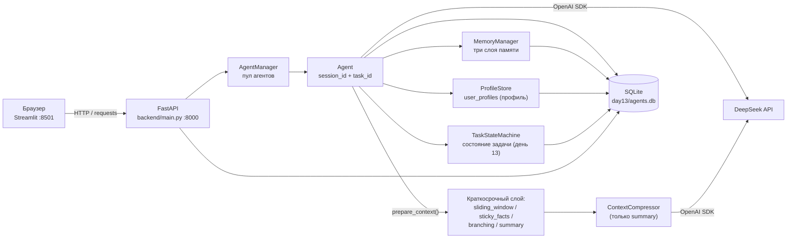

# Архитектура дня 13 — «Состояние задачи как конечный автомат»

День 13 — это копия дня 12 (`day12/` **не изменяется**: дни 1–12 остались
снимками, все правки внутри `day13/`) плюс **состояние задачи как конечный
автомат**: формализованные этапы и шаги задачи, ожидаемое действие, журнал
переходов, пауза и продолжение с того же места без повторных объяснений.
Состояние живёт в SQLite, подключается к системному промпту **каждого** запроса
и обновляется по реплике пользователя.

Новое в дне 13:

- таблицы `task_states` и `task_transitions` (11 таблиц вместо 9) и их ORM —
  `backend/tables_task.py`;
- FSM `backend/task_fsm.py`: этапы `planning`/`execution`/`validation`/`done`/
  `paused`, шаги внутри этапа, события `advance`/`rollback`/`pause`/`resume` и
  паттерн State с явной ошибкой на неизвестное событие;
- `TaskStateMachine` (`backend/task_state.py`) — поведение и валидация переходов,
  `TaskStateStore` (`backend/task_store.py`) — хранение; домен разложен на два
  модуля по лимиту 400 строк;
- блок состояния задачи последним блоком системного сообщения
  (`backend/task_prompt.py`) и авто-обновление состояния по реплике
  (`backend/task_intent.py`);
- девять эндпоинтов `/agents/{agent_id}/tasks` и `/tasks/{task_id}/...` — всего
  45 эндпоинтов вместо 36;
- третья секция основной области UI «🧭 Состояние задачи» (`ui/task_panel.py`) и
  отчёт [`../task_state_demo.md`](../task_state_demo.md) от `task_state_demo.py`.

Подробно — в разделе
[«Состояние задачи (день 13)»](#состояние-задачи-день-13).

Наследованное из дней 10–12 (перенесено в `day13/` без изменений): единая
история диалога заменена **тремя явными слоями памяти** — краткосрочным (диалог
сессии), рабочим (данные задачи) и долговременным (категории `profile`,
`preference`, `decision`, `knowledge`). Хранилищем слоёв заведует `MemoryManager`
(`backend/memory.py`), а `Agent` при сборке контекста решает, что взять из
каждого слоя, и возвращает разбивку токенов по слоям. Четыре стратегии сборки
контекста (`sliding_window`, `sticky_facts`, `branching`, `summary`) сохранены и
управляют **краткосрочным** слоем; стратегия агента — значение `Enum`
(`backend/strategies.py`), сборка контекста — `Agent.prepare_context()`,
диспетчеризация по стратегии — его `_prepare_*`-ветки.

Наследованный из дня 12 **профиль пользователя** — таблица `user_profiles`
(настройки стиля, жёсткие ограничения и произвольные инструкции), колонка
`agents.user_id` и блок персонализации первым блоком системного сообщения.
Профиль — не четвёртый слой памяти: он не хранит диалог и не отбирается по
релевантности, а подставляется целиком в каждый запрос (подробно — в разделе
[«Профиль пользователя (персонализация; наследовано из дня 12)»](#профиль-пользователя-персонализация-наследовано-из-дня-12)).

Стек: Python 3.14, FastAPI + uvicorn (порт 8000), Streamlit (порт 8501),
SQLite + SQLAlchemy 2.0, tiktoken, OpenAI SDK → DeepSeek
(`https://api.deepseek.com`), pytest.



Состояние задачи (`task_fsm.py` + `task_state.py` + `task_store.py`) хранится в
таблицах `task_states`/`task_transitions` и читается из БД на каждый запрос —
поэтому блок состояния в промпте и «продолжение с того же места» переживают
перезапуск процесса.

## Стратегии управления контекстом (наследовано из дней 10–12)

Стратегия определяет сборку **краткосрочного** слоя: сколько последних реплик
сессии уходит в запрос и в каком виде. Рабочая и долговременная память
подставляются блоками системного сообщения независимо от неё, и состояние задачи
(день 13) от стратегии тоже не зависит — его блок добавляется последним при любой
стратегии.

`Strategy` — перечисление (`backend/strategies.py`) со строковыми значениями;
поведение живёт в методах `Agent` (`prepare_context` → `_prepare_*`), а не в
Enum. Каждая стратегия формирует список сообщений для LLM по-своему:

| Стратегия | Что уходит в LLM | Плюсы | Минусы |
| --- | --- | --- | --- |
| `sliding_window` | system + последние `window_size` реплик + промпт | Дешевле всех, предсказуемо, один параметр | Вне окна теряется всё раннее — «память» равна окну |
| `sticky_facts` | system (+блок фактов) + последние `window_size` реплик + промпт | Детали не теряются: факты хранятся явно (таблица `facts`) | Блок фактов растёт и тратит токены; нужны явные формулировки «ключ: значение» |
| `branching` | system + вся история активной ветки + промпт | Ничего не теряет; позволяет ветвить диалог (таблица `checkpoints`) | Контекст растёт линейно; UI с деревом веток сложнее |
| `summary` | system (+конспект) + последние `keep_last_messages` непокрытых реплик + промпт | Хороший баланс «память/токены», работает автоматически | Качество зависит от суммаризации; точные значения могут «сплющиться» |

Сводка метрик по стратегиям дня 10 — в
[`../../day10/comparison.md`](../../day10/comparison.md); отчёт по слоям памяти —
артефакт дня 11:
[`../../day11/memory_layers_comparison.md`](../../day11/memory_layers_comparison.md).
Опции управления памятью в дне 13 сохранены полностью (наследовано из дня 11),
но сценария в интерфейсе нет — диалог ведётся вручную в чате. Доказательства
дают два прогона вне pytest: персонализацию — `personalization_comparison.py`
(отчёт [`../personalization_comparison.md`](../personalization_comparison.md)),
состояние задачи — `task_state_demo.py`
(отчёт [`../task_state_demo.md`](../task_state_demo.md)).

## Компоненты

| Файл | Зона ответственности |
| --- | --- |
| `day13/app.py` | Streamlit, точка входа (45 строк): `st.set_page_config` («Состояние задачи · День 13», «🧭»), `common.init_state()` → `sidebar.render_sidebar()` → `chat_section.render_main_area()`; переключатель трёх разделов основной области — `st.radio` («💬 Чат и память» / «👤 Профиль пользователя» / «🧭 Состояние задачи») |
| `personalization_comparison.py` | Доказательство персонализации (вне pytest, наследовано из дня 12): два противоположных профиля на одном вопросе, запись отчёта [`../personalization_comparison.md`](../personalization_comparison.md); нужен `DEEPSEEK_API_KEY`, режим `--no-api` — офлайн-заглушка |
| `task_state_demo.py` | Доказательство состояния задачи (вне pytest, день 13): пять фаз полного цикла, каждая — **отдельный процесс** (`--all`, `--phase N`, `--reset`, `--no-api`), запись отчёта [`../task_state_demo.md`](../task_state_demo.md) |
| `task_demo_report.py` | Сборка markdown-фрагментов отчёта демонстрации: таблица переходов, раздел про ход агента (реплика, ответ, блок состояния), строка-доказательство «какой процесс и откуда прочитал состояние» |
| `backend/memory.py` | `MemoryManager` (сессии/задачи/категории), `Enum MemoryCategory`, чистые `query_keywords`, `render_working_block`, `render_long_term_block` |
| `backend/profiles.py` | Чистые правила персонализации (без БД, сети и UI): `ProfileValueError`, Enum `Tone`/`Verbosity`/`Language`/`ResponseFormat`, `PREFERENCE_ENUMS`/`PREFERENCE_OPTIONS`/`DEFAULT_PREFERENCES`/`DEFAULT_CONSTRAINTS`/`PROFILE_FIELD_LABELS`/`PROFILE_HEADER`, `normalize_preferences`/`normalize_constraints`/`normalize_instructions`/`instructions_text`, `PromptElement`/`ProfilePrompt`, `build_profile_prompt`, `describe_profile`, `preference_options` |
| `backend/profile_store.py` | Доступ к таблице `user_profiles` через переданную фабрику сессий: `ProfileData` (frozen dataclass: поля БД + `instructions`, `prompt`, `summary`, `personalized`), `empty_profile`, `ProfileStore` (`load`/`get`/`list_all`/`create`/`update`/`delete`), исключения `ProfileNotFoundError`/`ProfileExistsError` |
| `backend/demo_profiles.py` | Данные для UI и отчёта: `DEMO_QUESTION`, `DEMO_FEATURE_REQUEST`, `DEMO_PROFILES` (`strict_tech`, `friendly_mentor`, `process_orchestrator`), `demo_profile(user_id)`, `demo_titles()` |
| `backend/strategies.py` | `Enum Strategy` (sliding_window/sticky_facts/branching/summary), `AVAILABLE_STRATEGIES`, `strategy_from_value` |
| `backend/fact_extractor.py` | Чистая эвристика `extract_facts`: «ключ: значение» / «ключ = значение» / «ключ — значение» |
| `backend/task_fsm.py` | Чистый автомат состояния задачи (без БД, сети и UI): Enum `TaskStage`/`TaskStep`/`TaskEvent`, таблицы `STAGE_STEPS`/`STAGE_TRANSITIONS`/`STAGE_ORDER`, функции `stage_from_value`/`step_from_value`/`steps_of`/`first_step`/`next_step`/`is_valid_transition`/`rollback_target`, классы-этапы `PlanningState`/`ExecutionState`/`ValidationState`/`DoneState`/`PausedState` (метод `handle(event, step)`) и ошибки `UnknownTaskEvent`/`InvalidTaskTransition` |
| `backend/task_prompt.py` | Тексты блока состояния для системного промпта: `TASK_STATE_HEADER`, `EXPECTED_ACTIONS` (пара «этап, шаг» → ожидаемое действие), `PAUSED_ACTION`/`DONE_ACTION`, `default_expected_action`, `previous_stages_text`, `build_prompt_block`, `render_task_state_block` |
| `backend/task_intent.py` | Enum `TaskIntent` и `classify_task_intent(text)`: намерение по реплике (`pause` → `resume` → `rollback` → `advance` по порядку групп, совпадение на границе слова) |
| `backend/task_store.py` | `TaskStateStore` — единственное место работы с таблицами `task_states`/`task_transitions`: сессия на операцию, `state`/`state_dict`/`history`/`states`, единый путь записи перехода `apply` (history + журнал + поля строки + снимок рабочей памяти), исключение `TaskNotFoundError` |
| `backend/task_state.py` | `TaskStateMachine` — поведение и валидация: `create`, `transition_to`, `pause`, `resume`, `advance_step`, `rollback`, `is_valid_transition`; причины переходов константами, исключение `TaskExistsError` |
| `backend/tables_task.py` | ORM состояния задачи: `TaskState` (`task_states`) и `TaskTransition` (`task_transitions`); отдельный модуль от `tables.py` — иначе лимит 400 строк был бы превышен |
| `backend/manager_tasks.py` | Миксин `TaskOpsMixin`: тонкие обёртки над `TaskStateMachine`, разрешение умолчаний шага и ожидаемого действия, `list_active_tasks` (завершённые не возвращаются) |
| `backend/config.py` | URL и модели DeepSeek, дефолты агента, лимиты/тарифы, настройки сжатия, `DEFAULT_STRATEGY`/`DEFAULT_WINDOW_SIZE`, константы слоёв (`DEFAULT_TASK_ID`, `LONG_TERM_LIMIT`, лимиты записей), границы полей состояния задачи (`TASK_STAGE_MAX`, `TASK_STEP_MAX`, `EXPECTED_ACTION_MAX`, `TASK_REASON_MAX`), путь БД и `.env` |
| `backend/context_fsm.py` | Стейт-машина процесса сжатия (Enum + паттерн State) — используется только стратегией `summary` |
| `backend/context_policy.py` | Чистая арифметика сжатия: `CompressionPolicy`, `CompressionPlan`, `plan_compression`, `split_uncovered` |
| `backend/tables.py` | ORM-таблицы (SQLAlchemy): `AgentRecord` (`agents`, в том числе `user_id` и связь `task_states`), `ShortTermMessage`, `WorkingMemory`, `LongTermMemory`, `Summary`, `TokenUsage`, `Fact`, `Checkpoint`, `UserProfile`; таблицы состояния задачи лежат рядом, в `tables_task.py` |
| `backend/database.py` | Движок и фабрика сессий из `config.DATABASE_URL` через `shared/db_base.py` (`make_engine` / `init_db` / `make_session_factory`) плюс реэкспорт ORM-таблиц из `backend/tables.py` **и** `backend/tables_task.py` — остальной код импортирует их из `backend.database` |
| `backend/models/` | Пакет Pydantic-схем API по доменам: `agent.py` (конфигурация/патч агента, генерация с полем `task_state`, `TokenMetrics`), `context.py` (сжатие, стратегии, ветки, факты), `memory.py` (три слоя памяти), `profile.py` (схемы персонализации `UserProfileIn`/`UserPreferences`/`UserConstraints` с `extra="forbid"`, `UserProfileOut`, `AppliedProfileOut`), `task.py` (состояние задачи: `TaskStateOut`, `TaskTransitionOut`, тела переходов); `models/__init__.py` реэкспортирует все имена, поэтому импорт остался `from backend.models import ...` |
| `backend/routers/` | Эндпоинты по доменам: `agents.py` (11), `context.py` (9), `memory.py` (10), `profiles.py` (6), `tasks.py` (9) — всего 45; пути абсолютные (`/agents/...`), префиксов нет |
| `backend/dependencies.py` | `get_manager()` (менеджер резолвится в момент вызова — тесты подменяют `main.get_manager`), `agent_or_404()` и `task_or_404()` |
| `ui/` | Streamlit-интерфейс по секциям (10 модулей): `sidebar`, `chat_section` (переключатель трёх разделов `st.radio` с ключом `main_section`, карточка агента, диалог, сводка после хода), `context_panels`, `memory_panels`, `profile_section`, `profile_comparison`, `task_panel` (раздел «🧭 Состояние задачи»), `common` (состояние сессии, `active_agent`, `TASK_STAGE_LABELS`, `fmt_time`, `flash`), `api_client` (`BACKEND_URL` из `DAY13_BACKEND_URL`, `_request` и обёртки эндпоинтов, включая девять функций состояния задачи), `__init__`; `app.py` — только точка входа (45 строк), модули `ui/` не вызывают `st.*` на импорте |
| `backend/compressor.py` | `ContextCompressor`: план сжатия, суммаризация, запись в `summaries` (только `summary`) |
| `backend/agent.py` | `Agent`: `session_id`/`task_id`, слои памяти (`new_session`, `set_task`, `build_memory_context`, `memory_state`), токены, `prepare_context` + `_prepare_*`, факты, ветки, `generate`, `compare_modes`, `summary_state`; персонализация (наследовано) — `user_id`, `profile`, `profile_store`, `reload_profile`, `apply_profile`, `profile_report`, `profile_state`, `_system_text`, блок профиля в `_system_message`; состояние задачи (день 13) — `task_state_machine`, `task_state()`, `task_state_block()`, `apply_task_intent()`, блок состояния в `_system_message`, поле `record["task_state"]` |
| `backend/agent_manager.py` | `AgentManager` (синглтон), собранный из миксинов `backend/manager_agents.py`, `manager_context.py`, `manager_memory.py`, `manager_profiles.py`, `manager_tasks.py`, `manager_usage.py`: пул, `restore_from_db`, стратегии, ветки, факты, обёртки слоёв памяти, агрегаты `token_usage`; персонализация (наследовано) — `get_user_profile`, `create_user_profile`, `update_user_profile`, `delete_user_profile`, `list_user_profiles`, `get_agent_profile`, `profile_store`, применение профиля к живым агентам; состояние задачи (день 13) — `create_task`, `get_task_state`, `get_task_history`, `pause_task`, `resume_task`, `advance_task_step`, `rollback_task`, `transition_task`, `list_active_tasks` |
| `backend/main.py` | Сборка FastAPI-приложения (80 строк, версия `7.0.0`): заголовок и описание, CORS, `lifespan` (создание таблиц + восстановление агентов), `include_router` пяти роутеров; сами 45 эндпоинтов (наследованные из дня 11 память/стратегии/ветки/факты/метрики, наследованные из дня 12 профили, корневой `GET /` и девять эндпоинтов состояния задачи) и обработка 404/409/422/502 — в `backend/routers/` |
| `tests/` | Офлайн-тесты (фейковый клиент DeepSeek + временная SQLite) по всем слоям, персонализации (наследовано: `test_profiles`, `test_profile_store`, `test_profile_agent`, `test_profile_api`) и состоянию задачи (день 13: `test_task_fsm`, `test_task_prompt`, `test_task_intent`, `test_task_store`, `test_task_state`, `test_task_manager`, `test_task_agent`, `test_task_api`) |

### Модульная структура (после рефакторинга)

До рефакторинга (коммит `9c7021c`) день был набором крупных файлов: `app.py` —
1852 строки, `backend/main.py` — 660, `backend/agent_manager.py` — 637,
`backend/models.py` — 845, `backend/database.py` — 425, `backend/profiles.py` —
343. Теперь **архитектура модульная**: у каждого слоя своя папка и свой домен,
а общий код вынесен в пакет `shared/` в корне репозитория.

| Слой | Модули | Что даёт |
|---|---|---|
| Интерфейс | `app.py` (точка входа, 45 строк), `ui/` (10 модулей) | Страница собирается вызовами секций: `common.init_state()` → `sidebar.render_sidebar()` → `chat_section.render_main_area()`; модули `ui/` не вызывают `st.*` на импорте |
| API | `backend/main.py` (сборка `app`), `backend/routers/` (5 роутеров), `backend/dependencies.py` | Эндпоинт лежит в файле своего домена; доступ к менеджеру — одна точка (`dependencies.get_manager`), её и подменяют тесты |
| Схемы API | `backend/models/` (`agent`, `context`, `memory`, `profile`, `task` + `__init__.py`) | Схемы разложены по доменам, а импорт остался `from backend.models import ...` |
| Данные | `backend/tables.py` + `backend/tables_task.py` (ORM-таблицы), `backend/database.py` (движок и сессии) | Таблицы дня наследуются от `shared.db_base.Base`; движок и фабрика сессий — общие помощники `shared/db_base.py`; ORM состояния задачи вынесен в отдельный модуль по лимиту 400 строк |
| Домен | `backend/agent.py`, `backend/agent_manager.py` + `manager_*.py`, `memory.py`, `memory_layers.py`, `profiles.py`, `profile_store.py`, `profile_values.py`, `compressor.py`, `context_fsm.py`, `context_policy.py`, `strategies.py`, `fact_extractor.py`, `demo_profiles.py`, `task_fsm.py`, `task_prompt.py`, `task_intent.py`, `task_state.py`, `task_store.py` | Логика дня; крупный класс `AgentManager` собран из миксинов по доменам, состояние задачи разложено на «автомат / поведение / хранение» |
| Общий код | `shared/` | Код, не меняющийся между днями: клиент DeepSeek, база SQLAlchemy, токены, логи |

Что день 13 берёт из `shared/`:

| Модуль дня | Импорт | Зачем |
|---|---|---|
| `backend/__init__.py` | добавляет корень репозитория в `sys.path` (`parents[2]`) | Чтобы `from shared...` работал в любом модуле дня — без правок тестов и копий кода |
| `backend/agent.py` | `deepseek_client.make_client`, `token_counter.count_tokens` | Клиент DeepSeek на агента и локальная оценка токенов контекста |
| `backend/config.py` | `deepseek_utils.DEEPSEEK_BASE_URL`, `read_key_from_env_file` | Адрес API и чтение `DEEPSEEK_API_KEY` из `.env` дня |
| `backend/database.py` | `db_base.Base`, `init_db`, `make_engine`, `make_session_factory` | Движок и сессии SQLite (`check_same_thread=False`, `PRAGMA foreign_keys=ON`) |
| `backend/tables.py` | `db_base.Base` | Декларативная база для ORM-классов дня |
| `backend/tables_task.py` | `db_base.Base` | Та же декларативная база для ORM состояния задачи |
| `backend/task_store.py` | `logging_utils.get_logger` | Отладочный лог записанного перехода |
| `backend/main.py` | `logging_utils.get_logger` | Логгер бэкенда; вывод включается только явным `configure_logging()` |

Ограничение размера: любой `.py` ≤ 400 строк (`app.py` ≤ 100,
`backend/main.py` ≤ 80). В дне 13 ради этого ORM состояния задачи вынесен в
`backend/tables_task.py`, а два модуля и отчёт-демонстрация не слиты в один.
Единственное осознанное расхождение — `backend/agent.py` (1597 строк): это
унаследованный из дня 12 класс `Agent`, его рефакторинг в день 13 не входил.
Полная карта модулей с числом строк — в [`../STRUCTURE.md`](../STRUCTURE.md).

Схема потоков одного хода:

```
Streamlit app.py ──HTTP──▶ FastAPI main.py ──▶ AgentManager ──▶ Agent
                                                                │
                                           apply_task_intent() ─┤ состояние задачи по реплике
                                                                │ (день 13, ДО prepare_context)
                                     self.profile.prompt.text ──┤ персонализация: блок профиля
                                                                │ (первый блок system message)
                                          build_memory_context()┤ рабочая + долговременная
                                                                │ (blocks → system message)
                                               prepare_context()┤ краткосрочный слой по стратегии
                                                                │
                                          task_state_block() ───┤ состояние задачи (последний блок)
                                                                ▼
                                         sliding_window ── последние N реплик
                                         sticky_facts  ── факты + последние N
                                         branching     ── вся активная ветка
                                         summary       ── ContextCompressor ──▶ DeepSeek
                                                                │
                                                                ▼
                                     SQLite agents.db (short_term_messages / working_memory /
                                       long_term_memory / facts / checkpoints / summaries /
                                       token_usage / user_profiles / task_states /
                                       task_transitions)
```

## Слои памяти агента

Три слоя (`backend/memory.py`) отличаются не только содержимым, но и ключом, к
которому привязаны записи, — поэтому у каждого свой жизненный цикл.

| Слой | Таблица | Ключ | Что хранит |
| --- | --- | --- | --- |
| 👤 Краткосрочная | `short_term_messages` | `agent_id` + `session_id` | реплики текущего диалога: `role`, `content`, `created_at` |
| 🗂 Рабочая | `working_memory` | `agent_id` + `task_id` + `key` | данные активной задачи: цель, ограничения, решения, критерии приёмки |
| 🧠 Долговременная | `long_term_memory` | `agent_id` + `category` + `key` | `profile`, `preference`, `decision`, `knowledge` + `confidence` (0..1) |

Активные `session_id` и `task_id` хранит строка `agents`
(`current_session_id` / `current_task_id`) — это источник правды при рестарте
бэкенда, поэтому диалог и задача восстанавливаются вместе с агентом.

`MemoryCategory` — `Enum` категорий долговременного слоя; значение (строка)
попадает в БД, API и UI без дополнительного маппинга.

### Методы `MemoryManager`

| Метод | Что делает |
| --- | --- |
| `add_short_term(agent_id, session_id, role, content)` | INSERT реплики; пустые `session_id`/`role`/`content` → `ValueError` |
| `get_short_term(agent_id, session_id, limit=None)` | реплики сессии по возрастанию `id`; `limit` — хвост (последние N) в хронологическом порядке |
| `count_short_term`, `clear_short_term` | число реплик сессии / удаление реплик сессии (возвращает число удалённых, 0 — не ошибка) |
| `add_working(agent_id, task_id, key, value)` | upsert по `(agent_id, task_id, key)`: та же пара перезаписывает `value` и `updated_at` |
| `get_working(agent_id, task_id)` | все записи задачи, сортировка по `key` |
| `list_tasks(agent_id)` | `DISTINCT task_id` агента по алфавиту (для селектора в UI) |
| `add_long_term(agent_id, category, key, value, confidence=1.0)` | upsert по `(agent_id, category, key)`; категория вне `AVAILABLE_CATEGORIES` или `confidence` вне `[0, 1]` → `ValueError` |
| `get_long_term(agent_id, category=None)` | все записи агента или одной категории, сортировка `(category, key)` |
| `delete_long_term(agent_id, entry_id)` | `DELETE` по id; `False`, если записи не было (API отвечает 404) |
| `select_long_term(agent_id, query, limit)` | отбор релевантных записей для запроса (см. следующий раздел) |

Менеджер принимает фабрику сессий (`session_factory`) и обслуживает всех
агентов: `agent_id` передаётся в каждый метод явно.

### Правила выбора данных в контекст

* **Краткосрочная память** — по стратегии агента: последние `keep_last_messages`
  непокрытых конспектом реплик (summary), последние `window_size` (sliding
  window / sticky facts) или вся история активной ветки (branching).
* **Рабочая память** — **все** записи активной задачи: они уходят блоком
  «Рабочая память (данные текущей задачи…)» сразу после системного промпта.
* **Долговременная память** — до `config.LONG_TERM_LIMIT` (5) записей: сначала
  те, чьи `key`/`value` содержат ключевые слова запроса (`query_keywords`: слова
  длиной ≥ 3 без стоп-слов) или чья категория упомянута в запросе, затем добор
  самыми уверенными. Записи категории `profile` этой таблицы попадают в контекст
  даже без совпадений, а отбор детерминирован (одинаковый вход → одинаковый
  результат). Это **не** то же самое, что профиль пользователя (наследовано из
  дня 12): категория `profile` — запись долговременной памяти агента, профиль —
  отдельная таблица `user_profiles` по `user_id` (см. ниже).


## Профиль пользователя (персонализация; наследовано из дня 12)

Персонализация — наследованная из дня 12 часть `day13/`. Профиль — это
**инструкции о том, как отвечать** (обращение, стиль, формат, длина, язык,
жёсткие ограничения, произвольные инструкции); они подключаются к системному
промпту **каждого** запроса агента. Профиль не хранит диалог, не отбирается по
релевантности и привязан не к агенту, а к пользователю (`user_id`): одни и те
же настройки применяются ко всем агентам пользователя, ко всем его задачам и
сессиям.

### Модель `UserProfile`

ORM-класс `database.UserProfile`, таблица `user_profiles` в `day13/agents.db`:

| Колонка | Тип | Смысл |
| --- | --- | --- |
| `id` | Integer, primary key, autoincrement | ключ строки |
| `user_id` | String(64), unique, index, NOT NULL | идентификатор пользователя — то, на что ссылается `agents.user_id` |
| `name` | String(100), NOT NULL | имя для обращения: «Обращайся к пользователю по имени: …» |
| `preferences` | JSON, NOT NULL | настройки стиля: `tone` / `verbosity` / `language` / `format` |
| `constraints` | JSON, NOT NULL | ограничения: `max_response_length` / `forbidden_topics` / `required_disclaimers` |
| `custom_instructions` | Text, NOT NULL | произвольные инструкции, одна на строку |
| `created_at` | DateTime(tz) | создание (UTC) |
| `updated_at` | DateTime(tz) | последнее изменение (UTC) |

Плюс колонка **`agents.user_id`** (String(64), index, NOT NULL, default
`"default"`) — какой пользователь привязан к агенту. `Agent.__init__` читает
профиль из БД по `cfg.user_id`: `self.profile_store = ProfileStore(...)`,
`self.profile = self.profile_store.load(self.user_id)`; при смене `user_id`
через `apply_config(cfg)` профиль перечитывается.

**FK между `agents` и `user_profiles` нет намеренно**: удаление профиля не
должно уносить агентов — они просто теряют персонализацию и продолжают
работать с пустым профилем (`ProfileData.exists == False`, промпт пустой,
ошибки нет). Связь — логическая, по значению `user_id`.

### Схема данных

`preferences` — объект из четырёх необязательных полей; допустимые значения —
значения `Enum` из `backend/profiles.py` (`PREFERENCE_ENUMS`,
`PREFERENCE_OPTIONS`), и ровно они попадают в блок промпта:

| Поле (`preferences`) | Enum | Допустимые значения | Текст строки в промпте |
| --- | --- | --- | --- |
| `tone` | `Tone` | `формальный`, `дружелюбный`, `технический` | формальный — «Стиль общения: формальный — на «Вы», без сленга и эмодзи, официальные формулировки.»; дружелюбный — «Стиль общения: дружелюбный — тепло и просто, уместны эмодзи и обращение к собеседнику напрямую.»; технический — «Стиль общения: технический — точные термины и конкретика, без вводных фраз, эмодзи и «воды».» |
| `format` | `ResponseFormat` | `markdown`, `plain text`, `структурированный` | markdown — «Формат ответа: markdown — заголовки, списки, блоки кода.»; структурированный — «Формат ответа: структурированный — нумерованные разделы с подписями (например: 1. Анализ, 2. Решение, 3. Проверка).»; plain text — «Формат ответа: plain text — простой текст без markdown-разметки.» |
| `verbosity` | `Verbosity` | `кратко`, `подробно`, `сбалансировано` | кратко — «Длина ответа: кратко — только суть, без прелюдий и повторов.»; подробно — «Длина ответа: подробно — с пояснениями, примерами и обоснованием.»; сбалансировано — «Длина ответа: сбалансированно — суть плюс короткое пояснение ключевых мест.» |
| `language` | `Language` | `русский`, `английский` | русский — «Язык ответа: русский.»; английский — «Язык ответа: английский — отвечай на английском.» |

`constraints` — объект из трёх необязательных полей с границами
(`normalize_constraints`):

| Поле (`constraints`) | Смысл и текст строки | Границы |
| --- | --- | --- |
| `max_response_length` | жёсткий предел длины ответа: «Жёсткое ограничение: весь ответ не длиннее N символов.» | 20..8000; пусто (`None`) — без ограничения |
| `forbidden_topics` | запрещённые темы: «Не обсуждай темы: a, b. Если запрос про них — вежливо откажись и предложи другую формулировку.» | до 20 тем, каждая до 100 символов |
| `required_disclaimers` | обязательные вставки: «Всегда добавляй в ответ: a; b.» | до 20 вставок, каждая до 500 символов |

`custom_instructions` — текст, **одна инструкция на строку**: до 4000 символов
всего, до 30 инструкций, каждая до 500 символов (`normalize_instructions`,
`instructions_text`). В промпт инструкции уходят списком после строки
«Дополнительные инструкции пользователя (выполняй буквально):».

**Пустое значение = «не настроено».** Для `preferences` пусто — это `None`
(`DEFAULT_PREFERENCES`), для `constraints` — `None` или пустой список
(`DEFAULT_CONSTRAINTS`). Такое поле просто не даёт строки в блоке промпта и не
попадает в `elements`. Профиль, у которого не настроено ничего, даёт пустой
текст блока (`ProfilePrompt.text == ""`), `personalized == False`, и агент
отвечает как обычно.

**Невалидное значение — ошибка, а не «тихое» игнорирование.** Неизвестное
значение перечисления, неизвестное поле объекта (схемы используют
`extra="forbid"`) или выход за границы → `ProfileValueError` в `profiles.py` →
HTTP 422 у API.

### Как профиль встраивается в системный промпт

`Agent._system_message(...)` собирает **одно** system-сообщение; порядок блоков
зафиксирован в его коде:

```
1. блок персонализации — self.profile.prompt.text   (если профиль не пуст)
2. системный промпт (роль) агента — config.system_prompt
3. «Рабочая память (данные текущей задачи…)»        — все записи активной задачи
4. «Долговременная память (профиль, …)»             — релевантные записи (до LONG_TERM_LIMIT)
5. «Конспект предыдущей части диалога …»            (если конспект есть)
6. «Известные факты диалога …»                      (только sticky_facts)
```

Все блоки склеиваются в **одно** сообщение `{"role": "system", "content": …}`
(части соединяются `"\n\n"`), а не добавляются отдельными system-сообщениями:
так поведение не зависит от того, как провайдер обрабатывает несколько
system-сообщений подряд, и `_system_text(payload)` однозначно берёт первое (оно
же единственное). Профиль идёт **первым**, потому что это постоянная инструкция
пользователя, одинаковая во всех запросах: она не должна теряться за блоками
памяти. Если не заполнен ни один блок, system-сообщения в payload нет вовсе.

Состав блока профиля (`build_profile_prompt`): заголовок `PROFILE_HEADER` и по
одной строке на каждое заполненное поле; незаполненные строки пропускаются.

```
Профиль пользователя (персонализация; соблюдай в каждом ответе):
Обращайся к пользователю по имени: <name>.
Стиль общения: <текст по tone>
Формат ответа: <текст по format>
Длина ответа: <текст по verbosity>
Язык ответа: <текст по language>
Жёсткое ограничение: весь ответ не длиннее <N> символов.
Не обсуждай темы: <a>, <b>. Если запрос про них — вежливо откажись и предложи другую формулировку.
Всегда добавляй в ответ: <дисклеймеры>.
Дополнительные инструкции пользователя (выполняй буквально):
- <инструкция 1>
- <инструкция 2>
```

Пример заполненного блока — профиль `friendly_mentor` из `demo_profiles.py`
(`name=Илья`, `tone=дружелюбный`, `format=markdown`, `verbosity=подробно`,
`language=русский`, `forbidden_topics=[политика]`, две инструкции); здесь не
настроены `max_response_length` и `required_disclaimers`, поэтому строк про них
нет:

```
Профиль пользователя (персонализация; соблюдай в каждом ответе):
Обращайся к пользователю по имени: Илья.
Стиль общения: дружелюбный — тепло и просто, уместны эмодзи и обращение к собеседнику напрямую.
Формат ответа: markdown — заголовки, списки, блоки кода.
Длина ответа: подробно — с пояснениями, примерами и обоснованием.
Язык ответа: русский.
Не обсуждай темы: политика. Если запрос про них — вежливо откажись и предложи другую формулировку.
Дополнительные инструкции пользователя (выполняй буквально):
- Объясняй простыми словами, используй аналогии
- Обращайся ко мне по имени
```

**Профиль не зависит от стратегии.** Блок профиля — часть `_system_message()`, а
её вызывают все ветки `_prepare_*`, поэтому блок уходит в запрос при **любой**
стратегии (`sliding_window`, `sticky_facts`, `branching`, `summary`) и
участвует в оценке токенов: `_context_tokens_for(messages)` считает
`self._system_message() + messages`, то есть токены профиля входят в
`token_metrics`.

**Что видно в ответе генерации.** `POST /agents/{agent_id}/generate`
возвращает два поля персонализации; оба считаются **до** вызова DeepSeek,
поэтому присутствуют и в ответе 502:

| Поле | Содержимое |
| --- | --- |
| `record["profile"]` (`AppliedProfileOut`) | `user_id`, `name`, `personalized`, `summary`, `instructions`, `prompt_block` (текст блока профиля) и `elements` — только поля, реально давшие строку промпта: `{field, label, value, text}`, где `field` вида `preferences.tone`, `constraints.max_response_length`, `custom_instructions` |
| `record["system_prompt"]` | итоговое system-сообщение запроса (профиль + роль + блоки памяти/фактов текущего запроса) |

`GET /agents/{agent_id}/profile` отдаёт тот же `AppliedProfileOut`, но его
`system_prompt` — системное сообщение **без** блоков памяти текущего запроса:
это предпросмотр того, что даёт профиль. Если профиля нет или он пуст,
`personalized == False`, а плашка после ответа показывает «👤 профиль: без
персонализации».

### Взаимодействие с тремя слоями памяти

| Слой | Что с профилем |
| --- | --- |
| 👤 Краткосрочная (`short_term_messages`, `session_id`) | Профиль её не читает и не пишет. `Agent.new_session()` и `DELETE /agents/{agent_id}/memory/short-term` очищают диалог, но профиль не трогают: после новой сессии персонализация та же |
| 🗂 Рабочая (`working_memory`, `task_id`) | `PUT /agents/{agent_id}/memory/task` переключает задачу, профиль при этом не меняется. Блок профиля и блок рабочей памяти сосуществуют в системном промпте, профиль — раньше |
| 🧠 Долговременная (`long_term_memory`, `agent_id`) | Записи `profile`/`preference`/`decision`/`knowledge` отбираются по ключевым словам запроса — это **данные для ответа**, а не инструкции о стиле. Профиль же — таблица `user_profiles` по `user_id`: одни и те же настройки применяются ко всем агентам пользователя, ко всем его задачам и сессиям, меняются на лету и не зависят от того, что попало в долговременную память |

Формально профиль — четвёртый по счёту источник в запросе, но **не слой
памяти**: он не хранит диалог и не отбирается по релевантности, а подставляется
целиком в системный промпт каждого запроса. Оценки токенов слоёв
(`record["memory"]`: `short_term_tokens`, `working_tokens`, `long_term_tokens`)
считают только три слоя; токены блока профиля входят в общие
`prompt_tokens` / `sent_context_tokens`.

### Поток данных при запросе с профилем

1. **Агент и пользователь.** `POST /agents` принимает `user_id` (по умолчанию
   `"default"`); `Agent.__init__` грузит профиль
   (`self.profile_store.load(self.user_id)`).
2. **Сборка контекста.** `POST /agents/{agent_id}/generate` →
   `Agent.generate(prompt)` → `prepare_context()`: `build_memory_context()`
   собирает блоки рабочей и долговременной памяти, выбранная стратегия строит
   payload, а `_system_message(...)` первым блоком кладёт профиль.
   `record["profile"]` и `record["system_prompt"]` заполняются здесь же — до
   обращения к сети.
3. **Вызов DeepSeek** — одним запросом с уже готовым system-сообщением.
4. **Сохранение.** Реплики `user`+`assistant` и метрики `token_usage`
   сохраняются как обычно; профиль — не история, а конфигурация: ни ход, ни
   новая сессия его не меняют.

**Жизненный цикл профиля** (`AgentManager` и эндпоинты):

| Действие | Поведение |
| --- | --- |
| `POST /users/{user_id}/profile` | Создание профиля; дубль `user_id` → `ProfileExistsError` → HTTP 409 |
| `PUT /users/{user_id}/profile` | **Замена** настроек: поля, не переданные в теле, сбрасываются в «не настроено»; `created_at` сохраняется, `updated_at` растёт; в ответе `applied_to_agents` — сколько живых агентов получили новые настройки |
| `DELETE /users/{user_id}/profile` | Удаление строки: агенты остаются работоспособными и отвечают без персонализации |
| `PATCH /agents/{agent_id}` с `user_id` | Переключает профиль **живого** агента без перезапуска бэкенда (`apply_config` перечитывает профиль) |
| `Agent.reload_profile()` / `Agent.apply_profile(profile)` | Перечитать профиль из БД / применить готовый `ProfileData` к агенту |
| `Agent.profile_report()` / `Agent.profile_state()` | Отчёт для ответа генерации / предпросмотр блока и системного промпта |

Создание и обновление профиля применяется к живым агентам этого `user_id`
немедленно: `_agents_of_user(user_id)` → `_apply_profile_to_agents(data)`.
Отбор релевантных записей долговременной памяти профиль не затрагивает — он в
ней не участвует.

### Эндпоинты персонализации

| Метод и путь | Что делает |
| --- | --- |
| `GET /users` | список всех профилей (`UserProfileOut`: настройки, `summary`, `personalized`) |
| `GET /users/{user_id}/profile` | профиль; нет профиля → 404 |
| `POST /users/{user_id}/profile` | создание; профиль уже есть → 409; тело — `UserProfileIn` |
| `PUT /users/{user_id}/profile` | замена настроек; нет профиля → 404; в ответе `applied_to_agents` |
| `DELETE /users/{user_id}/profile` | удаление; нет профиля → 404; ответ `{"status": "deleted", "user_id": …}` |
| `GET /agents/{agent_id}/profile` | `AppliedProfileOut`: применённый профиль, `elements`, `prompt_block`, `instructions`, `system_prompt` |

Персонализация видна и в агентских эндпоинтах: `POST /agents` и
`PATCH /agents/{agent_id}` принимают `user_id`, `GET /agents` и
`GET /agents/{id}` возвращают его, а `POST /agents/{agent_id}/generate` — поля
`profile` и `system_prompt`. Корневой `GET /` перечисляет эндпоинты
персонализации в поле `personalization`. Коды ошибок: 404 — нет агента или
профиля, 409 — профиль уже есть, 422 — невалидные поля (в том числе
`ProfileValueError`), 502 — сбой генерации.

### Отчёт `personalization_comparison.md`

Доказательство персонализации — прогон `python personalization_comparison.py`
(нужен `DEEPSEEK_API_KEY` в `day13/.env`) либо офлайн-прогон
`python personalization_comparison.py --no-api`. Скрипт работает на отдельной
БД `day13/personalization_demo.db` (пересоздаётся при каждом прогоне),
использует профили из `demo_profiles.py` и пишет
[`../personalization_comparison.md`](../personalization_comparison.md): таблицу
«Профиль | Настройки | Ответ агента | Какие элементы профиля повлияли», полные
ответы вместе с системными промптами запросов, раздел про профиль с инструкцией
о порядке ролей и таблицу наблюдений (ограничение длины, отсутствие markdown у
`plain text`, наличие markdown у `markdown`, длина подробного ответа против
краткого, порядок ролей аналитик → разработчик → тестировщик). Прогон делает
реальные запросы к `deepseek-chat`; проверки стиля и формата — наблюдения
(модель соблюдает ограничение приблизительно), обязательные проверки —
подстановка профиля в промпт и следование инструкции о порядке ролей.


## Состояние задачи (день 13)

Состояние задачи — то, что день 13 добавляет к копии дня 12. У задачи есть
**этап** (`planning` → `execution` → `validation` → `done`), **шаг** внутри этапа,
**ожидаемое действие** и **журнал переходов**. Состояние лежит в SQLite (таблицы
`task_states` и `task_transitions`), поэтому оно переживает перезапуск процесса:
после рестарта агент читает строку по `task_id` и продолжает с того же места, без
повторных объяснений. Одна строка `task_states` — одна задача; `task_id` уникален
глобально, потому что состояние запрашивается по нему одному
(`GET /tasks/{task_id}/state`) и на него ссылается журнал переходов.

### Модель `TaskState` (таблица `task_states`)

ORM — `backend/tables_task.py`, отдельный модуль от `tables.py`: добавление двух
таблиц в `tables.py` превысило бы лимит 400 строк, поэтому ORM-слой разложен по
доменам.

| Поле | Тип | Смысл |
| --- | --- | --- |
| `id` | Integer PK, autoincrement | Суррогатный ключ строки |
| `task_id` | String(64), unique, index, NOT NULL | Идентификатор задачи: по нему читается состояние и на него ссылается журнал |
| `agent_id` | String, FK → `agents.agent_id` (CASCADE), index, NOT NULL | Агент — владелец задачи |
| `stage` | String(32), index, NOT NULL | Текущий этап — значение `TaskStage` |
| `current_step` | String(32), NOT NULL | Текущий шаг — значение `TaskStep` |
| `expected_action` | String(500), NOT NULL | Ожидаемое действие (текст из `backend/task_prompt.py`), уходит в промпт |
| `context` | JSON, NOT NULL | Снимок данных задачи: `task_id`, `working_memory` (рабочая память дня 11 по паре `(agent_id, task_id)`) и метка паузы `paused_from_stage`/`paused_from_step` |
| `history` | JSON, NOT NULL | Журнал переходов внутри самой строки (те же записи, что уходят в `task_transitions`) |
| `created_at` / `updated_at` | DateTime (UTC) | Создание состояния / время последнего перехода |

Связи: `AgentRecord.task_states` (каскад `all, delete-orphan` + `ondelete CASCADE`)
и `TaskState.transitions` → `TaskTransition`.

### FSM: этапы, шаги и события

Автомат — `backend/task_fsm.py`: чистый модуль без БД, сети и UI (только `enum` и
`typing`), поэтому его таблицы читаются глазами и проверяются отдельно от
хранилища.

Этапы (`TaskStage`) и шаги (`TaskStep`) внутри них:

| Этап | Шаги |
| --- | --- |
| `planning` | `gather_requirements` → `define_scope` → `create_plan` |
| `execution` | `implement` → `test_locally` |
| `validation` | `review` → `run_tests` → `finalize` |
| `done` | шагов нет; `current_step` остаётся `finalize` |
| `paused` | шагов нет; сохраняется шаг, на котором встали |

События (`TaskEvent`): `advance` — следующий шаг, а с последнего шага этапа
следующий этап; `rollback` — на предыдущий этап (шаг сбрасывается на первый шаг
целевого этапа); `pause` — пауза с сохранением этапа и шага; `resume` —
продолжение с того же этапа и шага.

```
прямой ход:    planning -> execution -> validation -> done
откат:         validation -> execution;  execution -> planning
пауза:         planning|execution|validation|done -> paused
возобновление: paused -> тот же этап и шаг, с которого встали
```

Таблица допустимых переходов этапов (`STAGE_TRANSITIONS`):

| Из этапа | Куда можно перейти |
| --- | --- |
| `planning` | `execution`, `paused` |
| `execution` | `validation`, `planning`, `paused` |
| `validation` | `done`, `execution`, `paused` |
| `done` | `paused` |
| `paused` | `planning`, `execution`, `validation`, `done` |

Переходы описаны паттерном State: базовый `TaskStageBase` и по классу на этап
(`PlanningState`, `ExecutionState`, `ValidationState`, `DoneState`,
`PausedState`); `handle(event, step)` возвращает пару «этап, шаг». Событие, не
описанное для этапа (например `resume` вне `paused`), — явная ошибка
`UnknownTaskEvent`, а не тихое «ничего не делаем»; недопустимый переход (`advance`
из `done`, `rollback` из `planning`/`done`/`paused`, `advance`/`rollback` на
паузе, шаг чужого этапа) — `InvalidTaskTransition`. Обе ошибки API отдаёт как
HTTP 400.

Ожидаемое действие по умолчанию собирает `backend/task_prompt.py`
(`EXPECTED_ACTIONS` по паре «этап, шаг»): `execution/implement` → «ожидается
реализация модуля», `validation/run_tests` → «ожидается проверка тестов», `paused`
→ «задача на паузе; ожидается продолжение (resume)», `done` → «задача завершена;
ожидается новая задача».

### Журнал переходов (таблица `task_transitions`)

| Поле | Смысл |
| --- | --- |
| `id` | Integer PK — порядок записей журнала |
| `task_id` | String(64), FK → `task_states.task_id` (CASCADE), index: журнал уходит каскадом вместе с состоянием |
| `from_stage` / `from_step` | Откуда перешли; пусты (`NULL`) только у строки создания задачи |
| `to_stage` / `to_step` | Куда перешли (значения `Enum`) |
| `reason` | Причина перехода, String(200) |
| `created_at` | Время перехода |

Один переход — одна транзакция и **один** путь записи (`TaskStateStore.apply`):
строка журнала и запись в `history` строки состояния появляются вместе, плюс
обновляются `stage`, `current_step`, `expected_action`, `context` и `updated_at`.
Причины зафиксированы константами в `backend/task_state.py`: «задача создана»,
«следующий шаг», «пауза», «продолжение после паузы», «откат на предыдущий этап»,
«задача завершена», «переход по запросу», а откат по реплике пользователя —
«откат по реплике пользователя». Журнал отдаётся целиком:
`GET /tasks/{task_id}/history` (`TaskHistoryOut.entries`); по нему же построена
таблица переходов в отчёте [`../task_state_demo.md`](../task_state_demo.md).

### Блок состояния в системном промпте

`backend/task_prompt.py` собирает заголовок `TASK_STATE_HEADER` и **одну** строку
блока; `Agent.task_state_block()` читает состояние из БД и возвращает готовый
текст, а `render_task_state_block(...)` — заголовок вместе со строкой (он же
уходит в поле `prompt_block` схемы `TaskStateOut`). Дословный пример:

```
Состояние задачи (текущий этап и шаг; продолжай с этого места):
Текущий этап: execution. Текущий шаг: implement. Ожидаемое действие: ожидается реализация модуля. Предыдущие шаги: planning (gather_requirements, define_scope, create_plan) — завершены.
```

Блок добавляется **последним** в то же единственное system-сообщение, которое
собирает `Agent._system_message`, — независимо от стратегии агента:

```
1. блок профиля пользователя (персонализация, наследовано из дня 12)  (если профиль не пуст)
2. config.system_prompt                                              (если задан)
3. «Рабочая память (данные текущей задачи…)»                         — все записи активной задачи
4. «Долговременная память (профиль, …)»                              — релевантные записи (до LONG_TERM_LIMIT)
5. «Конспект предыдущей части диалога …»                             (только summary)
6. «Известные факты диалога …»                                       (только sticky_facts)
7. блок состояния задачи (день 13)                                   (если задача заведена)
```

Состояние идёт последним, потому что это **конкретная** точка, с которой надо
продолжать: она должна читаться сразу после общей рамки. Профиль, наоборот,
остаётся первым — постоянная инструкция пользователя не должна теряться за
блоками памяти. Пустого состояния не бывает: если строки `task_states` для
активной задачи агента нет, блока в промпте нет вовсе.

### Поток данных при запросе: авто-обновление состояния

1. **Реплика пользователя.** `Agent.generate(prompt)` кладёт её в
   `self.short_term_messages` (зеркало краткосрочного слоя).
2. **Авто-обновление состояния** — `self.apply_task_intent(prompt)`, **до**
   `prepare_context`. `classify_task_intent` (`backend/task_intent.py`) ищет
   намерение по таблице фраз, группы проверяются в порядке `pause` → `resume` →
   `rollback` → `advance`, совпадение — на границе слова (поэтому
   «продолжительность сессии» намерением не считается). Найденное намерение
   применяет `TaskStateMachine`: `pause`, `resume`, `advance_step` или `rollback`
   (с причиной «откат по реплике пользователя»). Недопустимый переход **не
   роняет диалог** — он пишется в лог (`logger.debug`), и запрос выполняется как
   обычно; состояния нет или задача уже `done` — авто-обновления нет.
3. **Сборка контекста** (`prepare_context`): `build_memory_context` собирает блоки
   рабочей и долговременной памяти, стратегия строит краткосрочный слой, а
   `_system_message` вкладывает в system-сообщение все семь блоков, включая блок
   состояния (пункт 7 выше). Значит, промпт **того же** запроса уже описывает новое
   состояние задачи.
4. **Отчёты до сети.** `record["task_state"] = self.task_state()` (тот же
   `TaskStateOut`, что и у эндпоинтов), рядом — `record["profile"]`,
   `record["system_prompt"]`, `record["memory"]`. Всё это заполняется **до**
   вызова DeepSeek, поэтому видно и при 502.
5. **Вызов DeepSeek.** После ответа состояние задачи не меняется: события приходят
   только от реплик пользователя и из API/UI, а не от самого факта генерации.

### Почему два модуля и почему состояние в БД

- **`TaskStateStore` (`backend/task_store.py`) против `TaskStateMachine`
  (`backend/task_state.py`).** Поведение («какие переходы допустимы, какой шаг за
  каким идёт, что делать с паузой») и хранение (сессии, `task_states`,
  `task_transitions`) — разные обязанности, которые в одном модуле дали бы 441
  строку при лимите 400. Граница «поведение / хранение»: машину читают, не
  отвлекаясь на SQLAlchemy, а хранилище тестируется без автомата; сам автомат
  (`task_fsm.py`) отделён и от того, и от другого.
- **Состояние живёт в БД, а не в памяти процесса.** У `TaskStateMachine` нет
  состояния в памяти: единственный атрибут — `self._store` (хранилище на фабрике
  сессий), а `get_state`, `pause`, `resume`, `advance_step`, `rollback` на каждом
  вызове читают строку задачи заново. Поэтому пауза и «продолжение с того же
  места» работают после перезапуска бэкенда, а блок в промпте собирается из свежей
  строки, а не из кэша агента.

**Жизненный цикл состояния.** Строка `task_states` появляется только явно —
`POST /agents/{agent_id}/tasks`; авто-создания при `POST /agents` нет, и тогда
блок состояния в промпте просто отсутствует. Заведение задачи делает её
**активной** задачей агента (`Agent.set_task`), поэтому блок подключается к
промпту сразу и его видно в том же ответе генерации. `Agent.clear_history` и
`new_session` состояние задачи не трогают — это не диалог; состояние удаляется
вместе с агентом (`DELETE /agents/{id}` уносит строки `task_states`, а журнал —
каскадом), отдельного «сброса состояния» нет.
Управление состоянием — девять эндпоинтов `/agents/{agent_id}/tasks` и
`/tasks/{task_id}/...` (полные тела и коды — в [`api.md`](api.md)).

## Схема БД (`day13/agents.db`)

Одиннадцать таблиц: девять из дня 12 (восемь из дня 11 — от агента семь связей
один-ко-многим с каскадным удалением, плюс `user_profiles`, связанная с агентом
**не** FK, а значением `agents.user_id`) и две новые таблицы состояния задачи —
`task_states` и `task_transitions`. ORM состояния задачи лежит в отдельном модуле
`backend/tables_task.py` (доменное деление по лимиту 400 строк), остальные
ORM-классы — в `backend/tables.py`.

```
agents (1) ──< short_term_messages (N)  краткосрочная память: реплики сессии
    │        ──< working_memory       (N)  рабочая память: ключи задачи
    │        ──< long_term_memory     (N)  долговременная: категория + ключ
    │        ──< summaries            (N)  конспекты, append-only (summary)
    │        ──< token_usage          (N)  метрики хода + токены по слоям
    │        ──< facts                (N)  факты «ключ → значение» (sticky_facts)
    │        ──< checkpoints          (N)  снимки истории/ветки (branching)
    └────────< task_states            (N)  состояние задачи (день 13)
             (agent_id FK → agents.agent_id, ondelete CASCADE, index)

task_states (1) ──< task_transitions (N)  журнал переходов задачи (день 13)
             (task_id FK → task_states.task_id, ondelete CASCADE, index)

agents.user_id ─ ─▶ user_profiles.user_id   персонализация (логическая связь, НЕ FK)
```

**`agents`** — конфигурация агента.
`agent_id` (PK, String), `name` (String(100)), `model` (String(100)),
`temperature` (Float), `system_prompt` (Text, default `""`),
`max_tokens` (Integer), `created_at` (DateTime),
`summary_enabled` (Boolean, default `True`), `keep_last_messages` (Integer,
default `6`), `summarize_every` (Integer, default `10`),
`strategy` (String(32), default `"summary"`), `window_size` (Integer,
default `10`), `current_session_id` (String(32) — активная сессия
краткосрочного слоя, обязательное поле), `current_task_id` (String(64),
default `"default"` — активная задача рабочей памяти), `user_id` (String(64),
index, NOT NULL, default `"default"` — пользователь, чей профиль применяется к
запросу; подробно — в разделе «Профиль пользователя»).

**`short_term_messages`** — краткосрочная память.
`id` (Integer PK, autoincrement), `agent_id` (FK→`agents.agent_id`, CASCADE,
index), `session_id` (String(32), index), `role` (String(16)), `content` (Text),
`created_at` (DateTime).
Диалог **одной сессии**: при сжатии реплики НЕ удаляются (конспект заменяет их
только в запросе), при переключении ветки таблица перезаписывается снимком
выбранной ветки **в пределах текущей сессии**, а `Agent.new_session()` удаляет
реплики прошлой сессии. Фронтенд помечает покрытые конспектом реплики флагом
`summarized`.

**`working_memory`** — рабочая память задачи.
`id` (Integer PK), `agent_id` (FK, CASCADE, index), `task_id` (String(64),
index), `key` (String(200)), `value` (Text), `updated_at` (DateTime).
Тройка `(agent_id, task_id, key)` уникальна (`UniqueConstraint`): повторная
запись ключа обновляет `value` и `updated_at`. Слой привязан к задаче и
переживает смену сессии.

**`long_term_memory`** — долговременная память.
`id` (Integer PK), `agent_id` (FK, CASCADE, index), `category` (String(32),
index — `profile`/`preference`/`decision`/`knowledge`), `key` (String(200)),
`value` (Text), `confidence` (Float, default `1.0`), `updated_at` (DateTime).
Тройка `(agent_id, category, key)` уникальна: повторная запись обновляет
`value`, `confidence` и `updated_at`. Слой переживает и сессии, и задачи.

**`summaries`** — конспекты, **append-only** (стратегия `summary`).
`id` (Integer PK), `agent_id` (FK, CASCADE, index), `content` (Text),
`covered_from_message_id` / `covered_to_message_id` (Integer — границы и
watermark), `covered_messages`, `source_tokens`, `summary_tokens`,
`prompt_tokens`, `completion_tokens` (Integer), `cost` (Float),
`created_at` (DateTime).
Каждая успешная суммаризация добавляет новую строку, старые не изменяются;
**текущий конспект = последняя строка** (`ORDER BY id DESC`).

**`token_usage`** — одна запись на успешный ход.
Базовые поля дня 8: `id` (PK), `agent_id` (FK, CASCADE, index), `timestamp`,
`prompt_tokens`, `completion_tokens`, `total_tokens`, `history_tokens`,
`response_tokens` (Integer), `cost` (Float).
Поля дня 9: `mode` (String(16): `"full"`/`"compressed"` для summary, иначе имя
стратегии), `full_context_tokens`, `sent_context_tokens`, `saved_tokens`,
`summary_tokens`, `summarized_messages` (Integer), `summary_used` (Boolean).
Поля дня 11 (наследованы) — расход по слоям: `short_term_tokens`,
`working_tokens`, `long_term_tokens` (Integer, оценки tiktoken блоков, ушедших в
запрос); токены блока профиля в них не входят.

**`facts`** — факты «ключ → значение» (стратегия `sticky_facts`).
`id` (Integer PK), `agent_id` (FK, CASCADE, index), `key` (String(200)),
`value` (Text), `updated_at` (DateTime). Пара `(agent_id, key)` уникальна
(`UniqueConstraint`): повторное извлечение того же ключа обновляет `value` и
`updated_at`, а не плодит дубли. Экстракция — эвристика `fact_extractor.py`,
сохранение — `Agent._upsert_facts` (ПОСЛЕ успешного хода).

**`checkpoints`** — снимки истории/ветки (стратегия `branching`).
`id` (Integer PK), `agent_id` (FK, CASCADE, index), `parent_id` (Integer,
nullable — от какого чекпоинта создана ветка, `NULL` у корня),
`messages` (JSON — список `[{"role", "content"}, …]`, полный снимок истории),
`created_at` (DateTime). Активная ветка хранится в памяти (`Agent.active_branch_id`)
и обновляется после каждого успешного хода (`_snapshot_branch_tip`); переключение
(`switch_branch`) перезаписывает краткосрочный слой агента снимком ветки.

**`user_profiles`** — профиль пользователя (персонализация, наследовано из дня 12).
`id` (Integer PK, autoincrement), `user_id` (String(64), unique, index, NOT
NULL), `name` (String(100), NOT NULL), `preferences` (JSON, NOT NULL),
`constraints` (JSON, NOT NULL), `custom_instructions` (Text, NOT NULL),
`created_at` / `updated_at` (DateTime с таймзоной, UTC). Строка — **один профиль
на пользователя**, а не на агента: на неё ссылаются все агенты с этим
`user_id`. Полное описание полей — в разделе
[«Профиль пользователя (персонализация; наследовано из дня 12)»](#профиль-пользователя-персонализация-наследовано-из-дня-12).

**`task_states`** — состояние задачи (день 13).
`id` (Integer PK, autoincrement), `task_id` (String(64), unique, index, NOT NULL),
`agent_id` (FK→`agents.agent_id`, CASCADE, index, NOT NULL),
`stage` (String(32), index), `current_step` (String(32)),
`expected_action` (String(500)), `context` (JSON — `task_id`, `working_memory`,
метка паузы `paused_from_stage`/`paused_from_step`), `history` (JSON — журнал
переходов внутри строки), `created_at` / `updated_at` (DateTime, UTC). Строка —
**одна задача**; `task_id` уникален глобально. ORM — `backend/tables_task.py`,
модель `TaskState`; полное описание — в разделе
[«Состояние задачи (день 13)»](#состояние-задачи-день-13).

**`task_transitions`** — журнал переходов задачи (день 13).
`id` (Integer PK, autoincrement), `task_id` (String(64), FK→`task_states.task_id`,
CASCADE, index, NOT NULL), `from_stage` / `from_step` (String, nullable — пусты
только у строки создания), `to_stage` / `to_step` (String, NOT NULL),
`reason` (String(200)), `created_at` (DateTime, UTC). Одна запись на переход;
причины — «задача создана», «следующий шаг», «пауза», «продолжение после паузы»,
«откат на предыдущий этап», «задача завершена», «переход по запросу», «откат по
реплике пользователя». ORM — `TaskTransition` в `backend/tables_task.py`.

Каскады включены и на уровне ORM (`cascade="all, delete-orphan"`), и на уровне
БД (`PRAGMA foreign_keys=ON` в `make_engine`). `DELETE /agents/{id}` удаляет
агента вместе с `short_term_messages`, `working_memory`, `long_term_memory`,
`summaries`, `token_usage`, `facts`, `checkpoints` и `task_states` (а журнал
`task_transitions` уходит каскадом от состояний); профиль пользователя при
этом не трогается (FK нет), а сам `DELETE /users/{user_id}/profile` не удаляет
агентов — они просто теряют персонализацию. `DELETE
/agents/{id}/history` очищает диалог, конспекты, факты, ветки и метрики, не
трогая конфигурацию, рабочую, долговременную память, профиль и состояние задачи
(состояние задачи — не диалог). `POST
/agents/{id}/memory/session` удаляет реплики прошлой сессии, конспекты и факты,
сохраняя рабочую и долговременную память, ветки, метрики, профиль и состояние
задачи. Таблицы создаются при старте бэкенда (`init_db` → `create_all`), файл
`agents.db` в git не попадает (правило `*.db`).

## Поток данных при формировании контекста

`Agent.prepare_context(prompt)` первым делом собирает блоки памяти
(`build_memory_context`), а затем отдаёт краткосрочный слой стратегии. Порядок
блоков системного сообщения фиксирован (`_system_message`):

```
1. блок профиля пользователя (персонализация, наследовано из дня 12)   (если профиль не пуст)
2. config.system_prompt                                  (если задан)
3. «Рабочая память (данные текущей задачи…)»             — все записи активной задачи
4. «Долговременная память (профиль, …)»                  — релевантные записи (до LONG_TERM_LIMIT)
5. «Конспект предыдущей части диалога …»                 (если конспект есть)
6. «Известные факты диалога …»                           (только sticky_facts)
7. «Состояние задачи (текущий этап и шаг…)»              (день 13, если задача заведена)
```

Все блоки вкладываются в **одно** system-сообщение; если ни один блок не
заполнен, системного сообщения в payload нет вовсе. Далее идёт краткосрочный
слой по стратегии и новое сообщение пользователя. Блок профиля (пункт 1)
описан в разделе [«Профиль пользователя (персонализация; наследовано из дня
12)»](#профиль-пользователя-персонализация-наследовано-из-дня-12), блок
состояния задачи (пункт 7) — в разделе
[«Состояние задачи (день 13)»](#состояние-задачи-день-13). Блок состояния
добавляется **последним** на любом этапе — независимо от стратегии и от того,
что попало в блоки 1–6.

**Токены по слоям.** `build_memory_context` считает токены текстов рабочего и
долговременного блоков (`count_tokens`, tiktoken), стратегия добавляет токены
отправленной части краткосрочного слоя (в summary — только «хвоста»
`keep_last_messages`, без конспекта). Формула отчёта:

```
memory.total_tokens = short_term_tokens + working_tokens + long_term_tokens
```

Конспект в эту сумму не входит: он — сжатие того же краткосрочного слоя и
отдельно виден как `token_metrics.summary_tokens`. Токены блока профиля в эту
сумму тоже не входят: `memory` описывает только три слоя, а блок
персонализации учитывается в общих `prompt_tokens` / `sent_context_tokens`
(через `_system_message()` в `_context_tokens_for`). Токены самого нового промпта
тоже не относятся ни к одному слою (реплика становится памятью после успешного
хода), поэтому в первой реплике новой сессии `short_term_tokens == 0`.

Отчёт `record["memory"]` заполняется **до** вызова API, поэтому он есть и при
ошибке генерации (проверяется офлайн, без ключа): `layers` — по элементу на
слой (`layer`, `used`, `entries`, `tokens`, `details`), плюс `session_id`,
`task_id`, `keywords` — ключевые слова запроса, по которым отбирался
долговременный слой.

**Отбор долговременных записей** (`MemoryManager.select_long_term`): счёт записи
= число ключевых слов запроса, входящих подстрокой в её `key` или `value`, плюс
1, если в запросе упомянута её категория; сортировка `(-score, -confidence,
key)`, затем добор до `LONG_TERM_LIMIT` самыми уверенными (`(-confidence,
key)`). Функция детерминирована и не требует ни эмбеддингов, ни вызовов LLM.


## Подготовка контекста (`prepare_context`)

`Agent.generate(prompt)` сначала кладёт реплику пользователя в память, затем
вызывает `prepare_context(prompt)`, который по `self.strategy` диспетчеризует в
одну из веток `_prepare_*` и возвращает словарь `{payload, context_tokens,
full_context_tokens, mode, summary_used, kept_messages, new_facts, …}`:

| Стратегия | `_prepare_*` | Состав payload |
| --- | --- | --- |
| `sliding_window` | `_prepare_sliding_window` | `_system_message(memory=…)` + последние `window_size` реплик + промпт |
| `sticky_facts` | `_prepare_sticky_facts` | `_system_message(facts=merged, memory=…)` + последние `window_size` + промпт |
| `branching` | `_prepare_branching` | `_system_message(memory=…)` + вся история активной ветки + промпт |
| `summary` | `_prepare_summary` | `build_payloads(prompt, memory=…)` (день 9: конспект + последние непокрытые) |

Пост-ходовые действия в `generate` по стратегии: `summary` → `compress_now()`;
`sticky_facts` → `_upsert_facts(new_facts + extract_facts(answer))`;
`branching` → `_snapshot_branch_tip()`. Аварийная обрезка `_emergency_trim`
применяется к любому собранному payload одинаково (реплики из БД не удаляются).
Во **всех** четырёх ветках системное сообщение собирает один и тот же
`_system_message(...)`, поэтому блок профиля пользователя (первым) и блок
состояния задачи (последним, день 13) есть при любой стратегии — от стратегии
зависит только краткосрочный слой.
`_prepare_summary` идёт через `build_payloads(prompt, memory=…)`, который тоже
кладёт в system-сообщение `_system_message(...)` с профилем.

## Правило сжатия

Вся арифметика — в `context_policy.py`, без побочных эффектов.
`CompressionPolicy(enabled, keep_last, summarize_every)` — настройки агента,
`plan_compression(policy, uncovered_count)` считает:

| Величина | Формула |
| --- | --- |
| `backlog` | `uncovered_count − keep_last` |
| `should_compress` | `enabled and backlog >= summarize_every` |
| `summarize_count` (при сжатии) | `backlog` — самые старые непокрытые реплики |
| `keep_count` (при сжатии) | `keep_last` — последние непокрытые реплики |
| `summarize_count` / `keep_count` (без сжатия) | `0` / `uncovered_count` |

Инварианты проверяются явно: `uncovered_count < 0`, `keep_last < 1` или
`summarize_every < 1` → `ValueError`. `split_uncovered(rows, plan)` режет
последовательность на «в конспект» и «оставить» и требует, чтобы
`len(rows) == plan.uncovered_count` (иначе `ValueError`, а не молчаливая
потеря реплик).

**Пример расчёта** при `keep_last = 6`, `summarize_every = 10`,
`uncovered_count = 17`:

```
backlog = 17 − 6 = 11
should_compress = True   (11 >= 10)
summarize_count = 11     → 11 самых старых реплик уходят в конспект
keep_count = 6           → 6 последних уходят в запрос как есть
```

Граница среза выравнивается по паре реплик (`_compress_slice`): если первый
оставляемый остаток — ответ `assistant`, он тоже уходит в конспект, чтобы
«хвост» всегда начинался с реплики пользователя.

**Payload запроса при включённом сжатии:**

```
[system: system_prompt + «Конспект предыдущей части диалога …»]
+ последние keep_last НЕПОКРЫТЫХ конспектом реплик
+ новое сообщение пользователя
```

Конспект вкладывается в **существующее** system-сообщение, а не добавляется
вторым: так поведение не зависит от того, как провайдер обрабатывает несколько
system-сообщений подряд. Если нет ни конспекта, ни `system_prompt`, отдельного
system-сообщения в payload нет вовсе. Без конспекта и с выключенным сжатием
payload равен «системный промпт + вся история + промпт» — поведение дня 8.

## Стейт-машина сжатия

`ContextState`: `IDLE="idle"`, `TRACKING="tracking"`,
`SUMMARY_PENDING="summary_pending"`, `SUMMARIZING="summarizing"`,
`ERROR="error"`.
`ContextEvent`: `TURN_ADDED`, `THRESHOLD_REACHED`, `SUMMARY_REQUESTED`,
`SUMMARY_READY`, `SUMMARY_FAILED`, `RESET`, `DISABLED`, `ENABLED`.

| Состояние | TURN_ADDED | THRESHOLD_REACHED | SUMMARY_REQUESTED | SUMMARY_READY | SUMMARY_FAILED | RESET | DISABLED | ENABLED |
| --- | --- | --- | --- | --- | --- | --- | --- | --- |
| IDLE | TRACKING | — | — | — | — | IDLE | IDLE | IDLE |
| TRACKING | TRACKING | SUMMARY_PENDING | — | — | — | IDLE | IDLE | — |
| SUMMARY_PENDING | SUMMARY_PENDING | — | SUMMARIZING | — | — | IDLE | IDLE | — |
| SUMMARIZING | — | — | — | TRACKING | ERROR | — | — | — |
| ERROR | TRACKING | — | — | — | — | IDLE | IDLE | — |

Прочерк — не «тихое зависание», а явная ошибка `UnknownContextEvent`: базовое
состояние поднимает исключение для любого не переопределённого события. Пока
идёт вызов суммаризации, `SUMMARIZING` принимает только его исход
(`SUMMARY_READY`/`SUMMARY_FAILED`) — прерывать полёт нечем, поэтому даже
`RESET` в этом состоянии считается ошибкой.

Экспортируемые имена (`__all__`): `ContextState`, `ContextEvent`,
`UnknownContextEvent`, `ContextStateBase`, `IdleState`, `TrackingState`,
`SummaryPendingState`, `SummarizingState`, `ErrorState`, `ContextMachine`,
`STATE_BY_VALUE`, `STATE_CLASS_BY_STATE`, `state_from_value`.
`ContextMachine(state=None)` стартует в `IDLE`; методы — `dispatch(event)`,
`reset()`, `state_value()`, `is_idle()`; свойство — `state` (объект состояния).
`state_from_value(value)` восстанавливает объект состояния по строке и кидает
`ValueError` на неизвестное значение (никакого «тихого» отката в IDLE).

**Состояние НЕ хранится в БД.** Оно полностью выводимо из watermark
(`covered_to_message_id`), числа непокрытых реплик и порога, поэтому
рестарт бэкенда не может его «испортить». Синхронизацию выполняет
`Agent.refresh_context_state()`: выключенное сжатие → IDLE; план требует
сжатия → TRACKING и `THRESHOLD_REACHED` → SUMMARY_PENDING; есть непокрытые
реплики → TRACKING; иначе → IDLE. Метод вызывается при создании агента,
после `restore_from_db`, после PATCH и при чтении `summary_state()`.

## Поток одного запроса

`POST /agents/{agent_id}/generate` → `Agent.generate(prompt)`:

1. **Реплика пользователя** добавляется в `self.short_term_messages` (зеркало
   краткосрочного слоя в памяти; в БД — не раньше успеха).
2. **Авто-обновление состояния задачи** (день 13):
   `self.apply_task_intent(prompt)` — первое действие после записи реплики и
   **до** `prepare_context`. Намерение распознаёт `backend/task_intent.py`
   («пауза», «продолжи», «вернись на предыдущий этап», «подтверждаю» и т. п.), а
   переход выполняет `TaskStateMachine`: пауза, продолжение, следующий шаг или
   откат. Недопустимый переход не роняет ход — он уходит в лог, и запрос
   выполняется как обычно.
3. **Сборка контекста** (`prepare_context`): сначала `build_memory_context`
   собирает блоки рабочей и долговременной памяти, затем по `self.strategy`
   строится payload (окно / факты / ветка / конспект). Первым блоком в
   системное сообщение кладётся профиль пользователя (персонализация),
   **последним** — блок состояния задачи, уже описывающий новое состояние.
   Для `summary` дополнительно считаются два варианта (полный — «что было бы
   без сжатия», и сжатый — фактический) ради метрик экономии; для остальных
   стратегий `full_context_tokens` — оценка полной истории. Отчёты по слоям
   (`record["memory"]`), по профилю (`record["profile"]`,
   `record["system_prompt"]`) и состояние задачи (`record["task_state"]`)
   заполняются здесь же — до вызова API.
4. **Аварийный предохранитель** (`_emergency_trim`): если payload больше лимита
   модели, самые старые **целые пары** реплик не отправляются в этом запросе
   (`context.trimmed_messages`), но в БД остаются. Если и пустая история не
   влезает — `status: "error"` **без вызова API** и без изменения БД.
5. **Вызов DeepSeek.** При сбое (нет ключа, сеть, лимиты) реплика пользователя
   откатывается, ответ `status: "error"`, история не меняется — но
   `record["task_state"]` уже заполнен (он считается до сети), поэтому состояние
   видно и при 502.
6. **Сохранение.** При успехе считаются метрики (фактический `usage` API, иначе
   оценки tiktoken, плюс токены по слоям) и пара реплик `user`+`assistant`
   вместе с записью `token_usage` сохраняются **одной транзакцией** в границах
   текущей сессии (`session_id`).
7. **Пост-ходовое действие по стратегии**: `summary` → `compress_now()`
   (FSM `TRACKING → SUMMARY_PENDING → SUMMARIZING → TRACKING` либо `ERROR`),
   `sticky_facts` → `_upsert_facts(...)`, `branching` → `_snapshot_branch_tip()`.
   Ошибка сжатия **не отменяет** ответ — она видна в `context.compression.error`.
   Состояние задачи от стратегии не зависит и после ответа не меняется.

## Экономика токенов

Для каждого хода считаются две величины:

| Метрика | Смысл |
| --- | --- |
| `saved_tokens` | `full_context_tokens − sent_context_tokens` (оценка tiktoken, не меньше 0) — сколько токенов контекста сэкономил конспект в этом запросе |
| `net_saved_tokens` | сэкономленные токены ходов минус собственные токены вызовов суммаризации (`prompt_tokens + completion_tokens` из таблицы `summaries`) |

Стоимость (`cost`) приблизительная и считается по тарифам `MODEL_PRICES`:

```
cost = prompt_tokens / 1_000_000 * IN  +  completion_tokens / 1_000_000 * OUT
```

(округление до 6 знаков). Для `deepseek-chat` — 0.27 / 1.10, для
`deepseek-reasoner` — 0.55 / 2.19 $ за 1 млн токенов.

При коротких репликах net-экономия может оказаться **отрицательной**: вызов
суммаризации сам тратит токены на вход (старые реплики + предыдущий конспект)
и выход (текст конспекта), а заменяемые реплики в демо-диалоге короткие. Это
ожидаемое поведение, а не ошибка: сжатие окупается на длинных репликах, а
порог `summarize_every` и `keep_last_messages` подбираются под их типичную
длину. В `/summary` обе метрики возвращаются рядом (`saved_tokens`,
`net_saved_tokens`), поэтому в интерфейсе видно и «грязную», и честную экономию.

## Интерфейс

Streamlit-приложение (`app.py`) ходит в бэкенд по
`DAY13_BACKEND_URL` (по умолчанию `http://127.0.0.1:8000`), таймаут 90 с
(сравнение с вызовами API делает два запроса к DeepSeek). Ключ фронтенду не
нужен — его читает бэкенд. Раздел переключается вверху основной области:
`st.radio` с вариантами **«💬 Чат и память»**, **«👤 Профиль пользователя»** и
**«🧭 Состояние задачи»** (ключ `main_section`) — именно radio, а не `st.tabs`:
выбор вкладки Streamlit не сохраняет между перезапусками скрипта, а после
«Сохранить профиль» или кнопки паузы нужен `st.rerun`.

| Элемент | Что показывает / делает |
| --- | --- |
| Сайдбар «🗂 Задача и сессия» | Активные `session_id`/`task_id`, селектор задачи + «🔀 Переключить задачу» (`PUT /agents/{agent_id}/memory/task`), поле и «➕ Создать задачу», кнопка «🆕 Новая сессия» (`POST /agents/{agent_id}/memory/session`) |
| Панели «🧠 Слои памяти агента» | Три вкладки: «👤 Краткосрочная» (таблица реплик сессии + «🧹 Очистить краткосрочную память»), «🗂 Рабочая» (форма upsert по ключу задачи + таблица записей), «🧠 Долговременная» (фильтр по категории, форма с ключом/значением/уверенностью, таблица и удаление записи по id) |
| Индикатор «🧭 Что ушло в последний запрос» | Три метрики (записи/токены) по слоям из `record["memory"]` + сессия, задача, сумма токенов, использованные слои и ключевые слова запроса; до первого сообщения — подсказка |
| Сайдбар «⚙️ Стратегия контекста» | Выпадающий список стратегии (Sliding Window / Sticky Facts / Branching / Summary) и слайдер `window_size` (2–50) для активного агента; кнопка «Применить стратегию» (`POST /agents/{id}/strategy`) |
| Сайдбар | Статус бэкенда, «🔄 Обновить список», форма нового агента (имя, модель, температура, системный промпт, `max_tokens`, настройки сжатия, выбор профиля пользователя в селекторе `user_id`) |
| Список агентов | Подпись «имя · модель · N сообщений · стратегия · задача» |
| Карточка агента | Индикация текущей стратегии, `window_size`, профиль (`user_id`), а для branching — активная ветка |
| Панель «📌 Факты диалога» | (sticky_facts) таблица фактов «ключ/значение/обновлено» в реальном времени |
| Панель «🌿 Ветвление истории» | (branching) дерево веток с отступами, активная ветка 🟢, кнопка «↩» переключения и «🌱 Новая ветка от текущего сообщения» |
| Раздел «👤 Профиль пользователя» | Селектор профиля, форма создания нового профиля (`user_id` + «➕ Создать профиль»), три кнопки готовых профилей из `demo_profiles.py`, форма редактирования (имя, tone, verbosity, language, format, предел длины, запрещённые темы, дисклеймеры, произвольные инструкции) с кнопкой «💾 Сохранить профиль», предпросмотр блока промпта и «🗑 Удалить профиль» |
| Блок «🔀 Профиль активного агента» | Быстрое переключение профиля живого агента (`PATCH /agents/{id}` с `user_id`), таблица элементов применённого профиля и expander «Итоговый системный промпт (без блоков памяти задачи)» |
| Панель «📊 Сравнение двух профилей на одном вопросе» | Два временных агента с разными профилями → два ответа рядом, «что повлияло на ответ» (элементы профиля) и системный промпт; агенты удаляются после прогона |
| Раздел «🧭 Состояние задачи» (день 13) | Состояние **активной** задачи агента (`ui/task_panel.py`): текущий этап с подписью из `common.TASK_STAGE_LABELS`, шаг, ожидаемое действие, при паузе — строка «⏸ Пауза с этапа …: “Продолжить” вернёт в него на шаг …», ASCII-схема FSM и пять кнопок — «⏸ Пауза», «▶️ Продолжить», «⏭ Следующий шаг», «↩️ Откат на предыдущий этап» (неактивна, когда откатываться некуда), «✅ Завершить задачу»; две вкладки — «📜 Журнал переходов» (таблица «# / из / в / причина / время») и «🧩 Блок в системном промпте» (готовый `prompt_block`); если состояния у активной задачи нет — форма заведения (`task_id` + начальный этап `planning`/`execution`/`validation`) |
| Панель «🗜 Сжатие контекста» | (summary) состояние процесса, конспект, экономика, кнопки «Сжать сейчас» и переключатель сжатия |
| Панель «📊 Токены диалога» | 4 метрики, прогресс контекста, график роста и экономии, таблица `token_usage` |
| «⚖️ Сравнить режимы» (expander) | Сравнение «без сжатия / со сжатием» (из дня 9) |
| Диалог | Чат + маркер сжатия на границе конспекта (для summary) |
| Сводка после хода | Одна плашка: время, токены, стоимость, `finish_reason`, слои памяти (короткая/рабочая/долговременная в токенах), применённый профиль («👤 профиль strict_tech: 6 элементов» или «👤 профиль: без персонализации»), предупреждения |

При недоступном бэкенде приложение не падает: сверху появляется
предупреждение с командой запуска
(`uvicorn backend.main:app --port 8000`), панели молча пропускаются.

## Тесты

Все тесты офлайн: фейковый клиент DeepSeek (`tests/support.py`), временная
SQLite-БД (фикстуры `session_factory` и `make_agent`). Всего **584** теста
(314 наследованных из дней 10–12 + 270 новых по состоянию задачи), зелёные.
Запуск из папки `day13`:

```
python -m pytest -q
```

| Файл | Что проверяет |
| --- | --- |
| `tests/test_memory_manager.py` | Слои на уровне хранилища: сессионная изоляция реплик, хвост по `limit`, upsert рабочей памяти и область задачи, `list_tasks`, upsert и удаление долговременных записей, `ValueError` на неизвестной категории и уверенности вне `[0, 1]`, отбор релевантных записей (ключевые слова, подсказка категории, добор по уверенности), чистые `query_keywords`/`render_*` |
| `tests/test_memory_agent.py` | Блоки памяти в системном сообщении, отчёт `record["memory"]` (слои и токены, `total_tokens` = сумма), пустые слои как `used=False`, изоляция сессий, `new_session` (диалог удалён, рабочая/долговременная память целы), `set_task` (область рабочей памяти, диалог не тронут), `clear_history`, восстановление `session_id`/`task_id` из БД и починка пустой сессии |
| `tests/test_memory_api.py` | Десять эндпоинтов `/memory/...`: коды 201/200/404/422, форма тел, `limit` реплик, upsert задачи, фильтр категории, удаление записи и 404 на её отсутствие, `MemoryInfo` в ответе генерации, очистка сессии endpoint'ом |
| `tests/test_context_fsm.py` | Таблица переходов всех состояний, включая негативные (неизвестное событие → `UnknownContextEvent`), и `state_from_value` |
| `tests/test_context_policy.py` | Границы порога, инварианты плана, `ValueError` на некорректных входах |
| `tests/test_fact_extractor.py` | Эвристика `extract_facts`: форматы, нормализация ключей, кавычки, `merge_facts` |
| `tests/test_strategies.py` | `prepare_context` для всех четырёх стратегий, факты (извлечение/обновление/персистентность), ветки (снимок/форк/переключение), методы `AgentManager` |
| `tests/test_strategy_api.py` | Эндпоинты дня 10 (наследованы): `/strategy`, `/strategies`, `/branches`, `/branches/{id}/switch`, `/facts`, 404/422 |
| `tests/test_storage.py` | Таблица `summaries`, watermark, каскадное удаление, метрики |
| `tests/test_compressor.py` | План сжатия, вызов суммаризации, деградация при сбое |
| `tests/test_agent_compression.py` | Сборка payload, экономия, FSM, аварийный предохранитель |
| `tests/test_profiles.py` | Чистые правила персонализации: перечисления `tone`/`verbosity`/`language`/`format`, границы `constraints` и инструкций (в том числе `ProfileValueError`), нормализация и порядок блоков промпта |
| `tests/test_profile_store.py` | Таблица `user_profiles`: уникальность `user_id`, `created_at`/`updated_at`, замена при `update`, случай «профиля нет» |
| `tests/test_profile_agent.py` | Профиль в system-сообщении агента, отчёт генерации (`record["profile"]`, `record["system_prompt"]`), смена профиля живого агента на лету, удаление профиля (агент остаётся работоспособным), методы `AgentManager` |
| `tests/test_profile_api.py` | Эндпоинты `/users`, `/users/{user_id}/profile`, `/agents/{agent_id}/profile`: тела и коды 404/409/422, поля `profile` и `system_prompt` в ответе генерации, `applied_to_agents` при `PUT`, переключение профиля через `PATCH` |
| `tests/test_task_fsm.py` | Чистый автомат состояния задачи (`tests/test_task_*.py` — 270 тестов дня 13): все пары «этап × событие» из `STAGE_TRANSITIONS`, негативные случаи (`resume` вне `paused` → `UnknownTaskEvent`, `advance` из `done` и `rollback` из `planning` → `InvalidTaskTransition`), `first_step`/`next_step`/`rollback_target`/`stage_from_value`/`step_from_value` |
| `tests/test_task_prompt.py` | Тексты блока состояния: ожидаемое действие по всем парам «этап, шаг», дословная строка для `execution/implement`, перечень завершённых этапов, `done`/`paused`, заголовок `render_task_state_block` |
| `tests/test_task_intent.py` | Распознавание намерения: все фразы `INTENT_PHRASES`, приоритет `resume` над `advance`, границы слов («продолжительность сессии» → `None`) |
| `tests/test_task_store.py` | Хранение состояния: снимок рабочей памяти в `context`, журнал в `task_transitions`, проекция строки в словарь, состояние переживает новый объект машины |
| `tests/test_task_state.py` | Поведение `TaskStateMachine`: полная цепочка шагов и этапов, пауза и продолжение с сохранением шага, откат, прямой `transition_to`, причины журнала, `TaskExistsError`/`TaskNotFoundError`/`InvalidTaskTransition` |
| `tests/test_task_manager.py` | `TaskOpsMixin`: умолчания шага и ожидаемого действия, `list_active_tasks` без завершённых задач, причины переходов в журнале |
| `tests/test_task_agent.py` | Блок состояния в системном промпте и авто-обновление по реплике (пауза / продолжение / следующий шаг / откат), недопустимое намерение не роняет диалог, состояние переживает пересборку агента |
| `tests/test_task_api.py` | Девять эндпоинтов состояния задачи: коды 201/400/404/409/422, полный цикл через API, журнал переходов, поле `task_state` в ответе генерации |
| `tests/test_api.py` | Контракты эндпоинтов дня 9 через `TestClient` |

Вне pytest доказательства дают два прогона. Персонализация (наследовано):
`personalization_comparison.py` — два противоположных профиля на одном вопросе и
отчёт [`../personalization_comparison.md`](../personalization_comparison.md).
Состояние задачи (день 13): `task_state_demo.py` — пять фаз полного цикла,
каждая в **отдельном процессе** (`python task_state_demo.py --all`,
`--phase N`, `--reset`, `--no-api`), и отчёт
[`../task_state_demo.md`](../task_state_demo.md) с таблицами переходов, ответами
агента, блоком состояния из системного промпта и строкой-доказательством «новый
процесс (pid …), состояние прочитано из `…db`». Проверки
самих слоёв памяти остались артефактом дня 11:
[`../../day11/memory_layers_comparison.md`](../../day11/memory_layers_comparison.md)
(в `day13/` файлов `memory_layers_demo.py` и `memory_layers_comparison.md` нет).

## Сценарий демонстрации (видео)

Демонстрация дня 13 — состояние задачи как конечный автомат (наследованные слои
памяти и профиль показываются как работающая основа). Покадровый сценарий живёт
в одной точке — инструкции [`usage.md`](usage.md) (§12). Кадры: заведение задачи в
разделе «🧭 Состояние задачи» (`planning/gather_requirements` и дословный блок во
вкладке «🧩 Блок в системном промпте»); три нажатия «⏭ Следующий шаг» до
`execution/implement`; «⏸ Пауза» (`paused/implement` со строкой «⏸ Пауза с этапа
execution»); **остановка и повторный запуск бэкенда** на той же `day13/agents.db`
— `GET /tasks/{task_id}/state` возвращает тот же этап и шаг; реплика «продолжи»
(или «▶️ Продолжить») возвращает задачу на `execution/implement` уже с новым
блоком состояния в промпте того же запроса; откат с `validation/run_tests` на
`execution/implement` и `400` при `{"to_stage": "validation"}`; «✅ Завершить
задачу» → `done/finalize`, после чего «⏭ Следующий шаг» даёт `400`, а задача уходит
из `GET /agents/{id}/tasks`. Готовые числа, журнал переходов и ответы для
сверки — в [`../task_state_demo.md`](../task_state_demo.md)
(`python task_state_demo.py --all`). Отчёт по персонализации (наследовано из дня
12) — [`../personalization_comparison.md`](../personalization_comparison.md)
(`python personalization_comparison.py`).

## Ограничения

- **Один процесс бэкенда и один файл `day13/agents.db`.** Несколько процессов
  на одну базу не рассчитаны (менеджер — синглтон в памяти).
- **`PUT /users/{user_id}/profile` — замена, а не частичное обновление.** Поля,
  не переданные в теле, сбрасываются в «не настроено»; чтобы сохранить
  настройку, её нужно передать целиком (для сравнения: `PATCH /agents/{id}`
  меняет только указанные поля).
- **Связь агента и профиля — по значению `user_id`, без FK.** Целостность пары
  `agents.user_id` → `user_profiles.user_id` обеспечивает код, а не БД: агент
  может ссылаться на несуществующий профиль и просто работать без
  персонализации. Зато `DELETE /users/{user_id}/profile` не удаляет агентов.
- **Валидация профиля строгая.** Неизвестное поле или значение перечисления —
  это `ProfileValueError` и HTTP 422, а не «пропустить непонятное»; так схема
  профиля не разъезжается с `backend/profiles.py`.
- **Токены профиля не выделены в отчёте по слоям.** `record["memory"]` считает
  только три слоя памяти; вклад блока персонализации виден лишь в общих
  `prompt_tokens` / `sent_context_tokens`.
- **Состояние задачи заводится явно.** Строка `task_states` не появляется ни при
  `POST /agents`, ни при `PUT /memory/task`: пока задачи нет, блока состояния в
  промпте тоже нет (рабочая память при этом работает как раньше, а
  `record["task_state"]` равно `null`). `task_id` уникален **глобально**, а не в
  пределах агента; повторное создание даёт 409.
- **Состояние задачи — не диалог.** `clear_history` и `new_session` его не
  трогают; удаляется оно только вместе с агентом (`DELETE /agents/{id}`).
- **`done` терминален для шага и отката.** Из `done` работают только пауза и
  возврат из неё: `advance`/`rollback` → 400 («задача завершена: этап done
  терминальный»). Пауза, наоборот, разрешена из любого этапа, включая `done`, но
  `advance`/`rollback` на паузе тоже 400 — сначала «Продолжить».
- **Откат — ровно на один этап назад** (`validation → execution`,
  `execution → planning`); `to_stage`, не совпадающий с целью отката, и откат из
  `planning`/`done`/`paused` отклоняются 400.
- **Ожидаемое действие — текст из кода** (`backend/task_prompt.py`), а не вывод
  LLM: модель видит его в промпте, но сама его не выбирает. Состояние меняют
  только реплики с распознанным намерением (`backend/task_intent.py`) и вызовы
  API/UI, причём распознавание — эвристика по таблице фраз на границе слова
  («продолжительность сессии» намерением не считается), а недопустимый переход
  просто уходит в лог, не прерывая диалог.
- **`new_session()` удаляет производные старого диалога.** Реплики прошлой
  сессии, конспекты (`summaries`) и факты (`facts`) удаляются: устаревший
  конспект иначе продолжал бы подставляться в системное сообщение. Рабочая и
  долговременная память, `checkpoints`, `token_usage` и состояние задачи
  сохраняются — счётчик токенов и стоимость живут дольше одной сессии. Профиль
  пользователя `new_session()` не трогает: персонализация остаётся той же.
- **Долговременная память заполняется вручную.** LLM-извлечения записей из
  диалога нет; автоматического переноса `facts` в `long_term_memory` тоже нет
  (при необходимости факты пишут в категорию `knowledge`). Профиль пользователя
  (наследовано из дня 12) заполняется вручную — через форму в UI или API.
- **Отбор долговременных записей — эвристика.** Подстроки ключевых слов и
  уверенность, без эмбеддингов и семантического поиска.
- **Активная ветка не переживает рестарт.** `Agent.active_branch_id` хранится в
  памяти процесса: после перезапуска бэкенда дерево веток в `checkpoints`
  остаётся, но активная ветка сбрасывается (продолжается ствол).
- **Переключение ветки перезаписывает краткосрочный слой.** История сессии —
  снимок активной ветки; остальные ветки сохраняются только в `checkpoints`.
- **Извлечение фактов — эвристика.** `fact_extractor.py` ловит явные
  «ключ: значение», а не произвольный текст; LLM-извлечение фактов не
  реализовано (потребовало бы отдельного вызова на каждый ход).
- **Оценки tiktoken приблизительны.** Используется кодировка `cl100k_base`,
  тогда как у DeepSeek свой токенизатор. Для запроса и ответа приоритет —
  фактические значения `usage` API; локальные оценки нужны там, где API их не
  вернул, и для сравнения режимов без вызова сети.
- **Лимиты контекста демонстрационные:** `MODEL_TOKEN_LIMITS` — 8 000 для
  `deepseek-chat` и 32 000 для `deepseek-reasoner`. Реальный контекст шире.
- **`deepseek-reasoner`** может игнорировать `temperature`, а его скрытые
  рассуждения попадают в `completion_tokens`. Суммаризация всегда идёт на
  `deepseek-chat` (`SUMMARY_MODEL`).
- **Сжатие коротких реплик невыгодно** (net-экономия может быть отрицательной).
- **Стоимость приблизительная:** тарифы `MODEL_PRICES` не учитывают кэширование
  и скидки провайдера.
