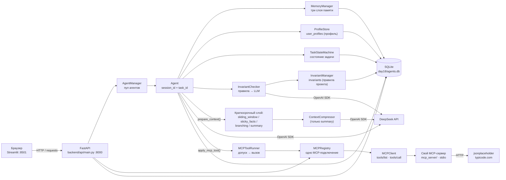
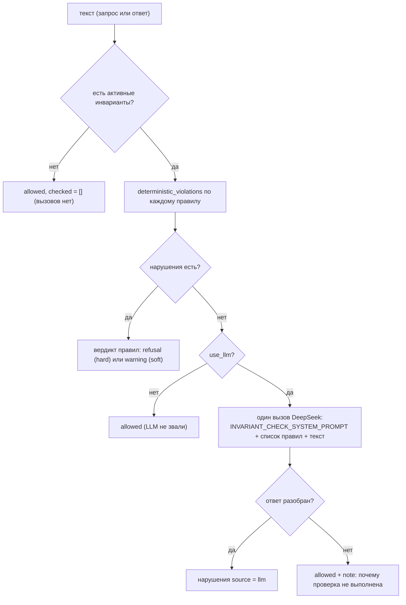

# Архитектура дня 17 — «Свой MCP-сервер и вызов инструмента из агента»

Приложение дня 17 — агент DeepSeek (FastAPI-бэкенд + Streamlit-интерфейс,
SQLite, tiktoken) с тремя слоями памяти, профилем пользователя, системой
инвариантов, состоянием задачи как конечным автоматом и контролируемыми
переходами. Новое в этом дне — **свой MCP-сервер и вызов инструмента из агента**:
в дне лежит собственный MCP-сервер (Model Context Protocol) — `day18/mcp_server/`,
шесть модулей, транспорт stdio, шесть инструментов: три читают публичный mock API
`jsonplaceholder.typicode.com` (`get_user`, `get_post`, `list_user_posts`), а три
(`schedule_reminder`, `collect_data`, `generate_summary`) ставят фоновые задачи
через `POST /scheduler/tasks` бэкенда дня;
клиент дня 16 научился вызывать инструмент (`tools/call`), а агент по ключевым
словам реплики сам решает, нужен ли вызов, вызывает инструмент и использует
полученные данные в ответе. Приложение поднимает свой сервер дочерним процессом
(`uv run python mcp_server/server.py`), каталог инструментов отдаётся полями
`name`, `description`, `input_schema`, `output_schema`, а ход агента — полем `mcp`
(`record["mcp"]`): какой инструмент вызван, с какими аргументами, чем закончилось
и ушли ли данные в промпт.

Что даёт день 17:

- собственный MCP-сервер — `mcp_server/`: `config.py` (адрес API, таймаут и
  границы), `schemas.py` (`TypedDict`-структуры ответов), `api_client.py`
  (`JsonPlaceholderClient`, `ExternalAPIError`), `server.py` (три инструмента
  через `@server.tool()`, `parse_args`, `main()` → `server.run(transport="stdio")`);
- вызов инструмента — `MCPClient.call_tool` (`tools/call`), `MCPRegistry.call_tool`
  и `MCPToolRunner` (`backend/services/mcp_tool_runner.py`): правила допуска, сам
  вызов и отчёт-исход `MCPToolCallOutcome`;
- правила допуска и жизненный цикл вызова — `backend/domain/mcp_tool_call.py`
  (`admission_reason`, коды причин, `MCPToolCallState`/`MCPToolCallEvent`,
  `MCPToolCallFSM`, `UnknownMCPToolCallEvent`);
- распознавание запроса к инструменту по реплике — `backend/domain/mcp_intent.py`
  (`INTENT_RULES`, `classify_tool_call`), блок данных в системном промпте —
  `backend/domain/mcp_prompt.py` (`render_mcp_tool_block`), каталог известных
  серверов — `backend/domain/mcp_servers.py` (`KNOWN_SERVERS`, `server_records`);
- эндпоинты `POST /mcp/call` (вызов инструмента) и `GET /mcp/servers` (каталог
  серверов) — `backend/api/mcp.py`; поле `mcp` в ответе генерации
  (`record["mcp"]`);
- шаг MCP в агенте — `Agent.apply_mcp_tool`: успешный результат дописывается
  системным блоком в промпт того же запроса и входит в контроль лимита контекста;
- раздел «🔌 MCP»: форма вызова инструмента по `input_schema` с результатом
  (`frontend/mcp_call.py`) и блок «🤖 Спросить агента» (`frontend/mcp_ask.py`),
  строка про MCP в сводке хода (`frontend/chat_section.py`);
- сквозной прогон — `scripts/mcp_tool_demo.py` (вызовы, отказы и шаг агента
  офлайн) и генератор отчёта `scripts/mcp_tool_report.py`, отчёт —
  [`reports/mcp_tool_demo.md`](reports/mcp_tool_demo.md).

Что даёт день 16 (унаследовано — MCP-клиент и каталог инструментов):

- клиент соединения — `backend/services/mcp_client.py` (`MCPClient`): транспорты
  stdio/SSE/Streamable HTTP, `connect` → `list_tools` → `disconnect`, постраничный
  `tools/list`, понятные тексты ошибок вместо traceback; днём 17 к нему добавлен
  `call_tool`;
- реестр одного подключения на процесс — `backend/services/mcp_registry.py`
  (`MCPRegistry`): смена соединения с закрытием прежнего, статус, закрытие при
  остановке приложения;
- стейт-машина подключения — `backend/domain/mcp_connection_fsm.py`
  (`MCPConnectionState`/`MCPConnectionEvent`, `ALLOWED_TRANSITIONS`,
  `UnknownMCPConnectionEvent`), разбор цели — `backend/domain/mcp_target.py`,
  структура инструмента — `backend/domain/mcp_tools.py`;
- ошибки и тексты — `backend/services/mcp_errors.py` (`MCPError` и подклассы,
  `error_message`, разворачивание `ExceptionGroup` транспорта);
- эндпоинты `/mcp/connect`, `/mcp/disconnect`, `/mcp/status`, `/mcp/tools`
  (`backend/api/mcp.py`) и схемы `backend/schemas/mcp.py`;
- раздел «🔌 MCP» в интерфейсе (`frontend/mcp_section.py` + запросы
  `frontend/mcp_api.py`): поле цели, транспорт, кнопки «Подключиться» /
  «Отключиться», статус, таблица инструментов и кнопка обновления списка;
- минимальный консольный скрипт — `scripts/mcp_demo.py`, отчёт —
  [`reports/mcp_demo.md`](reports/mcp_demo.md).

Подробно — в разделах [«MCP-интеграция»](#mcp-интеграция) и
[«MCP-сервер и инструменты»](#mcp-сервер-и-инструменты).

Что даёт день 15 (унаследовано без изменений):

- граф допуска и guards — `backend/domain/task_state_machine.py`:
  `ALLOWED_TRANSITIONS`, `GUARDS`, `STAGE_FLAG`, `TASK_FLAGS`, `can_transition`,
  `is_transition_allowed`, `get_allowed_next_stages`, `get_blocked_stages`,
  `transition_explanation`, `intent_refusal_notice`, `cleared_flags`;
- распознавание предложения модели перейти в другой этап —
  `backend/domain/task_proposal.py` (`STAGE_PROPOSAL_PHRASES`,
  `detect_stage_proposal`);
- журнал попыток: колонка `task_transitions.accepted` и
  `TaskStateStore.log_rejection` (отказ виден, состояние не меняется);
- этап паузы — отдельная колонка `task_states.paused_from_stage` (в `context`
  его больше нет); флаги-согласования — `PATCH /tasks/{task_id}/context`,
  доступные этапы — `GET /tasks/{task_id}/allowed-next` (всего 53 эндпоинта);
- отказ агента на предложение модели (`🚧 Ответ предлагает переход в …`) и
  уведомление о неприменённой реплике (`⚠️ Переход по реплике …`), отчёты
  `record["task_intent"]`/`record["task_proposal"]`;
- блок переходов, паузы и флагов в панели задачи — `frontend/task_transitions.py`;
- отчёт [`reports/controlled_transitions_demo.md`](reports/controlled_transitions_demo.md)
  от `scripts/controlled_transitions_demo.py` — офлайн-прогон, включая
  продолжение после паузы в отдельном процессе.

Контролируемые переходы — источник правды один: `backend/domain/task_state_machine.py`
(таблица `ALLOWED_TRANSITIONS`, guards `GUARDS`, тексты отказа). Вперёд задача
идёт только после согласования этапа флагом (`plan_approved`,
`implementation_complete`, `validation_passed`), `done` терминален, а каждая
отклонённая попытка остаётся в журнале `task_transitions` строкой с
`accepted = False`.

Подробно — в разделе
[«Контролируемые переходы состояний»](#контролируемые-переходы-состояний).

Инварианты — подсистема дня 14, перенесённая в день 15 без изменений: правила
проекта лежат в отдельной таблице `invariants` (не в истории сообщений), блоком
подставляются в системный промпт каждого запроса, а предложение проверяется
перед выдачей — сначала детерминированными правилами, при неоднозначности одним
вызовом LLM. Нарушение `hard`-инварианта превращается в отказ, `soft` — в
предупреждение.

Инварианты (наследие дня 14):

- таблица `invariants` и её ORM — `backend/models/invariant.py`;
- значения инварианта `backend/domain/invariant_values.py`: перечисления
  `InvariantCategory`/`InvariantSeverity` (значения — строки для БД/API/UI),
  три вердикта проверки, подписи для интерфейса и функции-валидаторы;
- детерминированные правила `backend/domain/invariant_rules.py`: правило —
  «признак в описании инварианта (`gate`) → тот же признак в тексте (`signal`)»,
  с `exclude` для случаев, когда нарушение снимается (согласие пользователя);
- тексты `backend/domain/invariant_prompt.py`: блок промпта, отказ,
  предупреждение и сообщение для LLM-проверки;
- `InvariantChecker` (`backend/services/invariant_checker.py`) — оркестрация
  проверки (правила → LLM), `InvariantCheckResult`/`InvariantViolation` и
  объединение вердиктов запроса и ответа (`merged_with`);
- `InvariantManager` (`backend/storage/invariant_store.py`) — CRUD правил;
- проверка запроса **до** вызова DeepSeek и ответа — после, с отказом
  (`Agent.check_invariants`, `Agent._refuse_by_invariants`);
- шесть эндпоинтов `/invariants...` (всего 53);
- четвёртый раздел основной области UI «📏 Инварианты»
  (`frontend/invariant_panel.py`) и отчёт [`invariants_demo.md`](../invariants_demo.md)
  от `scripts/invariants_demo.py` (три сценария, офлайн).

Подробно — в разделе [«Инварианты»](#инварианты).

Остальные подсистемы приложения — три слоя памяти, четыре стратегии сборки
контекста, профиль пользователя и состояние задачи как конечный автомат с
контролируемыми переходами — описаны ниже как его текущие части.

Стек: Python 3.14, FastAPI + uvicorn (порт 8000), Streamlit (порт 8501),
SQLite + SQLAlchemy 2.0, tiktoken, OpenAI SDK → DeepSeek
(`https://api.deepseek.com`), pytest. Управление зависимостями — **uv**
(`pyproject.toml` + `uv.lock` + `.python-version`) вместо `pip` и
`requirements.txt` — см. раздел «Структура проекта» → «Зависимости (uv)».



Инварианты (`invariant_values.py` + `invariant_rules.py` + `invariant_prompt.py`
в домене, `invariant_checker.py` в сервисах, `invariant_store.py` в хранилище)
хранятся в таблице `invariants` и читаются из БД на каждый запрос: включённое
правило действует со следующего хода, выключенное — перестаёт, без перезапуска
процесса и без правки кода.

Состояние задачи (`task_fsm.py` + `task_state.py` + `task_store.py`) хранится в
таблицах `task_states`/`task_transitions` и читается из БД на каждый запрос —
поэтому блок состояния в промпте и «продолжение с того же места» переживают
перезапуск процесса.

## Стратегии управления контекстом

Стратегия определяет сборку **краткосрочного** слоя: сколько последних реплик
сессии уходит в запрос и в каком виде. Рабочая и долговременная память
подставляются блоками системного сообщения независимо от неё, и состояние задачи
от стратегии тоже не зависит — его блок добавляется последним при любой
стратегии.

`Strategy` — перечисление (`backend/domain/strategies.py`) со строковыми значениями;
поведение живёт в методах `Agent` (`prepare_context` → `_prepare_*`), а не в
Enum. Каждая стратегия формирует список сообщений для LLM по-своему:

| Стратегия | Что уходит в LLM | Плюсы | Минусы |
| --- | --- | --- | --- |
| `sliding_window` | system + последние `window_size` реплик + промпт | Дешевле всех, предсказуемо, один параметр | Вне окна теряется всё раннее — «память» равна окну |
| `sticky_facts` | system (+блок фактов) + последние `window_size` реплик + промпт | Детали не теряются: факты хранятся явно (таблица `facts`) | Блок фактов растёт и тратит токены; нужны явные формулировки «ключ: значение» |
| `branching` | system + вся история активной ветки + промпт | Ничего не теряет; позволяет ветвить диалог (таблица `checkpoints`) | Контекст растёт линейно; UI с деревом веток сложнее |
| `summary` | system (+конспект) + последние `keep_last_messages` непокрытых реплик + промпт | Хороший баланс «память/токены», работает автоматически | Качество зависит от суммаризации; точные значения могут «сплющиться» |

Сценария в интерфейсе нет — диалог ведётся вручную в чате, а доказательства
инвариантов даёт `scripts/invariants_demo.py` (отчёт
[`../invariants_demo.md`](../invariants_demo.md)).

## Структура проекта

Файл лежит в папке **своего слоя** — это правило, а не украшение: по пути к файлу
сразу видно, что он делает и от чего имеет право зависеть. Корень `backend/`
пуст (только `__init__.py`) — если там появился модуль, значит он не нашёл свой
слой.

```
day18/
├── app.py            точка входа Streamlit (60 строк): только вызовы секций
├── mcp_server/       СВОЙ MCP-сервер (6 модулей, транспорт stdio): config (адрес
│                     API, адрес бэкенда дня и границы), schemas (TypedDict-ответы
│                     инструментов), api_client (JsonPlaceholderClient +
│                     ExternalAPIError), backend_api (ScheduleBackendClient —
│                     POST /scheduler/tasks бэкенда дня), server (шесть
│                     инструментов через @server.tool(), stdio), __init__ (описание
│                     пакета)
├── frontend/         интерфейс по секциям: api_client, common, sidebar, chat_section,
│                     context_panels, memory_panels, profile_section,
│                     profile_comparison, task_panel, task_transitions, invariant_panel,
│                     mcp_section (раздел «🔌 MCP»), mcp_api (запросы /mcp/...),
│                     mcp_call (ручной вызов инструмента + каталог серверов),
│                     mcp_ask («🤖 Спросить агента»), scheduler_api (запросы
│                     /scheduler/...), scheduler_section (раздел «🗓 Планировщик»),
│                     notifications (уведомления фоновых задач в области чата)
├── scripts/          прогоны демонстраций и сборка отчётов (в docs/reports/), в том
│                     числе mcp_demo.py — подключение к MCP-серверу и печать каталога,
│                     а mcp_tool_demo.py + mcp_tool_report.py — сквозной прогон дня 17
│                     (три вызова, три отказа, шаг агента) и markdown-отчёт;
│                     scheduler_stand.py (изолированный бэкенд прогона),
│                     scheduler_demo.py + scheduler_report.py — четыре сценария
│                     планировщика и отчёт о них
├── backend/
│   ├── core/         config (настройки, пути .env и agents.db, цель MCP по умолчанию),
│   │                 dependencies (get_manager, get_mcp_registry, get_scheduler,
│   │                 get_schedule_service, *_or_404)
│   ├── domain/       чистые правила без БД и LLM: strategies, context_fsm, context_policy,
│   │                 fact_extractor, memory_layers, profile_values, profiles,
│   │                 demo_profiles, task_fsm, task_state_machine, task_proposal,
│   │                 task_prompt, task_intent, invariant_values, invariant_rules,
│   │                 invariant_prompt, demo_invariants, mcp_connection_fsm (FSM
│   │                 подключения), mcp_target (разбор цели), mcp_tools (инструмент
│   │                 и его результат), mcp_tool_call (допуск вызова и его FSM),
│   │                 mcp_intent (распознавание по реплике), mcp_prompt (блок данных
│   │                 в промпте), mcp_servers (каталог известных серверов),
│   │                 scheduler_values/scheduler_fsm (значения и FSM планировщика),
│   │                 schedule_spec (инструменты и их аргументы), schedule_timing
│   │                 (формы расписания), aggregation (сводка по записям),
│   │                 schedule_intent (реплики инструментов), scheduler_prompt
│   │                 (блок «## Данные планировщика»)
│   ├── storage/      database (движок, сессии, реэкспорт ORM), task_store, invariant_store,
│   │                 memory_rows, scheduler_store (задачи и запуски),
│   │                 scheduler_data_store (напоминания, данные, сводки,
│   │                 уведомления), scheduler_rows (проекции строк)
│   ├── services/     compressor (суммаризация), task_state (переходы задачи),
│   │                 invariant_checker (правила → LLM), mcp_client (MCPClient),
│   │                 mcp_errors (тексты ошибок), mcp_registry (MCPRegistry),
│   │                 mcp_loop (цикл событий в потоке), mcp_transport (адаптеры SDK),
│   │                 mcp_tool_runner (допуск → вызов → исход), scheduler
│   │                 (TaskScheduler), apscheduler_bridge (триггеры и job'ы
│   │                 APScheduler), scheduled_jobs (действия инструментов),
│   │                 schedule_service (операции дня), source_fetch (чтение
│   │                 источника сбора)
│   ├── agents/       agent, memory, profile_store, agent_manager, manager_* (7 миксинов)
│   ├── models/       ORM-таблицы SQLAlchemy по доменам: agent, message, memory, context,
│   │                 user_profile, task_state, invariant, scheduler (шесть таблиц
│   │                 планировщика: scheduled_tasks, task_runs, reminders,
│   │                 notifications, collected_data, periodic_summaries)
│   ├── schemas/      Pydantic-схемы API по доменам: agent, context, invariant, mcp,
│   │                 memory, profile, scheduler, task
│   ├── api/          FastAPI: agents, context, invariants, mcp, memory, profiles,
│   │                 scheduler, tasks + main и lifespan (старт планировщика)
│   └── utils/        слой объявлен обязательным, но пуст: общий код — в repo-level shared/
├── tests/            unit/ (25 файлов), integration/ (28), e2e/ (10) + conftest.py,
│                     support.py, mcp_fakes.py, scheduler_fakes.py, backend_stub.py
│                     и stub_api.py
└── docs/             architecture.md, usage.md, api.md, reports/
```

Направление зависимостей — сверху вниз по списку: `api` знает `core`, `schemas`,
`agents` и `services`; `agents` знает `services`, `storage`, `domain`, `schemas`;
`services` — `domain` и `storage`; `storage` — `models` и `domain`; `domain` — только
`core` и соседей по слою. Обратных зависимостей нет: `domain` ничего не знает о
БД, HTTP и Streamlit, а `frontend/` общается с бэкендом **только по HTTP**
(`frontend/api_client.py`).

Два места, где связь пришлось сделать ленивой, чтобы не замыкать цикл
`storage ⇄ agents` и `core ⇄ agents` (поведение не меняется):
`backend/storage/task_store.py` импортирует `MemoryManager` внутри свойства
`memory_manager`, а `backend/core/dependencies.py` держит `AgentManager` только
под `TYPE_CHECKING` (для аннотации). Публичный контракт слоя объявлен в его
`__init__.py` — там реэкспорт имён, и `backend/api/__init__.py` намеренно не
импортирует `main` (его тянет `dependencies.get_manager` в момент вызова).

### Зависимости (uv)

Зависимости дня управляются **uv** — он заменяет собой `pip`, `virtualenv` и
`pip-tools`, поэтому `requirements.txt` в дне больше нет. Три файла лежат в корне
дня и фиксируются в Git:

| Файл | Что в нём |
|---|---|
| `pyproject.toml` | двенадцать **прямых** зависимостей дня (`fastapi`, `uvicorn[standard]`, `streamlit`, `openai`, `requests`, `sqlalchemy`, `tiktoken`, `httpx`, `pytest`, `pandas`, `mcp`, `apscheduler`) и нижняя граница версии Python (`requires-python = ">=3.14"`) |
| `uv.lock` | **точные** версии всех прямых и транзитивных пакетов (77 разрешённых) — одинаковое окружение у всех, кто склонировал репозиторий |
| `.python-version` | `3.14` — интерпретатор, который uv берёт для проекта |

Команды: `uv sync` создаёт `.venv` и приводит его ровно к содержимому лока (лишние
пакеты удаляются), `uv run <команда>` выполняет команду в этом окружении —
активация `.venv` не нужна. Проверки дня: `uv run pytest -q`,
`uv run python -m py_compile <файл>`. Проект объявлен без сборочного бэкенда
(`uv init --no-package`): день — приложение, а не распространяемый пакет, поэтому
`uv sync` не пытается установить сам `day18/` в `.venv`.

## Компоненты

| Файл | Зона ответственности |
| --- | --- |
| `day18/app.py` | Streamlit, точка входа (60 строк): `st.set_page_config` («Планировщик задач · День 18», «🗓»), `common.init_state()` → `sidebar.render_sidebar()` → `chat_section.render_main_area()`; переключатель шести разделов основной области — `st.radio` («💬 Чат и память» / «👤 Профиль пользователя» / «🧭 Состояние задачи» / «📏 Инварианты» / «🔌 MCP» / «🗓 Планировщик») |
| `mcp_server/server.py` | **Свой MCP-сервер дня**: `MCPServer` из MCP SDK 2.x, шесть инструментов через `@server.tool()` — три читают jsonplaceholder (`get_user`/`get_post`/`list_user_posts`), три планируют фон (`schedule_reminder`/`collect_data`/`generate_summary`); имя берётся из функции, описание из докстринга, `inputSchema` из аннотаций параметров, `outputSchema` из `TypedDict`-аннотации возврата; `_run` переводит `ExternalAPIError` и `BackendAPIError` в ошибку инструмента `ToolError`, `parse_args(--api-base/--timeout/--backend-url)` и `main()` → `server.run(transport="stdio")` |
| `mcp_server/api_client.py` | HTTP-часть сервера: `JsonPlaceholderClient` (`get_user`/`get_post`/`list_user_posts` поверх `httpx`), `ExternalAPIError` (404 и недоступность API — понятный текст для модели), модульный синглтон `configure`/`get_client` |
| `mcp_server/backend_api.py` | Бэкенд дня для инструментов планировщика: `ScheduleBackendClient.schedule_tool(tool, arguments)` — один `POST /scheduler/tasks`, `BackendAPIError` (текст причины из `detail` ответа), `configure(base_url)`/`get_client` |
| `mcp_server/config.py`, `mcp_server/__init__.py` | Настройки сервера: `DEFAULT_API_BASE` (jsonplaceholder), `DEFAULT_TIMEOUT`, `MAX_POSTS_LIMIT`/`MAX_USER_ID`, `BACKEND_URL`/`BACKEND_TIMEOUT`/`SCHEDULER_TOOLS` (бэкенд дня), `SERVER_NAME` (`day18-jsonplaceholder`)/`SERVER_VERSION`/`SERVER_INSTRUCTIONS` (шесть инструментов); докстринг пакета — что это за сервер и как он запускается |
| `mcp_server/schemas.py` | `TypedDict`-структуры ответов инструментов (`UserInfo`, `PostInfo`, `PostSummary`, `UserPosts`; планировщик — `ReminderScheduled`, `CollectionStarted`, `SummaryReady`): SDK собирает из них `outputSchema`, а `structuredContent` ответа становится самим словарём |
| `scripts/invariants_demo.py` | Доказательство инвариантов (вне pytest): три сценария офлайн (разрешено / предупреждение / отказ) на своей БД `invariants_demo.db`, заглушка DeepSeek, LLM-слой проверки выключен; запись отчёта [`invariants_demo.md`](../invariants_demo.md). Ключ и сеть не нужны |
| `scripts/controlled_transitions_demo.py` | Доказательство контролируемых переходов (вне pytest): офлайн-прогон на своей БД `controlled_transitions_demo.db` — недопустимые попытки с текстами отказа, отказ агента на предложение модели (заглушка `ProposalStubClient`), продолжение после паузы в отдельном процессе (фазы 1 и 2 — разные `subprocess`). Отчёт — [`reports/controlled_transitions_demo.md`](reports/controlled_transitions_demo.md); таблицу собирает `scripts/transitions_report.py` |
| `scripts/transitions_report.py` | Генератор отчёта `docs/reports/controlled_transitions_demo.md`: шапка с pid фаз, таблица «Попытка перехода / Допустимость / Причина отказа / Что предложил агент / Как продолжил после паузы», разделы «Продолжение после паузы» и «Журнал попыток» (выборка `accepted = false`), выводы |
| `scripts/seed_invariants.py` | Посев демо-правил (`DEMO_INVARIANTS`) в БД дня: `--db PATH`, `--reset`; идемпотентен, без сети |
| `backend/agents/memory.py` | `MemoryManager` (сессии/задачи/категории), `Enum MemoryCategory`, чистые `query_keywords`, `render_working_block`, `render_long_term_block` |
| `backend/domain/profiles.py` | Чистые правила персонализации (без БД, сети и UI): `ProfileValueError`, Enum `Tone`/`Verbosity`/`Language`/`ResponseFormat`, `PREFERENCE_ENUMS`/`PREFERENCE_OPTIONS`/`DEFAULT_PREFERENCES`/`DEFAULT_CONSTRAINTS`/`PROFILE_FIELD_LABELS`/`PROFILE_HEADER`, `normalize_preferences`/`normalize_constraints`/`normalize_instructions`/`instructions_text`, `PromptElement`/`ProfilePrompt`, `build_profile_prompt`, `describe_profile`, `preference_options` |
| `backend/agents/profile_store.py` | Доступ к таблице `user_profiles` через переданную фабрику сессий: `ProfileData` (frozen dataclass: поля БД + `instructions`, `prompt`, `summary`, `personalized`), `empty_profile`, `ProfileStore` (`load`/`get`/`list_all`/`create`/`update`/`delete`), исключения `ProfileNotFoundError`/`ProfileExistsError` |
| `backend/domain/demo_profiles.py` | Данные для UI и отчёта: `DEMO_QUESTION`, `DEMO_FEATURE_REQUEST`, `DEMO_PROFILES` (`strict_tech`, `friendly_mentor`, `process_orchestrator`), `demo_profile(user_id)`, `demo_titles()` |
| `backend/domain/strategies.py` | `Enum Strategy` (sliding_window/sticky_facts/branching/summary), `AVAILABLE_STRATEGIES`, `strategy_from_value` |
| `backend/domain/fact_extractor.py` | Чистая эвристика `extract_facts`: «ключ: значение» / «ключ = значение» / «ключ — значение» |
| `backend/domain/task_fsm.py` | Чистый автомат состояния задачи (без БД, сети и UI): Enum `TaskStage`/`TaskStep`/`TaskEvent`, таблицы `STAGE_STEPS`/`STAGE_ORDER`, функции `stage_from_value`/`step_from_value`/`steps_of`/`first_step`/`next_step`/`rollback_target`, классы-этапы `PlanningState`/`ExecutionState`/`ValidationState`/`DoneState`/`PausedState` (метод `handle(event, step)`) и ошибки `UnknownTaskEvent`/`InvalidTransitionError`. Таблицы допуска здесь больше нет: граф переходов живёт в `task_state_machine.py` |
| `backend/domain/task_state_machine.py` | Граф допуска и guard-условия (день 15): `ALLOWED_TRANSITIONS` (этап → куда можно, `done` пуст), `GUARDS`, `STAGE_FLAG`, `TASK_FLAGS`, флаги `FLAG_PLAN_APPROVED`/`FLAG_IMPLEMENTATION_COMPLETE`/`FLAG_VALIDATION_PASSED`, `can_transition`/`is_transition_allowed`/`guard_context`, `get_allowed_next_stages`/`get_blocked_stages`, `transition_explanation`/`transition_error_message`/`transition_hint`, `intent_refusal_notice`, `cleared_flags` |
| `backend/domain/task_proposal.py` | Распознавание предложения модели перейти в этап: `STAGE_PROPOSAL_PHRASES` (таблица «этап → фразы», от дальних этапов к ближним) и `detect_stage_proposal(text)` → `TaskStage`/`None` |
| `backend/domain/task_prompt.py` | Тексты блока состояния для системного промпта: `TASK_STATE_HEADER`, `EXPECTED_ACTIONS` (пара «этап, шаг» → ожидаемое действие), `PAUSED_ACTION`/`DONE_ACTION`, `default_expected_action`, `previous_stages_text`, `build_prompt_block` (с допустимыми следующими этапами и запретом недопустимого перехода), `render_task_state_block` |
| `backend/domain/task_intent.py` | Enum `TaskIntent` и `classify_task_intent(text)`: намерение по реплике (`pause` → `resume` → `rollback` → `advance` по порядку групп, совпадение на границе слова) |
| `backend/domain/invariant_values.py` | Значения инварианта: Enum `InvariantCategory` (architecture / tech_decisions / stack_constraints / business_rules) и `InvariantSeverity` (hard / soft), `AVAILABLE_CATEGORIES`/`AVAILABLE_SEVERITIES`, подписи `CATEGORY_LABELS`/`SEVERITY_LABELS`, вердикты `VERDICT_ALLOWED`/`VERDICT_WARNING`/`VERDICT_REFUSAL`, `category_from_value`/`severity_from_value` (неизвестное → `InvariantValueError`) |
| `backend/domain/invariant_rules.py` | Детерминированный слой проверки: `DeterministicRule` (category, label, `gate`, `signal`, `explanation`, `exclude`), 14 правил-терминов + `PAID_SERVICES_RULE`, `DETERMINISTIC_RULES`, `deterministic_violations(text, invariant)` → список нарушений в форме схемы API |
| `backend/domain/invariant_prompt.py` | Тексты: `INVARIANTS_HEADER`/`INVARIANTS_FOOTER`, `invariant_line`, `render_invariants_block`, `violation_line`, `render_violation_refusal`, `render_violation_warning`, `render_check_user_message` |
| `backend/domain/demo_invariants.py` | `DEMO_INVARIANTS` — четыре правила, по одному на категорию (интерфейс, посев, отчёт) |
| `backend/storage/invariant_store.py` | `InvariantManager` — единственное место работы с таблицей `invariants`: сессия на операцию, `get_invariant`/`get_all_invariants`/`get_invariants_by_category`, `add_invariant`/`update_invariant`/`activate_invariant`/`deactivate_invariant`/`delete_invariant`, проекция `invariant_dict`; исключения `InvariantNotFoundError`/`InvariantExistsError` |
| `backend/services/invariant_checker.py` | `InvariantChecker.check(text, use_llm, invariants)` — правила, затем один вызов LLM (`INVARIANT_CHECK_SYSTEM_PROMPT`, строгий JSON `{"violations": [...]}`); `InvariantViolation`/`InvariantCheckResult` (`verdict`, `to_dict`, `merged_with`); сбой внешнего вызова не ломает проверку — причина уходит в `note` |
| `backend/models/invariant.py` | ORM правила проекта: `Invariant` (`invariants`) — имя (уникально), описание, категория, важность, `is_active`, метки времени |
| `backend/agents/manager_invariants.py` | Миксин `InvariantOpsMixin`: `get_invariant`/`list_invariants`/`active_invariants`, `create_invariant`/`update_invariant`/`delete_invariant`, `check_text` (проверка текста вне агента, с фабрикой клиента менеджера) |
| `frontend/invariant_panel.py` | Раздел «📏 Инварианты»: таблица правил с фильтрами, форма «➕ Добавить инвариант», блок «✏️ Редактировать» (сохранение, активация/деактивация, удаление), блок «🔎 Проверка текста на инварианты» с разбором вердикта |
| `backend/storage/task_store.py` | `TaskStateStore` — единственное место работы с таблицами `task_states`/`task_transitions`: сессия на операцию, `state`/`state_dict`/`history`/`states`, единый путь записи перехода `apply` (history + журнал + поля строки + снимок рабочей памяти, `clear_flags`), `log_rejection` (строка журнала с `accepted=False` — состояние не меняется), `set_flags`; в `state_dict` производные `allowed_next`/`blocked`/`prompt_block`, исключение `TaskNotFoundError` |
| `backend/services/task_state.py` | `TaskStateMachine` — поведение и валидация: `create`, `transition_to`, `pause`, `resume`, `advance_step`, `rollback`, `set_flags`; единая точка отказа `_reject` (журнал + `InvalidTransitionError`), проверки «граф и guard → шаг → действие», причины переходов константами, исключение `TaskExistsError` |
| `backend/models/task_state.py` | ORM состояния задачи: `TaskState` (`task_states`, в том числе колонка `paused_from_stage` — этап паузы) и `TaskTransition` (`task_transitions`, в том числе `accepted`; `to_stage`/`to_step` nullable) — отдельный модуль по правилу слоя (файл в папке своего домена) |
| `backend/agents/manager_tasks.py` | Миксин `TaskOpsMixin`: тонкие обёртки над `TaskStateMachine` (`transition_task` делегирует умолчания сервису), `set_task_flags`, `list_active_tasks` (завершённые не возвращаются) |
| `backend/services/mcp_client.py` | `MCPClient` (день 16, днём 17 дополнен вызовом) — соединение с одним MCP-сервером: долгоживущая задача `_serve` (контексты MCP SDK входят и выходят в одной задаче), выбор транспорта `stdio`/`sse`/`streamable_http`, `connect`/`list_tools(refresh)`/`call_tool(tool_name, arguments)`/`disconnect`/`close`, постраничный `tools/list` (предел `MCP_MAX_TOOL_PAGES`), общая проверка готовности `_ready_or_raise`, сборка `MCPToolResult` из ответа SDK, синхронный интерфейс для FastAPI и Streamlit (392 строки) |
| `backend/services/mcp_loop.py` | `MCPEventLoop` (день 17) — цикл событий в отдельном daemon-потоке: `submit` (корутина + таймаут + текст ошибки по таймауту), `spawn` (задача без ожидания), `call_soon`, `stop`, `running`; константа `SUBMIT_GRACE`; вынесен из клиента, чтобы протокол и многопоточная обвязка читались отдельно |
| `backend/services/mcp_transport.py` | Адаптеры MCP SDK (день 17): `transport_context(target)` (stdio/SSE/Streamable HTTP), `server_info(init)` (имя, версия, протокол из `initialize`), `raw_parts(raw)` (структура, текст и признак ошибки из `CallToolResult`) — всё знание о классах SDK собрано на одной границе |
| `backend/services/mcp_errors.py` | Ошибки и тексты MCP: `MCPError`/`MCPConnectionError`/`MCPNotConnectedError`/`MCPToolsError`/`MCPCallError` (день 17 — обрыв вызова), `ACTION_LABELS` (connect/tools/call/serve), `leaf_errors` (разворачивание `ExceptionGroup` транспорта), `error_message` — одна строка «что делали, что случилось, что проверить» |
| `backend/services/mcp_registry.py` | `MCPRegistry` — одно активное MCP-подключение процесса: `connect` (закрывает прежнее), `disconnect`, `tools(refresh)`, `call_tool(tool_name, arguments)` (день 17; без соединения — `MCPNotConnectedError`), `status()` (словарь для схемы API), `close()` в `lifespan`; синглтон `get_mcp_registry` |
| `backend/services/mcp_tool_runner.py` | `MCPToolRunner` (день 17) — единственное место, где домен встречается с реестром: `status`/`connected`/`available_tools`, `call(tool_name, arguments)` (FSM вызова: `plan` → правила допуска → `invoke` → `succeed`/`fail`/`reject`) и `call_for_prompt(prompt)` (распознавание по реплике → вызов); сбой связи и ошибка инструмента возвращаются исходом, а не исключением |
| `backend/domain/mcp_connection_fsm.py` | FSM подключения: `MCPConnectionState`/`MCPConnectionEvent` (`Enum`), классы состояний с `handle(event)`, `ALLOWED_TRANSITIONS`, `allowed_events`, `UnknownMCPConnectionEvent`; повторы и обрывы описаны графом (10 переходов) |
| `backend/domain/mcp_target.py` | `MCPTransport` (`auto`/`stdio`/`sse`/`http`), `MCPTarget`, `detect_transport` (по виду строки), `parse_target`/`parse_transport`/`split_command` (кавычки и обратные слэши Windows-путей сохраняются), `MCPTargetError` |
| `backend/domain/mcp_tools.py` | `MCPToolInfo` (`name`, `description`, `input_schema`, `output_schema`, `to_dict` с глубокой копией схем), `make_tool_info`/`make_tool_infos`, `MCPToolResult` (день 17 — ответ инструмента: аргументы, структурированный результат, текстовые блоки, `is_error`, `duration_ms`), `MCPToolError` (инструмент без имени — ошибка) |
| `backend/domain/mcp_tool_call.py` | Допуск вызова и его жизненный цикл (день 17): `admission_reason(tool_name, arguments, catalog, connected)` → пара «текст, код» с кодами `not_connected`/`unknown_tool`/`bad_arguments`, `ARGUMENTS_HINT`, `find_tool`, `JSON_TYPES` (проверка типов по JSON Schema, `bool` не считается `integer`); `MCPToolCallState`/`MCPToolCallEvent` (`Enum`), паттерн State с `ALLOWED_TRANSITIONS`, `allowed_events`, `UnknownMCPToolCallEvent`, `MCPToolCallFSM`; `MCPToolCallOutcome` (`state`, `detected`, `accepted`, `called`, `tool`, `arguments`, `result`, `reason_code`, `error`, `duration_ms`, `to_dict`) |
| `backend/domain/mcp_intent.py` | Распознавание запроса к инструменту по реплике (день 17): `ToolIntentRule`, `INTENT_RULES` (порядок задаёт приоритет: `list_user_posts` → `get_user` → `get_post`), `MCPToolCallPlan` и `classify_tool_call(text, available_tools)` — совпадение по границе слова с допуском окончания, номер аргумента — первое число в тексте |
| `backend/domain/mcp_prompt.py` | Текст блока данных в системном промпте (день 17): `MCP_BLOCK_HEADER` («## Данные MCP-инструмента»), `MCP_BLOCK_FOOTER` (запрет выдумывать поля) и `render_mcp_tool_block(outcome)` — блок только для успешного вызова (`DONE`), иначе пустая строка |
| `backend/domain/mcp_servers.py` | Каталог известных серверов для `GET /mcp/servers`: ключи `day18-jsonplaceholder`/`fetch`/`filesystem` (у своего сервера шесть инструментов — три читают jsonplaceholder, три планируют фон), `MCPServerOption` (`matches` — сравнение по нормализованной цели, `to_dict`), `KNOWN_SERVERS`, `server_records(connected_target, tool_count)` |
| `backend/api/mcp.py` | Роутер `/mcp` — шесть эндпоинтов: `GET /mcp/status`, `POST /mcp/connect`, `POST /mcp/disconnect`, `GET /mcp/tools?refresh=`, `POST /mcp/call` (день 17 — вызов инструмента), `GET /mcp/servers` (день 17 — каталог серверов); переводит `MCPTargetError` в 400, ошибки MCP — в 502, отсутствие соединения — в 409, отказ правил допуска — в 400/409, а ошибку самого инструмента отдаёт телом с `is_error: true` |
| `backend/schemas/mcp.py` | `MCPConnectIn` (цель + транспорт), `MCPStatusResponse`, `MCPToolSchema` (`from_info`; с днём 17 — и `output_schema`), `MCPToolsResponse` (`tools`, `count`, сервер), `MCPCallIn` (имя инструмента + аргументы), `MCPCallResponse` (день 17 — исход вызова, `allowed_events`), `MCPCallReportOut` (то же плюс `used_in_prompt`/`added_tokens` — поле `mcp` ответа генерации), `MCPServerSchema`/`MCPServersResponse` (каталог серверов) |
| `frontend/mcp_section.py` | Раздел «🔌 MCP»: поле цели (по умолчанию — свой сервер дня), селектор транспорта, кнопки «🔌 Подключиться» / «⏏ Отключиться», плашка состояния, таблица инструментов, «🔄 Обновить список инструментов», разбор полной `input_schema` и `output_schema`, каталог серверов, форма вызова и блок «🤖 Спросить агента», подсказка без соединения |
| `frontend/mcp_api.py` | Запросы MCP-раздела поверх общего транспорта: `api_mcp_status`, `api_mcp_connect`, `api_mcp_disconnect`, `api_mcp_tools(refresh)`, `api_mcp_call(tool, arguments)` и `api_mcp_servers()` (день 17) |
| `frontend/mcp_call.py` | Прямой вызов инструмента (день 17): таблица каталога серверов с кнопкой подключения, `st.selectbox` по инструментам, форма аргументов по `input_schema` (`integer`/`number` → числовое поле, `boolean` → флажок, `string` → строка, остальное — JSON), кнопка «▶ Вызвать инструмент» и плашка результата (состояние, длительность, `st.json`, текст ошибки инструмента) |
| `frontend/mcp_ask.py` | Блок «🤖 Спросить агента» (день 17): выбор агента, поле запроса и кнопка, `api_generate` в спиннере; в ответе — текст модели и разбор отчёта `record["mcp"]` (инструмент, аргументы, состояние, ошибка, результат, признак «данные ушли в промпт»); примеры распознаваемых реплик |
| `scripts/mcp_demo.py` | Минимальная демонстрация дня 16: `connect` → `list_tools` → `disconnect` в консоли, читаемый вывод и `--json`; ошибки подключения печатаются одной строкой (код выхода 1) |
| `scripts/mcp_tool_demo.py` | Сквозная демонстрация дня 17 (вне pytest): подключение к своему серверу и каталог с `input_schema`/`output_schema`, три успешных вызова через `MCPToolRunner`, три отказных (неизвестный инструмент, нет аргумента, несуществующий id), затем шаг агента на временной БД — офлайн-заглушка DeepSeek `ToolStubClient` отвечает по блоку данных MCP, поэтому видно, что результат дошёл до промпта; ключи `--target`/`--api-base`/`--timeout`/`--live`/`--tests`/`--json`/`--report` |
| `scripts/mcp_tool_report.py` | Генератор отчёта [`reports/mcp_tool_demo.md`](reports/mcp_tool_demo.md) из данных прогона `DemoRun`: семь разделов — что проверялось, какой API, сервер и инструменты, вызовы, использование результата агентом, автотесты, границы дня |
| `backend/core/config.py` | URL и модели DeepSeek, дефолты агента, лимиты/тарифы, настройки сжатия, `DEFAULT_STRATEGY`/`DEFAULT_WINDOW_SIZE`, константы слоёв (`DEFAULT_TASK_ID`, `LONG_TERM_LIMIT`, лимиты записей), границы полей состояния задачи (`TASK_STAGE_MAX`, `TASK_STEP_MAX`, `EXPECTED_ACTION_MAX`, `TASK_REASON_MAX`), границы и настройки инвариантов (`INVARIANT_NAME_MAX`, `INVARIANT_DESCRIPTION_MAX`, `INVARIANT_LLM_CHECK`, `INVARIANT_CHECK_MAX_TOKENS`/`TEMPERATURE`), настройки MCP (`MCP_DEFAULT_TARGET` — свой сервер дня, `MCP_FETCH_TARGET`, `MCP_FILESYSTEM_TARGET`, `MCP_TIMEOUT`, `MCP_MAX_TOOL_PAGES`, `MCP_TARGET_MAX`, `MCP_TOOL_NAME_MAX` — граница имени инструмента в `POST /mcp/call`), путь БД и `.env`, настройки планировщика (`SCHEDULER_TIMEZONE`, `SCHEDULER_SYNC_SECONDS`, `SCHEDULER_MISFIRE_GRACE`, границы расписаний `SCHEDULE_INTERVAL_MIN`/`MAX`, `SCHEDULER_LIST_LIMIT`/`SCHEDULER_RUNS_LIMIT`, `COLLECT_TIMEOUT`/`COLLECT_MAX_BYTES`) |
| `backend/domain/context_fsm.py` | Стейт-машина процесса сжатия (Enum + паттерн State) — используется только стратегией `summary` |
| `backend/domain/context_policy.py` | Чистая арифметика сжатия: `CompressionPolicy`, `CompressionPlan`, `plan_compression`, `split_uncovered` |
| `backend/models/*.py` | ORM-таблицы (SQLAlchemy), разложенные по доменам: `models/agent.py` (`AgentRecord`, в том числе `user_id` и все `relationship`), `models/message.py` (`ShortTermMessage`), `models/memory.py` (`WorkingMemory`, `LongTermMemory`), `models/context.py` (`Summary`, `TokenUsage`, `Fact`, `Checkpoint`), `models/user_profile.py` (`UserProfile`), `models/task_state.py` (`TaskState`, `TaskTransition`) `models/invariant.py` (`Invariant`) и `models/scheduler.py` (`ScheduledTask`, `SchedulerTaskRun`, `Reminder`, `SchedulerNotification`, `CollectedRecord`, `PeriodicSummary` — шесть таблиц планировщика); реэкспорт — через `backend/storage/database.py` |
| `backend/storage/database.py` | Движок и фабрика сессий из `config.DATABASE_URL` через `shared/db_base.py` (`make_engine` / `init_db` / `make_session_factory`) плюс реэкспорт ORM-классов из всех модулей `backend/models/*.py` — остальной код импортирует их из `backend.storage.database` |
| `backend/schemas/` | Пакет Pydantic-схем API по доменам: `agent.py` (конфигурация/патч агента, генерация с полями `task_state`, `task_intent`, `task_proposal`, `invariants` и `mcp` — отчёт о шаге MCP, `TokenMetrics`), `context.py` (сжатие, стратегии, ветки, факты), `invariant.py` (инварианты и результат проверки: `InvariantIn`/`InvariantUpdateIn`/`InvariantOut`/`InvariantCheckIn`/`InvariantCheckOut`/`InvariantViolationOut`), `memory.py` (три слоя памяти), `profile.py` (схемы персонализации `UserProfileIn`/`UserPreferences`/`UserConstraints` с `extra="forbid"`, `UserProfileOut`, `AppliedProfileOut`), `task.py` (состояние задачи: `TaskStateOut` с `allowed_next`/`blocked`, `TaskTransitionOut` с `accepted`, `TaskAllowedNextOut`, `TaskBlockedOut`, `TaskFlagsIn`, тела переходов); `scheduler.py` (задачи и данные планировщика, `ScheduleReportOut` — поле `schedule` ответа генерации); `schemas/__init__.py` реэкспортирует все имена, поэтому импорт остался `from backend.schemas import ...` |
| `backend/api/` | Эндпоинты по доменам: `agents.py` (11), `context.py` (9), `invariants.py` (6), `mcp.py` (6), `memory.py` (10), `profiles.py` (6), `scheduler.py` (14), `tasks.py` (11) — всего 73; пути абсолютные (`/agents/...`, `/mcp/...`, `/scheduler/...`), префиксов нет; `lifespan.py` — порядок старта (таблицы → агенты → планировщик) и остановки (планировщик → MCP) |
| `backend/core/dependencies.py` | `get_manager()`, `get_mcp_registry()`, `get_scheduler()` и `get_schedule_service()` — резолвятся в момент вызова (тесты и стенды подменяют `main.get_manager` / `main.get_scheduler`), поэтому подмену видит и `lifespan`; `agent_or_404()`, `task_or_404()` и `invariant_or_404()` |
| `frontend/` | Streamlit-интерфейс по секциям (18 модулей): `sidebar`, `chat_section` (переключатель шести разделов `st.radio` с ключом `main_section`, карточка агента, диалог, сводка после хода со строкой про MCP, блок предупреждения/отказа по инвариантам над вводом), `context_panels`, `memory_panels`, `profile_section`, `profile_comparison`, `task_panel` (раздел «🧭 Состояние задачи»), `task_transitions` (кнопки-этапы, причины недоступности, флаги-согласования, пауза/продолжение), `invariant_panel` (раздел «📏 Инварианты»), `mcp_section` (раздел «🔌 MCP»), `mcp_call` (ручной вызов инструмента и каталог серверов), `mcp_ask` («🤖 Спросить агента»), `scheduler_api` (`/scheduler/...`), `scheduler_section` (раздел «🗓 Планировщик»), `notifications` (уведомления фоновых задач), `common` (состояние сессии, `active_agent`, `TASK_STAGE_LABELS`, `TASK_FLAG_LABELS`, `blocked_reason`, `run_task_action`, `INVARIANT_*_LABELS`, `invariant_notice`, `MCP_CALL_STATE_LABELS`, `MCP_REASON_LABELS`, `SCHEDULE_STATE_LABELS`, `REMINDER_STATE_LABELS`, `RUN_STATUS_LABELS`, `NOTIFICATION_KIND_LABELS`, `SCHEDULER_TOOL_LABELS`, `schedule_note`, `schedule_row`, `fmt_time`, `flash`), `api_client` (`BACKEND_URL` из `DAY18_BACKEND_URL`, `_request` и обёртки эндпоинтов, включая одиннадцать функций состояния задачи, шесть — инвариантов и шесть — MCP, четырнадцать — планировщика), `__init__`; `app.py` — только точка входа (60 строк), модули `frontend/` не вызывают `st.*` на импорте |
| `backend/services/compressor.py` | `ContextCompressor`: план сжатия, суммаризация, запись в `summaries` (только `summary`) |
| `backend/agents/agent.py` | `Agent`: `session_id`/`task_id`, слои памяти (`new_session`, `set_task`, `build_memory_context`, `memory_state`), токены, `prepare_context` + `_prepare_*`, факты, ветки, `generate`, `compare_modes`, `summary_state`; персонализация — `user_id`, `profile`, `profile_store`, `reload_profile`, `apply_profile`, `profile_report`, `profile_state`, `_system_text`, блок профиля в `_system_message`; состояние задачи — `task_state_machine`, `task_state()`, `task_state_block()`, `apply_task_intent()` (возвращает отчёт `task_intent`), проверка ответа на предложение модели (`detect_stage_proposal` → отказ `🚧` и поле `record["task_proposal"]`), блок состояния в `_system_message`, поля `record["task_state"]`/`record["task_intent"]`; инварианты — `invariants` (`InvariantManager`), `invariant_rows()`, `invariants_block()`, свойство `invariant_checker`, `check_invariants()`, `_refuse_by_invariants()`, блок инвариантов в `_system_message`, поле `record["invariants"]`; MCP-инструменты (день 17) — `mcp_registry` в конструкторе, `apply_mcp_tool()` (по реплике вызывает инструмент и возвращает отчёт), `_append_system_block()`, поле `record["mcp"]` |
| `backend/agents/agent_manager.py` | `AgentManager` (синглтон), собранный из миксинов `backend/agents/manager_agents.py`, `manager_context.py`, `manager_invariants.py`, `manager_memory.py`, `manager_profiles.py`, `manager_tasks.py`, `manager_usage.py`: пул, `restore_from_db`, стратегии, ветки, факты, обёртки слоёв памяти, агрегаты `token_usage`; персонализация — `get_user_profile`, `create_user_profile`, `update_user_profile`, `delete_user_profile`, `list_user_profiles`, `get_agent_profile`, `profile_store`, применение профиля к живым агентам; состояние задачи — `create_task`, `get_task_state`, `get_task_history`, `pause_task`, `resume_task`, `advance_task_step`, `rollback_task`, `transition_task`, `set_task_flags`, `list_active_tasks`; инварианты — `get_invariant`, `list_invariants`, `active_invariants`, `create_invariant`, `update_invariant`, `delete_invariant`, `check_text` (необязательная `client_factory` в конструкторе — фабрика клиента для проверки вне агента); MCP — необязательный `mcp_registry` в конструкторе, который передаётся созданным и восстановленным агентам (`manager_agents.py`) |
| `backend/api/main.py` | Сборка FastAPI-приложения (69 строк, версия `12.0.0`): заголовок «Агенты DeepSeek + планировщик задач — День 18» и описание, CORS, `lifespan` из `backend/api/lifespan.py` (создание таблиц, восстановление агентов, старт планировщика; на выходе — остановка планировщика и закрытие MCP-подключения), `include_router` восьми роутеров; сами 73 эндпоинта (память, стратегии, ветки, факты и метрики, профили, состояние задачи, корневой `GET /`, инварианты, MCP и планировщик) и обработка 404/409/422/502 — в `backend/api/` |
| `tests/` | Офлайн-тесты (фейковый клиент DeepSeek + временная SQLite) по всем слоям, персонализации (`test_profiles`, `test_profile_store`, `test_profile_agent`, `test_profile_api`), состоянию задачи (`test_task_fsm`, `test_task_prompt`, `test_task_intent`, `test_task_store`, `test_task_state`, `test_task_manager`, `test_task_agent`, `test_task_api` + новые `test_task_state_machine`, `test_task_transition_texts`, `test_task_proposal`, `test_task_transitions`, `test_task_transitions_api`) и инвариантам (`test_invariant_values`, `test_invariant_rules`, `test_invariant_prompt`, `test_invariant_manager`, `test_invariant_checker`, `test_invariant_agent`, `test_invariant_api`), а также MCP (`test_mcp_target`, `test_mcp_connection_fsm`, `test_mcp_tools`, `test_mcp_tool_call`, `test_mcp_intent`, `test_mcp_prompt`, `test_mcp_servers`, `test_mcp_stdio`, `test_mcp_client_errors`, `test_mcp_registry`, `test_mcp_server_stdio`, `test_mcp_tool_runner`, `test_mcp_agent`, `test_mcp_api`, `test_mcp_call_api`); фейки MCP, планировщика и стенды лежат отдельно — `tests/mcp_fakes.py`, `tests/scheduler_fakes.py`, `tests/stub_api.py` и `tests/backend_stub.py`; планировщик покрыт `test_scheduler_fsm`, `test_schedule_spec`, `test_aggregation`, `test_schedule_intent`, `test_scheduler_prompt`, `test_scheduler_service`, `test_scheduler_ticks`, `test_scheduler_restore`, `test_scheduler_apscheduler`, `test_scheduler_agent`, `test_mcp_scheduler_tools` и `test_scheduler_api` |
| `tests/mcp_fakes.py` | Фейковый MCP-клиент и каталоги инструментов для тестов дня 17: настоящая FSM подключения, `FAKE_TOOL_CATALOG` (три инструмента с `input_schema`/`output_schema`), `FakeMCPClient` с `call_result`/`call_error`/`call_fail` и журналом `call_calls`, `make_mcp_factory` |
| `tests/stub_api.py` | Локальный HTTP-стенд вместо jsonplaceholder (`GET /users/{id}`, `GET /posts/{id}`, `GET /posts?userId=&_limit=`) на свободном порту: тесты stdio-сервера идут без сети; фикстура `stub_api_base` отдаёт его базовый URL |

### Модульная структура

Архитектура модульная: у каждого слоя своя папка и свой домен — схемы API в
`backend/schemas/`, ORM в `backend/models/*.py`, чистые правила в
`backend/domain/`, доступ к БД в `backend/storage/`, прикладные сервисы в
`backend/services/`; общий код вынесен в пакет `shared/` в корне репозитория.

| Слой | Модули | Что даёт |
|---|---|---|
| Интерфейс | `app.py` (точка входа, 71 строка), `frontend/` (15 модулей) | Страница собирается вызовами секций: `common.init_state()` → `sidebar.render_sidebar()` → `chat_section.render_main_area()`; модули `frontend/` не вызывают `st.*` на импорте |
| MCP-сервер | `mcp_server/` (`config`, `schemas`, `api_client`, `server` + `__init__.py`) | Отдельный процесс (транспорт stdio), который поднимает клиент дня: знает только `mcp` SDK и `httpx`, о бэкенде дня не знает ничего; инструменты объявляются декоратором `@server.tool()`, поэтому контракт (`inputSchema`/`outputSchema`) собирает SDK из аннотаций и докстринга |
| API | `backend/api/main.py` (сборка `app`), `backend/api/` (7 роутеров), `backend/core/dependencies.py` | Эндпоинт лежит в файле своего домена; доступ к менеджеру — одна точка (`dependencies.get_manager`), её и подменяют тесты |
| Схемы API | `backend/schemas/` (`agent`, `context`, `invariant`, `mcp`, `memory`, `profile`, `task` + `__init__.py`) | Схемы разложены по доменам, а импорт остался `from backend.schemas import ...` |
| Данные | `backend/models/*.py` (ORM-таблицы по доменам), `backend/storage/` (`database` — движок и сессии, `task_store`, `invariant_store`, `memory_rows`) | Таблицы дня наследуются от `shared.db_base.Base`; движок и фабрика сессий — общие помощники `shared/db_base.py`; ORM разложен по доменам слоя, реэкспорт классов — из `backend.storage.database` |
| Домен | `backend/domain/` (`strategies`, `context_fsm`, `context_policy`, `fact_extractor`, `memory_layers`, `profile_values`, `profiles`, `demo_profiles`, `task_fsm`, `task_state_machine`, `task_proposal`, `task_prompt`, `task_intent`, `invariant_values`, `invariant_rules`, `invariant_prompt`, `demo_invariants`, `mcp_connection_fsm`, `mcp_target`, `mcp_tools`, `mcp_tool_call`, `mcp_intent`, `mcp_prompt`, `mcp_servers`), `backend/services/` (`compressor`, `task_state`, `invariant_checker`, `mcp_client`, `mcp_errors`, `mcp_registry`, `mcp_loop`, `mcp_transport`, `mcp_tool_runner`), `backend/storage/` (`database`, `task_store`, `invariant_store`, `memory_rows`), `backend/agents/` (`agent`, `agent_manager` + `manager_*.py`, `memory`, `profile_store`) | Логика дня; крупный класс `AgentManager` собран из миксинов по доменам, состояние задачи разложено на «автомат шагов (`task_fsm`) / граф и guards (`task_state_machine`) / поведение и хранение», проверка инвариантов — на «правила / оркестрация / хранение», путь вызова MCP-инструмента — на «правила допуска и FSM (`mcp_tool_call`) / распознавание (`mcp_intent`) / текст блока (`mcp_prompt`) / оркестрация (`mcp_tool_runner`)», а чистые правила (`domain/`) не зависят ни от БД, ни от HTTP |
| Общий код | `shared/` | Код, не меняющийся между днями: клиент DeepSeek, база SQLAlchemy, токены, логи |
| Тесты | `tests/unit/` (20 файлов, в том числе `test_mcp_tool_call.py`, `test_mcp_intent.py`, `test_mcp_prompt.py`, `test_mcp_servers.py`), `tests/integration/` (22, в том числе `test_mcp_server_stdio.py`, `test_mcp_tool_runner.py`, `test_mcp_agent.py`), `tests/e2e/` (9, в том числе `test_mcp_call_api.py`) + `conftest.py`, `support.py`, `mcp_fakes.py`, `stub_api.py` | Раскладка по фикстурам: `unit/` — без БД и агента, `integration/` — временная SQLite и `Agent`, `e2e/` — `TestClient`; общие фикстуры и фейки остаются в корне `tests/` (для MCP это `mcp_fakes.py`, для внешнего API сервера — стенд `stub_api.py`) |
| Скрипты | `scripts/` (`mcp_tool_demo.py` + `mcp_tool_report.py` — доказательство дня 17, `mcp_demo.py`, `controlled_transitions_demo.py` + `transitions_report.py`, `task_state_demo.py`, `invariants_demo.py`, `seed_invariants.py`, `personalization_comparison.py`) | Прогоны вне pytest на своих БД: пишут отчёты в `docs/reports/` (или в корень дня), ключ и сеть не нужны; сквозной прогон дня 17 требует лишь своего MCP-сервера |

Что день 15 берёт из `shared/`:

| Модуль дня | Импорт | Зачем |
|---|---|---|
| `backend/__init__.py` | добавляет корень репозитория в `sys.path` (`parents[2]`) | Чтобы `from shared...` работал в любом модуле дня — без правок тестов и копий кода |
| `backend/agents/agent.py` | `deepseek_client.make_client`, `token_counter.count_tokens` | Клиент DeepSeek на агента и локальная оценка токенов контекста |
| `backend/core/config.py` | `deepseek_utils.DEEPSEEK_BASE_URL`, `read_key_from_env_file` | Адрес API и чтение `DEEPSEEK_API_KEY` из `.env` дня |
| `backend/storage/database.py` | `db_base.Base`, `init_db`, `make_engine`, `make_session_factory` | Движок и сессии SQLite (`check_same_thread=False`, `PRAGMA foreign_keys=ON`) |
| `backend/models/*.py` | `db_base.Base` | Декларативная база для ORM-классов дня |
| `backend/models/task_state.py` | `db_base.Base` | Та же декларативная база для ORM состояния задачи |
| `backend/models/invariant.py` | `db_base.Base` | Та же декларативная база для ORM инвариантов |
| `backend/storage/task_store.py` | `logging_utils.get_logger` | Отладочный лог записанного перехода |
| `backend/storage/invariant_store.py` | `logging_utils.get_logger` | Отладочный лог созданного/изменённого правила |
| `backend/services/invariant_checker.py` | `deepseek_client.make_client`, `logging_utils.get_logger` | Клиент для LLM-слоя проверки и лог причины, по которой проверка не выполнена |
| `backend/api/main.py` | `logging_utils.get_logger` | Логгер бэкенда; вывод включается только явным `configure_logging()` |

Ограничение размера: любой `.py` ≤ 400 строк (`app.py` ≤ 100,
`backend/api/main.py` ≤ 80). По этой границе разведены
`TaskStateMachine`/`TaskStateStore` и `InvariantChecker`/`InvariantManager`,
а правила и тексты инвариантов живут в домене.
Единственное осознанное расхождение — `backend/agents/agent.py` (1898 строк,
унаследовано из прошлых дней): декомпозиция этого класса не выполнялась, +124
строки дала интеграция инвариантов, а день 17 добавил к ним шаг MCP
(`apply_mcp_tool` с помощником `_append_system_block`). Остальные файлы дня, в
том числе пять модулей `mcp_server/` и новые сервисы вызова, укладываются в
лимит (самый крупный — `backend/services/mcp_client.py`, 392 строки).
Полная карта модулей с числом строк — в [`../STRUCTURE.md`](../STRUCTURE.md).

Схема потоков одного хода:

```
Streamlit app.py ──HTTP──▶ FastAPI main.py ──▶ AgentManager ──▶ Agent
                                                                │
                                           apply_task_intent() ─┤ состояние задачи по реплике
                                                                │ (ДО prepare_context)
                                           check_invariants() ──┤ проверка ЗАПРОСА (
                                                                │ только правила, ДО сети)
                                            apply_mcp_tool() ───┤ MCP-инструмент по реплике:
                                                                │ вызов + блок данных в промпт
                                                                │ (после инвариантов, до лимита)
                                     self.profile.prompt.text ──┤ персонализация: блок профиля
                                                                │ (первый блок system message)
                                       self.config.system_prompt ┤ роль агента
                                       self.invariants_block() ─┤ блок инвариантов
                                          build_memory_context()┤ рабочая + долговременная
                                                                │ (blocks → system message)
                                               prepare_context()┤ краткосрочный слой по стратегии
                                                                │
                                          task_state_block() ───┤ состояние задачи (последний блок)
                                                                ▼
                                         sliding_window ── последние N реплик
                                         sticky_facts  ── факты + последние N
                                         branching     ── вся активная ветка
                                         summary       ── ContextCompressor ──▶ DeepSeek
                                                                │
                                                                ▼
                                ответ модели ──▶ check_invariants(answer)
                                                                │ hard → отказ вместо ответа
                                                                │ soft → предупреждение перед текстом
                                                                ▼
                                     SQLite agents.db (short_term_messages / working_memory /
                                       long_term_memory / facts / checkpoints / summaries /
                                       token_usage / user_profiles / task_states /
                                       task_transitions / invariants)
```

## Слои памяти агента

Три слоя (`backend/agents/memory.py`) отличаются не только содержимым, но и ключом, к
которому привязаны записи, — поэтому у каждого свой жизненный цикл.

| Слой | Таблица | Ключ | Что хранит |
| --- | --- | --- | --- |
| 👤 Краткосрочная | `short_term_messages` | `agent_id` + `session_id` | реплики текущего диалога: `role`, `content`, `created_at` |
| 🗂 Рабочая | `working_memory` | `agent_id` + `task_id` + `key` | данные активной задачи: цель, ограничения, решения, критерии приёмки |
| 🧠 Долговременная | `long_term_memory` | `agent_id` + `category` + `key` | `profile`, `preference`, `decision`, `knowledge` + `confidence` (0..1) |

Активные `session_id` и `task_id` хранит строка `agents`
(`current_session_id` / `current_task_id`) — это источник правды при рестарте
бэкенда, поэтому диалог и задача восстанавливаются вместе с агентом.

`MemoryCategory` — `Enum` категорий долговременного слоя; значение (строка)
попадает в БД, API и UI без дополнительного маппинга.

### Методы `MemoryManager`

| Метод | Что делает |
| --- | --- |
| `add_short_term(agent_id, session_id, role, content)` | INSERT реплики; пустые `session_id`/`role`/`content` → `ValueError` |
| `get_short_term(agent_id, session_id, limit=None)` | реплики сессии по возрастанию `id`; `limit` — хвост (последние N) в хронологическом порядке |
| `count_short_term`, `clear_short_term` | число реплик сессии / удаление реплик сессии (возвращает число удалённых, 0 — не ошибка) |
| `add_working(agent_id, task_id, key, value)` | upsert по `(agent_id, task_id, key)`: та же пара перезаписывает `value` и `updated_at` |
| `get_working(agent_id, task_id)` | все записи задачи, сортировка по `key` |
| `list_tasks(agent_id)` | `DISTINCT task_id` агента по алфавиту (для селектора в UI) |
| `add_long_term(agent_id, category, key, value, confidence=1.0)` | upsert по `(agent_id, category, key)`; категория вне `AVAILABLE_CATEGORIES` или `confidence` вне `[0, 1]` → `ValueError` |
| `get_long_term(agent_id, category=None)` | все записи агента или одной категории, сортировка `(category, key)` |
| `delete_long_term(agent_id, entry_id)` | `DELETE` по id; `False`, если записи не было (API отвечает 404) |
| `select_long_term(agent_id, query, limit)` | отбор релевантных записей для запроса (см. следующий раздел) |

Менеджер принимает фабрику сессий (`session_factory`) и обслуживает всех
агентов: `agent_id` передаётся в каждый метод явно.

### Правила выбора данных в контекст

* **Краткосрочная память** — по стратегии агента: последние `keep_last_messages`
  непокрытых конспектом реплик (summary), последние `window_size` (sliding
  window / sticky facts) или вся история активной ветки (branching).
* **Рабочая память** — **все** записи активной задачи: они уходят блоком
  «Рабочая память (данные текущей задачи…)» сразу после системного промпта.
* **Долговременная память** — до `config.LONG_TERM_LIMIT` (5) записей: сначала
  те, чьи `key`/`value` содержат ключевые слова запроса (`query_keywords`: слова
  длиной ≥ 3 без стоп-слов) или чья категория упомянута в запросе, затем добор
  самыми уверенными. Записи категории `profile` этой таблицы попадают в контекст
  даже без совпадений, а отбор детерминирован (одинаковый вход → одинаковый
  результат). Это **не** то же самое, что профиль пользователя: категория
  `profile` — запись долговременной памяти агента, профиль —
  отдельная таблица `user_profiles` по `user_id` (см. ниже).


## Профиль пользователя (персонализация)

Профиль — это
**инструкции о том, как отвечать** (обращение, стиль, формат, длина, язык,
жёсткие ограничения, произвольные инструкции); они подключаются к системному
промпту **каждого** запроса агента. Профиль не хранит диалог, не отбирается по
релевантности и привязан не к агенту, а к пользователю (`user_id`): одни и те
же настройки применяются ко всем агентам пользователя, ко всем его задачам и
сессиям.

### Модель `UserProfile`

ORM-класс `database.UserProfile`, таблица `user_profiles` в `day18/agents.db`:

| Колонка | Тип | Смысл |
| --- | --- | --- |
| `id` | Integer, primary key, autoincrement | ключ строки |
| `user_id` | String(64), unique, index, NOT NULL | идентификатор пользователя — то, на что ссылается `agents.user_id` |
| `name` | String(100), NOT NULL | имя для обращения: «Обращайся к пользователю по имени: …» |
| `preferences` | JSON, NOT NULL | настройки стиля: `tone` / `verbosity` / `language` / `format` |
| `constraints` | JSON, NOT NULL | ограничения: `max_response_length` / `forbidden_topics` / `required_disclaimers` |
| `custom_instructions` | Text, NOT NULL | произвольные инструкции, одна на строку |
| `created_at` | DateTime(tz) | создание (UTC) |
| `updated_at` | DateTime(tz) | последнее изменение (UTC) |

Плюс колонка **`agents.user_id`** (String(64), index, NOT NULL, default
`"default"`) — какой пользователь привязан к агенту. `Agent.__init__` читает
профиль из БД по `cfg.user_id`: `self.profile_store = ProfileStore(...)`,
`self.profile = self.profile_store.load(self.user_id)`; при смене `user_id`
через `apply_config(cfg)` профиль перечитывается.

**FK между `agents` и `user_profiles` нет намеренно**: удаление профиля не
должно уносить агентов — они просто теряют персонализацию и продолжают
работать с пустым профилем (`ProfileData.exists == False`, промпт пустой,
ошибки нет). Связь — логическая, по значению `user_id`.

### Схема данных

`preferences` — объект из четырёх необязательных полей; допустимые значения —
значения `Enum` из `backend/domain/profiles.py` (`PREFERENCE_ENUMS`,
`PREFERENCE_OPTIONS`), и ровно они попадают в блок промпта:

| Поле (`preferences`) | Enum | Допустимые значения | Текст строки в промпте |
| --- | --- | --- | --- |
| `tone` | `Tone` | `формальный`, `дружелюбный`, `технический` | формальный — «Стиль общения: формальный — на «Вы», без сленга и эмодзи, официальные формулировки.»; дружелюбный — «Стиль общения: дружелюбный — тепло и просто, уместны эмодзи и обращение к собеседнику напрямую.»; технический — «Стиль общения: технический — точные термины и конкретика, без вводных фраз, эмодзи и «воды».» |
| `format` | `ResponseFormat` | `markdown`, `plain text`, `структурированный` | markdown — «Формат ответа: markdown — заголовки, списки, блоки кода.»; структурированный — «Формат ответа: структурированный — нумерованные разделы с подписями (например: 1. Анализ, 2. Решение, 3. Проверка).»; plain text — «Формат ответа: plain text — простой текст без markdown-разметки.» |
| `verbosity` | `Verbosity` | `кратко`, `подробно`, `сбалансировано` | кратко — «Длина ответа: кратко — только суть, без прелюдий и повторов.»; подробно — «Длина ответа: подробно — с пояснениями, примерами и обоснованием.»; сбалансировано — «Длина ответа: сбалансированно — суть плюс короткое пояснение ключевых мест.» |
| `language` | `Language` | `русский`, `английский` | русский — «Язык ответа: русский.»; английский — «Язык ответа: английский — отвечай на английском.» |

`constraints` — объект из трёх необязательных полей с границами
(`normalize_constraints`):

| Поле (`constraints`) | Смысл и текст строки | Границы |
| --- | --- | --- |
| `max_response_length` | жёсткий предел длины ответа: «Жёсткое ограничение: весь ответ не длиннее N символов.» | 20..8000; пусто (`None`) — без ограничения |
| `forbidden_topics` | запрещённые темы: «Не обсуждай темы: a, b. Если запрос про них — вежливо откажись и предложи другую формулировку.» | до 20 тем, каждая до 100 символов |
| `required_disclaimers` | обязательные вставки: «Всегда добавляй в ответ: a; b.» | до 20 вставок, каждая до 500 символов |

`custom_instructions` — текст, **одна инструкция на строку**: до 4000 символов
всего, до 30 инструкций, каждая до 500 символов (`normalize_instructions`,
`instructions_text`). В промпт инструкции уходят списком после строки
«Дополнительные инструкции пользователя (выполняй буквально):».

**Пустое значение = «не настроено».** Для `preferences` пусто — это `None`
(`DEFAULT_PREFERENCES`), для `constraints` — `None` или пустой список
(`DEFAULT_CONSTRAINTS`). Такое поле просто не даёт строки в блоке промпта и не
попадает в `elements`. Профиль, у которого не настроено ничего, даёт пустой
текст блока (`ProfilePrompt.text == ""`), `personalized == False`, и агент
отвечает как обычно.

**Невалидное значение — ошибка, а не «тихое» игнорирование.** Неизвестное
значение перечисления, неизвестное поле объекта (схемы используют
`extra="forbid"`) или выход за границы → `ProfileValueError` в `profiles.py` →
HTTP 422 у API.

### Как профиль встраивается в системный промпт

`Agent._system_message(...)` собирает **одно** system-сообщение; порядок блоков
зафиксирован в его коде:

```
1. блок персонализации — self.profile.prompt.text   (если профиль не пуст)
2. системный промпт (роль) агента — config.system_prompt
3. «Рабочая память (данные текущей задачи…)»        — все записи активной задачи
4. «Долговременная память (профиль, …)»             — релевантные записи (до LONG_TERM_LIMIT)
5. «Конспект предыдущей части диалога …»            (если конспект есть)
6. «Известные факты диалога …»                      (только sticky_facts)
```

Все блоки склеиваются в **одно** сообщение `{"role": "system", "content": …}`
(части соединяются `"\n\n"`), а не добавляются отдельными system-сообщениями:
так поведение не зависит от того, как провайдер обрабатывает несколько
system-сообщений подряд, и `_system_text(payload)` однозначно берёт первое (оно
же единственное). Профиль идёт **первым**, потому что это постоянная инструкция
пользователя, одинаковая во всех запросах: она не должна теряться за блоками
памяти. Если не заполнен ни один блок, system-сообщения в payload нет вовсе.

Состав блока профиля (`build_profile_prompt`): заголовок `PROFILE_HEADER` и по
одной строке на каждое заполненное поле; незаполненные строки пропускаются.

```
Профиль пользователя (персонализация; соблюдай в каждом ответе):
Обращайся к пользователю по имени: <name>.
Стиль общения: <текст по tone>
Формат ответа: <текст по format>
Длина ответа: <текст по verbosity>
Язык ответа: <текст по language>
Жёсткое ограничение: весь ответ не длиннее <N> символов.
Не обсуждай темы: <a>, <b>. Если запрос про них — вежливо откажись и предложи другую формулировку.
Всегда добавляй в ответ: <дисклеймеры>.
Дополнительные инструкции пользователя (выполняй буквально):
- <инструкция 1>
- <инструкция 2>
```

Пример заполненного блока — профиль `friendly_mentor` из `demo_profiles.py`
(`name=Илья`, `tone=дружелюбный`, `format=markdown`, `verbosity=подробно`,
`language=русский`, `forbidden_topics=[политика]`, две инструкции); здесь не
настроены `max_response_length` и `required_disclaimers`, поэтому строк про них
нет:

```
Профиль пользователя (персонализация; соблюдай в каждом ответе):
Обращайся к пользователю по имени: Илья.
Стиль общения: дружелюбный — тепло и просто, уместны эмодзи и обращение к собеседнику напрямую.
Формат ответа: markdown — заголовки, списки, блоки кода.
Длина ответа: подробно — с пояснениями, примерами и обоснованием.
Язык ответа: русский.
Не обсуждай темы: политика. Если запрос про них — вежливо откажись и предложи другую формулировку.
Дополнительные инструкции пользователя (выполняй буквально):
- Объясняй простыми словами, используй аналогии
- Обращайся ко мне по имени
```

**Профиль не зависит от стратегии.** Блок профиля — часть `_system_message()`, а
её вызывают все ветки `_prepare_*`, поэтому блок уходит в запрос при **любой**
стратегии (`sliding_window`, `sticky_facts`, `branching`, `summary`) и
участвует в оценке токенов: `_context_tokens_for(messages)` считает
`self._system_message() + messages`, то есть токены профиля входят в
`token_metrics`.

**Что видно в ответе генерации.** `POST /agents/{agent_id}/generate`
возвращает два поля персонализации; оба считаются **до** вызова DeepSeek,
поэтому присутствуют и в ответе 502:

| Поле | Содержимое |
| --- | --- |
| `record["profile"]` (`AppliedProfileOut`) | `user_id`, `name`, `personalized`, `summary`, `instructions`, `prompt_block` (текст блока профиля) и `elements` — только поля, реально давшие строку промпта: `{field, label, value, text}`, где `field` вида `preferences.tone`, `constraints.max_response_length`, `custom_instructions` |
| `record["system_prompt"]` | итоговое system-сообщение запроса (профиль + роль + блоки памяти/фактов текущего запроса) |

`GET /agents/{agent_id}/profile` отдаёт тот же `AppliedProfileOut`, но его
`system_prompt` — системное сообщение **без** блоков памяти текущего запроса:
это предпросмотр того, что даёт профиль. Если профиля нет или он пуст,
`personalized == False`, а плашка после ответа показывает «👤 профиль: без
персонализации».

### Взаимодействие с тремя слоями памяти

| Слой | Что с профилем |
| --- | --- |
| 👤 Краткосрочная (`short_term_messages`, `session_id`) | Профиль её не читает и не пишет. `Agent.new_session()` и `DELETE /agents/{agent_id}/memory/short-term` очищают диалог, но профиль не трогают: после новой сессии персонализация та же |
| 🗂 Рабочая (`working_memory`, `task_id`) | `PUT /agents/{agent_id}/memory/task` переключает задачу, профиль при этом не меняется. Блок профиля и блок рабочей памяти сосуществуют в системном промпте, профиль — раньше |
| 🧠 Долговременная (`long_term_memory`, `agent_id`) | Записи `profile`/`preference`/`decision`/`knowledge` отбираются по ключевым словам запроса — это **данные для ответа**, а не инструкции о стиле. Профиль же — таблица `user_profiles` по `user_id`: одни и те же настройки применяются ко всем агентам пользователя, ко всем его задачам и сессиям, меняются на лету и не зависят от того, что попало в долговременную память |

Формально профиль — четвёртый по счёту источник в запросе, но **не слой
памяти**: он не хранит диалог и не отбирается по релевантности, а подставляется
целиком в системный промпт каждого запроса. Оценки токенов слоёв
(`record["memory"]`: `short_term_tokens`, `working_tokens`, `long_term_tokens`)
считают только три слоя; токены блока профиля входят в общие
`prompt_tokens` / `sent_context_tokens`.

### Поток данных при запросе с профилем

1. **Агент и пользователь.** `POST /agents` принимает `user_id` (по умолчанию
   `"default"`); `Agent.__init__` грузит профиль
   (`self.profile_store.load(self.user_id)`).
2. **Сборка контекста.** `POST /agents/{agent_id}/generate` →
   `Agent.generate(prompt)` → `prepare_context()`: `build_memory_context()`
   собирает блоки рабочей и долговременной памяти, выбранная стратегия строит
   payload, а `_system_message(...)` первым блоком кладёт профиль.
   `record["profile"]` и `record["system_prompt"]` заполняются здесь же — до
   обращения к сети.
3. **Вызов DeepSeek** — одним запросом с уже готовым system-сообщением.
4. **Сохранение.** Реплики `user`+`assistant` и метрики `token_usage`
   сохраняются как обычно; профиль — не история, а конфигурация: ни ход, ни
   новая сессия его не меняют.

**Жизненный цикл профиля** (`AgentManager` и эндпоинты):

| Действие | Поведение |
| --- | --- |
| `POST /users/{user_id}/profile` | Создание профиля; дубль `user_id` → `ProfileExistsError` → HTTP 409 |
| `PUT /users/{user_id}/profile` | **Замена** настроек: поля, не переданные в теле, сбрасываются в «не настроено»; `created_at` сохраняется, `updated_at` растёт; в ответе `applied_to_agents` — сколько живых агентов получили новые настройки |
| `DELETE /users/{user_id}/profile` | Удаление строки: агенты остаются работоспособными и отвечают без персонализации |
| `PATCH /agents/{agent_id}` с `user_id` | Переключает профиль **живого** агента без перезапуска бэкенда (`apply_config` перечитывает профиль) |
| `Agent.reload_profile()` / `Agent.apply_profile(profile)` | Перечитать профиль из БД / применить готовый `ProfileData` к агенту |
| `Agent.profile_report()` / `Agent.profile_state()` | Отчёт для ответа генерации / предпросмотр блока и системного промпта |

Создание и обновление профиля применяется к живым агентам этого `user_id`
немедленно: `_agents_of_user(user_id)` → `_apply_profile_to_agents(data)`.
Отбор релевантных записей долговременной памяти профиль не затрагивает — он в
ней не участвует.

### Эндпоинты персонализации

| Метод и путь | Что делает |
| --- | --- |
| `GET /users` | список всех профилей (`UserProfileOut`: настройки, `summary`, `personalized`) |
| `GET /users/{user_id}/profile` | профиль; нет профиля → 404 |
| `POST /users/{user_id}/profile` | создание; профиль уже есть → 409; тело — `UserProfileIn` |
| `PUT /users/{user_id}/profile` | замена настроек; нет профиля → 404; в ответе `applied_to_agents` |
| `DELETE /users/{user_id}/profile` | удаление; нет профиля → 404; ответ `{"status": "deleted", "user_id": …}` |
| `GET /agents/{agent_id}/profile` | `AppliedProfileOut`: применённый профиль, `elements`, `prompt_block`, `instructions`, `system_prompt` |

Персонализация видна и в агентских эндпоинтах: `POST /agents` и
`PATCH /agents/{agent_id}` принимают `user_id`, `GET /agents` и
`GET /agents/{id}` возвращают его, а `POST /agents/{agent_id}/generate` — поля
`profile` и `system_prompt`. Корневой `GET /` перечисляет эндпоинты
персонализации в поле `personalization`. Коды ошибок: 404 — нет агента или
профиля, 409 — профиль уже есть, 422 — невалидные поля (в том числе
`ProfileValueError`), 502 — сбой генерации.

## Состояние задачи

Состояние задачи — конечный автомат: у задачи есть **этап**
(`planning` → `execution` → `validation` → `done`), **шаг** внутри этапа,
**ожидаемое действие** и **журнал переходов**. Состояние лежит в SQLite (таблицы
`task_states` и `task_transitions`), поэтому оно переживает перезапуск процесса:
после рестарта агент читает строку по `task_id` и продолжает с того же места, без
повторных объяснений. Одна строка `task_states` — одна задача; `task_id` уникален
глобально, потому что состояние запрашивается по нему одному
(`GET /tasks/{task_id}/state`) и на него ссылается журнал переходов. Свободных
переходов между этапами нет: их допуск проверяют граф и guards — раздел
[«Контролируемые переходы состояний»](#контролируемые-переходы-состояний).

### Модель `TaskState` (таблица `task_states`)

ORM — `backend/models/task_state.py`, отдельный модуль от `models/*.py`: добавление двух
таблиц в `models/*.py` превысило бы лимит 400 строк, поэтому ORM-слой разложен по
доменам.

| Поле | Тип | Смысл |
| --- | --- | --- |
| `id` | Integer PK, autoincrement | Суррогатный ключ строки |
| `task_id` | String(64), unique, index, NOT NULL | Идентификатор задачи: по нему читается состояние и на него ссылается журнал |
| `agent_id` | String, FK → `agents.agent_id` (CASCADE), index, NOT NULL | Агент — владелец задачи |
| `stage` | String(32), index, NOT NULL | Текущий этап — значение `TaskStage` |
| `current_step` | String(32), NOT NULL | Текущий шаг — значение `TaskStep` |
| `expected_action` | String(500), NOT NULL | Ожидаемое действие (текст из `backend/domain/task_prompt.py`), уходит в промпт |
| `context` | JSON, NOT NULL | Снимок данных задачи: `task_id`, `working_memory` (рабочая память по паре `(agent_id, task_id)`) и **флаги-согласования** (`plan_approved`, `implementation_complete`, `validation_passed`) |
| `paused_from_stage` | String(32), nullable | Этап, с которого задача встала на паузу (`NULL` у активной задачи). Отдельная колонка, а не ключ `context`: этап паузы читают и guards, и UI, а метка паузы — часть состояния, а не «данные задачи» |
| `history` | JSON, NOT NULL | Журнал переходов внутри самой строки (те же записи, что уходят в `task_transitions`, включая отклонённые) |
| `created_at` / `updated_at` | DateTime (UTC) | Создание состояния / время последнего перехода |

Связи: `AgentRecord.task_states` (каскад `all, delete-orphan` + `ondelete CASCADE`)
и `TaskState.transitions` → `TaskTransition`.

### FSM: этапы, шаги и события

Автомат — `backend/domain/task_fsm.py`: чистый модуль без БД, сети и UI (только `enum` и
`typing`), поэтому его таблица шагов читается глазами и проверяется отдельно от
хранилища. Правила допуска этапов — в соседнем модуле
`backend/domain/task_state_machine.py` (раздел
[«Контролируемые переходы состояний»](#контролируемые-переходы-состояний)).

Этапы (`TaskStage`) и шаги (`TaskStep`) внутри них:

| Этап | Шаги |
| --- | --- |
| `planning` | `gather_requirements` → `define_scope` → `create_plan` |
| `execution` | `implement` → `test_locally` |
| `validation` | `review` → `run_tests` → `finalize` |
| `done` | шагов нет; `current_step` остаётся `finalize` |
| `paused` | шагов нет; сохраняется шаг, на котором встали |

События (`TaskEvent`): `advance` — следующий шаг, а с последнего шага этапа
следующий этап; `rollback` — на предыдущий этап (шаг сбрасывается на первый шаг
целевого этапа); `pause` — пауза с сохранением этапа и шага; `resume` —
продолжение с того же этапа и шага.

Куда из этапа можно перейти — не здесь: граф допуска живёт в
`backend/domain/task_state_machine.py` (таблица `ALLOWED_TRANSITIONS`), потому
что правила допуска должны быть одни на весь день. Здесь остаются только
события и шаги: кратко — прямой ход `planning → execution → validation → done`,
откат по одному этапу назад, пауза из рабочих этапов и возврат из паузы в
рабочие этапы; из `done` переходов нет. Полная таблица «этап → куда можно», её
guards и тексты отказа — в разделе
[«Граф допуска (`ALLOWED_TRANSITIONS`)»](#граф-допуска-allowed_transitions).

Переходы описаны паттерном State: базовый `TaskStageBase` и по классу на этап
(`PlanningState`, `ExecutionState`, `ValidationState`, `DoneState`,
`PausedState`); `handle(event, step)` возвращает пару «этап, шаг». Событие, не
описанное для этапа (например `resume` вне `paused`), — явная ошибка
`UnknownTaskEvent`, а не тихое «ничего не делаем»; недопустимый переход (`advance`
из `done`, `rollback` из `planning`/`done`/`paused`, `advance`/`rollback` на
паузе, шаг чужого этапа) — `InvalidTransitionError`. Дальше решение о допуске
всегда перепроверяет домен переходов, поэтому «`done` терминален» действует и
для паузы: `DoneState.handle` отклоняет `PAUSE` тем же исключением. Ошибки API
отдаёт как HTTP 400.

Ожидаемое действие по умолчанию собирает `backend/domain/task_prompt.py`
(`EXPECTED_ACTIONS` по паре «этап, шаг»): `execution/implement` → «ожидается
реализация модуля», `validation/run_tests` → «ожидается проверка тестов», `paused`
→ «задача на паузе; ожидается продолжение (resume)», `done` → «задача завершена;
ожидается новая задача».

### Журнал переходов (таблица `task_transitions`)

| Поле | Смысл |
| --- | --- |
| `id` | Integer PK — порядок записей журнала |
| `task_id` | String(64), FK → `task_states.task_id` (CASCADE), index: журнал уходит каскадом вместе с состоянием |
| `from_stage` / `from_step` | Откуда перешли; пусты (`NULL`) только у строки создания задачи |
| `to_stage` / `to_step` | Куда перешли (значения `Enum`); `NULL` у отклонённой попытки, если цель не названа (например, неизвестный этап) |
| `reason` | Причина перехода, String(200); у отклонённой попытки — короткая причина отказа |
| `accepted` | Boolean, NOT NULL, default `True`: `False` — попытка, отклонённая правилами допуска (состояние задачи при этом не менялось) |
| `created_at` | Время перехода |

Один **состоявшийся** переход — одна транзакция и **один** путь записи
(`TaskStateStore.apply`):
строка журнала и запись в `history` строки состояния появляются вместе, плюс
обновляются `stage`, `current_step`, `expected_action`, `context` и `updated_at`.
Несостоявшийся переход пишется вторым путём — `TaskStateStore.log_rejection`:
строка журнала с `accepted = False` и `reason` = текст отказа; `task_states` при
этом не меняется вовсе. Причины зафиксированы константами в `backend/services/task_state.py`: «задача создана»,
«следующий шаг», «пауза», «продолжение после паузы», «откат на предыдущий этап»,
«задача завершена», «переход по запросу», а откат по реплике пользователя —
«откат по реплике пользователя». Журнал отдаётся целиком:
`GET /tasks/{task_id}/history` (`TaskHistoryOut.entries`); по нему же
построена таблица переходов в интерфейсе.

### Блок состояния в системном промпте

`backend/domain/task_prompt.py` собирает заголовок `TASK_STATE_HEADER` и **одну**
строку блока; `Agent.task_state_block()` читает состояние из БД и возвращает готовый
текст, а `render_task_state_block(...)` — заголовок вместе со строкой (он же
уходит в поле `prompt_block` схемы `TaskStateOut`). Дословный пример:

```
Состояние задачи (текущий этап и шаг; продолжай с этого места):
Текущий этап задачи: execution. Допустимые следующие этапы: planning, paused. Ожидаемое действие: ожидается реализация модуля. Не пытайся перейти в недопустимый этап — сначала заверши текущий. Текущий шаг: implement. Предыдущие шаги: planning (gather_requirements, define_scope, create_plan) — завершены.
```

Строка называет и текущее место задачи, и **границу**: `allowed_next` считается
правилами допуска (см. раздел
[«Контролируемые переходы состояний»](#контролируемые-переходы-состояний)),
поэтому список меняется вместе с флагами-согласованиями.

Блок добавляется **последним** в то же единственное system-сообщение, которое
собирает `Agent._system_message`, — независимо от стратегии агента:

```
1. блок профиля пользователя (персонализация)  (если профиль не пуст)
2. config.system_prompt                                              (если задан)
3. «Рабочая память (данные текущей задачи…)»                         — все записи активной задачи
4. «Долговременная память (профиль, …)»                              — релевантные записи (до LONG_TERM_LIMIT)
5. «Конспект предыдущей части диалога …»                             (только summary)
6. «Известные факты диалога …»                                       (только sticky_facts)
7. блок состояния задачи                                   (если задача заведена)
```

Состояние идёт последним, потому что это **конкретная** точка, с которой надо
продолжать: она должна читаться сразу после общей рамки. Профиль, наоборот,
остаётся первым — постоянная инструкция пользователя не должна теряться за
блоками памяти. Пустого состояния не бывает: если строки `task_states` для
активной задачи агента нет, блока в промпте нет вовсе.

### Поток данных при запросе: авто-обновление состояния

1. **Реплика пользователя.** `Agent.generate(prompt)` кладёт её в
   `self.short_term_messages` (зеркало краткосрочного слоя).
2. **Авто-обновление состояния** — `self.apply_task_intent(prompt)`, **до**
   `prepare_context`. `classify_task_intent` (`backend/domain/task_intent.py`) ищет
   намерение по таблице фраз, группы проверяются в порядке `pause` → `resume` →
   `rollback` → `advance`, совпадение — на границе слова (поэтому
   «продолжительность сессии» намерением не считается). Найденное намерение
   применяет `TaskStateMachine`: `pause`, `resume`, `advance_step` или `rollback`
   (с причиной «откат по реплике пользователя»). **Недопустимый переход не
   роняет диалог**: отказ записан в журнал (`accepted = False`) и в лог
   (`logger.debug`), а метод возвращает отчёт `task_intent`
   (`applied = False` + причина + `allowed_next`), из которого собирается
   уведомление `⚠️` перед ответом. Состояния нет или задача уже `done` —
   авто-обновления нет (`task_intent` = `None`).
3. **Сборка контекста** (`prepare_context`): `build_memory_context` собирает блоки
   рабочей и долговременной памяти, стратегия строит краткосрочный слой, а
   `_system_message` вкладывает в system-сообщение все семь блоков, включая блок
   состояния (пункт 7 выше). Значит, промпт **того же** запроса уже описывает новое
   состояние задачи.
4. **Отчёты до сети.** `record["task_state"] = self.task_state()` (тот же
   `TaskStateOut`, что и у эндпоинтов), рядом — `record["task_intent"]`
   (заполнен на шаге 2), `record["profile"]`, `record["system_prompt"]`,
   `record["memory"]`. Всё это заполняется **до** вызова DeepSeek, поэтому
   видно и при 502.
5. **Вызов DeepSeek и проверка ответа.** После ответа состояние задачи не
   меняется: события приходят только от реплик пользователя и из API/UI, а не
   от самого факта генерации. Зато ответ проверяется на **предложение** перейти
   в другой этап (`detect_stage_proposal`): допустимое остаётся текстом,
   недопустимое заменяется отказом `🚧` с причиной и подсказкой, а разбор
   попадает в `record["task_proposal"]` (пункт дня — «отказ агента на
   предложение модели», подробности в разделе
   [«Контролируемые переходы состояний»](#контролируемые-переходы-состояний)).

### Почему состояние живёт в трёх модулях и в БД

- **`TaskStateStore` (`backend/storage/task_store.py`) против `TaskStateMachine`
  (`backend/services/task_state.py`).** Поведение («какие переходы допустимы, какой шаг за
  каким идёт, что делать с паузами») и хранение (сессии, `task_states`,
  `task_transitions`) — разные обязанности, и они же совпадают с границей слоёв
  `services/` и `storage/`. Граница «поведение / хранение»: машину читают, не
  отвлекаясь на SQLAlchemy, а хранилище тестируется без автомата. Побочный
  эффект — каждый файл укладывается в лимит 400 строк.
- **Граф допуска отделён от классов-этапов** (`domain/task_state_machine.py`
  против `domain/task_fsm.py`). Классы этапов отвечают на вопрос «что делает
  событие `advance`/`pause` внутри этапа», а таблица допуска с guards — на вопрос
  «пустят ли сюда вообще». Держать их вместе значило бы задавать правила допуска
  в пяти классах-этапах сразу; теперь «нельзя» произносится ровно один раз и всегда с
  объяснением (см. раздел
  [«Контролируемые переходы состояний»](#контролируемые-переходы-состояний)).
- **Состояние живёт в БД, а не в памяти процесса.** У `TaskStateMachine` нет
  состояния в памяти: единственный атрибут — `self._store` (хранилище на фабрике
  сессий), а `get_state`, `pause`, `resume`, `advance_step`, `rollback` на каждом
  вызове читают строку задачи заново. Поэтому пауза и «продолжение с того же
  места» работают после перезапуска бэкенда, а блок в промпте собирается из свежей
  строки, а не из кэша агента.

**Жизненный цикл состояния.** Строка `task_states` появляется только явно —
`POST /agents/{agent_id}/tasks`; авто-создания при `POST /agents` нет, и тогда
блок состояния в промпте просто отсутствует. Заведение задачи делает её
**активной** задачей агента (`Agent.set_task`), поэтому блок подключается к
промпту сразу и его видно в том же ответе генерации. `Agent.clear_history` и
`new_session` состояние задачи не трогают — это не диалог; состояние удаляется
вместе с агентом (`DELETE /agents/{id}` уносит строки `task_states`, а журнал —
каскадом), отдельного «сброса состояния» нет.
Управление состоянием — одиннадцать эндпоинтов `/agents/{agent_id}/tasks` и
`/tasks/{task_id}/...` (полные тела и коды — в [`api.md`](api.md)).

## Контролируемые переходы состояний

Переход этапа — решение правил, а не пожелание модели и не «побочный эффект»
кода. Единственный источник правды о том, куда задача имеет право попасть,
лежит в домене: `backend/domain/task_state_machine.py`. Модуль
`backend/domain/task_fsm.py` по-прежнему описывает только события и шаги внутри
этапа (паттерн State) — таблица допуска и guards оттуда убраны, чтобы «нельзя»
произносилось ровно один раз и всегда с объяснением.

Контроль состоит из трёх частей:

1. **Граф допуска** (`ALLOWED_TRANSITIONS`) — куда перейти можно физически.
2. **Guard-условия** (`GUARDS`) — что должно быть согласовано, чтобы прямой
   переход состоялся.
3. **Отказ как данные** — недопустимая попытка становится строкой
   `task_transitions` с `accepted = False` и объясняет себя причиной и
   подсказкой, а состояние задачи не меняется.

### Граф допуска (`ALLOWED_TRANSITIONS`)

| Из этапа | Куда можно перейти | Почему |
| --- | --- | --- |
| `planning` | `execution` (guard `plan_approved`), `paused` | прямой ход после согласования плана |
| `execution` | `validation` (guard `implementation_complete`), `planning` (откат), `paused` | вперёд, на шаг назад или на паузу |
| `validation` | `done` (guard `validation_passed`), `execution` (откат), `paused` | завершение после проверки |
| `done` | — | этап терминальный: переходов нет |
| `paused` | `planning`, `execution`, `validation` | возврат только в рабочие этапы |

Два следствия видны прямо в таблице:

- **`done` терминален.** Переходов из него нет вовсе — даже в паузу: строка
  `done` — пустое множество (`frozenset()`). Завершённую задачу нельзя ни
  приостановить, ни откатить, ни перевести вперёд:
  `POST /tasks/{task_id}/pause` отвечает 400 «Нельзя перейти из done: этап done
  терминальный», а `advance`/`rollback` — «задача завершена: этап done
  терминальный». Доработка сданного — это новая задача, а не правка состояния.
- **`paused` возвращает только в рабочие этапы** (`planning`/`execution`/
  `validation`) — не в `done` и не в себя: пауза откладывает продолжение, а не
  позволяет проскочить этап.

Пары, которой в таблице нет, — отказ, а не «переход по умолчанию»:
`can_transition(from_stage, to_stage)` проверяет **только граф** (неизвестный
этап — `ValueError`, а не `False`: опечатку нельзя принять за запрет), а
`is_transition_allowed(from_stage, to_stage, context)` — сначала граф, затем
guard.

### Guards и флаги контекста

Прямой переход требует явного согласования этапа — флага в
`task_states.context` (`TASK_FLAGS`):

| Переход | Флаг | Подпись в панели задачи |
| --- | --- | --- |
| `planning → execution` | `plan_approved` | 📝 План утверждён |
| `execution → validation` | `implementation_complete` | ⚙️ Реализация завершена |
| `validation → done` | `validation_passed` | ✅ Валидация пройдена |

Флаги выставляет пользователь — чекбоксами панели задачи
(`PATCH /tasks/{task_id}/context`), а не по тексту реплики: согласование этапа
это подтверждение человека, что этап действительно пройден. Guard требует
именно `True` (`context.get(flag) is True`): строка `"true"` из JSON или `1` из
ручной правки БД согласием не считаются — иначе согласование обходило бы
интерфейс. Неизвестный флаг — ошибка запроса (`ValueError` → 400), а не молча
проигнорированное поле.

Отдельное правило — **guard выхода из паузы** (`_resume_guard`):

- свой этап возврата (`paused_from_stage`) — всегда: это обычное продолжение;
- другой рабочий этап — только если он и так достижим из этапа паузы
  (`target in get_allowed_next_stages(paused_from_stage, context)`): тогда это
  явное «продолжить сразу в следующий этап», а не прыжок через этап;
- этап паузы не сохранён — `False`: продолжать некуда.

**Движение назад сбрасывает согласования** (`cleared_flags`): возврат на более
ранний этап прямого хода снимает флаги этапа-цели и всех последующих —
`validation → planning` и `execution → planning` снимают все три,
`validation → execution` — два (`implementation_complete`,
`validation_passed`). Правило действует одинаково для отката, для перехода-кнопки
назад и для явного продолжения из паузы в более ранний этап. Движение вперёд,
пауза и переход «в себя» флаги не трогают. Без сброса после отката «план
утверждён» остался бы выставленным, и следующий шаг вперёд молча проскочил бы
этап.

### Порядок проверки в `TaskStateMachine.transition_to`

Единый вход для перехода по названному этапу
(`backend/services/task_state.py`) проверяет ровно в этом порядке — тогда отказ
называет **первую настоящую** причину, а не её следствие:

| # | Проверка | Что даёт отказ |
| --- | --- | --- |
| 1 | Этап понятен (`stage_from_value`) | «Неизвестный этап задачи: 'нет-такого'. Допустимые: planning, execution, validation, done, paused» |
| 2 | Переход разрешён: граф + guard (`is_transition_allowed`) | короткую причину правила — `transition_error_message` |
| 3 | Шаг принадлежит целевому этапу (`steps_of`) | «шаг X не принадлежит этапу Y»; у паузы шаг сохраняется, у `done` допустим только `finalize` |
| 4 | Ожидаемое действие | пустое/`None` заменяется умолчанием (`default_expected_action`); длиннее `EXPECTED_ACTION_MAX` (500) — `ValueError`: это ошибка поля, а не перехода, в журнал она не пишется |

Только после этих проверок `TaskStateStore.apply` пишет изменение: `stage`,
`current_step`, `expected_action`, `context` (со сбросом флагов), запись в
`history` строки и строку журнала с `accepted = True` — одной транзакцией.

### Отказ как данные

Отказ — не исключение ради исключения, а запись в журнал:

```python
def _reject(self, session, row, message, to_stage=None, to_step=None):
    self._store.log_rejection(session, row, to_stage=to_stage,
                              to_step=to_step, reason=message)
    raise InvalidTransitionError(message)
```

Порядок именно такой: **сначала строка журнала, потом исключение**. Строку
`task_states` отказ не меняет — этап, шаг и ожидаемое действие остаются
прежними, поэтому журнал годится и для разбора «почему не пустило». У
отклонённой строки `accepted = False`, `to_stage`/`to_step` могут быть `NULL`
(цель не названа — например, неизвестный этап), а в `reason` лежит короткая
причина отказа. API отдаёт `InvalidTransitionError` как HTTP 400: эндпоинт
`transition` ловит его отдельно, остальные переходы — через общий `_mutate`,
который к тому же переводит `ValueError` в 400.

Дословные тексты (их сверяет `tests/unit/test_task_transition_texts.py`):

| Попытка | Причина отказа | Что сделать |
| --- | --- | --- |
| `planning → done` | Нельзя перейти из planning в done: пропущены этапы execution и validation | Сначала перейдите в execution и пройдите этапы по порядку. |
| `planning → execution` без `plan_approved` | Нельзя перейти в execution: план не утверждён | Утвердите план: отметьте флаг «📝 План утверждён» в панели задачи. |
| `execution → validation` без `implementation_complete` | Нельзя перейти в validation: реализация не завершена | Отметьте флаг «⚙️ Реализация завершена» в панели задачи. |
| `validation → done` без `validation_passed` | Нельзя перейти в done: валидация не пройдена | Отметьте флаг «✅ Валидация пройдена» в панели задачи. |
| `done → …` | Нельзя перейти из done: этап done терминальный | Завершённая задача изменению не подлежит: заведите новую задачу. |
| `paused → done` | Нельзя перейти из paused в done: из паузы возвращаются только в planning, execution или validation | Продолжите задачу в этап, откуда её поставили на паузу, и доведите до нужного этапа. |
| `validation → planning` | Нельзя перейти из validation в planning: откат идёт по одному этапу (сначала execution) | Откатывайтесь по одному этапу (кнопка «Откат»). |
| `execution → нет-такого` | Неизвестный этап задачи: 'нет-такого'. Допустимые: planning, execution, validation, done, paused | — (HTTP-контракт отклоняет такой этап ещё раньше — кодом 422) |

Те же причина и подсказка доходят до пользователя по всем трём каналам:

- **API** — `detail` ответа 400 у `POST /tasks/{task_id}/transition`: роутер
  добавляет к причине подсказку (`transition_hint`). У `pause`/`resume`/
  `advance`/`rollback` целевой этап выбирает система, поэтому `detail` — причина
  из текста исключения;
- **интерфейс** — красное сообщение панели задачи (`common.run_task_action`) и
  `help` недоступной кнопки-этапа (короткая причина из `blocked[]` уходит в
  `frontend/task_transitions.py`);
- **ответ агента** — уведомление о неприменённой реплике-намерении
  (`intent_refusal_notice`): причина без подсказки плюс перечень допустимых
  следующих этапов, чтобы «нажал, а ничего не произошло» не вынуждало угадывать
  состояние.

```text
⚠️ Переход по реплике «advance» не выполнен: Нельзя перейти в execution: план не утверждён Доступные следующие этапы: paused.
```

### Отказ агента на предложение модели

Модель может написать «Задача завершена, можно сдавать». Сама фраза ничего не
меняет, но её нужно либо пропустить, либо отклонить осмысленно. Ответ разбирает
`detect_stage_proposal` (`backend/domain/task_proposal.py`): таблица
`STAGE_PROPOSAL_PHRASES` («этап → фразы», от дальних этапов к ближним) и
совпадение на границе слова (`\b`), поэтому «запускаю тестирование»
предложением не считается, а при нескольких совпадениях выигрывает самый дальний
этап («запускаю тесты и задача выполнена» — это про `done`, а не про
`validation`).

Дальше `Agent.generate` спрашивает домен, допустим ли переход:

- **упоминание текущего этапа предложением не считается.** «Приступаю к
  реализации», когда задача уже на `execution`, — описание работы, а не переход;
  наказывать за него отказом значило бы ломать нормальный ответ;
- **допустимое предложение** остаётся текстом и ничего не двигает: этапы меняют
  пользователь (кнопкой, репликой-намерением) и API;
- **недопустимое предложение** заменяет ответ модели отказом — в диалог уходит
  он, а не исходный текст:

```text
🚧 Ответ предлагает переход в done, но это недопустимо. Нельзя перейти в done: валидация не пройдена Отметьте флаг «✅ Валидация пройдена» в панели задачи.
```

Отчёты хода (схема `GenerateResponse`) показывают обе проверки:
`record["task_intent"]` — что случилось с намерением реплики
(`{"intent", "applied", "reason", "allowed_next"}`; при `applied = False` ответ
начинается с `⚠️`), `record["task_proposal"]` — предложение модели, которое не
прошло (`{"proposed", "allowed_next", "reason", "hint"}`; у допустимого
предложения остаётся `None`). Ни отказ перехода, ни отказ на предложение не
роняют генерацию: это данные, а не сбой.

### Строка блока в системном промпте

Строка блока собирается `build_prompt_block` и теперь называет **границу**, за
которую модель не пустят (требование дня: агент обязан проверить допустимость
действия, а не «сначала сделать, потом объяснить»):

```
Состояние задачи (текущий этап и шаг; продолжай с этого места):
Текущий этап задачи: execution. Допустимые следующие этапы: planning, paused. Ожидаемое действие: ожидается реализация модуля. Не пытайся перейти в недопустимый этап — сначала заверши текущий. Текущий шаг: implement. Предыдущие шаги: planning (gather_requirements, define_scope, create_plan) — завершены.
```

`allowed_next` считает `get_allowed_next_stages` — **с учётом guards**, поэтому
в примере выше список без флага `implementation_complete` равен
`planning, paused`: `validation` появится в нём только после согласования
реализации (`planning, validation, paused`). Пустой список печатается словами —
«Допустимые следующие этапы: нет». Заголовок блока (`TASK_STATE_HEADER`), состав
остальных блоков и порядок блоков системного сообщения не изменились: блок
задачи по-прежнему последний.

### Эндпоинты дня

Три точки управления переходами (полные тела и коды — в [`api.md`](api.md)):

| Метод и путь | Что делает | Ответ |
| --- | --- | --- |
| `POST /tasks/{task_id}/transition` | переход в названный этап/шаг: `stage` обязателен, `step`/`expected_action` — нет | `200 TaskStateOut`; `400` с причиной **и подсказкой**; `404`; `422` на неизвестный этап или шаг (валидация схемы) |
| `GET /tasks/{task_id}/allowed-next` | куда задача может перейти сейчас | `200 TaskAllowedNextOut` (`task_id`, `stage`, `allowed_next`, `blocked` с причинами); `404` |
| `PATCH /tasks/{task_id}/context` | выставить флаги-согласования (`plan_approved`, `implementation_complete`, `validation_passed`) | `200 TaskStateOut`; `422` на пустое тело; `400` на неизвестный флаг |

```powershell
# Задача на этапе planning: попытка завершить её сразу — 400 с объяснением
curl.exe -X POST http://127.0.0.1:8000/tasks/tz/transition `
  -H "Content-Type: application/json" -d "{\"stage\": \"done\"}"

# Согласование плана и переход в execution
curl.exe -X PATCH http://127.0.0.1:8000/tasks/tz/context `
  -H "Content-Type: application/json" -d "{\"plan_approved\": true}"
curl.exe -X POST http://127.0.0.1:8000/tasks/tz/transition `
  -H "Content-Type: application/json" -d "{\"stage\": \"execution\"}"

# Что доступно сейчас и почему остальное нельзя
curl.exe http://127.0.0.1:8000/tasks/tz/allowed-next
```

Остальные восемь эндпоинтов состояния задачи (`GET`/`POST /agents/{agent_id}/tasks`,
`GET /tasks/{task_id}/state`, `GET /tasks/{task_id}/history`,
`pause`/`resume`/`advance`/`rollback`) контракт сохранили, но отвечают по новым
правилам: `pause` завершённой задачи — 400, а `GET /tasks/{task_id}/state` и
`GET /tasks/{task_id}/history` отдают производные `allowed_next`/`blocked` и
поле `accepted` у записей журнала. Реплики-намерения (`pause`/`resume`/
`rollback`/`advance` из `backend/domain/task_intent.py`) проходят через те же
правила: отклонённое намерение не роняет диалог, но превращается в уведомление
`⚠️` и запись `accepted = False` в журнале.

## Инварианты

Инвариант — правило проекта, которое агент не имеет права нарушать. Три
проектных решения определяют весь механизм.

1. **Правила живут в своей таблице, а не в истории сообщений.** Их не вымывает
   сжатие контекста, они одинаковы для всех агентов и не зависят от стратегии
   сборки контекста. Таблица глобальная (без `agent_id`): правила описывают
   проект, а не агента.
2. **Проверка идёт от дешёвого к дорогому.** Сначала детерминированные правила
   (регулярные выражения, без сети), и только если они молчат — один вызов LLM.
   Отсюда две экономии: очевидный отказ в запросе не тратит токены вовсе, а
   семантически чистый ответ не платит за проверку, которую уже сделали правила.
3. **Проверяется и запрос, и ответ.** Запрос — детерминированно ДО вызова
   DeepSeek, ответ — после генерации, вместе с LLM-слоем; вердикты объединяются,
   чтобы нарушение из запроса не потерялось за чистым ответом.

### Модель `Invariant` (таблица `invariants`)

| Колонка | Тип | Назначение |
|---|---|---|
| `id` | `Integer`, PK | Идентификатор правила |
| `name` | `String(100)`, unique, index | Имя: по нему правило называют в отказе и в UI |
| `description` | `Text` | Формулировка правила; к ней же привязываются детерминированные правила |
| `category` | `String(32)`, index | `architecture` / `tech_decisions` / `stack_constraints` / `business_rules` |
| `severity` | `String(16)` | `hard` (нарушение → отказ) / `soft` (нарушение → предупреждение) |
| `is_active` | `Boolean`, default `True` | Выключенное правило не идёт ни в промпт, ни в проверку |
| `created_at` / `updated_at` | `DateTime(timezone=True)` | Метки времени (пишутся UTC, отдаются UTC-aware) |

FK-связей у таблицы нет: правила независимы от агентов, диалога и задач. Значения
`category`/`severity` валидирует домен (`InvariantValueError` → HTTP 422), длины
полей — константы `config.INVARIANT_*_MAX`.

### Категории и важность

| Категория | Смысл | Пример |
|---|---|---|
| `architecture` | Выбранные технологии и их рамки | «Используем только FastAPI и Streamlit; никаких Flask, Django, Bottle или Tornado» |
| `tech_decisions` | Принятые технические решения | «Состояние задачи хранится в SQLite, а не в Redis, Memcached, MongoDB или Kafka» |
| `stack_constraints` | Ограничения по стеку | «Только Python: без JavaScript, TypeScript и их фреймворков (Node.js, React, Vue, Angular)» |
| `business_rules` | Правила работы с пользователем и деньгами | «Платные API — только с явного согласия пользователя» |

| Важность | Что делает агент | Что видит пользователь |
|---|---|---|
| `hard` | Отказывается выполнять предложение; DeepSeek при отказе в запросе не вызывается | `response` = текст отказа с именем правила и причиной; `invariants.verdict = "refusal"` |
| `soft` | Предупреждает, но предлагает решение | `response` начинается с «⚠️ Предупреждение…» и строк нарушений; `verdict = "warning"` |

### `InvariantManager`: единственная точка работы с таблицей

| Метод | Что делает |
|---|---|
| `get_invariant(id)` | Правило по id (или `None`) |
| `get_all_invariants(active_only=True)` | Правила по алфавиту имён; по умолчанию только активные — именно этот список идёт в промпт и проверку |
| `get_invariants_by_category(category)` | Правила одной категории (и выключенные тоже); неизвестная категория → `InvariantValueError` |
| `add_invariant(name, description, category, severity)` | Создаёт активное правило; занятое имя → `InvariantExistsError` |
| `update_invariant(id, data)` | Меняет переданные поля (пустое тело — ничего не меняет); смена имени на занятое → ошибка |
| `activate_invariant(id)` / `deactivate_invariant(id)` | Включает/выключает правило, не удаляя его |
| `delete_invariant(id)` | Удаляет правило; `False` — такого id не было |

Стиль ошибок тот же, что у состояния задачи: неизвестный id →
`InvariantNotFoundError` (404), занятое имя → `InvariantExistsError` (409),
неизвестное значение → `InvariantValueError` (422). Хранилище не знает ни про
правила проверки, ни про LLM — только сессии SQLAlchemy и проекция строки в
словарь API.

### `InvariantChecker`: порядок «правила → LLM»



Протокол ответа модели — строгий JSON:

```json
{"violations": [{"name": "Только FastAPI и Streamlit", "reason": "предложение опирается на Flask"}]}
```

Категория и важность нарушения берутся из **инварианта**, а не из ответа модели:
модель называет правило, жёсткость правила определяет проект. Имя, которого нет
среди активных правил, игнорируется — модель не может «выдумать» инвариант.
Битый JSON, отказ сети и отсутствие ключа не ломают ход: вердикт считается по
правилам, а причина попадает в `note` («проверка LLM не выполнена: …» либо
«ответ LLM не разобран: …»).

### Поток одного хода с инвариантами

```
generate(prompt):
  1. реплика пользователя → self.short_term_messages
  2. apply_task_intent(prompt)                  # состояние задачи
  3. check_invariants(prompt, use_llm=False)    # ЗАПРОС: только правила, без сети
       ├─ verdict = refusal → _refuse_by_invariants(): отказ-объяснение в диалог,
       │                      DeepSeek НЕ вызывается, токенов не потрачено
       └─ иначе → продолжаем, вердикт запроса сохраняется в record["invariants"]
  3а. apply_mcp_tool(prompt, payload)          # MCP (день 17): по ключевым словам
       │                                         реплики — вызов инструмента наружу
       ├─ успех → блок «## Данные MCP-инструмента» в системный промпт,
       │           record["mcp"], добавленные токены входят в контроль лимита
       └─ отказ правил допуска / сбой → данных нет, вызов виден в record["mcp"]
  4. prepare_context() → payload (профиль → роль → инварианты → память → задача)
  5. вызов DeepSeek
  6. check_invariants(answer)                   # ОТВЕТ: правила, затем LLM
       └─ merged_with(вердикт запроса)          # худший побеждает
            ├─ refusal → ответ заменяется текстом отказа
            └─ warning → предупреждение ставится перед ответом модели
  7. сохранение пары реплик (в диалог идёт именно показанный текст)
```

Место блока инвариантов в системном промпте — сразу после роли агента и до
блоков памяти:

```text
<профиль пользователя — если профиль настроен>

<системный промпт агента — если задан>

Ты обязан соблюдать следующие инварианты:
- [hard] Только FastAPI и Streamlit (architecture): Используем только FastAPI и Streamlit; никаких Flask, Django, Bottle или Tornado
- [soft] Платные API — только с согласия (business_rules): Агент не должен предлагать решения, которые требуют платных API без явного согласия пользователя

Если запрос пользователя или твоё предлагаемое решение нарушает хотя бы один из них, ты обязан отказаться и объяснить причину.

<рабочая память>
<долговременная память>
<конспект>
<факты>
Состояние задачи (текущий этап и шаг; продолжай с этого места): …
```

Ограничение: `compare_modes` (служебное сравнение режимов контекста) инварианты
не проверяет — это не ход диалога, реплики он не сохраняет.

## MCP-интеграция

MCP (Model Context Protocol) — способ показать агенту внешние инструменты:
файловую систему, веб-запросы, базы данных. День 16 **подключился** к
MCP-серверу и научился **читать каталог** его инструментов (`tools/list`); день 17
добавил к этому **вызов инструмента** (`tools/call`) — в том числе из агента,
который сам решает по реплике, нужен ли вызов, — и **свой MCP-сервер**
(`day18/mcp_server/`), у которого сегодня шесть инструментов: три читают
`jsonplaceholder.typicode.com`, а три ставят фоновые задачи планировщика
(`POST /scheduler/tasks`; подробности — в разделе
[«Планировщик и фоновые задачи»](#планировщик-и-фоновые-задачи)).
Каталог, транспорты, ошибки и жизненный цикл подключения остались прежними: вызов
— следующая ступень той же подсистемы, а не вторая рядом с ней.

Подсистема живёт в трёх слоях: чистая логика (домен), соединение, вызов и реестр
(сервисы), транспорт (API) — и не касается таблиц БД: MCP-подключение — это связь
с внешним процессом, а не данные домена.

```
Streamlit «🔌 MCP» ──HTTP──► backend/api/mcp.py ──┐
  (frontend/mcp_section.py,     (роутер /mcp/...,  │
   mcp_api, mcp_call)            схемы schemas/    │
                                 mcp.py)           │
                                                   ▼
Агент (Agent.apply_mcp_tool) ─► MCPToolRunner ─► MCPRegistry ─► MCPClient
                                (правила допуска →  (одно подключение  (поток с циклом
                                 вызов)              на процесс)        событий + MCP SDK)
                                                                             │
                                                       ┌─────────────────────┴──────────────────┐
                                                       ▼                                        ▼
                                             stdio: процесс сервера                HTTP: Streamable HTTP / SSE
                                          (uv run python mcp_server/server.py,        (http://… , sse://…)
                                           uvx mcp-server-fetch,
                                           npx …/server-filesystem)
```

Сквозной путь вызова инструмента — от реплики до блока данных в промпте — разобран
в разделе [«MCP-сервер и инструменты»](#mcp-сервер-и-инструменты).

### Транспорты

Транспорт выбирается по виду цели (`backend/domain/mcp_target.py`), явное
значение в запросе сильнее автоопределения:

|Транспорт|Как задаётся цель|Как соединяется|
|---|---|---|
|`stdio`|команда запуска (`uv run python mcp_server/server.py` — свой сервер дня 17 и цель по умолчанию, `uvx mcp-server-fetch`, `npx -y @modelcontextprotocol/server-filesystem .`; префикс `stdio:` необязателен)|`stdio_client(StdioServerParameters(...))` — сервер запускается дочерним процессом, обмен JSON-RPC по stdin/stdout|
|`http`|`http://…` или `https://…`|`streamable_http_client(url)` — современный HTTP-транспорт MCP|
|`sse`|`sse://host:port/path` (схема переводится в `http://`)|`sse_client(url)` — ранний HTTP-транспорт|

Разбор цели — чистая функция: `split_command` использует
`shlex.split(..., posix=False)` и снимает кавычки, поэтому Windows-пути с
пробелами (`npx -y pkg "C:\Program Files\dir"`) доезжают до процесса целиком;
`MCPTargetError` — единственная ошибка разбора (пустая цель, URL там, где нужна
команда, неизвестный транспорт).

### Жизненный цикл подключения

Состояние подключения — стейт-машина (`backend/domain/mcp_connection_fsm.py`):
состояния и события — `Enum`, переходы — паттерн State, у каждого события в
состоянии ровно один результат, недопустимое событие — `UnknownMCPConnectionEvent`.

```
                 connect                connected
DISCONNECTED ─────────────► CONNECTING ─────────────► CONNECTED
     ▲   ▲                     │   │                     │   │
     │   │      disconnect     │   │  disconnect         │   │ disconnect
     │   └─────────────────────┘   │                     │   │
     │                             │ fail                │   │ fail
     │        disconnect           ▼                     │   ▼
     └────────────────────────── ERROR ◄─────────────────┘  ERROR
                                   │
                                   └── connect ──► CONNECTING (повтор разрешён)
```

Практические следствия графа:

- **повторное отключение** — безопасный no-op (`DISCONNECTED` + `disconnect` →
  `DISCONNECTED`), а не ошибка: кнопка «Отключиться» не должна падать, если
  соединения уже нет;
- **обрыв связи** во время работы (`CONNECTED` + `fail`) переводит в `ERROR`:
  следующий `GET /mcp/tools` (и `POST /mcp/call`) не пытается «достучаться» до
  мёртвой сессии, а отвечает `502` с причиной;
- **переподключение** — это два шага (`disconnect`, затем `connect`): `MCPClient`
  делает их сам, чтобы в логе и в `allowed_events` было видно, что старое
  соединение закрыто, а не потеряно;
- `allowed_events` состояния уходит в `GET /mcp/status` — интерфейс и внешний
  клиент видят, что сейчас допустимо.

### `MCPClient`: почему синхронный

MCP SDK асинхронный, а его транспорты и сессия держат соединение в
`AsyncExitStack`, то есть внутри task-group anyio. Такой контекст обязан войти и
выйти **в одной задаче** одного цикла событий — попытка войти в одной корутине, а
выйти в другой заканчивается `Attempted to exit cancel scope in a different task
than it was entered in`. FastAPI-роуты и Streamlit синхронные, поэтому:

- `MCPClient` держит **свой поток** с циклом событий (день 17 он вынесен в
  `backend/services/mcp_loop.py` — `MCPEventLoop`: `submit`, `spawn`, `call_soon`,
  `stop`, константа `SUBMIT_GRACE`) и одну долгоживущую задачу `_serve`: она входит
  в контексты транспорта и сессии, делает `initialize`, сообщает о готовности через
  `threading.Event` и ждёт события `shutdown`, после которого закрывает контексты
  там же, где открыла;
- публичные методы синхронные и потокобезопасные (`RLock`): `connect()`,
  `list_tools(refresh=False)`, `call_tool(tool_name, arguments)`, `disconnect()`,
  `close()`; запросы `tools/list` и `tools/call` выполняются отдельными задачами
  того же цикла — они не привязаны к задаче-владельцу контекстов;
- `close()` останавливает цикл событий, поэтому после работы не остаётся ни
  висящего потока, ни дочернего процесса stdio-сервера; в приложении это делает
  `lifespan` при остановке бэкенда.

### Как получается список инструментов

`list_tools()` отправляет `tools/list` в открытую сессию и читает ответ
**постранично** (`next_cursor`, предел `MCP_MAX_TOOL_PAGES = 20` — защита от
сервера, который всегда возвращает курсор). Каждый инструмент превращается в
`MCPToolInfo` чистой функцией `make_tool_info`:

|Поле|Что это|Нормализация|
|---|---|---|
|`name`|имя инструмента|обязательно; пустое имя — `MCPToolError` (инструмент нельзя ни показать, ни вызвать)|
|`description`|описание от сервера|`None` → `""`, пробелы срезаются|
|`input_schema`|JSON Schema аргументов (`inputSchema` из MCP)|не словарь → `{}`; копируется глубоко (`to_dict`)|
|`output_schema`|JSON Schema структурированного результата (`outputSchema`; день 17)|так же: не словарь → `{}`; схема есть не у всякого сервера — пустое поле не мешает вызову|

Список кэшируется в клиенте до `refresh=True`: раздел интерфейса читает кэш, а
кнопка «🔄 Обновить список инструментов» просит сервер заново. `count` в ответе
API — длина именно этого списка.

### Ошибки

`backend/services/mcp_errors.py` собирает текст один раз для всех потребителей —
красной плашки в UI, `detail` ответа API и строки в консольном скрипте. Текст
строится по схеме «что делали → что случилось → что проверить»: `ACTION_LABELS`
(`connect`/`tools`/`call`/`serve`), развёрнутый `ExceptionGroup` транспорта
(`leaf_errors`) и подсказки по конкретной причине (нет команды в PATH, истёк
таймаут, HTTP-транспорт — проверьте URL). Отказ никогда не оставляет молчаливого
состояния: клиент переходит в `ERROR`, а `GET /mcp/status` показывает текст
последней ошибки.

Обрыв или таймаут **вызова** (день 17) отличается от ошибки самого инструмента и
имеет свой класс `MCPCallError`: он превращается в `502` ответа API или в исход
`failed` с кодом `transport` у раннера. Ошибка инструмента (например, «пользователя
с id=999 нет») приходит **данными** — `CallToolResult.is_error` — и остаётся
ответом сервера: пользователь и модель видят текст, HTTP-код 200.

### Сквозной путь запроса

1. Пользователь вводит цель в разделе «🔌 MCP» и нажимает «🔌 Подключиться».
2. `frontend/mcp_api.py` → `POST /mcp/connect` → `MCPRegistry.connect`:
   прежнее соединение закрывается, создаётся `MCPClient`, вызывается `connect()`.
3. `MCPClient` открывает контексты транспорта и сессии в служебном цикле, делает
   `initialize` и запоминает имя/версию сервера и версию протокола; FSM
   переходит `DISCONNECTED → CONNECTING → CONNECTED`.
4. Раздел читает `GET /mcp/tools` → `MCPRegistry.tools` → `MCPClient.list_tools`,
   рисует таблицу `name`/`description`/`input_schema`/`output_schema` и
   «Инструментов: N»; число инструментов подставляется и в плашку статуса.
5. **Вызов инструмента вручную** (день 17): форма аргументов по `input_schema` →
   `POST /mcp/call` → `MCPToolRunner.call` → правила допуска → `MCPClient.call_tool`
   (`tools/call`) → ответ сервера в плашке результата.
6. **Вызов инструмента агентом** (день 17): `POST /agents/{id}/generate` →
   `Agent.generate` → `apply_mcp_tool` → `MCPToolRunner.call_for_prompt`
   (распознавание по реплике) → тот же `call`; при успехе данные уходят системным
   блоком в промпт этого же запроса, а исход виден в поле `mcp` ответа.
7. «⏏ Отключиться» → `POST /mcp/disconnect` → `MCPClient.disconnect`: событие
   `shutdown`, ожидание завершения задачи, выход из контекстов (процесс
   stdio-сервера завершается), FSM → `DISCONNECTED`.

## MCP-сервер и инструменты

Свой сервер дня — это обычный MCP-сервер по stdio: он не знает о бэкенде дня
ничего и общается с клиентом JSON-RPC по stdin/stdout, как `mcp-fetch` или
`server-filesystem`. Отличие в том, что инструменты у него свои, а данные — из
публичного mock API `jsonplaceholder.typicode.com` (настоящие HTTP-запросы:
без сети инструмент отвечает ошибкой).

```
day18/mcp_server/
├── __init__.py    докстринг пакета: что это, как запускается (uv run python
│                  mcp_server/server.py, транспорт stdio)
├── config.py      DEFAULT_API_BASE, DEFAULT_TIMEOUT, MAX_POSTS_LIMIT, MAX_USER_ID,
│                  BACKEND_URL/BACKEND_TIMEOUT (бэкенд дня), SERVER_NAME,
│                  SERVER_VERSION, SERVER_INSTRUCTIONS
├── schemas.py     TypedDict-ответы: UserInfo, PostInfo, PostSummary, UserPosts,
│                  ReminderScheduled, CollectionStarted, SummaryReady
├── api_client.py  JsonPlaceholderClient (get_user/get_post/list_user_posts) поверх
│                  httpx, ExternalAPIError, configure/get_client
├── backend_api.py ScheduleBackendClient — POST /scheduler/tasks бэкенда дня,
│                  BackendAPIError, configure/get_client
└── server.py      MCPServer + шесть инструментов (@server.tool()), _run (перевод
                   ошибок API в ToolError), parse_args(--api-base/--timeout/
                   --backend-url), main() → run(transport="stdio")
```

### Инструменты и их контракт

Инструменты объявляются декоратором `@server.tool()`, а контракт SDK собирает из
кода — дублировать его вручную не нужно:

|Что в контракте|Откуда берётся|
|---|---|
|`name`|имя функции (`get_user`, `get_post`, `list_user_posts`)|
|`description`|докстринг функции: что делает, какие параметры, что возвращает, пример вызова|
|`inputSchema`|аннотации типизированных параметров (`user_id: int`, `limit: int = 5`; значение по умолчанию делает аргумент необязательным)|
|`outputSchema`|аннотация возврата — `TypedDict` (`UserInfo`/`PostInfo`/`UserPosts`)|
|`structuredContent` ответа|сам словарь, который вернул инструмент (`wrap_output=False` у SDK): схема и данные совпадают по построению|

|Инструмент|Аргументы|Возвращает|
|---|---|---|
|`get_user`|`user_id: int`|`UserInfo` (`id`, `name`, `username`, `email`, `city`, `phone`, `website`, `company`)|
|`get_post`|`post_id: int`|`PostInfo` (`id`, `user_id`, `title`, `body`)|
|`list_user_posts`|`user_id: int`, `limit: int = 5` (1..20)|`UserPosts` (`user_id`, `count`, `posts` — только `id` и `title`)|

Параметры типизированы намеренно: схема из аннотаций — это то, по чему и правила
допуска дня, и модель понимают, как звать инструмент. Ошибки внешнего API
превращаются в ошибку инструмента (`ToolError`): 404 — понятный текст («у
jsonplaceholder 10 пользователей, id от 1 до 10»), недоступность API — сообщение с
адресом. `parse_args` даёт ключи `--api-base`, `--timeout` и `--backend-url` (адрес
бэкенда дня для инструментов планировщика; то же значение берётся из переменной
`DAY18_BACKEND_URL`), поэтому тот же сервер без правок кода можно направить на
локальный стенд (так делают тесты).

### Путь вызова: от реплики до промпта

```
реплика пользователя ──► Agent.apply_mcp_tool
                            │
                            ▼
                     MCPToolRunner.call_for_prompt ── classify_tool_call (mcp_intent)
                            │                          нет ключевых слов → исход idle
                            ▼
                     MCPToolRunner.call
                            │
              admission_reason (mcp_tool_call) ──► отказ: state rejected,
                            │                       reason_code not_connected /
                            │                       unknown_tool / bad_arguments
                            ▼ допуск
                     MCPRegistry.call_tool ──► MCPClient.call_tool
                            │                       │
                            │                       ▼
                            │                 сессия MCP SDK: tools/call
                            │                       │
                            │                       ▼
                            │                 свой сервер (stdio) ──HTTP──► jsonplaceholder
                            │                       │
                            ▼◄──────────────────────┘
                     MCPToolResult / исход: done (succeed) или failed
                            │        (reason_code transport | tool_error)
                            ▼
              render_mcp_tool_block ──► Agent._append_system_block(payload)
```

Разбор по шагам:

- **решение принимает эвристика, а не модель.** `classify_tool_call`
  (`backend/domain/mcp_intent.py`) смотрит на ключевые слова реплики: «Найди
  информацию о пользователе с ID 1» → `get_user` с `{"user_id": 1}`, «Покажите
  пост 3» → `get_post`, «Какие посты у пользователя 2» → `list_user_posts`. Порядок
  правил задаёт приоритет, совпадение — по границе слова, номер аргумента — первое
  число в тексте. Без ключевых слов вызов не планируется вовсе (`detected: false`,
  состояние `idle`), и наружу ничего не уходит.
- **допуск отделён от вызова.** `admission_reason` (`mcp_tool_call.py`) проверяет
  по порядку: есть ли соединение (`not_connected`), есть ли инструмент в каталоге
  (`unknown_tool`), все ли обязательные аргументы на месте и нет ли лишних,
  совпадают ли типы по `input_schema` (`bad_arguments`). Отказ — это данные: он
  возвращается кодом причины, из него делается HTTP 400/409 и подпись в интерфейсе,
  а вызов не выполняется.
- **у вызова своя стейт-машина** (`MCPToolCallFSM`): `IDLE --plan--> PLANNED`, затем
  `--invoke--> INVOKED` и `--succeed--> DONE` либо `--fail--> FAILED`; отказ правил —
  это `PLANNED --reject--> REJECTED`. Недопустимое событие — явная ошибка
  `UnknownMCPToolCallEvent`. Состояние и код причины целиком уезжают в ответ
  (`state`, `reason_code`).
- **в промпт попадает только успешный результат.** `render_mcp_tool_block` вернёт
  блок «## Данные MCP-инструмента» лишь для состояния `DONE`; `REJECTED`, `FAILED`
  и `IDLE` — это отсутствие данных, а не данные, поэтому модель получает пустую
  строку, а о неудаче узнаёт пользователь из поля `mcp`. Блок дописывается
  `Agent._append_system_block` в существующее системное сообщение (или создаёт его
  первым) — модель видит данные как источник правды и вместе с ними инструкцию не
  выдумывать полей, которых нет.
- **почему шаг стоит там, где стоит.** `apply_mcp_tool` вызывается в `generate`
  **после** проверки запроса инвариантами и **до** контроля лимита контекста.
  Проверка инвариантов бесплатна, локальна и может закончить ход отказом — а вызов
  инструмента отправляет HTTP-запрос наружу, поэтому отказ по правилам не должен
  приводить к обращению к внешнему серверу. Контроль лимита идёт следом, потому что
  добавленный блок тоже занимает токены: они прибавляются к `sent_tokens`, то есть
  входят в лимит наравне с остальным контекстом.
- **что видно в ответе.** Поле `mcp` ответа генерации (`record["mcp"]`,
  `MCPCallReportOut`) повторяет исход вызова: `state`, `detected`, `connected`,
  `called`, `accepted`, `tool`, `arguments`, `result` (структурированные данные,
  текст и `is_error`), `reason_code`, `error`, `duration_ms` и добавленные
  `used_in_prompt`/`added_tokens`. Отчёт заполняется **до** вызова DeepSeek, поэтому
  виден и при последующей ошибке генерации — а при отказе по инвариантам остаётся
  `null`.
- **три разных отказа не смешиваются.** Правила допуска (`rejected` + `not_connected`
  / `unknown_tool` / `bad_arguments`) → HTTP 400/409 и подсказка «что сделать»; сбой
  связи или таймаут (`failed` + `transport`, `MCPCallError`) → HTTP 502; ошибка
  самого инструмента (`failed` + `tool_error`, `is_error`) → HTTP 200 с текстом от
  сервера. Ход агента не падает ни в одном из случаев: агент просто отвечает без
  внешних данных.

### Инструменты планировщика (день 18)

День 18 расширяет тот же сервер до **шести** инструментов (`SERVER_NAME` —
`day18-jsonplaceholder`, `SERVER_VERSION` — `1.1.0`): три прежних читают
jsonplaceholder, три новых не возвращают данные, а **регистрируют фоновую задачу**.

|Инструмент|Аргументы|Возвращает (`TypedDict`)|Что делает|
|---|---|---|---|
|`get_user`|`user_id: int`|`UserInfo`|читает пользователя jsonplaceholder (день 17)|
|`get_post`|`post_id: int`|`PostInfo`|читает пост jsonplaceholder (день 17)|
|`list_user_posts`|`user_id: int`, `limit: int = 5`|`UserPosts`|читает посты пользователя (день 17)|
|`schedule_reminder`|`text: str`, `delay_seconds: int`|`ReminderScheduled`|разовое напоминание через N секунд: строка в `reminders`, задача в `scheduled_tasks`|
|`collect_data`|`source_url: str`, `interval_seconds: int`, `name: str`|`CollectionStarted`|периодический сбор по адресу: записи в `collected_data`|
|`generate_summary`|`name: str`, `interval_seconds: int`|`SummaryReady`|регулярная сводка по накопленным данным: строки в `periodic_summaries`|

Тела новых инструментов не ходят в jsonplaceholder: они вызывают
**`POST /scheduler/tasks` бэкенда дня** (`mcp_server/backend_api.py`,
`ScheduleBackendClient.schedule_tool`), потому что единственный писатель в SQLite —
процесс бэкенда, а не MCP-сервер. Адрес берётся из `--backend-url` или переменной
`DAY18_BACKEND_URL` (по умолчанию `http://127.0.0.1:8000`), таймаут —
`BACKEND_TIMEOUT = 30` секунд (больше таймаута внешнего API: регистрация сбора
делает первый HTTP-запрос к источнику).

Отказ бэкенда приходит **ошибкой инструмента**: `BackendAPIError` (текст причины из
`detail` ответа) превращается в `ToolError` и уезжает клиенту как `is_error` с
понятным текстом («интервал должен быть от 1 до 86400»), а не как обрыв связи —
поэтому и человек, и модель видят, что именно не понравилось, а не «сервер упал».
Ответ инструмента — `structuredContent` из `TypedDict`'а (`ReminderScheduled` /
`CollectionStarted` / `SummaryReady`), поэтому правила допуска дня проверяют
аргументы по `inputSchema`, а отчёт хода заполняет `record["schedule"]`. Полный
путь фоновой задачи — в разделе
[«Планировщик и фоновые задачи»](#планировщик-и-фоновые-задачи).

## Схема БД (`day18/agents.db`)

Двенадцать таблиц вместе с `agents`: семь таблиц агента с каскадным удалением
(`short_term_messages`, `working_memory`, `long_term_memory`, `summaries`,
`token_usage`, `facts`, `checkpoints`), `user_profiles` (связана с агентом
**не** FK, а значением `agents.user_id`), две таблицы состояния задачи
(`task_states`, `task_transitions`) и таблица инвариантов `invariants` — она
не связана ни с чем по FK. ORM разложен по доменам в
`backend/models/` (`agent`, `message`, `memory`, `context`, `user_profile`,
`task_state`, `invariant`); реэкспорт — через `backend/storage/database.py`.
День 18 добавил к ним шесть таблиц планировщика — `scheduled_tasks`, `task_runs`,
`reminders`, `notifications`, `collected_data`, `periodic_summaries` (ORM —
`backend/models/scheduler.py`); их назначение и колонки — в разделе
[«Планировщик и фоновые задачи»](#планировщик-и-фоновые-задачи).

MCP-подсистема таблиц **не имеет**: подключение к внешнему серверу живёт в
памяти процесса (`MCPRegistry`), список инструментов — в открытой сессии
клиента. Поэтому схема БД днём 17 тоже не меняется — ни вызов инструмента, ни
каталог серверов таблиц не заводят, — а после перезапуска бэкенда `/mcp/status`
отвечает `disconnected`.

```
agents (1) ──< short_term_messages (N)  краткосрочная память: реплики сессии
    │        ──< working_memory       (N)  рабочая память: ключи задачи
    │        ──< long_term_memory     (N)  долговременная: категория + ключ
    │        ──< summaries            (N)  конспекты, append-only (summary)
    │        ──< token_usage          (N)  метрики хода + токены по слоям
    │        ──< facts                (N)  факты «ключ → значение» (sticky_facts)
    │        ──< checkpoints          (N)  снимки истории/ветки (branching)
    └────────< task_states            (N)  состояние задачи
             (agent_id FK → agents.agent_id, ondelete CASCADE, index)

task_states (1) ──< task_transitions (N)  журнал переходов и отклонённых попыток
             (task_id FK → task_states.task_id, ondelete CASCADE, index)

agents.user_id ─ ─▶ user_profiles.user_id   персонализация (логическая связь, НЕ FK)

invariants                                  правила проекта
             (без FK: таблица глобальная, правила описывают проект, а не агента)
```

**`agents`** — конфигурация агента.
`agent_id` (PK, String), `name` (String(100)), `model` (String(100)),
`temperature` (Float), `system_prompt` (Text, default `""`),
`max_tokens` (Integer), `created_at` (DateTime),
`summary_enabled` (Boolean, default `True`), `keep_last_messages` (Integer,
default `6`), `summarize_every` (Integer, default `10`),
`strategy` (String(32), default `"summary"`), `window_size` (Integer,
default `10`), `current_session_id` (String(32) — активная сессия
краткосрочного слоя, обязательное поле), `current_task_id` (String(64),
default `"default"` — активная задача рабочей памяти), `user_id` (String(64),
index, NOT NULL, default `"default"` — пользователь, чей профиль применяется к
запросу; подробно — в разделе «Профиль пользователя»).

**`short_term_messages`** — краткосрочная память.
`id` (Integer PK, autoincrement), `agent_id` (FK→`agents.agent_id`, CASCADE,
index), `session_id` (String(32), index), `role` (String(16)), `content` (Text),
`created_at` (DateTime).
Диалог **одной сессии**: при сжатии реплики НЕ удаляются (конспект заменяет их
только в запросе), при переключении ветки таблица перезаписывается снимком
выбранной ветки **в пределах текущей сессии**, а `Agent.new_session()` удаляет
реплики прошлой сессии. Фронтенд помечает покрытые конспектом реплики флагом
`summarized`.

**`working_memory`** — рабочая память задачи.
`id` (Integer PK), `agent_id` (FK, CASCADE, index), `task_id` (String(64),
index), `key` (String(200)), `value` (Text), `updated_at` (DateTime).
Тройка `(agent_id, task_id, key)` уникальна (`UniqueConstraint`): повторная
запись ключа обновляет `value` и `updated_at`. Слой привязан к задаче и
переживает смену сессии.

**`long_term_memory`** — долговременная память.
`id` (Integer PK), `agent_id` (FK, CASCADE, index), `category` (String(32),
index — `profile`/`preference`/`decision`/`knowledge`), `key` (String(200)),
`value` (Text), `confidence` (Float, default `1.0`), `updated_at` (DateTime).
Тройка `(agent_id, category, key)` уникальна: повторная запись обновляет
`value`, `confidence` и `updated_at`. Слой переживает и сессии, и задачи.

**`summaries`** — конспекты, **append-only** (стратегия `summary`).
`id` (Integer PK), `agent_id` (FK, CASCADE, index), `content` (Text),
`covered_from_message_id` / `covered_to_message_id` (Integer — границы и
watermark), `covered_messages`, `source_tokens`, `summary_tokens`,
`prompt_tokens`, `completion_tokens` (Integer), `cost` (Float),
`created_at` (DateTime).
Каждая успешная суммаризация добавляет новую строку, старые не изменяются;
**текущий конспект = последняя строка** (`ORDER BY id DESC`).

**`token_usage`** — одна запись на успешный ход.
Базовые поля: `id` (PK), `agent_id` (FK, CASCADE, index), `timestamp`,
`prompt_tokens`, `completion_tokens`, `total_tokens`, `history_tokens`,
`response_tokens` (Integer), `cost` (Float).
Поля сжатия: `mode` (String(16): `"full"`/`"compressed"` для summary, иначе имя
стратегии), `full_context_tokens`, `sent_context_tokens`, `saved_tokens`,
`summary_tokens`, `summarized_messages` (Integer), `summary_used` (Boolean).
Поля расхода по слоям: `short_term_tokens`,
`working_tokens`, `long_term_tokens` (Integer, оценки tiktoken блоков, ушедших в
запрос); токены блока профиля в них не входят.

**`facts`** — факты «ключ → значение» (стратегия `sticky_facts`).
`id` (Integer PK), `agent_id` (FK, CASCADE, index), `key` (String(200)),
`value` (Text), `updated_at` (DateTime). Пара `(agent_id, key)` уникальна
(`UniqueConstraint`): повторное извлечение того же ключа обновляет `value` и
`updated_at`, а не плодит дубли. Экстракция — эвристика `fact_extractor.py`,
сохранение — `Agent._upsert_facts` (ПОСЛЕ успешного хода).

**`checkpoints`** — снимки истории/ветки (стратегия `branching`).
`id` (Integer PK), `agent_id` (FK, CASCADE, index), `parent_id` (Integer,
nullable — от какого чекпоинта создана ветка, `NULL` у корня),
`messages` (JSON — список `[{"role", "content"}, …]`, полный снимок истории),
`created_at` (DateTime). Активная ветка хранится в памяти (`Agent.active_branch_id`)
и обновляется после каждого успешного хода (`_snapshot_branch_tip`); переключение
(`switch_branch`) перезаписывает краткосрочный слой агента снимком ветки.

**`user_profiles`** — профиль пользователя (персонализация).
`id` (Integer PK, autoincrement), `user_id` (String(64), unique, index, NOT
NULL), `name` (String(100), NOT NULL), `preferences` (JSON, NOT NULL),
`constraints` (JSON, NOT NULL), `custom_instructions` (Text, NOT NULL),
`created_at` / `updated_at` (DateTime с таймзоной, UTC). Строка — **один профиль
на пользователя**, а не на агента: на неё ссылаются все агенты с этим
`user_id`. Полное описание полей — в разделе
[«Профиль пользователя (персонализация)»](#профиль-пользователя-персонализация).

**`task_states`** — состояние задачи.
`id` (Integer PK, autoincrement), `task_id` (String(64), unique, index, NOT NULL),
`agent_id` (FK→`agents.agent_id`, CASCADE, index, NOT NULL),
`stage` (String(32), index), `current_step` (String(32)),
`expected_action` (String(500)), `context` (JSON — `task_id`, `working_memory`,
флаги-согласования `plan_approved`/`implementation_complete`/`validation_passed`),
`paused_from_stage` (String(32), nullable — этап, с которого задача встала на
паузу; метка паузы в `context` больше **не** лежит), `history` (JSON — журнал
переходов внутри строки), `created_at` / `updated_at` (DateTime, UTC). Строка —
**одна задача**; `task_id` уникален глобально. ORM — `backend/models/task_state.py`,
модель `TaskState`; полное описание — в разделе
[«Состояние задачи»](#состояние-задачи).

**`task_transitions`** — журнал переходов задачи.
`id` (Integer PK, autoincrement), `task_id` (String(64), FK→`task_states.task_id`,
CASCADE, index, NOT NULL), `from_stage` / `from_step` (String, nullable — пусты
только у строки создания), `to_stage` / `to_step` (String, nullable — `NULL` у
отклонённой попытки, если цель не названа), `reason` (String(200)),
`accepted` (Boolean, NOT NULL, default `True`: `False` — попытка, отклонённая
правилами допуска), `created_at` (DateTime, UTC). Одна запись на **попытку**
перехода — состоявшуюся (`accepted = True`) или отклонённую (`accepted = False`,
состояние задачи не менялось); причины — «задача создана», «следующий шаг»,
«пауза», «продолжение после паузы», «откат на предыдущий этап», «задача
завершена», «переход по запросу», «откат по реплике пользователя», а у
отклонённой строки — короткая причина отказа. ORM — `TaskTransition` в
`backend/models/task_state.py`.

**`invariants`** — правила проекта.
`id` (Integer PK, autoincrement), `name` (String(100), unique, index, NOT NULL),
`description` (Text, NOT NULL), `category` (String(32), index, NOT NULL),
`severity` (String(16), NOT NULL), `is_active` (Boolean, default `True`),
`created_at` / `updated_at` (DateTime(timezone=True), UTC). Уникальность имени —
на уровне БД, поэтому два правила с одним именем не появятся даже при гонке двух
запросов (второй получает 409). FK нет: правила не привязаны ни к агентам, ни к
диалогу, ни к задачам — они описывают проект целиком. Строки таблицы не
затрагиваются ни `DELETE /agents/{id}`, ни `POST /agents/{id}/memory/session`, ни
`DELETE /agents/{id}/history`. ORM — `Invariant` в `backend/models/invariant.py`;
полное описание — в разделе [«Инварианты»](#инварианты).

Каскады включены и на уровне ORM (`cascade="all, delete-orphan"`), и на уровне
БД (`PRAGMA foreign_keys=ON` в `make_engine`). `DELETE /agents/{id}` удаляет
агента вместе с `short_term_messages`, `working_memory`, `long_term_memory`,
`summaries`, `token_usage`, `facts`, `checkpoints` и `task_states` (а журнал
`task_transitions` уходит каскадом от состояний); профиль пользователя при
этом не трогается (FK нет), а сам `DELETE /users/{user_id}/profile` не удаляет
агентов — они просто теряют персонализацию. `DELETE
/agents/{id}/history` очищает диалог, конспекты, факты, ветки и метрики, не
трогая конфигурацию, рабочую, долговременную память, профиль и состояние задачи
(состояние задачи — не диалог). `POST
/agents/{id}/memory/session` удаляет реплики прошлой сессии, конспекты и факты,
сохраняя рабочую и долговременную память, ветки, метрики, профиль и состояние
задачи. Таблицы создаются при старте бэкенда (`init_db` → `create_all`), файл
`agents.db` в git не попадает (правило `*.db`).

## Планировщик и фоновые задачи

День 18 добавляет агенту **фон**: три инструмента — `schedule_reminder`,
`collect_data`, `generate_summary` — не отдают данные сразу, а **заводят задачу**,
которая выполняется позже: один раз (напоминание) или периодически (сбор данных,
сводка). Задание ставит к этому два требования: задачи должны **переживать
перезапуск** приложения, а фон не должен **блокировать основной поток**.

Отсюда устройство подсистемы. Служба живёт в процессе бэкенда
(`backend/services/scheduler.py`, `TaskScheduler`), таймеры держит APScheduler
(`AsyncIOScheduler`), а метаданные задач — в SQLite (`scheduled_tasks`), потому
что память планировщика перезапуск не переживает. Обвязка библиотеки собрана в
одном месте — `backend/services/apscheduler_bridge.py` (триггеры
`date`/`interval`/`cron`, id задач `scheduled-task-<id>` и служебный
`scheduler-reconcile`, создание, пауза, перенос и остановка планировщика); там —
знание про классы APScheduler, в `scheduler.py` — правила дня.

### Источник правды — таблица `scheduled_tasks`, а не память планировщика

APScheduler держит задачи в памяти: после перезапуска процесса их бы не стало.
Поэтому источник правды — строка `scheduled_tasks`: имя задачи, инструмент и его
аргументы, форма расписания (`schedule_type`/`schedule_value`), состояние и метки
последнего и следующего запуска. Планировщик — **производная** от неё:
`sync_from_db` доводит набор job'ов до того, что лежит в БД (добавляет пропавшие,
убирает удалённые, подтягивает `next_run_at`). Отсюда три свойства: задача
переживает рестарт (восстановление — часть старта), её можно поставить из другого
процесса и планировщик её увидит, а `GET /scheduler/tasks` и таблица интерфейса
показывают одно состояние независимо от того, запущен планировщик или нет (при
остановленном расписание всё равно рассчитано и записано).

`next_run_at` пишется в БД **всегда**: при регистрации — расчётное значение
(`backend/domain/schedule_timing.py`), после тика — фактическое
`job.next_run_time`. Для cron иначе нельзя: расписание триггера вычисляет
APScheduler, и повторять разбор cron в домене — значит завести вторую его
реализацию, которая рано или поздно разойдётся с первой.

### Жизненный цикл: старт и остановка в `lifespan`

Порядок старта содержательный, поэтому он вынесен в отдельный модуль
`backend/api/lifespan.py` (в `backend/api/main.py` держится лимит 80 строк).
Старт:

1. **таблицы** — `database.init_db()` создаёт схему SQLite, если её ещё нет
   (вызов идёт атрибутом модуля — на этом приёме держатся стенды прогона, которые
   подменяют `database.init_db` и не трогают рабочую БД);
2. **агенты** — `AgentManager.restore_from_db()` поднимает диалоги, слои памяти и
   состояние задач, накопленные прошлыми запусками;
3. **планировщик** — `get_scheduler().start()` запускает APScheduler в текущем
   цикле событий, ставит служебную сверку и поднимает задачи из `scheduled_tasks`.

Остановка идёт в обратном порядке: сначала `get_scheduler().shutdown()` — фон
больше не трогает БД на выходе, — затем `get_mcp_registry().close()`, иначе
дочерний процесс stdio-сервера остался бы висеть. `start()` и `shutdown()`
идемпотентны: повторный вызов — безопасный no-op, у процесса один планировщик
(`get_scheduler` — ленивый singleton, как `get_mcp_registry`).

Момент старта выбран не случайно: `AsyncIOScheduler` берёт **текущий** цикл
событий, поэтому запускать его нужно внутри уже работающего приложения. Функции
берутся через `backend.core.dependencies` (`get_manager` / `get_scheduler` /
`get_mcp_registry`), которые резолвят их по атрибутам `backend.api.main` в момент
вызова, — поэтому тесты и скрипты прогона подменяют `main.get_scheduler` одной
строкой, и подмену видит в том числе `lifespan`.

### Сверка БД и планировщика (`sync_from_db`)

Сверка отвечает на вопрос «job'ы всё ещё соответствуют таблице?» и делает три
работы: снимает job'ы удалённых задач, ставит job'ы активным задачам, у которых
их нет, и записывает в БД фактический `next_run_time` (для cron — единственный
источник). Вызывается она **дважды**: при `start()` и по таймеру раз в
`SCHEDULER_SYNC_SECONDS` (5 секунд) служебной задачей `scheduler-reconcile`.

Вызов по таймеру и есть ответ на «а если задачу создал кто-то другой».
MCP-сервер не пишет в SQLite — единственный писатель в базу это процесс
бэкенда, — он вызывает `POST /scheduler/tasks`, который кладёт строку в
`scheduled_tasks`. Через сверку эта строка попадает в APScheduler сама: задача,
поставленная из другого процесса, начинает работать без перезапуска приложения и
без ручного действия. Сверка читает не больше `SYNC_LIMIT` (1000) строк; ошибка
одной задачи не мешает остальным — она пишется предупреждением в лог.

### Почему тик — синхронная функция и почему он не ходит через MCP

APScheduler 3.x выполняет задачи через `AsyncIOExecutor`: корутины он запускает в
цикле событий, а **обычные функции — в пуле потоков**. Тик поэтому обычная функция
(`TaskScheduler._tick` → `run_tick`), и HTTP-запрос к источнику внутри неё не
блокирует цикл событий FastAPI: приложение продолжает отвечать, пока идёт сбор.
Сессии SQLite уже открываются с `check_same_thread=False`
(`shared/db_base.make_engine`), поэтому запись из фонового потока безопасна. Два
job-настройки держат фон предсказуемым: `max_instances=1` (тики одной задачи не
накладываются) и `coalesce=True` (несколько пропущенных запусков сворачиваются в
один).

Второе правило: **тик не вызывает MCP-инструмент**. MCP-соединение принадлежит
пользователю и держит блокировку клиента, поэтому `tools/call` из фонового потока
был бы дедлоком. Тик работает с функциями домена напрямую
(`backend/services/scheduled_jobs.py`: `prepare` — немедленное действие в момент
регистрации, `tick` — запуск по расписанию), а MCP-инструмент остаётся тонкой
обёрткой над `POST /scheduler/tasks`.

Единственная точка исполнения тика — `run_tick(task_id)`: ею пользуются job
APScheduler, `POST /scheduler/tasks/{id}/run` и тесты. Исключение внутри тика не
валит планировщик: `run_tick` ловит всё, пишет запуск в журнал (`task_runs`) со
`status="error"` и текстом ошибки, а задача остаётся `active` и повторится на
следующем тике. Инструмент сбора при сбое источника дополнительно кладёт
пользователю уведомление `kind="error"` («Сбор «posts»: …»): сбой — это данные,
которые надо показать, а не молчание. Разовая задача (`date`) после единственного
успешного тика проходит FSM `COMPLETE`, получает `status=completed` и снимается с
обслуживания — напоминание срабатывает ровно один раз. Повторный запуск такой
задачи отклоняется (`REASON_NOT_ACTIVE`, HTTP 409: «уже выполнена и повторно не
запускается»), а повторная выдача уже выданного напоминания — ошибка FSM:
`ReminderFSM` на `FIRE` из состояния `done` бросает `UnknownSchedulerEvent`.

### Догон пропущенного запуска

Пока приложение было выключено, момент запуска мог пройти. Обрабатываются оба
случая:

- **окно прощения APScheduler** — `misfire_grace_time=SCHEDULER_MISFIRE_GRACE`
  (60 секунд): запуск, опоздавший в пределах окна, ещё выполняется, а не
  отбрасывается;
- **свой догон** — у разовой задачи в БД лежит **абсолютный** момент (`run_date`),
  а не задержка: иначе после перезапуска напоминание отсчитывалось бы заново и
  срабатывало каждый раз снова. `register` при `next_run_at` в прошлом ставит
  задачу на «сейчас» (`_planned_next_run` не отдаёт момент раньше текущего), а
  `sync_from_db` через `_catch_up` переносит уже поставленный job
  (`job.modify(next_run_time=now)`), если строка задачи говорит «пора», а
  планировщик всё ещё ждёт будущего. Так напоминание не теряется, а периодический
  сбор не ждёт целый период.

### Шесть таблиц планировщика

ORM — `backend/models/scheduler.py`, реэкспорт — через
`backend/storage/database.py`. Границы строк — из `config` (`SCHEDULE_NAME_MAX`,
`REMINDER_TEXT_MAX`, `NOTIFICATION_TEXT_MAX`, `COLLECT_URL_MAX`), как у таблиц
памяти и задачи.

|Таблица (ORM)|Назначение|Ключевые колонки|
|---|---|---|
|`scheduled_tasks` (`ScheduledTask`)|Задача планировщика — ЗАДАЧА: что и когда запускать. Строка переживает рестарт, из неё `sync_from_db` восстанавливает job'ы|`id`, `name`, `schedule_type` (`date`/`interval`/`cron`), `schedule_value` (JSON: `run_date` / `seconds` / `cron`), `tool_name`, `arguments` (JSON), `status` (`active`/`paused`/`completed`), `last_run_at`, `next_run_at`, `created_at`|
|`task_runs` (`SchedulerTaskRun`)|ЖУРНАЛ ЗАПУСКОВ: строка на «подготовку» и на каждый тик — история задачи для `GET /scheduler/tasks/{id}/history`|`id`, `task_id` (FK → `scheduled_tasks.id`, CASCADE), `phase` (`prepare`/`tick`), `status` (`ok`/`error`), `started_at`, `finished_at`, `duration_ms`, `detail` (JSON), `error` (Text)|
|`reminders` (`Reminder`)|НАПОМИНАНИЯ: что и когда напомнить; выдаёт их тик задачи `schedule_reminder`|`id`, `text`, `remind_at`, `status` (`scheduled`/`done`), `created_at`, `task_id` (FK → `scheduled_tasks.id`, SET NULL)|
|`notifications` (`SchedulerNotification`)|ОЧЕРЕДЬ УВЕДОМЛЕНИЙ: durable-запись того, что показать пользователю (напоминание сработало, сводка готова, сбор упал)|`id`, `kind` (`reminder`/`summary`/`error`), `text`, `task_id` (FK, SET NULL), `payload` (JSON), `created_at`, `read_at`|
|`collected_data` (`CollectedRecord`)|НАКОПЛЕННЫЕ ЗАПИСИ: что вернул источник при каждом сборе; из них считает сводку `generate_summary`|`id`, `name` (имя сбора), `source_url`, `payload` (JSON), `collected_at`|
|`periodic_summaries` (`PeriodicSummary`)|РЕГУЛЯРНЫЕ СВОДКИ: текст сводки, её период, число записей и метрики структурой|`id`, `name`, `content` (Text), `period_start`, `period_end`, `total_records`, `key_metrics` (JSON), `task_id` (FK, SET NULL), `created_at`|

**Почему `periodic_summaries`, а не `summaries`.** Имя `summaries` в проекте уже
занято конспектами сжатия истории (день 9, `backend/models/context.py`): это
унаследованная таблица со своим смыслом и своим кодом, и переименовывать её ради
нового дня нельзя — разъехались бы и миграции-создание схемы, и все читатели
конспекта. Поэтому таблица регулярных сводок называется `periodic_summaries`.

Два уточнения к схеме. Задание перечисляет четыре таблицы; `task_runs` и
`notifications` добавлены осознанно — без них нет ни истории запусков, ни
durable-очереди уведомлений, а `reminders.task_id`,
`periodic_summaries.total_records`/`key_metrics`/`task_id` нужны интерфейсу и
разбору, что именно породило запись. Каскады: удаление задачи уносит её запуски
(`task_runs`, `ondelete="CASCADE"`), а напоминания, уведомления и сводки остаются
историей — у них `task_id` с `ondelete="SET NULL"`.

### Поток данных

```
   инструмент (MCP-сервер / интерфейс / POST /scheduler/tasks)
                        │ {tool, arguments}
                        ▼
              ScheduleService.create_task
       валидация → расписание → строка task_runs(prepare) → register
                        │
        ┌───────────────┴──────────────────────────┐
        ▼                                          ▼
 scheduled_tasks                            prepare: немедленное действие
 (источник правды)                          reminders / collected_data /
        │                                   periodic_summaries
        │ sync_from_db (5 с)                         │
        ▼                                            │
   job APScheduler ◄── date | interval | cron        │
        │ тик (пул потоков, max_instances=1)         │
        ▼                                            │
 scheduled_jobs.tick ──► данные: reminders / collected_data / periodic_summaries
        │             ──► task_runs: phase="tick", status ok | error
        └────────────► notifications (kind = reminder | summary | error)
                                              │
                        ┌─────────────────────┴─────────────────────┐
                        ▼                                           ▼
        блок «## Данные планировщика» в промпте         раздел «🗓 Планировщик»
        агента (только при успешном вызове)             и всплывающие уведомления
                                                        (фрагмент с обновлением 5 с)
```

По шагам:

1. **Инструмент.** MCP-сервер получает вызов и отправляет
   `POST /scheduler/tasks` с `{tool, arguments}` — ровно то же делает форма
   раздела «🗓 Планировщик». Кто поставил задачу, MCP-инструмент или человек, для
   дальнейшего пути неважно: код-путь один.
2. **`ScheduleService.create_task`** (`backend/services/schedule_service.py`)
   проверяет аргументы (`validate_arguments`), выводит расписание
   (`schedule_for`) или берёт переопределение (`normalize_schedule`) и создаёт
   строку `scheduled_tasks` со `status="active"`.
3. **`prepare`** — немедленное действие: напоминание сохраняется, чтобы не
   потерялось; сбор делает первый запрос к источнику; сводка считается сразу за
   прошедший интервал. Результат виден в ответе `POST /scheduler/tasks`, а не
   «через N секунд»; ошибка немедленного действия отказом не считается — задача
   уже стоит и повторит попытку по расписанию.
4. **`scheduled_tasks`** — строка-источник правды; `TaskScheduler.register`
   ставит по ней job APScheduler (триггер по `schedule_type`) и записывает
   расчётный `next_run_at`.
5. **Тик APScheduler** — через `interval`/`cron`/`date` вызывает
   `scheduled_jobs.tick`: напоминание помечается выполненным и кладёт
   уведомление, сбор добавляет запись в `collected_data`, сводка пересчитывает
   период и пишет в `periodic_summaries`.
6. **Журнал и уведомления.** `run_tick` записывает запуск в `task_runs`
   (`phase="tick"`, статус, длительность, детали, текст ошибки) и обновляет
   `last_run_at`/`next_run_at`; уведомления (`notifications`) кладут сами
   инструменты — их вид говорит, о чём речь.
7. **Куда это приходит.** В интерфейс уведомление попадает из
   `GET /scheduler/notifications` (фрагмент `frontend/notifications.py`
   обновляется раз в 5 секунд, поэтому напоминание появляется без перезагрузки
   страницы), а в промпт агента — системным блоком «## Данные планировщика»
   (`backend/domain/scheduler_prompt.py`): он добавляется только при успешном
   вызове инструмента планировщика, чтобы модель подтвердила задачу, а не
   отвечала «я не умею планировать». Тот же факт для API и интерфейса — поле
   `schedule` ответа генерации (`record["schedule"]`, `ScheduleReportOut`).

### Границы решения

- **Фон живёт в одном процессе.** Таймеры держит процесс бэкенда; несколько
  экземпляров приложения на один файл `agents.db` не рассчитаны (как и менеджер
  агентов — singleton в памяти). Сверка подхватывает строки, записанные другим
  процессом, но выполняет задачи тот, у кого запущен планировщик: при остановленном
  бэкенде задачи не тикают — строки целы и догоняются при ближайшем старте.
- **Доставки уведомлений вне приложения нет.** `notifications` — очередь внутри
  дня: письма, мессенджеры и вебхуки не отправляются. Уведомление показывает
  основная область интерфейса (фрагмент рисует только непрочитанные, у каждого —
  кнопка «✔ Прочитано»); прочитанные и полный список доступны через
  `GET /scheduler/notifications` без `unread_only`.
- **Источник сбора — только HTTP(S) и только JSON.** Адрес без схемы, длиннее
  `COLLECT_URL_MAX` или недоступный — отказ с текстом причины
  (`backend/services/source_fetch.py`); ответ больше `COLLECT_MAX_BYTES`
  (256 КиБ) не сохраняется, таймаут запроса — `COLLECT_TIMEOUT` (10 секунд).
- **Расписание — данные, а не код.** Формы `date`, `interval` (1..86400 секунд) и
  `cron` (5 полей) проверяет `normalize_schedule`; инструменты выставляют первые
  две, cron доступен только ручным переопределением расписания при создании
  задачи. Пауза и возобновление идут через FSM задачи (`ScheduledTaskFSM`), отказ
  `pause` из не-`active` — это 409, а не «тихое» изменение строки.
- **Сводка — приблизительная статистика, а не анализ.** `aggregate_records`
  считает по полям записи число значений, среднее, минимум и максимум (числа) и
  уникальные значения (строки, `bool` в числовые поля не попадает), без SQL-запросов
  и без обращения к LLM.

## Поток данных при формировании контекста

`Agent.prepare_context(prompt)` первым делом собирает блоки памяти
(`build_memory_context`), а затем отдаёт краткосрочный слой стратегии. Порядок
блоков системного сообщения фиксирован (`_system_message`):

```
1. блок профиля пользователя (персонализация)   (если профиль не пуст)
2. config.system_prompt                                  (если задан)
3. «Рабочая память (данные текущей задачи…)»             — все записи активной задачи
4. «Долговременная память (профиль, …)»                  — релевантные записи (до LONG_TERM_LIMIT)
5. «Конспект предыдущей части диалога …»                 (если конспект есть)
6. «Известные факты диалога …»                           (только sticky_facts)
7. «Состояние задачи (текущий этап и шаг…)»              (если задача заведена)
```

Все блоки вкладываются в **одно** system-сообщение; если ни один блок не
заполнен, системного сообщения в payload нет вовсе. Далее идёт краткосрочный
слой по стратегии и новое сообщение пользователя. Блок профиля (пункт 1)
описан в разделе [«Профиль пользователя (персонализация)»](#профиль-пользователя-персонализация), блок
состояния задачи (пункт 7) — в разделе
[«Состояние задачи»](#состояние-задачи). Блок состояния
добавляется **последним** на любом этапе — независимо от стратегии и от того,
что попало в блоки 1–6.

Отдельно от этих семи блоков стоит **блок данных MCP-инструмента** (день 17):
`apply_mcp_tool` дописывает «## Данные MCP-инструмента» в уже готовое системное
сообщение — после `prepare_context` и только при успешном вызове. Поэтому в
перечне выше его нет, а токены его блока всё равно входят в контроль лимита
контекста (см. раздел
[«MCP-сервер и инструменты»](#mcp-сервер-и-инструменты)).

**Токены по слоям.** `build_memory_context` считает токены текстов рабочего и
долговременного блоков (`count_tokens`, tiktoken), стратегия добавляет токены
отправленной части краткосрочного слоя (в summary — только «хвоста»
`keep_last_messages`, без конспекта). Формула отчёта:

```
memory.total_tokens = short_term_tokens + working_tokens + long_term_tokens
```

Конспект в эту сумму не входит: он — сжатие того же краткосрочного слоя и
отдельно виден как `token_metrics.summary_tokens`. Токены блока профиля в эту
сумму тоже не входят: `memory` описывает только три слоя, а блок
персонализации учитывается в общих `prompt_tokens` / `sent_context_tokens`
(через `_system_message()` в `_context_tokens_for`). Токены самого нового промпта
тоже не относятся ни к одному слою (реплика становится памятью после успешного
хода), поэтому в первой реплике новой сессии `short_term_tokens == 0`.

Отчёт `record["memory"]` заполняется **до** вызова API, поэтому он есть и при
ошибке генерации (проверяется офлайн, без ключа): `layers` — по элементу на
слой (`layer`, `used`, `entries`, `tokens`, `details`), плюс `session_id`,
`task_id`, `keywords` — ключевые слова запроса, по которым отбирался
долговременный слой.

**Отбор долговременных записей** (`MemoryManager.select_long_term`): счёт записи
= число ключевых слов запроса, входящих подстрокой в её `key` или `value`, плюс
1, если в запросе упомянута её категория; сортировка `(-score, -confidence,
key)`, затем добор до `LONG_TERM_LIMIT` самыми уверенными (`(-confidence,
key)`). Функция детерминирована и не требует ни эмбеддингов, ни вызовов LLM.


## Подготовка контекста (`prepare_context`)

`Agent.generate(prompt)` сначала кладёт реплику пользователя в память, затем
вызывает `prepare_context(prompt)`, который по `self.strategy` диспетчеризует в
одну из веток `_prepare_*` и возвращает словарь `{payload, context_tokens,
full_context_tokens, mode, summary_used, kept_messages, new_facts, …}`:

| Стратегия | `_prepare_*` | Состав payload |
| --- | --- | --- |
| `sliding_window` | `_prepare_sliding_window` | `_system_message(memory=…)` + последние `window_size` реплик + промпт |
| `sticky_facts` | `_prepare_sticky_facts` | `_system_message(facts=merged, memory=…)` + последние `window_size` + промпт |
| `branching` | `_prepare_branching` | `_system_message(memory=…)` + вся история активной ветки + промпт |
| `summary` | `_prepare_summary` | `build_payloads(prompt, memory=…)` (конспект + последние непокрытые) |

Пост-ходовые действия в `generate` по стратегии: `summary` → `compress_now()`;
`sticky_facts` → `_upsert_facts(new_facts + extract_facts(answer))`;
`branching` → `_snapshot_branch_tip()`. Аварийная обрезка `_emergency_trim`
применяется к любому собранному payload одинаково (реплики из БД не удаляются).
Во **всех** четырёх ветках системное сообщение собирает один и тот же
`_system_message(...)`, поэтому блок профиля пользователя (первым) и блок
состояния задачи (последним) есть при любой стратегии — от стратегии
зависит только краткосрочный слой.
`_prepare_summary` идёт через `build_payloads(prompt, memory=…)`, который тоже
кладёт в system-сообщение `_system_message(...)` с профилем.

## Правило сжатия

Вся арифметика — в `context_policy.py`, без побочных эффектов.
`CompressionPolicy(enabled, keep_last, summarize_every)` — настройки агента,
`plan_compression(policy, uncovered_count)` считает:

| Величина | Формула |
| --- | --- |
| `backlog` | `uncovered_count − keep_last` |
| `should_compress` | `enabled and backlog >= summarize_every` |
| `summarize_count` (при сжатии) | `backlog` — самые старые непокрытые реплики |
| `keep_count` (при сжатии) | `keep_last` — последние непокрытые реплики |
| `summarize_count` / `keep_count` (без сжатия) | `0` / `uncovered_count` |

Инварианты проверяются явно: `uncovered_count < 0`, `keep_last < 1` или
`summarize_every < 1` → `ValueError`. `split_uncovered(rows, plan)` режет
последовательность на «в конспект» и «оставить» и требует, чтобы
`len(rows) == plan.uncovered_count` (иначе `ValueError`, а не молчаливая
потеря реплик).

**Пример расчёта** при `keep_last = 6`, `summarize_every = 10`,
`uncovered_count = 17`:

```
backlog = 17 − 6 = 11
should_compress = True   (11 >= 10)
summarize_count = 11     → 11 самых старых реплик уходят в конспект
keep_count = 6           → 6 последних уходят в запрос как есть
```

Граница среза выравнивается по паре реплик (`_compress_slice`): если первый
оставляемый остаток — ответ `assistant`, он тоже уходит в конспект, чтобы
«хвост» всегда начинался с реплики пользователя.

**Payload запроса при включённом сжатии:**

```
[system: system_prompt + «Конспект предыдущей части диалога …»]
+ последние keep_last НЕПОКРЫТЫХ конспектом реплик
+ новое сообщение пользователя
```

Конспект вкладывается в **существующее** system-сообщение, а не добавляется
вторым: так поведение не зависит от того, как провайдер обрабатывает несколько
system-сообщений подряд. Если нет ни конспекта, ни `system_prompt`, отдельного
system-сообщения в payload нет вовсе. Без конспекта и с выключенным сжатием
payload равен «системный промпт + вся история + промпт» — поведение без сжатия.

## Стейт-машина сжатия

`ContextState`: `IDLE="idle"`, `TRACKING="tracking"`,
`SUMMARY_PENDING="summary_pending"`, `SUMMARIZING="summarizing"`,
`ERROR="error"`.
`ContextEvent`: `TURN_ADDED`, `THRESHOLD_REACHED`, `SUMMARY_REQUESTED`,
`SUMMARY_READY`, `SUMMARY_FAILED`, `RESET`, `DISABLED`, `ENABLED`.

| Состояние | TURN_ADDED | THRESHOLD_REACHED | SUMMARY_REQUESTED | SUMMARY_READY | SUMMARY_FAILED | RESET | DISABLED | ENABLED |
| --- | --- | --- | --- | --- | --- | --- | --- | --- |
| IDLE | TRACKING | — | — | — | — | IDLE | IDLE | IDLE |
| TRACKING | TRACKING | SUMMARY_PENDING | — | — | — | IDLE | IDLE | — |
| SUMMARY_PENDING | SUMMARY_PENDING | — | SUMMARIZING | — | — | IDLE | IDLE | — |
| SUMMARIZING | — | — | — | TRACKING | ERROR | — | — | — |
| ERROR | TRACKING | — | — | — | — | IDLE | IDLE | — |

Прочерк — не «тихое зависание», а явная ошибка `UnknownContextEvent`: базовое
состояние поднимает исключение для любого не переопределённого события. Пока
идёт вызов суммаризации, `SUMMARIZING` принимает только его исход
(`SUMMARY_READY`/`SUMMARY_FAILED`) — прерывать полёт нечем, поэтому даже
`RESET` в этом состоянии считается ошибкой.

Экспортируемые имена (`__all__`): `ContextState`, `ContextEvent`,
`UnknownContextEvent`, `ContextStateBase`, `IdleState`, `TrackingState`,
`SummaryPendingState`, `SummarizingState`, `ErrorState`, `ContextMachine`,
`STATE_BY_VALUE`, `STATE_CLASS_BY_STATE`, `state_from_value`.
`ContextMachine(state=None)` стартует в `IDLE`; методы — `dispatch(event)`,
`reset()`, `state_value()`, `is_idle()`; свойство — `state` (объект состояния).
`state_from_value(value)` восстанавливает объект состояния по строке и кидает
`ValueError` на неизвестное значение (никакого «тихого» отката в IDLE).

**Состояние НЕ хранится в БД.** Оно полностью выводимо из watermark
(`covered_to_message_id`), числа непокрытых реплик и порога, поэтому
рестарт бэкенда не может его «испортить». Синхронизацию выполняет
`Agent.refresh_context_state()`: выключенное сжатие → IDLE; план требует
сжатия → TRACKING и `THRESHOLD_REACHED` → SUMMARY_PENDING; есть непокрытые
реплики → TRACKING; иначе → IDLE. Метод вызывается при создании агента,
после `restore_from_db`, после PATCH и при чтении `summary_state()`.

## Поток одного запроса

`POST /agents/{agent_id}/generate` → `Agent.generate(prompt)`:

1. **Реплика пользователя** добавляется в `self.short_term_messages` (зеркало
   краткосрочного слоя в памяти; в БД — не раньше успеха).
2. **Авто-обновление состояния задачи**:
   `self.apply_task_intent(prompt)` — первое действие после записи реплики и
   **до** `prepare_context`. Намерение распознаёт `backend/domain/task_intent.py`
   («пауза», «продолжи», «вернись на предыдущий этап», «подтверждаю» и т. п.), а
   переход выполняет `TaskStateMachine`: пауза, продолжение, следующий шаг или
   откат. Недопустимый переход не роняет ход — он уходит в лог, и запрос
   выполняется как обычно.
3. **Сборка контекста** (`prepare_context`): сначала `build_memory_context`
   собирает блоки рабочей и долговременной памяти, затем по `self.strategy`
   строится payload (окно / факты / ветка / конспект). Первым блоком в
   системное сообщение кладётся профиль пользователя (персонализация),
   **последним** — блок состояния задачи, уже описывающий новое состояние.
   Для `summary` дополнительно считаются два варианта (полный — «что было бы
   без сжатия», и сжатый — фактический) ради метрик экономии; для остальных
   стратегий `full_context_tokens` — оценка полной истории. Отчёты по слоям
   (`record["memory"]`), по профилю (`record["profile"]`,
   `record["system_prompt"]`) и состояние задачи (`record["task_state"]`)
   заполняются здесь же — до вызова API.
4. **Аварийный предохранитель** (`_emergency_trim`): если payload больше лимита
   модели, самые старые **целые пары** реплик не отправляются в этом запросе
   (`context.trimmed_messages`), но в БД остаются. Если и пустая история не
   влезает — `status: "error"` **без вызова API** и без изменения БД.
5. **Вызов DeepSeek.** При сбое (нет ключа, сеть, лимиты) реплика пользователя
   откатывается, ответ `status: "error"`, история не меняется — но
   `record["task_state"]` уже заполнен (он считается до сети), поэтому состояние
   видно и при 502.
6. **Сохранение.** При успехе считаются метрики (фактический `usage` API, иначе
   оценки tiktoken, плюс токены по слоям) и пара реплик `user`+`assistant`
   вместе с записью `token_usage` сохраняются **одной транзакцией** в границах
   текущей сессии (`session_id`).
7. **Пост-ходовое действие по стратегии**: `summary` → `compress_now()`
   (FSM `TRACKING → SUMMARY_PENDING → SUMMARIZING → TRACKING` либо `ERROR`),
   `sticky_facts` → `_upsert_facts(...)`, `branching` → `_snapshot_branch_tip()`.
   Ошибка сжатия **не отменяет** ответ — она видна в `context.compression.error`.
   Состояние задачи от стратегии не зависит и после ответа не меняется.

Инварианты встраиваются в этот же поток в двух точках:

- **Шаг 3.5** — сразу после отчёта по слоям памяти и ДО контроля лимита:
  `check_invariants(prompt, use_llm=False)`. Проверяется только ЗАПРОС и только
  правилами: нарушение hard-инварианта вызывает `_refuse_by_invariants` —
  в краткосрочный слой сохраняются реплика пользователя и отказ, DeepSeek не
  вызывается вовсе, метрик токенов нет. Остальные поля записи (`profile`,
  `task_state`, `system_prompt`, `memory`, `invariants`) к этому моменту уже
  заполнены, поэтому отказ в API выглядит как обычный ответ с `status = "ok"`.
- **Шаг 6.5** — внутри ветки успеха, до записи `record["response"]`:
  `check_invariants(answer)` (правила, затем LLM) и
  `request_check.merged_with(answer_check)`. `refusal` заменяет текст ответа
  текстом отказа, `warning` ставит предупреждение перед ответом модели; в
  `record["invariants"]` уходит объединённый вердикт. Дальше код не меняется:
  в `short_term_messages` и в `_save_turn` попадает именно показанный текст.

MCP-инструмент встраивается в тот же поток **одной** точкой:

- **Шаг 3.6** — после проверки запроса инвариантами (шаг 3.5) и до контроля
  лимита: `apply_mcp_tool(prompt, payload)`. Доменные правила
  (`classify_tool_call`) решают по реплике, нужен ли вызов, раннер проверяет
  допуск и вызывает инструмент, а результат успешного вызова дописывается блоком
  «## Данные MCP-инструмента» в системное сообщение `payload`. Добавленные токены
  прибавляются к `sent_tokens`, то есть входят в контроль лимита; исход вызова
  уходит в `record["mcp"]`. Отказ по инвариантам завершает ход раньше, поэтому при
  нём поле `mcp` остаётся `null` — наружу ничего не уходит.

При пустой таблице `invariants` обе проверки выходят сразу: `checked = []`,
лишних вызовов клиента нет, промпт не отличается от обычного.

## Экономика токенов

Для каждого хода считаются две величины:

| Метрика | Смысл |
| --- | --- |
| `saved_tokens` | `full_context_tokens − sent_context_tokens` (оценка tiktoken, не меньше 0) — сколько токенов контекста сэкономил конспект в этом запросе |
| `net_saved_tokens` | сэкономленные токены ходов минус собственные токены вызовов суммаризации (`prompt_tokens + completion_tokens` из таблицы `summaries`) |

Стоимость (`cost`) приблизительная и считается по тарифам `MODEL_PRICES`:

```
cost = prompt_tokens / 1_000_000 * IN  +  completion_tokens / 1_000_000 * OUT
```

(округление до 6 знаков). Для `deepseek-chat` — 0.27 / 1.10, для
`deepseek-reasoner` — 0.55 / 2.19 $ за 1 млн токенов.

При коротких репликах net-экономия может оказаться **отрицательной**: вызов
суммаризации сам тратит токены на вход (старые реплики + предыдущий конспект)
и выход (текст конспекта), а заменяемые реплики в демо-диалоге короткие. Это
ожидаемое поведение, а не ошибка: сжатие окупается на длинных репликах, а
порог `summarize_every` и `keep_last_messages` подбираются под их типичную
длину. В `/summary` обе метрики возвращаются рядом (`saved_tokens`,
`net_saved_tokens`), поэтому в интерфейсе видно и «грязную», и честную экономию.

## Интерфейс

Streamlit-приложение (`app.py`) ходит в бэкенд по
`DAY18_BACKEND_URL` (по умолчанию `http://127.0.0.1:8000`), таймаут 90 с
(сравнение с вызовами API делает два запроса к DeepSeek). Ключ фронтенду не
не нужен — его читает бэкенд. Раздел переключается вверху основной области:
`st.radio` с вариантами **«💬 Чат и память»**, **«👤 Профиль пользователя»**,
**«🧭 Состояние задачи»**, **«📏 Инварианты»**, **«🔌 MCP»** и
**«🗓 Планировщик»** (ключ `main_section`) — именно radio, а не `st.tabs`:
выбор вкладки Streamlit не сохраняет между перезапусками скрипта, а после
«Сохранить профиль» или кнопки паузы нужен `st.rerun`.

| Элемент | Что показывает / делает |
| --- | --- |
| Сайдбар «🗂 Задача и сессия» | Активные `session_id`/`task_id`, селектор задачи + «🔀 Переключить задачу» (`PUT /agents/{agent_id}/memory/task`), поле и «➕ Создать задачу», кнопка «🆕 Новая сессия» (`POST /agents/{agent_id}/memory/session`) |
| Панели «🧠 Слои памяти агента» | Три вкладки: «👤 Краткосрочная» (таблица реплик сессии + «🧹 Очистить краткосрочную память»), «🗂 Рабочая» (форма upsert по ключу задачи + таблица записей), «🧠 Долговременная» (фильтр по категории, форма с ключом/значением/уверенностью, таблица и удаление записи по id) |
| Индикатор «🧭 Что ушло в последний запрос» | Три метрики (записи/токены) по слоям из `record["memory"]` + сессия, задача, сумма токенов, использованные слои и ключевые слова запроса; до первого сообщения — подсказка |
| Сайдбар «⚙️ Стратегия контекста» | Выпадающий список стратегии (Sliding Window / Sticky Facts / Branching / Summary) и слайдер `window_size` (2–50) для активного агента; кнопка «Применить стратегию» (`POST /agents/{id}/strategy`) |
| Сайдбар | Статус бэкенда, «🔄 Обновить список», форма нового агента (имя, модель, температура, системный промпт, `max_tokens`, настройки сжатия, выбор профиля пользователя в селекторе `user_id`) |
| Список агентов | Подпись «имя · модель · N сообщений · стратегия · задача» |
| Карточка агента | Индикация текущей стратегии, `window_size`, профиль (`user_id`), а для branching — активная ветка |
| Панель «📌 Факты диалога» | (sticky_facts) таблица фактов «ключ/значение/обновлено» в реальном времени |
| Панель «🌿 Ветвление истории» | (branching) дерево веток с отступами, активная ветка 🟢, кнопка «↩» переключения и «🌱 Новая ветка от текущего сообщения» |
| Раздел «👤 Профиль пользователя» | Селектор профиля, форма создания нового профиля (`user_id` + «➕ Создать профиль»), три кнопки готовых профилей из `demo_profiles.py`, форма редактирования (имя, tone, verbosity, language, format, предел длины, запрещённые темы, дисклеймеры, произвольные инструкции) с кнопкой «💾 Сохранить профиль», предпросмотр блока промпта и «🗑 Удалить профиль» |
| Блок «🔀 Профиль активного агента» | Быстрое переключение профиля живого агента (`PATCH /agents/{id}` с `user_id`), таблица элементов применённого профиля и expander «Итоговый системный промпт (без блоков памяти задачи)» |
| Панель «📊 Сравнение двух профилей на одном вопросе» | Два временных агента с разными профилями → два ответа рядом, «что повлияло на ответ» (элементы профиля) и системный промпт; агенты удаляются после прогона |
| Раздел «🧭 Состояние задачи» | Состояние **активной** задачи агента (`frontend/task_panel.py` + `frontend/task_transitions.py`): текущий этап с подписью из `common.TASK_STAGE_LABELS`, шаг, ожидаемое действие, строка «**Допустимые следующие этапы:** …», при паузе — «⏸ Пауза с этапа …» и селектор «Куда продолжить», ASCII-схема графа; блок переходов — кнопки по всем этапам (`planning`/`execution`/`validation`/`done`/`paused`), недоступные погашены (`disabled`) с причиной в `help` и в expander «🔒 Почему часть переходов недоступна», кнопка «⏭ Следующий шаг», чекбоксы трёх флагов-согласований и «💾 Сохранить флаги»; три вкладки — «📜 Журнал переходов» (только `accepted`: «# / из / в / причина / время»), «🚫 Попытки недопустимых переходов» (`accepted = false`: «# / этап / шаг / цель / причина отказа / время») и «🧩 Блок в системном промпте» (готовый `prompt_block`); если состояния у активной задачи нет — форма заведения (`task_id` + начальный этап `planning`/`execution`/`validation`) |
| Панель «🗜 Сжатие контекста» | (summary) состояние процесса, конспект, экономика, кнопки «Сжать сейчас» и переключатель сжатия |
| Панель «📊 Токены диалога» | 4 метрики, прогресс контекста, график роста и экономии, таблица `token_usage` |
| «⚖️ Сравнить режимы» (expander) | Сравнение «без сжатия / со сжатием» |
| Диалог | Чат + маркер сжатия на границе конспекта (для summary) |
| Раздел «🔌 MCP» | Раздел MCP-подключения (`frontend/mcp_section.py`): поле «URL или команда запуска MCP-сервера», селектор транспорта (`auto` / `stdio` / `sse` / `http`), кнопки «🔌 Подключиться» и «⏏ Отключиться», плашка состояния («⚪ не подключено» / «🟢 подключено — сервер, версия, протокол, инструментов: N» / «🔴 ошибка подключения» с текстом причины), строка деталей (цель, транспорт, допустимые события), таблица инструментов `name`/`description`/`input_schema`, кнопка «🔄 Обновить список инструментов» (`refresh=true`), раскладки «🧾 Полная input_schema инструмента» и «🧾 Полная output_schema инструмента», каталог MCP-серверов с кнопкой подключения, форма аргументов по `input_schema` с кнопкой «▶ Вызвать инструмент» и плашкой результата (`mcp_call.py`), блок «🤖 Спросить агента» с разбором `record["mcp"]` (`mcp_ask.py`) и подсказка, пока соединения нет |
| Раздел «🗓 Планировщик» | Раздел фоновых задач (`frontend/scheduler_section.py`): плашка состояния планировщика (часовой пояс, число задач, период сверки), таблица задач (`name` / расписание / состояние / последний и следующий запуск) с кнопками «⏸ Пауза», «▶ Возобновить», «▶ Запустить сейчас» и «🗑 Удалить», форма создания задачи по инструменту из `GET /scheduler/tools` (поля аргументов, имя, «выполнить сразу», переопределение расписания — `interval`/`cron`), таблица напоминаний с фильтром, таблица сводок с метриками и кнопкой «📄 Показать текст», история запусков задачи (`GET /scheduler/tasks/{id}/history`) |
| Сводка после хода | Одна плашка: время, токены, стоимость, `finish_reason`, слои памяти (короткая/рабочая/долговременная в токенах), применённый профиль («👤 профиль strict_tech: 6 элементов» или «👤 профиль: без персонализации»), строка про MCP-шаг («🔧 MCP: get_user → успешно» или предупреждение с причиной отказа), предупреждения, строка про планировщик («🗓 Планировщик: …» из `record["schedule"]`) |

При недоступном бэкенде приложение не падает: сверху появляется
предупреждение с командой запуска
(`uvicorn backend.api.main:app --port 8000`), панели молча пропускаются.

## Тесты

Все тесты офлайн: фейковый клиент DeepSeek (`tests/support.py`), временная
SQLite-БД (фикстуры `session_factory` и `make_agent`). Всего **1222** теста, из
них **558** — по состоянию задачи (тринадцать файлов `test_task_*`), **141** —
по инвариантам, а MCP-подсистему — шестнадцать файлов `test_mcp_*`, планировщик —
одиннадцать файлов (`test_scheduler_*`, `test_schedule_*`, `test_aggregation`); все
зелёные.
Файлы разложены по подпапкам по фикстурам: без БД и агента — `tests/unit/`
(25 файлов), с временной БД и `Agent` — `tests/integration/` (28), через
`TestClient` — `tests/e2e/` (10); общие фикстуры и фейки (`conftest.py`,
`support.py`, для MCP — `mcp_fakes.py` и стенд внешнего API `stub_api.py`, для
планировщика — `scheduler_fakes.py` и `backend_stub.py`) остаются в корне
`tests/`, поэтому `pythonpath = . tests` из `pytest.ini` не меняется.
Фейк различает роли вызовов по системному промпту: генерация, конспектёр и
контролёр инвариантов (`FakeClient.invariant_calls` отдельно от
`generate_calls`), поэтому счётчики ходов в прежних тестах не сломались. Тесты
дня 17 идут без сети: `MCPClient` подменяется фейком (`tests/mcp_fakes.py`), а
настоящий stdio-сервер проверяется против локального стенда `tests/stub_api.py`
(фикстура `stub_api_base`), поднятого на свободном порту.
Запуск из папки `day18`:

```
uv run pytest -q
```

| Файл | Что проверяет |
| --- | --- |
| `tests/unit/test_mcp_connection_fsm.py` | Таблица FSM подключения (10 переходов), сверка таблицы с графом `ALLOWED_TRANSITIONS`, негативные пары (`CONNECTED` + `CONNECT`, `DISCONNECTED` + `FAIL` и др.) → `UnknownMCPConnectionEvent` без смены состояния, идемпотентное отключение, `can`/`allowed_events`/`reset` |
| `tests/unit/test_mcp_target.py` | Выбор транспорта по виду цели, разбор команды (кавычки, обратные слэши Windows-путей), перевод `sse://` в `http://`, приоритет явного транспорта, ошибки разбора (пустая цель, неизвестный транспорт, URL вместо команды, обрыв кавычки) |
| `tests/unit/test_mcp_tools.py` | Нормализация полей инструмента (`None` → `""`/`{}`, срез пробелов), ошибка на инструмент без имени, глубокая копия обеих схем в `to_dict`, порядок в `make_tool_infos`, `MCPToolResult.to_dict` с копиями аргументов и результата |
| `tests/unit/test_mcp_tool_call.py` | Таблица FSM вызова (сверка с `HANDLERS`), негативные пары → `UnknownMCPToolCallEvent` без смены состояния, `can`/`allowed_events`/`reset`; `admission_reason` по каждому коду причины (нет соединения, инструмент вне каталога со списком доступных, нет обязательного аргумента, лишний аргумент, `str`/`bool` вместо `integer`, схема без `properties` пропускает всё); форма `MCPToolCallOutcome.to_dict()` и `called` для всех состояний; `find_tool` |
| `tests/unit/test_mcp_intent.py` | Распознавание по реплике: приоритет правил («Какие посты у пользователя 2» → `list_user_posts`), фразы по всем инструментам, морфология окончаний, «пользовательский» не совпадает, регистр, пустая реплика и отсутствие инструмента в каталоге → `None`, первое число как аргумент, копия аргументов в `to_dict` |
| `tests/unit/test_mcp_prompt.py` | Блок промпта для успешного вызова: заголовок, инструмент, JSON аргументов и результата, строка-инструкция, воспроизводимость JSON; пустая строка для `IDLE`/`REJECTED`/`FAILED` и при отсутствии результата; текст инструмента, если структурированного ответа нет |
| `tests/unit/test_mcp_servers.py` | Каталог серверов в порядке `KNOWN_SERVERS`, `connected` только у сервера с совпавшей нормализованной целью, `tool_count` у остальных нулевой, эквивалентная запись цели, неразобранная цель не даёт исключения, форма `MCPServerOption.to_dict` |
| `tests/integration/test_mcp_stdio.py` | **Настоящий** MCP-сервер по stdio (`tests/mcp_echo_server.py`, два инструмента, тот же интерпретатор): соединение, непустой список с описанием и схемой, согласие кэша и `refresh`, ошибка без соединения, отключение и повторное подключение, контекстный менеджер |
| `tests/integration/test_mcp_client_errors.py` | Офлайн-ошибки: команда не найдена (подсказка про PATH), недоступный HTTP-адрес (подсказка про URL), состояние `ERROR` и `list_tools` без соединения, повтор подключения после ошибки, разбор цели до соединения |
| `tests/integration/test_mcp_registry.py` | Реестр (фейковая фабрика клиентов): статус без подключения, число инструментов до и после `tools()`, закрытие прежнего соединения при переподключении, `disconnect`/`close`, видимая ошибка после неудачного подключения |
| `tests/integration/test_mcp_server_stdio.py` | **Настоящий сервер дня** (`mcp_server/server.py`) дочерним процессом с `--api-base` на локальный стенд: каталог — ровно три инструмента, у `get_user` обязательный `user_id` и непустой `output_schema`; успешный вызов отдаёт структурированный результат, несуществующий id — ошибку инструмента со упоминанием 404, `limit` в `list_user_posts` соблюдается, без соединения — ошибка |
| `tests/integration/test_mcp_tool_runner.py` | Раннер на реестре с фейковым клиентом: успешный вызов (`done`, структурированный результат, длительность), ошибка инструмента → `tool_error`, обрыв связи → `transport`, без подключения → `rejected` + `not_connected`, инструмент вне каталога → `unknown_tool` со списком доступных, чужой тип аргумента → `bad_arguments`; `call_for_prompt` вызывает инструмент по ключевым словам и не вызывает без них (`call_calls` пуст) |
| `tests/integration/test_mcp_agent.py` | Шаг MCP в агенте: после «Найди информацию о пользователе с ID 1» — `record["mcp"]["tool"] == "get_user"`, аргументы, `used_in_prompt`, добавленные токены, а в последнем запросе к модели системное сообщение содержит «## Данные MCP-инструмента» и данные инструмента; без ключевых слов вызова нет; реплика без номера → `bad_arguments`, но ход всё равно `ok`; без соединения и при сбое инструмента генерация не падает; отказ по инвариантам пропускает шаг MCP |
| `tests/e2e/test_mcp_api.py` | Четыре эндпоинта дня 16 через `TestClient`: `200/400/409/422/502`, форма ответа `/mcp/tools` (`name`/`description`/`input_schema` + `count`), `refresh`, статус `error` после 502, отключение без соединения |
| `tests/e2e/test_mcp_call_api.py` | Новые эндпоинты дня 17 через `TestClient`: `POST /mcp/call` без соединения → 409, успешный вызов — поля исхода и `allowed_events`, неизвестный инструмент → 400, чужой тип аргумента → 400, валидация тела → 422, обрыв → 502, ошибка инструмента → 200 с `is_error: true`; `GET /mcp/tools` отдаёт `output_schema`; `GET /mcp/servers` — три сервера, подключённый отмечен, у остальных нулевой счётчик; `generate` возвращает поле `mcp` с вызванным инструментом |

| Файл | Что проверяет |
| --- | --- |
| `tests/unit/test_invariant_values.py` | Значения `Enum`, списки для API-валидации, подписи, тексты ошибок на неизвестную категорию и важность |
| `tests/unit/test_invariant_rules.py` | Правила-термины по всем 14 средствам, привязка правила к описанию инварианта (чужой категории — не срабатывает), согласие снимает нарушение, отрицание согласия — нет, границы слов, форма нарушения |
| `tests/unit/test_invariant_prompt.py` | Дословный блок промпта, тексты отказа и предупреждения (в том числе без нарушений), сообщение для LLM-проверки |
| `tests/integration/test_invariant_manager.py` | CRUD правил, уникальность имени, фильтры по категории и активности, `InvariantValueError` без создания строки, 404 на неизвестный id, независимость от диалога агента |
| `tests/integration/test_invariant_checker.py` | Пустая таблица → проверки нет; правила ловят hard и soft без LLM; чистый текст → один вызов LLM с промптом контролёра; мусор и сбой модели → вердикт правил и `note`; неизвестное имя от модели игнорируется; `merged_with` (приоритет hard, дедупликация, `checked`, первый непустой `note`) |
| `tests/integration/test_invariant_agent.py` | Блок в системном промпте и его исчезновение при выключении правила; сценарий «разрешено» (один вызов генерации); soft → предупреждение и ответ модели сохранён в диалог; hard в запросе → отказ без вызовов DeepSeek; hard в ответе → ответ заменён; сбой LLM-слоя не роняет ход |
| `tests/e2e/test_invariant_api.py` | Шесть эндпоинтов: 201/404/409/422, фильтры `category`/`active_only`, правка только переданных полей, удаление и повторный 404, проверка текста с `use_llm=false` и с LLM (фейк), поле `invariants` в ответе генерации, корневой ответ и пути OpenAPI |

Наборы по остальным подсистемам:

| Файл | Что проверяет |
| --- | --- |
| `tests/integration/test_memory_manager.py` | Слои на уровне хранилища: сессионная изоляция реплик, хвост по `limit`, upsert рабочей памяти и область задачи, `list_tasks`, upsert и удаление долговременных записей, `ValueError` на неизвестной категории и уверенности вне `[0, 1]`, отбор релевантных записей (ключевые слова, подсказка категории, добор по уверенности), чистые `query_keywords`/`render_*` |
| `tests/integration/test_memory_agent.py` | Блоки памяти в системном сообщении, отчёт `record["memory"]` (слои и токены, `total_tokens` = сумма), пустые слои как `used=False`, изоляция сессий, `new_session` (диалог удалён, рабочая/долговременная память целы), `set_task` (область рабочей памяти, диалог не тронут), `clear_history`, восстановление `session_id`/`task_id` из БД и починка пустой сессии |
| `tests/e2e/test_memory_api.py` | Десять эндпоинтов `/memory/...`: коды 201/200/404/422, форма тел, `limit` реплик, upsert задачи, фильтр категории, удаление записи и 404 на её отсутствие, `MemoryInfo` в ответе генерации, очистка сессии endpoint'ом |
| `tests/unit/test_context_fsm.py` | Таблица переходов всех состояний, включая негативные (неизвестное событие → `UnknownContextEvent`), и `state_from_value` |
| `tests/unit/test_context_policy.py` | Границы порога, инварианты плана, `ValueError` на некорректных входах |
| `tests/unit/test_fact_extractor.py` | Эвристика `extract_facts`: форматы, нормализация ключей, кавычки, `merge_facts` |
| `tests/integration/test_strategies.py` | `prepare_context` для всех четырёх стратегий, факты (извлечение/обновление/персистентность), ветки (снимок/форк/переключение), методы `AgentManager` |
| `tests/e2e/test_strategy_api.py` | Эндпоинты стратегий и веток: `/strategy`, `/strategies`, `/branches`, `/branches/{id}/switch`, `/facts`, 404/422 |
| `tests/integration/test_storage.py` | Таблица `summaries`, watermark, каскадное удаление, метрики |
| `tests/integration/test_compressor.py` | План сжатия, вызов суммаризации, деградация при сбое |
| `tests/integration/test_agent_compression.py` | Сборка payload, экономия, FSM, аварийный предохранитель |
| `tests/unit/test_profiles.py` | Чистые правила персонализации: перечисления `tone`/`verbosity`/`language`/`format`, границы `constraints` и инструкций (в том числе `ProfileValueError`), нормализация и порядок блоков промпта |
| `tests/integration/test_profile_store.py` | Таблица `user_profiles`: уникальность `user_id`, `created_at`/`updated_at`, замена при `update`, случай «профиля нет» |
| `tests/integration/test_profile_agent.py` | Профиль в system-сообщении агента, отчёт генерации (`record["profile"]`, `record["system_prompt"]`), смена профиля живого агента на лету, удаление профиля (агент остаётся работоспособным), методы `AgentManager` |
| `tests/e2e/test_profile_api.py` | Эндпоинты `/users`, `/users/{user_id}/profile`, `/agents/{agent_id}/profile`: тела и коды 404/409/422, поля `profile` и `system_prompt` в ответе генерации, `applied_to_agents` при `PUT`, переключение профиля через `PATCH` |
| `tests/unit/test_task_fsm.py` | Чистый автомат шагов и событий (59 тестов): все пары «этап × событие», негативные случаи (`resume` вне `paused` → `UnknownTaskEvent`, `advance` из `done`, `rollback` из `planning`, `pause` из `done` → `InvalidTransitionError`), `first_step`/`next_step`/`rollback_target`/`stage_from_value`/`step_from_value` |
| `tests/unit/test_task_state_machine.py` | Граф допуска и guards (106 тестов): все 25 пар «этап × этап» для `can_transition`, `done` без переходов, `paused` → три рабочих этапа, флаги (`True`, отсутствие, строка `"true"`), `get_allowed_next_stages`/`get_blocked_stages`, точные тексты `transition_explanation`, `cleared_flags`, `guard_context`, `intent_refusal_notice`, сверка «классы этапов не разъехались с таблицей» |
| `tests/unit/test_task_transition_texts.py` | Дословные тексты отказа и подсказки для каждой пары этапов и каждого guard-условия, включая длину причины (114 тестов) |
| `tests/unit/test_task_proposal.py` | Распознавание предложения модели (49 тестов): все фразы `STAGE_PROPOSAL_PHRASES`, регистр, границы слов («перехожу к реализации плана» → `execution`), «самый дальний этап» при нескольких совпадениях, пустой текст → `None` |
| `tests/unit/test_task_prompt.py` | Тексты блока состояния (33 теста): ожидаемое действие по всем парам «этап, шаг», дословная строка с допустимыми следующими этапами и запретом недопустимого перехода, «нет» при пустом списке, перечень завершённых этапов, `done`/`paused`, заголовок `render_task_state_block` |
| `tests/unit/test_task_intent.py` | Распознавание намерения (63 теста): все фразы `INTENT_PHRASES`, приоритет `resume` над `advance`, границы слов («продолжительность сессии» → `None`) |
| `tests/integration/test_task_store.py` | Хранение состояния (13 тестов): снимок рабочей памяти в `context`, колонка `paused_from_stage`, поле `accepted` в журнале, `log_rejection` (строка есть, `task_states` не изменился), `set_flags`, проекция строки в словарь, состояние переживает новый объект машины |
| `tests/integration/test_task_state.py` | Поведение `TaskStateMachine` (39 тестов): цепочка шагов и этапов с флагами, отказ без флага и запись `accepted = False`, пауза и продолжение с сохранением шага, откат со сбросом флагов, прямой `transition_to`, `set_flags`, `TaskExistsError`/`TaskNotFoundError`/`InvalidTransitionError` |
| `tests/integration/test_task_transitions.py` | Сквозные сценарии контролируемых переходов (18 тестов): `planning → done` и пропуск этапа, отказ без флага и успех после `set_flags`, пауза/продолжение, `done` терминален, неизвестный этап |
| `tests/integration/test_task_manager.py` | `TaskOpsMixin` (15 тестов): умолчания шага и ожидаемого действия делегируются сервису, `set_task_flags`, `list_active_tasks` без завершённых задач, причины переходов в журнале |
| `tests/integration/test_task_agent.py` | Блок состояния в системном промпте и авто-обновление по реплике (15 тестов), отказ реплики-намерения (`⚠️`, состояние прежнее), отказ на предложение модели (`🚧`, `record["task_proposal"]`), «приступаю к реализации» на текущем этапе отказом не считается, состояние переживает пересборку агента |
| `tests/e2e/test_task_api.py` | Одиннадцать эндпоинтов состояния задачи (27 тестов): коды 201/400/404/409/422, полный цикл с флагами, журнал с `accepted: false`, `task_state` с `allowed_next`/`blocked` в ответе генерации |
| `tests/e2e/test_task_transitions_api.py` | Новые эндпоинты через `TestClient` (7 тестов): `GET /tasks/{id}/allowed-next`, `PATCH /tasks/{id}/context` (200/400/422), `400` с причиной и подсказкой у `transition`, журнал отклонённых попыток |
| `tests/e2e/test_api.py` | Контракты эндпоинтов агентов и контекста через `TestClient` |

Вне pytest доказательство инвариантов даёт `scripts/invariants_demo.py`: три
сценария офлайн (разрешено / предупреждение / отказ) на своей БД
`invariants_demo.db`, с заглушкой DeepSeek и выключенным LLM-слоем проверки;
отчёт — [`../invariants_demo.md`](../invariants_demo.md)
(`uv run python scripts/invariants_demo.py`).

Контролируемые переходы доказывает `scripts/controlled_transitions_demo.py`:
офлайн-прогон на своей БД `controlled_transitions_demo.db` показывает все
недопустимые попытки вместе с текстами отказа, отказ агента на предложение
модели и продолжение задачи после паузы **в отдельном процессе** (фазы 1 и 2 —
разные `subprocess`, поэтому видно, что этап паузы лежит в БД, а не в памяти).
Отчёт — [`reports/controlled_transitions_demo.md`](reports/controlled_transitions_demo.md)
(`uv run python scripts/controlled_transitions_demo.py --all`); собирает его
`scripts/transitions_report.py`, лимит 400 строк он укладывает в счёт дважды
(скрипт и генератор отчёта — разные файлы).

## Сценарий демонстрации (видео)

Демонстрация дня 17 — **свой MCP-сервер и вызов инструмента из агента**:
сквозной прогон `scripts/mcp_tool_demo.py`. Пошаговый сценарий — в инструкции
[`usage.md`](usage.md): подключение к своему серверу
`uv run python mcp_server/server.py` и его каталог (три инструмента с
`input_schema` и `output_schema`); три успешных вызова и три отказных (неизвестный
инструмент, нет обязательного аргумента, несуществующий id); затем шаг агента —
реплика «Найди информацию о пользователе с ID 1», в которой инструмент вызывается
сам, а данные из ответа jsonplaceholder уходят блоком «## Данные MCP-инструмента»
в системный промпт (в консоли виден и этот блок, и отчёт `record["mcp"]`).
Ключ DeepSeek для прогона не нужен: клиент модели подменён заглушкой
`ToolStubClient`, которая отвечает **по блоку данных** из системного промпта, —
поэтому сам ответ агента доказывает, что результат инструмента дошёл до запроса.
Инструменты при этом делают настоящие HTTP-запросы к jsonplaceholder; если сети нет,
сервер направляется на локальный стенд тем же ключом `--api-base`.

Числа и строки для сверки — в отчёте
[`reports/mcp_tool_demo.md`](reports/mcp_tool_demo.md), который собирает
`scripts/mcp_tool_report.py`
(`uv run python scripts/mcp_tool_demo.py --report docs/reports/mcp_tool_demo.md`).
Минимальный прогон дня 16 (`scripts/mcp_demo.py` — `connect` → `list_tools` →
`disconnect`, отчёт [`reports/mcp_demo.md`](reports/mcp_demo.md)) остался как
доказательство каталога инструментов.

Наследованные скрипты прогона кадров (`scripts/video_scenario*.py`,
`scripts/controlled_transitions_demo.py`, `scripts/task_state_demo.py`) остались
артефактами дня 15: они проверяют кадры **прежнего** сценария (контролируемые
переходы) и ссылаются на §8 инструкции, которого в `usage.md` дня 17 больше нет —
файл описывает MCP. Отчёты этих прогонов
([`reports/controlled_transitions_demo.md`](reports/controlled_transitions_demo.md),
[`reports/task_state_demo.md`](reports/task_state_demo.md)) сохранены как
доказательства унаследованной функциональности.

## Ограничения

- **MCP-подключение живёт в памяти процесса.** Таблиц у подсистемы нет: после
  перезапуска бэкенда `/mcp/status` отвечает `disconnected`, и подключиться нужно
  заново. Это осознанно: соединение с внешним сервером — не данные домена.
- **Одно MCP-подключение на процесс.** Реестр держит один клиент: подключение к
  другому серверу закрывает прежнее, и `tools/call` уходит ровно в него. Это
  соответствует задаче дня; одновременная работа с несколькими серверами
  потребовала бы реестра по имени, а каталог `GET /mcp/servers` — это список
  известных **целей**, а не открытых соединений.
- **Вызовы идут наружу, к jsonplaceholder.** Инструменты своего сервера делают
  настоящие HTTP-запросы (`GET /users/{id}`, `GET /posts/{id}`,
  `GET /posts?userId=&_limit=`); без сети инструмент возвращает ошибку с текстом
  (её видно и в интерфейсе, и в поле `mcp` ответа), а не выдуманные данные. Тесты и
  сквозной прогон по умолчанию направляют сервер на локальный стенд
  (`tests/stub_api.py`, ключ `--api-base`), поэтому не зависят от интернета.
- **В промпт уходит только успешный результат.** Отказ правил допуска, сбой связи и
  ошибка инструмента — это отсутствие данных: блок «## Данные MCP-инструмента» не
  добавляется, модель отвечает без внешних данных, а причина видна пользователю в
  поле `mcp` (состояние, `reason_code`, `error`).
- **Вызов инициируется эвристикой по ключевым словам, а не политикой безопасности.**
  Решение «звать или не звать инструмент» принимает `classify_tool_call`
  (`backend/domain/mcp_intent.py`) по таблице фраз и первому числу в реплике — это
  распознавание намерения, а не разграничение прав: модель сама инструмент не
  выбирает и аргументы не подставляет, а список того, что вообще разрешено,
  ограничен каталогом подключённого сервера.
- **`MCP_TIMEOUT = 30` и первый запуск сервера.** Цель по умолчанию —
  `uv run python mcp_server/server.py`; дочерний процесс должен успеть подняться и
  ответить `initialize` за `MCP_TIMEOUT` секунд. Поэтому в дне сначала выполняется
  `uv sync` (готовый `.venv`): первый `uv run` в дочернем процессе синхронизирует
  окружение и может не уложиться в таймаут, а тогда подключение упадёт с текстом
  про таймаут, хотя сервер исправен.
- **Инструменты — только чтение.** Все три инструмента читают jsonplaceholder;
  операций записи нет, поэтому тема «политика разрешений на изменяющие действия»
  днём не поднимается.
- **Живой проверки HTTP/SSE-транспорта нет.** Обе ветки покрыты тестами разбора и
  ошибок, но общедоступного MCP-сервера с открытым HTTP-эндпоинтом для прогона не
  брали; проверялись stdio-серверы (`mcp-fetch`, `server-filesystem`).
- **stdio-сервер зависит от внешних команд.** `uvx mcp-server-fetch` требует `uv`,
  `npx …server-filesystem` — Node ≥ 18; при отсутствии команды подключение падает с
  подсказкой про PATH, но не поднимает сервер само.
- **Проверка ответа может стоить один вызов DeepSeek** — и только на том ходу,
  где детерминированные правила нарушений не нашли; отказ по `hard`-инварианту в
  запросе вызовов не делает. Отключить LLM-слой — `INVARIANT_LLM_CHECK = False` в
  `backend/core/config.py`.
- **Один процесс бэкенда и один файл `day18/agents.db`.** Несколько процессов
  на одну базу не рассчитаны: менеджер агентов и планировщик — синглтоны в
  памяти, а таймеры APScheduler живут в процессе бэкенда, поэтому фоновые задачи
  не делятся между экземплярами приложения.
- **`PUT /users/{user_id}/profile` — замена, а не частичное обновление.** Поля,
  не переданные в теле, сбрасываются в «не настроено»; чтобы сохранить
  настройку, её нужно передать целиком (для сравнения: `PATCH /agents/{id}`
  меняет только указанные поля).
- **Связь агента и профиля — по значению `user_id`, без FK.** Целостность пары
  `agents.user_id` → `user_profiles.user_id` обеспечивает код, а не БД: агент
  может ссылаться на несуществующий профиль и просто работать без
  персонализации. Зато `DELETE /users/{user_id}/profile` не удаляет агентов.
- **Валидация профиля строгая.** Неизвестное поле или значение перечисления —
  это `ProfileValueError` и HTTP 422, а не «пропустить непонятное»; так схема
  профиля не разъезжается с `backend/domain/profiles.py`.
- **Токены профиля не выделены в отчёте по слоям.** `record["memory"]` считает
  только три слоя памяти; вклад блока персонализации виден лишь в общих
  `prompt_tokens` / `sent_context_tokens`.
- **Состояние задачи заводится явно.** Строка `task_states` не появляется ни при
  `POST /agents`, ни при `PUT /memory/task`: пока задачи нет, блока состояния в
  промпте тоже нет (рабочая память при этом работает как раньше, а
  `record["task_state"]` равно `null`). `task_id` уникален **глобально**, а не в
  пределах агента; повторное создание даёт 409.
- **Состояние задачи — не диалог.** `clear_history` и `new_session` его не
  трогают; удаляется оно только вместе с агентом (`DELETE /agents/{id}`).
- **`done` терминален полностью.** Из `done` нет переходов вовсе: `advance`,
  `rollback` и `pause` → 400 («задача завершена: этап done терминальный»), а
  строка `done` в `ALLOWED_TRANSITIONS` пуста. Пауза разрешена только из рабочих
  этапов, и `advance`/`rollback` на паузе тоже 400 — сначала «Продолжить».
- **Откат — ровно на один этап назад** (`validation → execution`,
  `execution → planning`); `to_stage`, не совпадающий с целью отката, и откат из
  `planning`/`done`/`paused` отклоняются 400. Откат **сбрасывает флаги** этапа-цели
  и всех последующих (`cleared_flags`), поэтому после возврата назад переход
  вперёд снова требует согласования.
- **Согласование этапа — явное действие пользователя.** Флаги
  `plan_approved`/`implementation_complete`/`validation_passed` приходят только
  через `PATCH /tasks/{task_id}/context` (чекбоксы панели): по реплике-подтверждению
  они не выставляются, а `is True` считается согласием только у настоящего
  `True` — строка `"true"` или `1` не подойдут.
- **Отклонённая попытка — это запись, а не молчание.** Каждый отказ попадает в
  `task_transitions` строкой с `accepted = False` и короткой причиной; `reason`
  ограничен `TASK_REASON_MAX` (200 символов), поэтому причина в журнале короче
  подсказки. Отказ не меняет состояние задачи и не роняет ни диалог, ни генерацию.
- **Предложение модели распознаётся эвристикой по фразам**
  (`backend/domain/task_proposal.py`), а не структурированным протоколом ответа —
  приём уже принят для реплик пользователя (`task_intent.py`). Поэтому
  предложением считается только явная фраза из таблицы на границе слова, а
  упоминание текущего этапа («приступаю к реализации» на `execution`) — нет;
  допустимое предложение остаётся текстом и переходов не делает.
- **Ожидаемое действие — текст из кода** (`backend/domain/task_prompt.py`), а не вывод
  LLM: модель видит его в промпте, но сама его не выбирает. Состояние меняют
  только реплики с распознанным намерением (`backend/domain/task_intent.py`) и вызовы
  API/UI, причём распознавание — эвристика по таблице фраз на границе слова
  («продолжительность сессии» намерением не считается), а недопустимый переход
  не роняет диалог: он записан в журнал, а ответ начинается с `⚠️`.
- **Единственное превышение лимита строк — `backend/agents/agent.py`: 1898 строк**
  (в дне 16 — 1825, в дне 14 — 1727, в дне 13 — 1603): файл растёт вместе с
  функциями агента (память, профиль, состояние задачи, инварианты, контролируемые
  переходы, шаг MCP с `apply_mcp_tool`). Остальные файлы укладываются в 400 строк
  (самый крупный после агента — `backend/services/mcp_client.py`, 392 строки), а
  `backend/api/main.py` стоит ровно на границе — 80 строк при лимите 80.
- **`new_session()` удаляет производные старого диалога.** Реплики прошлой
  сессии, конспекты (`summaries`) и факты (`facts`) удаляются: устаревший
  конспект иначе продолжал бы подставляться в системное сообщение. Рабочая и
  долговременная память, `checkpoints`, `token_usage` и состояние задачи
  сохраняются — счётчик токенов и стоимость живут дольше одной сессии. Профиль
  пользователя `new_session()` не трогает: персонализация остаётся той же.
- **Долговременная память заполняется вручную.** LLM-извлечения записей из
  диалога нет; автоматического переноса `facts` в `long_term_memory` тоже нет
  (при необходимости факты пишут в категорию `knowledge`). Профиль пользователя
  заполняется вручную — через форму в UI или API.
- **Отбор долговременных записей — эвристика.** Подстроки ключевых слов и
  уверенность, без эмбеддингов и семантического поиска.
- **Активная ветка не переживает рестарт.** `Agent.active_branch_id` хранится в
  памяти процесса: после перезапуска бэкенда дерево веток в `checkpoints`
  остаётся, но активная ветка сбрасывается (продолжается ствол).
- **Переключение ветки перезаписывает краткосрочный слой.** История сессии —
  снимок активной ветки; остальные ветки сохраняются только в `checkpoints`.
- **Извлечение фактов — эвристика.** `fact_extractor.py` ловит явные
  «ключ: значение», а не произвольный текст; LLM-извлечение фактов не
  реализовано (потребовало бы отдельного вызова на каждый ход).
- **Оценки tiktoken приблизительны.** Используется кодировка `cl100k_base`,
  тогда как у DeepSeek свой токенизатор. Для запроса и ответа приоритет —
  фактические значения `usage` API; локальные оценки нужны там, где API их не
  вернул, и для сравнения режимов без вызова сети.
- **Лимиты контекста демонстрационные:** `MODEL_TOKEN_LIMITS` — 8 000 для
  `deepseek-chat` и 32 000 для `deepseek-reasoner`. Реальный контекст шире.
- **`deepseek-reasoner`** может игнорировать `temperature`, а его скрытые
  рассуждения попадают в `completion_tokens`. Суммаризация всегда идёт на
  `deepseek-chat` (`SUMMARY_MODEL`).
- **Сжатие коротких реплик невыгодно** (net-экономия может быть отрицательной).
- **Стоимость приблизительная:** тарифы `MODEL_PRICES` не учитывают кэширование
  и скидки провайдера.
