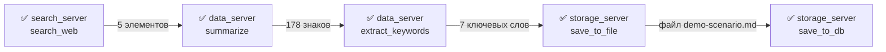

# Оркестрация MCP-серверов: прогон пяти сценариев (день 20)

Прогон: 2026-09-25T16:41:36+00:00 · сводка данных: агрегация (LLM выключена: `--llm off`)

Сценариев: 5 — 1. Демо-сценарий кнопкой (5 шагов по трём серверам); 2. Произвольный запрос через агента (реплика → флот); 3. Ошибка на шаге (маршрутизация и ошибка инструмента); 4. Перезапуск приложения (история и флот восстанавливаются); 5. Четвёртый сервер добавлен правкой файла (код не менялся). Флот дня: 3 MCP-сервера по stdio, публикуют 11 инструментов; каждый шаг — строка журнала.

**проверок пройдено: 47/47**
## 2. Проверки прогона

Проверки — утверждения сценариев, напечатанные в консоль прогона.

| сценарий | пройдено | вердикт |
|---|---|---|
| 1. Демо-сценарий кнопкой (5 шагов по трём серверам) | 13/13 | ✅ |
| 2. Произвольный запрос через агента (реплика → флот) | 10/10 | ✅ |
| 3. Ошибка на шаге (маршрутизация и ошибка инструмента) | 11/11 | ✅ |
| 4. Перезапуск приложения (история и флот восстанавливаются) | 8/8 | ✅ |
| 5. Четвёртый сервер добавлен правкой файла (код не менялся) | 5/5 | ✅ |

### 1. Демо-сценарий кнопкой (5 шагов по трём серверам)

- ✓ прогон завершён со статусом completed

- ✓ шагов ровно пять и все ok

- ✓ задействованы три сервера

- ✓ каждый шаг ушёл своему серверу

- ✓ реплика запуска — демо-запрос

- ✓ итоговое сообщение — «выполнена»

- ✓ поиск вернул элементы

- ✓ выход шага 1 стал входом шага 2 (данные перешли по ссылке)

- ✓ ключевые слова выделены из сводки

- ✓ файл сохранён в каталоге вывода

- ✓ размер файла совпадает с ответом инструмента

- ✓ строка записана в базу (номер строки получен)

- ✓ в базе лежит именно эта запись

### 2. Произвольный запрос через агента (реплика → флот)

- ✓ оркестрация распознана в реплике

- ✓ прогон завершён успешно

- ✓ план построен эвристикой (ключа DeepSeek нет)

- ✓ задействованы три сервера

- ✓ результат прогона ушёл в системный промпт

- ✓ блок оркестрации виден в системном промпте

- ✓ модель получила блок в запросе

- ✓ один ход — один автоматизм: пайплайн и одиночный вызов пропущены

- ✓ ответ агента получен (офлайн-заглушка)

- ✓ обычная реплика оркестрацию не запускает

### 3. Ошибка на шаге (маршрутизация и ошибка инструмента)

- ✓ неизвестный инструмент: прогон failed

- ✓ останов на втором шаге

- ✓ код причины — unknown_tool

- ✓ текст отказа перечисляет известные инструменты

- ✓ первый шаг остался ok

- ✓ оставшиеся шаги плана не выполнялись

- ✓ ошибка инструмента — тоже данные: прогон failed

- ✓ код причины — tool_error

- ✓ в шаге виден признак ошибки инструмента

- ✓ предыдущие шаги остались ok в журнале

- ✓ текст причины объясняет длину

### 4. Перезапуск приложения (история и флот восстанавливаются)

- ✓ флот остановлен

- ✓ флот подключён заново

- ✓ каталоги инструментов прочитаны после перезапуска

- ✓ история запусков на месте

- ✓ шаги прошлого запуска читаются из БД

- ✓ статистика считается по журналу

- ✓ кэш инструментов записан в файл флота

- ✓ новый прогон продолжает историю, не затирая прошлую

### 5. Четвёртый сервер добавлен правкой файла (код не менялся)

- ✓ в флоте четыре сервера

- ✓ инструментов стало тринадцать

- ✓ маршрутизация нашла инструмент нового сервера

- ✓ вызов нового инструмента работает по-настоящему

- ✓ реестр подключил только новый сервер (остальные не перезапускались)

Итог: 47 из 47 проверок.
## 3. Три MCP-сервера и их инструменты

Файл прогона `C:/Users/ILUSHK~1/AppData/Local/Temp/day20-orchestration-demo-1jkq66tc/mcp_servers.json` недоступен (временный каталог прогона удалён вместе с ним), поэтому команды и кэш — из файла дня `mcp_servers.json`.

Команды и кэш — из файла конфигурации (`servers_file`); инструменты сверены с каталогом реестра и журналом шагов (`server_name`); `†` — вызов без кэша.

| сервер | команда запуска | инструменты |
|---|---|---|
| `search_server` | `uv run python mcp_servers/search_server/server.py` | `search_web`, `search_local`, `fetch_url` |
| `data_server` | `uv run python mcp_servers/data_server/server.py` | `summarize`, `extract_keywords`, `filter_by_date`, `aggregate` |
| `storage_server` | `uv run python mcp_servers/storage_server/server.py` | `save_to_file`, `save_to_db`, `list_saved`, `load_from_file` |

Каталог флота (`catalog`, порядок реестра): search_web, search_local, fetch_url, summarize, extract_keywords, filter_by_date, aggregate, save_to_file, save_to_db, list_saved, load_from_file.
## 4. Сценарий 1 — демо-сценарий одной кнопкой

Прогон №1, статус `completed`, 689 мс; строки таблицы — журнал шагов:

| шаг | сервер | инструмент | входные данные | выходные данные | время выполнения | статус |
|---|---|---|---|---|---|---|
| 0 | `search_server` | `search_web` | `{"query": "", "source": "posts", "limit": 5}` | `{"query": "", "source": "posts", "source_kind": "api", "coun…` | 499 мс | ✅ ok |
| 1 | `data_server` | `summarize` | `{"items": [{"id": "post:1", "title": "sunt aut facere repell…` | `{"summary_text": "Найдено 5 элементов. Первые: sunt aut face…` | 6 мс | ✅ ok |
| 2 | `data_server` | `extract_keywords` | `{"text": "Найдено 5 элементов. Первые: sunt aut facere repel…` | `{"keywords": ["aut", "qui", "repellat", "esse", "est", "exce…` | 7 мс | ✅ ok |
| 3 | `storage_server` | `save_to_file` | `{"content": "Сводка:\nНайдено 5 элементов. Первые: sunt aut …` | `{"filename": "demo-scenario.md", "filepath": "C:/Users/ilush…` | 8 мс | ✅ ok |
| 4 | `storage_server` | `save_to_db` | `{"kind": "orchestration", "title": "найди последние посты по…` | `{"row_id": 1, "kind": "orchestration", "title": "найди после…` | 22 мс | ✅ ok |

Файл: `C:/Users/ilushkius/ai-advent-challenge/day20/output/demo-scenario.md` · каталог вывода: `C:/Users/ilushkius/ai-advent-challenge/day20/output`

```markdown
Сводка:
Найдено 5 элементов. Первые: sunt aut facere repellat provident occaecati excepturi optio reprehenderit; qui est esse; ea molestias quasi exercitationem repellat qui ipsa sit aut

Ключевые слова: aut, qui, repellat, esse, est, excepturi, exercitationem
```

Строка в базе (`saved_records`, база `C:/Users/ILUSHK~1/AppData/Local/Temp/day20-orchestration-demo-1jkq66tc/orchestration.db`):

| колонка | значение |
|---|---|
| `id` | `1` |
| `kind` | `orchestration` |
| `title` | `найди последние посты пользователей, сделай сводку по темам, сохрани в файл и запиши в базу` |
| `content` | `Найдено 5 элементов. Первые: sunt aut facere repellat provident occaecati excepturi optio reprehenderit; qui est esse; ea molestias quasi exercitationem repellat qui ipsa sit aut` |
| `source` | `search_web` |
| `metadata` | `{"file": "C:/Users/ilushkius/ai-advent-challenge/day20/output/demo-scenario.md", "keywords": "aut, qui, repellat, esse, est, excepturi, exercitationem"}` |
| `created_at` | `2026-09-25T16:36:28+00:00` |

Снимок интерфейса (живой прогон): `docs/reports/orchestration_ui.png`


## 5. Сценарий 2 — произвольный запрос через агента

Реплика: `RAG и сохрани в базу` распознана доменом, источник плана `heuristic` — ключа DeepSeek нет, план от эвристики дня:

| что | значение |
|---|---|
| серверы | `search_server, data_server, storage_server` |
| инструменты | `search_web, summarize, extract_keywords, save_to_file, save_to_db` |
| результат ушёл в промпт | `true` |
| добавлено токенов | `177` |
| обычная реплика запускает | `false` |

```
[офлайн-заглушка] результат оркестрации в запросе:
## Результат оркестрации
Запрос: RAG и сохрани в базу
Серверы: search_server, data_server, storage_server
Шаги:
- search_web (search_server): ok, 245 мс
- summarize (data_server): ok, 4 мс
- extract_keywords (data_server): ok, 3 мс
- save_to_file (storage_server): ok, 7 мс
- save_to_db (storage_server): ok, 13 мс
Итог: оркестрация выполнена
Данные собраны цепочкой MCP-инструментов; используй их как источник правды и не выдумывай полей, которых здесь нет.
```
## 6. Сценарий 3 — ошибка на шаге

Ошибка шага логируется строкой журнала (сервер, инструмент, аргументы, результат, время, текст ошибки); трассировка случая А — из журнала:

| случай | статус | шаг | код причины | статусы шагов | текст |
|---|---|---|---|---|---|
| А: инструмента нет ни у одного сервера | `failed` | `1` | `unknown_tool` | `ok, failed` | `Инструмент «teleport» не публикует ни один сервер флота. Известны: search_web, search_local, fetch_url, summarize, extract_keywords, filter_by_date, aggregate, save_to_file, save_to_db, list_saved, lo…` |
| Б: инструмент вернул ошибку | `failed` | `—` | `tool_error` | `— (см. проверки, раздел 2)` | `Error executing tool save_to_file: Текст длиннее допустимого (20000 символов)` |

| шаг | сервер | инструмент | входные данные | выходные данные | время выполнения | статус |
|---|---|---|---|---|---|---|
| 0 | `search_server` | `search_web` | `{"query": "", "source": "posts", "limit": 2}` | `{"query": "", "source": "posts", "source_kind": "api", "coun…` | 228 мс | ✅ ok |
| 1 | `—` | `teleport` | `{}` | `Инструмент «teleport» не публикует ни один сервер флота. Изв…` | 0 мс | ❌ failed |
## 7. Сценарий 4 — перезапуск приложения

Перезапуск — новый реестр на том же файле конфигурации и та же служба.

| что пережило перезапуск | источник | значение |
|---|---|---|
| история запусков и шаги | `orchestration_runs`/`_steps` | — (раздел 2) |
| статистика | `OrchestrationStore.stats()` | — (раздел 2) |
| состав флота | записи `mcp_servers.json` | 3 сервера |
| кэш инструментов | `tools_cache` записей | `search_server` — 3 шт., `data_server` — 4 шт., `storage_server` — 4 шт. |
## 8. Сценарий 5 — четвёртый сервер без правки кода

Файл флота скопировали во временный каталог и дописали запись — код не менялся.

| что | значение |
|---|---|
| добавленный сервер | `echo_server` |
| запись целиком | — (копия файла удалена с каталогом) |
| серверов во флоте | `4` |
| инструментов во флоте | `13` |
| новые инструменты | `echo, add` |
| результат маршрутизации | ✅ маршрутизация нашла инструмент нового сервера; вызов нового инструмента работает по-настоящему |
## 9. Схема таблиц `orchestration_runs` / `orchestration_steps`

Колонки и назначение — по ORM-классам `backend/models/orchestration.py`.

### `orchestration_runs` — запуски

| колонка | тип | назначение |
|---|---|---|
| `id` | INTEGER PK | номер запуска (им опрашивают статус) |
| `query` | VARCHAR(500) | реплика-запрос, из которой собран план |
| `plan` | JSON | план шагов целиком: имя, шаги, аргументы, условия |
| `status` | VARCHAR(16) | running \| completed \| stopped \| failed |
| `started_at` | DATETIME | когда прогон начался (UTC) |
| `finished_at` | DATETIME | когда завершился (NULL — идёт) |
| `total_duration_ms` | INTEGER | длительность прогона в миллисекундах |
| `servers_used` | JSON | серверы прогона в порядке первого появления |

### `orchestration_steps` — шаги запуска

| колонка | тип | назначение |
|---|---|---|
| `id` | INTEGER PK | номер строки журнала |
| `run_id` | INTEGER FK → orchestration_runs | запуск (ON DELETE CASCADE) |
| `step_index` | INTEGER | номер шага в плане (с нуля) |
| `server_name` | VARCHAR(64) | сервер флота, получивший вызов |
| `tool_name` | VARCHAR(64) | MCP-инструмент шага |
| `input_args` | JSON | аргументы вызова (ссылки плана уже разрешены) |
| `output_result` | JSON | structured, text, reason_code, is_error, duration_ms |
| `duration_ms` | INTEGER | сколько миллисекунд занял шаг |
| `status` | VARCHAR(16) | статус шага: ok \| failed \| stopped |
| `error_message` | TEXT | причина остановки или сообщение условия перехода |

Связь: `orchestration_steps.run_id` → `orchestration_runs.id` с `ON DELETE CASCADE`; журнал в SQLite — интерфейс видит прогресс, а история переживает рестарт.
## 10. Диаграмма флоу

По журналу сценария 1: узел на шаг (`сервер<br/>инструмент`), подпись ребра — объём данных, ушедший следующему серверу.



То же текстом: эта форма читается всегда, в том числе там, где mermaid не рисуется:

```
0. ✅ search_server · search_web  →[5 элементов]→
1. ✅ data_server · summarize  →[178 знаков]→
2. ✅ data_server · extract_keywords  →[7 ключевых слов]→
3. ✅ storage_server · save_to_file  →[файл demo-scenario.md]→
4. ✅ storage_server · save_to_db  (строка 1)
```
## 11. Автотесты дня

```
2144 passed, 269 warnings in 283.52s (0:04:43)
```
## 12. Что осталось за рамками

**Планировщик DeepSeek не задействован.** Ключа нет, план собрала эвристика дня, и ответ модели на промпт выбора инструментов проверить нечем.

**Данные внешние, сводка офлайн.** Поиск идёт в jsonplaceholder (ключ не нужен), а `--llm off` выключает DeepSeek в `data_server`: сводку делает агрегация.

**Рендер mermaid не проверен:** в headless-браузере этого окружения диаграмма не отрисовывается, поэтому рядом с ней стоит текстовая схема того же потока.

**Хранилище и политики.** `storage.db` не коммитится (`*.db` в `.gitignore`), дубли имён инструментов разрешены (первый сервер в порядке файла), повторов нет.
