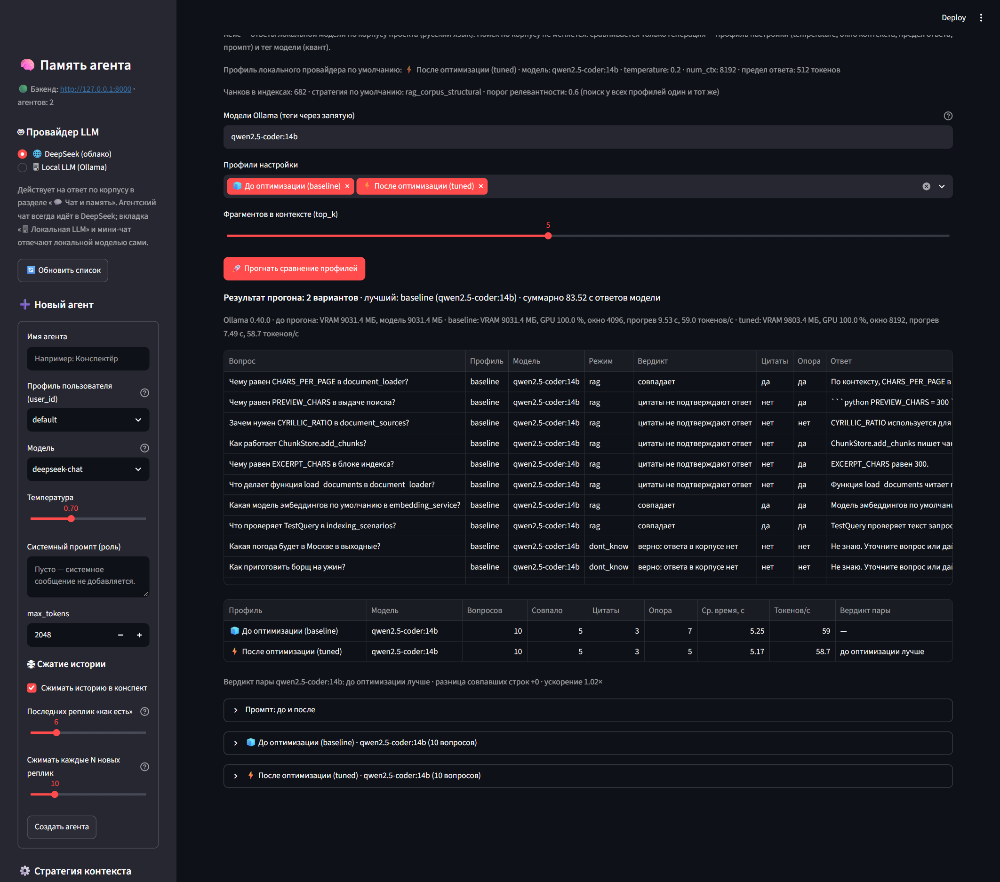

# Оптимизация локальной LLM под кейс RAG (день 29)

* дата прогона: 2026-10-08 22:32
* Ollama: 0.40.0 (http://localhost:11434)
* модели прогона: qwen2.5-coder:14b, qwen2.5-coder:14b-instruct-q3_K_M; модель конфига: qwen2.5-coder:14b
* профили: 🧊 До оптимизации (baseline) — модель конфига, temperature 0.7, num_ctx 4096, предел ответа по типу задачи, промпт режима (день 26) · ⚡ После оптимизации (tuned) — модель конфига, temperature 0.2, num_ctx 8192, предел ответа 512, промпт 527 символов
* профиль локального провайдера по умолчанию: tuned
* стратегия поиска: rag_corpus_structural, top_k: 5 (поиск у всех вариантов один и тот же)
* чанки по стратегиям: rag_corpus_fixed: 295 · rag_corpus_structural: 387 (всего 682)
* порог релевантности: 0.6 — ниже него строка приходит в режиме «не знаю» без вызова модели
* вариантов: 4, строк: 40, время прогона: 206.3 с

Воспроизведение (нужны запущенный бэкенд и Ollama):

```
uv run python scripts/run_local_llm_optimization.py --models qwen2.5-coder:14b,qwen2.5-coder:14b-instruct-q3_K_M
```

## Метод

Один и тот же набор контрольных вопросов корпуса прогоняется вариантами «профиль × модель» через `POST /llm/tune` (`provider="local"`). **Поиск по корпусу не меняется вообще** — FAISS-индекс дня 22 с диска и sentence-transformers; меняется только генерация: параметры профиля (temperature, окно контекста, предел ответа, системный промпт) и тег модели (квант).

Строка оценивается правилами проекта, без модели-судьи:

1. **вердикт строки** — правило дня 24 (`rag_demo.verdict`): `совпадает` (режим ожидался, ожидаемый источник найден, цитаты подтверждены), `верно: ответа в корпусе нет` для вопросов вне корпуса, и расхождения — `режим не совпал с ожиданием`, `источник не найден`, `цитаты не подтверждают ответ`, `ошибка модели, ответ без корпуса`;
2. **подтверждённые цитаты** (`quotes_verified`) — день 22/24;
3. **опора на контекст** (`grounding_ok`) — день 24: доля слов ответа, найденных в тексте фрагментов, выше порога.

Ранжирование вариантов: пара `(verdict_ok, quotes_verified, grounding_ok)`, тайбрейк — меньшее среднее время ответа (`avg_ms` считается только по строкам режима `rag`: в `dont_know` модель не вызывалась).

Скорость: `duration_ms` — время всего запроса (включая прогрев весов), `tokens_per_second` — из `eval_duration` Ollama (только генерация), `load_ms` — из `load_duration` (прогрев). Ресурсы — снимок `GET /api/ps` после прогона варианта: `size_vram` (VRAM), `size` (модель целиком), `context_length` (окно загруженного экземпляра); `gpu_percent` = 100·`size_vram`/`size`.

## Промпт: до и после

**До оптимизации** (`backend/domain/rag_mode.py` → `RAG_SYSTEM_PROMPT`; профиль `baseline` своего промпта не имеет):

````text
Ты отвечаешь по внутреннему корпусу документов проекта. Отвечай только на основе контекста. В ответе используй прямые цитаты из контекста, оборачивая их в кавычки. Если в контексте нет ответа — ответь «Не знаю» и попроси уточнение. Не используй общие знания. Отвечай по-русски, коротко: не длиннее шести предложений.
````

**После оптимизации** (`backend/domain/local_tuning.py` → `LOCAL_TUNED_RAG_PROMPT`):

````text
Ты отвечаешь на вопрос по фрагментам внутреннего корпуса проекта.
Правила:
1. Опирайся только на блок контекста ниже; общие знания и домыслы не используй.
2. Каждый факт подкрепляй короткой цитатой из контекста в кавычках.
3. Формат ответа: строка «Ответ:» с ответом не длиннее трёх предложений, затем строка «Источники:» с номерами использованных фрагментов, например [2], [5].
4. Если в контексте нет ответа — ответь ровно «Не знаю» и не перечисляй источники.
5. Пиши по-русски, без вступлений, извинений и пересказа вопроса.
````

## Таблица: до и после по вопросам

| № | Вопрос | Профиль | Модель | Режим | Вердикт | Цитаты | Опора | Ответ | Время, с | Токенов/с | Токенов вывода |
|---|---|---|---|---|---|---|---|---|---|---|---|
| 1 | Чему равен CHARS_PER_PAGE в document_loader? | baseline | qwen2.5-coder:14b | rag | цитаты не подтверждают ответ | нет | да | По контексту из документа `day21-backend-services-document_loader.py`, значение `CHARS_PER_PAGE` равно 1800. ```python CHARS_PER_PAGE = 1800 ``` | 23.69 | 55.9 | 48 |
| 2 | Чему равен PREVIEW_CHARS в выдаче поиска? | baseline | qwen2.5-coder:14b | rag | цитаты не подтверждают ответ | нет | да | В выдаче поиска PREVIEW_CHARS равен 300. Это указано в следующей строке контекста: ```python #: Сколько символов попадания показываются в ``preview`` (полный текст — в ``content``). PREVIEW_CHARS = 300 ``` | 4.53 | 56.9 | 70 |
| 3 | Зачем нужен CYRILLIC_RATIO в document_sources? | baseline | qwen2.5-coder:14b | rag | совпадает | да | нет | CYRILLIC_RATIO используется в функции detect_language для определения языка текста по доле кириллицы. Если доля кириллицы в тексте больше CYRILLIC_RATIO, то текст считается на русском языке ("ru"), иначе — на английском… | 4.46 | 57.5 | 74 |
| 4 | Как работает ChunkStore.add_chunks? | baseline | qwen2.5-coder:14b | rag | совпадает | да | да | ChunkStore.add_chunks пишет чанки одной стратегии и возвращает их id в порядке входа. Идентификаторы возвращаются, чтобы связать вектора FAISS с соответствующими чанками, без необходимости повторного запроса. Метод прини… | 8.85 | 56.2 | 308 |
| 5 | Чему равен EXCERPT_CHARS в блоке индекса? | baseline | qwen2.5-coder:14b | rag | цитаты не подтверждают ответ | нет | да | EXCERPT_CHARS равен 300. | 3.46 | 59.6 | 13 |
| 6 | Что делает функция load_documents в document_loader? | baseline | qwen2.5-coder:14b | rag | цитаты не подтверждают ответ | нет | да | Функция `load_documents` в `document_loader` читает папку документов и берет метаданные из манифеста. Если файл, которого нет в манифесте, метаданные для него определяются эвристиками и он добавляется в манифест. | 4.22 | 60.0 | 72 |
| 7 | Какая модель эмбеддингов по умолчанию в embedding_service? | baseline | qwen2.5-coder:14b | rag | совпадает | да | да | Модель эмбеддингов по умолчанию в `embedding_service` — `sentence-transformers/paraphrase-multilingual-MiniLM-L12-v2`. | 3.63 | 60.0 | 40 |
| 8 | Что проверяет TestQuery в indexing_scenarios? | baseline | qwen2.5-coder:14b | rag | совпадает | да | да | TestQuery проверяет "содержательное утверждение", а не факт запуска. Он содержит текст запроса, ожидаемые источники документов и пояснение для отчёта. Цель — убедиться, что запросы правильно распознаются и возвращаются о… | 4.50 | 58.6 | 73 |
| 9 | Какая погода будет в Москве в выходные? | baseline | qwen2.5-coder:14b | dont_know | верно: ответа в корпусе нет | нет | нет | Не знаю. Уточните вопрос или дайте больше контекста | 0.05 | 0.0 | 0 |
| 10 | Как приготовить борщ на ужин? | baseline | qwen2.5-coder:14b | dont_know | верно: ответа в корпусе нет | нет | нет | Не знаю. Уточните вопрос или дайте больше контекста | 0.03 | 0.0 | 0 |
| 11 | Чему равен CHARS_PER_PAGE в document_loader? | tuned | qwen2.5-coder:14b | rag | цитаты не подтверждают ответ | нет | да | Ответ: CHARS_PER_PAGE равен 1800. Источники: [2] | 11.50 | 56.7 | 24 |
| 12 | Чему равен PREVIEW_CHARS в выдаче поиска? | tuned | qwen2.5-coder:14b | rag | цитаты не подтверждают ответ | нет | да | Ответ: PREVIEW_CHARS равен 300. Источники: [2] | 3.66 | 58.5 | 22 |
| 13 | Зачем нужен CYRILLIC_RATIO в document_sources? | tuned | qwen2.5-coder:14b | rag | цитаты не подтверждают ответ | нет | нет | Ответ: CYRILLIC_RATIO используется для определения языка текста документа. Если доля кириллических символов в тексте превышает 15%, текст считается на русском языке; иначе — на английском. Источники: [2] | 4.41 | 57.1 | 73 |
| 14 | Как работает ChunkStore.add_chunks? | tuned | qwen2.5-coder:14b | rag | совпадает | да | нет | Ответ: Метод `add_chunks` в классе `ChunkStore` записывает чанки документов в таблицу `document_chunks` в базе данных SQLite. Он принимает итерируемый объект чанков и стратегию, возвращает список идентификаторов добавлен… | 5.27 | 56.5 | 109 |
| 15 | Чему равен EXCERPT_CHARS в блоке индекса? | tuned | qwen2.5-coder:14b | rag | цитаты не подтверждают ответ | нет | да | Ответ: EXCERPT_CHARS равен 300. Источники: [1] | 3.60 | 58.6 | 24 |
| 16 | Что делает функция load_documents в document_loader? | tuned | qwen2.5-coder:14b | rag | цитаты не подтверждают ответ | нет | да | Ответ: Функция `load_documents` читает папку документов и берет метаданные из манифеста. Если файл, которого нет в манифесте, он получает метаданные эвристиками и попадает в манифест. Источники: [2] | 4.41 | 54.7 | 74 |
| 17 | Какая модель эмбеддингов по умолчанию в embedding_service? | tuned | qwen2.5-coder:14b | rag | совпадает | да | да | Ответ: Модель эмбеддингов по умолчанию в `embedding_service` — `sentence-transformers/paraphrase-multilingual-MiniLM-L12-v2`. Источники: [2] | 3.80 | 59.4 | 51 |
| 18 | Что проверяет TestQuery в indexing_scenarios? | tuned | qwen2.5-coder:14b | rag | совпадает | да | да | Ответ: TestQuery проверяет тестовые запросы демонстрации индексации, их ожидаемые источники ответа и пояснения для отчёта. Источники: [2], [3] | 4.16 | 58.4 | 52 |
| 19 | Какая погода будет в Москве в выходные? | tuned | qwen2.5-coder:14b | dont_know | верно: ответа в корпусе нет | нет | нет | Не знаю. Уточните вопрос или дайте больше контекста | 0.05 | 0.0 | 0 |
| 20 | Как приготовить борщ на ужин? | tuned | qwen2.5-coder:14b | dont_know | верно: ответа в корпусе нет | нет | нет | Не знаю. Уточните вопрос или дайте больше контекста | 0.03 | 0.0 | 0 |
| 21 | Чему равен CHARS_PER_PAGE в document_loader? | baseline | qwen2.5-coder:14b-instruct-q3_K_M | rag | цитаты не подтверждают ответ | нет | да | CHARS_PER_PAGE равно 1800. | 12.07 | 64.0 | 12 |
| 22 | Чему равен PREVIEW_CHARS в выдаче поиска? | baseline | qwen2.5-coder:14b-instruct-q3_K_M | rag | цитаты не подтверждают ответ | нет | да | PREVIEW_CHARS равно 300. | 3.52 | 65.9 | 10 |
| 23 | Зачем нужен CYRILLIC_RATIO в document_sources? | baseline | qwen2.5-coder:14b-instruct-q3_K_M | rag | цитаты не подтверждают ответ | нет | нет | CYRILLIC_RATIO используется для определения языка текста. Если доля кириллических символов в тексте больше, чем значение CYRILLIC_RATIO, то текст считается на русском языке; иначе — на английском. | 4.19 | 64.1 | 63 |
| 24 | Как работает ChunkStore.add_chunks? | baseline | qwen2.5-coder:14b-instruct-q3_K_M | rag | цитаты не подтверждают ответ | нет | да | ``ChunkStore.add_chunks`` пишет чанки одной стратегии; возвращает их id в порядке входа. id возвращаются (а не просто их число), потому что вектора FAISS кладутся под этими же id: ``IndexService`` не смог бы связать вект… | 5.08 | 64.8 | 108 |
| 25 | Чему равен EXCERPT_CHARS в блоке индекса? | baseline | qwen2.5-coder:14b-instruct-q3_K_M | rag | цитаты не подтверждают ответ | нет | да | EXCERPT_CHARS равен 300. | 3.46 | 67.4 | 13 |
| 26 | Что делает функция load_documents в document_loader? | baseline | qwen2.5-coder:14b-instruct-q3_K_M | rag | цитаты не подтверждают ответ | нет | да | Функция `load_documents` в `document_loader` читает папку документов и берет метаданные из манифеста. Если файла нет в манифесте, он получает метаданные эвристиками и попадает в манифест, чтобы не выпасть из статистики и… | 4.38 | 63.6 | 81 |
| 27 | Какая модель эмбеддингов по умолчанию в embedding_service? | baseline | qwen2.5-coder:14b-instruct-q3_K_M | rag | совпадает | да | да | Модель эмбеддингов по умолчанию в `embedding_service` — `sentence-transformers/paraphrase-multilingual-MiniLM-L12-v2`. | 3.67 | 66.4 | 40 |
| 28 | Что проверяет TestQuery в indexing_scenarios? | baseline | qwen2.5-coder:14b-instruct-q3_K_M | rag | совпадает | да | да | TestQuery проверяет следующее: - **Текст запроса**: содержит строку запроса, который будет использован для поиска в индексе. - **Ожидаемые источники**: кортеж имен файлов в каталоге `documents/`, которые должны быть найд… | 6.74 | 64.5 | 219 |
| 29 | Какая погода будет в Москве в выходные? | baseline | qwen2.5-coder:14b-instruct-q3_K_M | dont_know | верно: ответа в корпусе нет | нет | нет | Не знаю. Уточните вопрос или дайте больше контекста | 0.05 | 0.0 | 0 |
| 30 | Как приготовить борщ на ужин? | baseline | qwen2.5-coder:14b-instruct-q3_K_M | dont_know | верно: ответа в корпусе нет | нет | нет | Не знаю. Уточните вопрос или дайте больше контекста | 0.03 | 0.0 | 0 |
| 31 | Чему равен CHARS_PER_PAGE в document_loader? | tuned | qwen2.5-coder:14b-instruct-q3_K_M | rag | цитаты не подтверждают ответ | нет | нет | Ответ: Значение CHARS_PER_PAGE равно 1800. Источники: [2], [3] | 10.38 | 63.4 | 29 |
| 32 | Чему равен PREVIEW_CHARS в выдаче поиска? | tuned | qwen2.5-coder:14b-instruct-q3_K_M | rag | цитаты не подтверждают ответ | нет | да | Ответ: PREVIEW_CHARS равен 300. Источники: [2] | 3.66 | 63.9 | 22 |
| 33 | Зачем нужен CYRILLIC_RATIO в document_sources? | tuned | qwen2.5-coder:14b-instruct-q3_K_M | rag | цитаты не подтверждают ответ | нет | нет | Ответ: CYRILLIC_RATIO используется для определения языка текста. Если доля кириллических символов в тексте превышает значение CYRILLIC_RATIO, то текст считается на русском языке; иначе — на английском. Источники: [2] | 4.38 | 63.9 | 75 |
| 34 | Как работает ChunkStore.add_chunks? | tuned | qwen2.5-coder:14b-instruct-q3_K_M | rag | совпадает | да | нет | Ответ: Метод `add_chunks` в классе `ChunkStore` записывает чанки в таблицу `document_chunks` в базе данных SQLite. Он принимает итерируемый объект чанков и стратегию, возвращает их идентификаторы в порядке входа. Чанки п… | 5.63 | 63.3 | 141 |
| 35 | Чему равен EXCERPT_CHARS в блоке индекса? | tuned | qwen2.5-coder:14b-instruct-q3_K_M | rag | цитаты не подтверждают ответ | нет | да | Ответ: Значение `EXCERPT_CHARS` равно 300. Источники: [1] | 3.68 | 66.1 | 28 |
| 36 | Что делает функция load_documents в document_loader? | tuned | qwen2.5-coder:14b-instruct-q3_K_M | rag | цитаты не подтверждают ответ | нет | да | Функция `load_documents` читает папку документов и берет метаданные из манифеста. Если файл, которого нет в манифесте, он получает метаданные эвристиками и попадает в манифест, чтобы не выпасть из статистики и отчета. Ис… | 4.40 | 65.0 | 86 |
| 37 | Какая модель эмбеддингов по умолчанию в embedding_service? | tuned | qwen2.5-coder:14b-instruct-q3_K_M | rag | совпадает | да | да | Ответ: Модель эмбеддингов по умолчанию в `embedding_service` — `sentence-transformers/paraphrase-multilingual-MiniLM-L12-v2`. Источники: [2] | 3.80 | 66.3 | 51 |
| 38 | Что проверяет TestQuery в indexing_scenarios? | tuned | qwen2.5-coder:14b-instruct-q3_K_M | rag | совпадает | да | да | Ответ: TestQuery проверяет тестовые запросы демонстрации индексации, их ожидаемые источники ответа и пояснения для отчёта. Источники: [2], [3] | 4.16 | 65.5 | 52 |
| 39 | Какая погода будет в Москве в выходные? | tuned | qwen2.5-coder:14b-instruct-q3_K_M | dont_know | верно: ответа в корпусе нет | нет | нет | Не знаю. Уточните вопрос или дайте больше контекста | 0.05 | 0.0 | 0 |
| 40 | Как приготовить борщ на ужин? | tuned | qwen2.5-coder:14b-instruct-q3_K_M | dont_know | верно: ответа в корпусе нет | нет | нет | Не знаю. Уточните вопрос или дайте больше контекста | 0.03 | 0.0 | 0 |

## Сводка по вариантам

| Профиль | Модель | Вопросов | Совпало | Цитаты | Опора | Ср. время, с | Токенов/с | VRAM, МБ | GPU, % | Вердикт пары |
|---|---|---|---|---|---|---|---|---|---|---|
| 🧊 До оптимизации (baseline) | qwen2.5-coder:14b | 10 | 6 | 4 | 7 | 7.17 | 58.1 | 9031 | 100 | — |
| ⚡ После оптимизации (tuned) | qwen2.5-coder:14b | 10 | 5 | 3 | 6 | 5.10 | 57.5 | 9803 | 100 | до оптимизации лучше |
| 🧊 До оптимизации (baseline) | qwen2.5-coder:14b-instruct-q3_K_M | 10 | 4 | 2 | 7 | 5.39 | 65.1 | 7558 | 100 | — |
| ⚡ После оптимизации (tuned) | qwen2.5-coder:14b-instruct-q3_K_M | 10 | 5 | 3 | 5 | 5.01 | 64.7 | 8330 | 100 | после оптимизации лучше |

Лучший вариант прогона: **baseline (qwen2.5-coder:14b)**. Суммарно ответы модели заняли 181.7 с.
* `qwen2.5-coder:14b`: baseline (qwen2.5-coder:14b) → tuned (qwen2.5-coder:14b) — **до оптимизации лучше**, разница совпавших строк -1, ускорение 1.4×.
* `qwen2.5-coder:14b-instruct-q3_K_M`: baseline (qwen2.5-coder:14b-instruct-q3_K_M) → tuned (qwen2.5-coder:14b-instruct-q3_K_M) — **после оптимизации лучше**, разница совпавших строк +1, ускорение 1.07×.

## Ресурсы

* до прогона: VRAM 7558 МБ, модель 7558 МБ

| Профиль | Модель | Загруженная модель | Модель, МБ | VRAM, МБ | GPU, % | Окно контекста | Прогрев, с | Токенов/с |
|---|---|---|---|---|---|---|---|---|
| baseline | qwen2.5-coder:14b | qwen2.5-coder:14b | 9031 | 9031 | 100 | 4096 | 10.54 | 58.1 |
| tuned | qwen2.5-coder:14b | qwen2.5-coder:14b | 9803 | 9803 | 100 | 8192 | 7.78 | 57.5 |
| baseline | qwen2.5-coder:14b-instruct-q3_K_M | qwen2.5-coder:14b-instruct-q3_K_M | 7558 | 7558 | 100 | 4096 | 8.52 | 65.1 |
| tuned | qwen2.5-coder:14b-instruct-q3_K_M | qwen2.5-coder:14b-instruct-q3_K_M | 8330 | 8330 | 100 | 8192 | 6.55 | 64.7 |

`gpu_percent` = 100·`size_vram`/`size`: 100 % — модель целиком в видеопамяти, меньше — часть слоёв считает CPU. Прогрев — максимум `load_duration` по строкам варианта (веса грузятся один раз, на первом запросе).

## Квантование

| Модель | Профиль | Совпало | Цитаты | Опора | Ср. время, с | Токенов/с | VRAM, МБ | Модель, МБ |
|---|---|---|---|---|---|---|---|---|
| qwen2.5-coder:14b | baseline | 6 | 4 | 7 | 7.17 | 58.1 | 9031 | 9031 |
| qwen2.5-coder:14b | tuned | 5 | 3 | 6 | 5.10 | 57.5 | 9803 | 9803 |
| qwen2.5-coder:14b-instruct-q3_K_M | baseline | 4 | 2 | 7 | 5.39 | 65.1 | 7558 | 7558 |
| qwen2.5-coder:14b-instruct-q3_K_M | tuned | 5 | 3 | 5 | 5.01 | 64.7 | 8330 | 8330 |

Размеры тегов берите из `ollama list`: квант меньше — модель компактнее и быстрее, но ответы слабее; вердикты строк выше показывают, чем именно это обошлось.

* `qwen2.5-coder:14b`: baseline (qwen2.5-coder:14b) → tuned (qwen2.5-coder:14b) — до оптимизации лучше, ускорение 1.4×.
* `qwen2.5-coder:14b-instruct-q3_K_M`: baseline (qwen2.5-coder:14b-instruct-q3_K_M) → tuned (qwen2.5-coder:14b-instruct-q3_K_M) — после оптимизации лучше, ускорение 1.07×.

## Приложение: полные ответы

### 🧊 До оптимизации (baseline) · qwen2.5-coder:14b (10 вопросов)

**1. Чему равен CHARS_PER_PAGE в document_loader?** — режим `rag` · цитаты не подтверждают ответ · 23.69 с · 55.9 токенов/с (вывод 48 токенов)

> По контексту из документа `day21-backend-services-document_loader.py`, значение `CHARS_PER_PAGE` равно 1800.
> 
> ```python
> CHARS_PER_PAGE = 1800
> ```

источники: day21-scripts-prepare_documents.py · module; day21-backend-services-document_loader.py · module; day21-backend-services-document_loader.py · DocumentLoader; day21-backend-services-index_service.py · module; day21-backend-models-indexing.py · module

**2. Чему равен PREVIEW_CHARS в выдаче поиска?** — режим `rag` · цитаты не подтверждают ответ · 4.53 с · 56.9 токенов/с (вывод 70 токенов)

> В выдаче поиска PREVIEW_CHARS равен 300. Это указано в следующей строке контекста:
> 
> ```python
> #: Сколько символов попадания показываются в ``preview`` (полный текст — в ``content``).
> PREVIEW_CHARS = 300
> ```

источники: day21-backend-services-index_service.py · _preview; day21-backend-services-index_service.py · module; day21-backend-models-indexing.py · module; day21-backend-models-indexing.py · DocumentChunk; day21-backend-schemas-indexing.py · IndexChunkOut

**3. Зачем нужен CYRILLIC_RATIO в document_sources?** — режим `rag` · совпадает · 4.46 с · 57.5 токенов/с (вывод 74 токенов)

> CYRILLIC_RATIO используется в функции detect_language для определения языка текста по доле кириллицы. Если доля кириллицы в тексте больше CYRILLIC_RATIO, то текст считается на русском языке ("ru"), иначе — на английском ("en").

источники: day21-backend-domain-document_sources.py · module; day21-backend-domain-document_sources.py · detect_language; day21-docs-architecture.md · Документы и их источники; day21-readme.md · Индексация и поиск; day21-backend-domain-index_scenarios.py · module

**4. Как работает ChunkStore.add_chunks?** — режим `rag` · совпадает · 8.85 с · 56.2 токенов/с (вывод 308 токенов)

> ChunkStore.add_chunks пишет чанки одной стратегии и возвращает их id в порядке входа. Идентификаторы возвращаются, чтобы связать вектора FAISS с соответствующими чанками, без необходимости повторного запроса. Метод принимает как объекты чанкера (Chunk с to_dict), так и готовые словари. Пример использования:
> 
> ```python
> def add_chunks(self, chunks: Iterable[Any], strategy: str) -> List[int]:
>     rows = [c.to_dict() if hasattr(c, "to_dict") else dict(c) for c in chunks]
>     if not rows:
>         return []
>     with self.session() as session:
>         orm_rows = []
>         for row in rows:
>             orm = DocumentChunk(
>                 source=row["source"],
>                 title=row["title"],
>                 section=row.get("section") or "",
>                 chunk_id=row["chunk_id"],
>                 strategy=strategy,
>                 content=row["content"],
>                 token_count=int(row.get("token_count") or 0),
>                 embedding_id=0,
>                 start_char=int(row.get("start_char") or 0),
>                 end_char=int(row.get("end_char") or 0),
>                 section_level=int(row.get("section_level") or 0),
>             )
>             orm_rows.append(orm)
>         session.bulk_save_objects(orm_rows)
>         session.flush()
>         ids = [chunk.id for chunk in orm_rows]
>         return ids
> ```

источники: day21-backend-storage-chunk_store.py · module; day21-backend-services-chunker.py · Chunk; day21-backend-storage-chunk_store.py · ChunkStore; day21-backend-services-index_service.py · IndexService; day21-backend-services-index_service.py · module

**5. Чему равен EXCERPT_CHARS в блоке индекса?** — режим `rag` · цитаты не подтверждают ответ · 3.46 с · 59.6 токенов/с (вывод 13 токенов)

> EXCERPT_CHARS равен 300.

источники: day21-backend-domain-indexing_prompt.py · module; day21-backend-domain-indexing_prompt.py · _excerpt; day21-backend-services-index_service.py · module; day21-docs-usage.md · 4.3 Как убедиться, что кэш работает; day21-backend-api-indexing.py · indexing_stats

**6. Что делает функция load_documents в document_loader?** — режим `rag` · цитаты не подтверждают ответ · 4.22 с · 60.0 токенов/с (вывод 72 токенов)

> Функция `load_documents` в `document_loader` читает папку документов и берет метаданные из манифеста. Если файл, которого нет в манифесте, метаданные для него определяются эвристиками и он добавляется в манифест.

источники: day21-backend-services-document_loader.py · DocumentLoader; day21-backend-services-document_loader.py · DocumentLoader; day21-backend-api-lifespan.py · _warmup_models; day21-backend-core-dependencies.py · get_embedding_service; day21-tests-fixtures_indexing.py · @pytest.fixture

**7. Какая модель эмбеддингов по умолчанию в embedding_service?** — режим `rag` · совпадает · 3.63 с · 60.0 токенов/с (вывод 40 токенов)

> Модель эмбеддингов по умолчанию в `embedding_service` — `sentence-transformers/paraphrase-multilingual-MiniLM-L12-v2`.

источники: day21-docs-usage.md · какая модель и какой предел ответа выбраны для какого типа задачи; day21-docs-architecture.md · Эмбеддинги; day21-tests-fixtures_indexing.py · @pytest.fixture; day21-backend-services-embedding_service.py · get_embedding_service; day21-backend-core-dependencies.py · get_embedding_service

**8. Что проверяет TestQuery в indexing_scenarios?** — режим `rag` · совпадает · 4.50 с · 58.6 токенов/с (вывод 73 токенов)

> TestQuery проверяет "содержательное утверждение", а не факт запуска. Он содержит текст запроса, ожидаемые источники документов и пояснение для отчёта. Цель — убедиться, что запросы правильно распознаются и возвращаются ожидаемые документы.

источники: day21-docs-architecture.md · Поток данных демо-сценария; day21-backend-domain-index_scenarios.py · module; day21-backend-domain-index_scenarios.py · TestQuery; day21-scripts-indexing_scenarios.py · module; day21-backend-core-dependencies.py · get_indexing_service

**9. Какая погода будет в Москве в выходные?** — режим `dont_know` · верно: ответа в корпусе нет · 0.05 с · 0.0 токенов/с (вывод 0 токенов)

> Не знаю. Уточните вопрос или дайте больше контекста

источники: —

предупреждение: Недостаточно контекста: максимальный балл 0.172 ниже порога 0.6

**10. Как приготовить борщ на ужин?** — режим `dont_know` · верно: ответа в корпусе нет · 0.03 с · 0.0 токенов/с (вывод 0 токенов)

> Не знаю. Уточните вопрос или дайте больше контекста

источники: —

предупреждение: Недостаточно контекста: максимальный балл 0.215 ниже порога 0.6

### ⚡ После оптимизации (tuned) · qwen2.5-coder:14b (10 вопросов)

**1. Чему равен CHARS_PER_PAGE в document_loader?** — режим `rag` · цитаты не подтверждают ответ · 11.50 с · 56.7 токенов/с (вывод 24 токенов)

> Ответ: CHARS_PER_PAGE равен 1800.
> 
> Источники: [2]

источники: day21-scripts-prepare_documents.py · module; day21-backend-services-document_loader.py · module; day21-backend-services-document_loader.py · DocumentLoader; day21-backend-services-index_service.py · module; day21-backend-models-indexing.py · module

**2. Чему равен PREVIEW_CHARS в выдаче поиска?** — режим `rag` · цитаты не подтверждают ответ · 3.66 с · 58.5 токенов/с (вывод 22 токенов)

> Ответ: PREVIEW_CHARS равен 300.
> 
> Источники: [2]

источники: day21-backend-services-index_service.py · _preview; day21-backend-services-index_service.py · module; day21-backend-models-indexing.py · module; day21-backend-models-indexing.py · DocumentChunk; day21-backend-schemas-indexing.py · IndexChunkOut

**3. Зачем нужен CYRILLIC_RATIO в document_sources?** — режим `rag` · цитаты не подтверждают ответ · 4.41 с · 57.1 токенов/с (вывод 73 токенов)

> Ответ: CYRILLIC_RATIO используется для определения языка текста документа. Если доля кириллических символов в тексте превышает 15%, текст считается на русском языке; иначе — на английском.
> 
> Источники: [2]

источники: day21-backend-domain-document_sources.py · module; day21-backend-domain-document_sources.py · detect_language; day21-docs-architecture.md · Документы и их источники; day21-readme.md · Индексация и поиск; day21-backend-domain-index_scenarios.py · module

**4. Как работает ChunkStore.add_chunks?** — режим `rag` · совпадает · 5.27 с · 56.5 токенов/с (вывод 109 токенов)

> Ответ: Метод `add_chunks` в классе `ChunkStore` записывает чанки документов в таблицу `document_chunks` в базе данных SQLite. Он принимает итерируемый объект чанков и стратегию, возвращает список идентификаторов добавленных чанков. Метод преобразует входные чанки в словари, создает объекты `DocumentChunk` и сохраняет их в базе данных.
> 
> Источники: [3]

источники: day21-backend-storage-chunk_store.py · module; day21-backend-services-chunker.py · Chunk; day21-backend-storage-chunk_store.py · ChunkStore; day21-backend-services-index_service.py · IndexService; day21-backend-services-index_service.py · module

**5. Чему равен EXCERPT_CHARS в блоке индекса?** — режим `rag` · цитаты не подтверждают ответ · 3.60 с · 58.6 токенов/с (вывод 24 токенов)

> Ответ: EXCERPT_CHARS равен 300.
> 
> Источники: [1]

источники: day21-backend-domain-indexing_prompt.py · module; day21-backend-domain-indexing_prompt.py · _excerpt; day21-backend-services-index_service.py · module; day21-docs-usage.md · 4.3 Как убедиться, что кэш работает; day21-backend-api-indexing.py · indexing_stats

**6. Что делает функция load_documents в document_loader?** — режим `rag` · цитаты не подтверждают ответ · 4.41 с · 54.7 токенов/с (вывод 74 токенов)

> Ответ: Функция `load_documents` читает папку документов и берет метаданные из манифеста. Если файл, которого нет в манифесте, он получает метаданные эвристиками и попадает в манифест.
> 
> Источники: [2]

источники: day21-backend-services-document_loader.py · DocumentLoader; day21-backend-services-document_loader.py · DocumentLoader; day21-backend-api-lifespan.py · _warmup_models; day21-backend-core-dependencies.py · get_embedding_service; day21-tests-fixtures_indexing.py · @pytest.fixture

**7. Какая модель эмбеддингов по умолчанию в embedding_service?** — режим `rag` · совпадает · 3.80 с · 59.4 токенов/с (вывод 51 токенов)

> Ответ: Модель эмбеддингов по умолчанию в `embedding_service` — `sentence-transformers/paraphrase-multilingual-MiniLM-L12-v2`.
> 
> Источники: [2]

источники: day21-docs-usage.md · какая модель и какой предел ответа выбраны для какого типа задачи; day21-docs-architecture.md · Эмбеддинги; day21-tests-fixtures_indexing.py · @pytest.fixture; day21-backend-services-embedding_service.py · get_embedding_service; day21-backend-core-dependencies.py · get_embedding_service

**8. Что проверяет TestQuery в indexing_scenarios?** — режим `rag` · совпадает · 4.16 с · 58.4 токенов/с (вывод 52 токенов)

> Ответ: TestQuery проверяет тестовые запросы демонстрации индексации, их ожидаемые источники ответа и пояснения для отчёта.
> 
> Источники: [2], [3]

источники: day21-docs-architecture.md · Поток данных демо-сценария; day21-backend-domain-index_scenarios.py · module; day21-backend-domain-index_scenarios.py · TestQuery; day21-scripts-indexing_scenarios.py · module; day21-backend-core-dependencies.py · get_indexing_service

**9. Какая погода будет в Москве в выходные?** — режим `dont_know` · верно: ответа в корпусе нет · 0.05 с · 0.0 токенов/с (вывод 0 токенов)

> Не знаю. Уточните вопрос или дайте больше контекста

источники: —

предупреждение: Недостаточно контекста: максимальный балл 0.172 ниже порога 0.6

**10. Как приготовить борщ на ужин?** — режим `dont_know` · верно: ответа в корпусе нет · 0.03 с · 0.0 токенов/с (вывод 0 токенов)

> Не знаю. Уточните вопрос или дайте больше контекста

источники: —

предупреждение: Недостаточно контекста: максимальный балл 0.215 ниже порога 0.6

### 🧊 До оптимизации (baseline) · qwen2.5-coder:14b-instruct-q3_K_M (10 вопросов)

**1. Чему равен CHARS_PER_PAGE в document_loader?** — режим `rag` · цитаты не подтверждают ответ · 12.07 с · 64.0 токенов/с (вывод 12 токенов)

> CHARS_PER_PAGE равно 1800.

источники: day21-scripts-prepare_documents.py · module; day21-backend-services-document_loader.py · module; day21-backend-services-document_loader.py · DocumentLoader; day21-backend-services-index_service.py · module; day21-backend-models-indexing.py · module

**2. Чему равен PREVIEW_CHARS в выдаче поиска?** — режим `rag` · цитаты не подтверждают ответ · 3.52 с · 65.9 токенов/с (вывод 10 токенов)

> PREVIEW_CHARS равно 300.

источники: day21-backend-services-index_service.py · _preview; day21-backend-services-index_service.py · module; day21-backend-models-indexing.py · module; day21-backend-models-indexing.py · DocumentChunk; day21-backend-schemas-indexing.py · IndexChunkOut

**3. Зачем нужен CYRILLIC_RATIO в document_sources?** — режим `rag` · цитаты не подтверждают ответ · 4.19 с · 64.1 токенов/с (вывод 63 токенов)

> CYRILLIC_RATIO используется для определения языка текста. Если доля кириллических символов в тексте больше, чем значение CYRILLIC_RATIO, то текст считается на русском языке; иначе — на английском.

источники: day21-backend-domain-document_sources.py · module; day21-backend-domain-document_sources.py · detect_language; day21-docs-architecture.md · Документы и их источники; day21-readme.md · Индексация и поиск; day21-backend-domain-index_scenarios.py · module

**4. Как работает ChunkStore.add_chunks?** — режим `rag` · цитаты не подтверждают ответ · 5.08 с · 64.8 токенов/с (вывод 108 токенов)

> ``ChunkStore.add_chunks`` пишет чанки одной стратегии; возвращает их id в порядке входа. id возвращаются (а не просто их число), потому что вектора FAISS кладутся под этими же id: ``IndexService`` не смог бы связать вектор с чанком, не зная id строк, — а запрашивать их повторно по ``chunk_id`` значило бы лишний запрос и вторую форму ответа на тот же вопрос.

источники: day21-backend-storage-chunk_store.py · module; day21-backend-services-chunker.py · Chunk; day21-backend-storage-chunk_store.py · ChunkStore; day21-backend-services-index_service.py · IndexService; day21-backend-services-index_service.py · module

**5. Чему равен EXCERPT_CHARS в блоке индекса?** — режим `rag` · цитаты не подтверждают ответ · 3.46 с · 67.4 токенов/с (вывод 13 токенов)

> EXCERPT_CHARS равен 300.

источники: day21-backend-domain-indexing_prompt.py · module; day21-backend-domain-indexing_prompt.py · _excerpt; day21-backend-services-index_service.py · module; day21-docs-usage.md · 4.3 Как убедиться, что кэш работает; day21-backend-api-indexing.py · indexing_stats

**6. Что делает функция load_documents в document_loader?** — режим `rag` · цитаты не подтверждают ответ · 4.38 с · 63.6 токенов/с (вывод 81 токенов)

> Функция `load_documents` в `document_loader` читает папку документов и берет метаданные из манифеста. Если файла нет в манифесте, он получает метаданные эвристиками и попадает в манифест, чтобы не выпасть из статистики и отчета.

источники: day21-backend-services-document_loader.py · DocumentLoader; day21-backend-services-document_loader.py · DocumentLoader; day21-backend-api-lifespan.py · _warmup_models; day21-backend-core-dependencies.py · get_embedding_service; day21-tests-fixtures_indexing.py · @pytest.fixture

**7. Какая модель эмбеддингов по умолчанию в embedding_service?** — режим `rag` · совпадает · 3.67 с · 66.4 токенов/с (вывод 40 токенов)

> Модель эмбеддингов по умолчанию в `embedding_service` — `sentence-transformers/paraphrase-multilingual-MiniLM-L12-v2`.

источники: day21-docs-usage.md · какая модель и какой предел ответа выбраны для какого типа задачи; day21-docs-architecture.md · Эмбеддинги; day21-tests-fixtures_indexing.py · @pytest.fixture; day21-backend-services-embedding_service.py · get_embedding_service; day21-backend-core-dependencies.py · get_embedding_service

**8. Что проверяет TestQuery в indexing_scenarios?** — режим `rag` · совпадает · 6.74 с · 64.5 токенов/с (вывод 219 токенов)

> TestQuery проверяет следующее:
> 
> - **Текст запроса**: содержит строку запроса, который будет использован для поиска в индексе.
> - **Ожидаемые источники**: кортеж имен файлов в каталоге `documents/`, которые должны быть найдены в ответе на запрос.
> - **Пояснение для отчёта**: строка с дополнительной информацией или контекстом, которая может быть полезна для понимания теста и результатов.
> 
> Пример из контекста:
> 
> ```python
> TestQuery(
>     query="оркестрация флота MCP-серверов и маршрутизация вызова по имени инструмента",
>     expected_sources=("day20-readme.md", "day20-docs-architecture.md"),
>     note="тема дня 20: флот из трёх серверов, реестр, маршрутизация по инструменту",
> )
> ```

источники: day21-docs-architecture.md · Поток данных демо-сценария; day21-backend-domain-index_scenarios.py · module; day21-backend-domain-index_scenarios.py · TestQuery; day21-scripts-indexing_scenarios.py · module; day21-backend-core-dependencies.py · get_indexing_service

**9. Какая погода будет в Москве в выходные?** — режим `dont_know` · верно: ответа в корпусе нет · 0.05 с · 0.0 токенов/с (вывод 0 токенов)

> Не знаю. Уточните вопрос или дайте больше контекста

источники: —

предупреждение: Недостаточно контекста: максимальный балл 0.172 ниже порога 0.6

**10. Как приготовить борщ на ужин?** — режим `dont_know` · верно: ответа в корпусе нет · 0.03 с · 0.0 токенов/с (вывод 0 токенов)

> Не знаю. Уточните вопрос или дайте больше контекста

источники: —

предупреждение: Недостаточно контекста: максимальный балл 0.215 ниже порога 0.6

### ⚡ После оптимизации (tuned) · qwen2.5-coder:14b-instruct-q3_K_M (10 вопросов)

**1. Чему равен CHARS_PER_PAGE в document_loader?** — режим `rag` · цитаты не подтверждают ответ · 10.38 с · 63.4 токенов/с (вывод 29 токенов)

> Ответ: Значение CHARS_PER_PAGE равно 1800.
> 
> Источники: [2], [3]

источники: day21-scripts-prepare_documents.py · module; day21-backend-services-document_loader.py · module; day21-backend-services-document_loader.py · DocumentLoader; day21-backend-services-index_service.py · module; day21-backend-models-indexing.py · module

**2. Чему равен PREVIEW_CHARS в выдаче поиска?** — режим `rag` · цитаты не подтверждают ответ · 3.66 с · 63.9 токенов/с (вывод 22 токенов)

> Ответ: PREVIEW_CHARS равен 300.
> 
> Источники: [2]

источники: day21-backend-services-index_service.py · _preview; day21-backend-services-index_service.py · module; day21-backend-models-indexing.py · module; day21-backend-models-indexing.py · DocumentChunk; day21-backend-schemas-indexing.py · IndexChunkOut

**3. Зачем нужен CYRILLIC_RATIO в document_sources?** — режим `rag` · цитаты не подтверждают ответ · 4.38 с · 63.9 токенов/с (вывод 75 токенов)

> Ответ: CYRILLIC_RATIO используется для определения языка текста. Если доля кириллических символов в тексте превышает значение CYRILLIC_RATIO, то текст считается на русском языке; иначе — на английском.
> 
> Источники: [2]

источники: day21-backend-domain-document_sources.py · module; day21-backend-domain-document_sources.py · detect_language; day21-docs-architecture.md · Документы и их источники; day21-readme.md · Индексация и поиск; day21-backend-domain-index_scenarios.py · module

**4. Как работает ChunkStore.add_chunks?** — режим `rag` · совпадает · 5.63 с · 63.3 токенов/с (вывод 141 токенов)

> Ответ: Метод `add_chunks` в классе `ChunkStore` записывает чанки в таблицу `document_chunks` в базе данных SQLite. Он принимает итерируемый объект чанков и стратегию, возвращает их идентификаторы в порядке входа. Чанки преобразуются в словари, и затем вставляются в базу данных с помощью SQLAlchemy. Метод `flush()` вызывается для пачечной вставки, и идентификаторы строк известны до фиксации транзакции `commit()`.
> 
> Источники: [3]

источники: day21-backend-storage-chunk_store.py · module; day21-backend-services-chunker.py · Chunk; day21-backend-storage-chunk_store.py · ChunkStore; day21-backend-services-index_service.py · IndexService; day21-backend-services-index_service.py · module

**5. Чему равен EXCERPT_CHARS в блоке индекса?** — режим `rag` · цитаты не подтверждают ответ · 3.68 с · 66.1 токенов/с (вывод 28 токенов)

> Ответ: Значение `EXCERPT_CHARS` равно 300.
> 
> Источники: [1]

источники: day21-backend-domain-indexing_prompt.py · module; day21-backend-domain-indexing_prompt.py · _excerpt; day21-backend-services-index_service.py · module; day21-docs-usage.md · 4.3 Как убедиться, что кэш работает; day21-backend-api-indexing.py · indexing_stats

**6. Что делает функция load_documents в document_loader?** — режим `rag` · цитаты не подтверждают ответ · 4.40 с · 65.0 токенов/с (вывод 86 токенов)

> Функция `load_documents` читает папку документов и берет метаданные из манифеста. Если файл, которого нет в манифесте, он получает метаданные эвристиками и попадает в манифест, чтобы не выпасть из статистики и отчета.
> 
> Источники: [2]

источники: day21-backend-services-document_loader.py · DocumentLoader; day21-backend-services-document_loader.py · DocumentLoader; day21-backend-api-lifespan.py · _warmup_models; day21-backend-core-dependencies.py · get_embedding_service; day21-tests-fixtures_indexing.py · @pytest.fixture

**7. Какая модель эмбеддингов по умолчанию в embedding_service?** — режим `rag` · совпадает · 3.80 с · 66.3 токенов/с (вывод 51 токенов)

> Ответ: Модель эмбеддингов по умолчанию в `embedding_service` — `sentence-transformers/paraphrase-multilingual-MiniLM-L12-v2`.
> 
> Источники: [2]

источники: day21-docs-usage.md · какая модель и какой предел ответа выбраны для какого типа задачи; day21-docs-architecture.md · Эмбеддинги; day21-tests-fixtures_indexing.py · @pytest.fixture; day21-backend-services-embedding_service.py · get_embedding_service; day21-backend-core-dependencies.py · get_embedding_service

**8. Что проверяет TestQuery в indexing_scenarios?** — режим `rag` · совпадает · 4.16 с · 65.5 токенов/с (вывод 52 токенов)

> Ответ: TestQuery проверяет тестовые запросы демонстрации индексации, их ожидаемые источники ответа и пояснения для отчёта.
> 
> Источники: [2], [3]

источники: day21-docs-architecture.md · Поток данных демо-сценария; day21-backend-domain-index_scenarios.py · module; day21-backend-domain-index_scenarios.py · TestQuery; day21-scripts-indexing_scenarios.py · module; day21-backend-core-dependencies.py · get_indexing_service

**9. Какая погода будет в Москве в выходные?** — режим `dont_know` · верно: ответа в корпусе нет · 0.05 с · 0.0 токенов/с (вывод 0 токенов)

> Не знаю. Уточните вопрос или дайте больше контекста

источники: —

предупреждение: Недостаточно контекста: максимальный балл 0.172 ниже порога 0.6

**10. Как приготовить борщ на ужин?** — режим `dont_know` · верно: ответа в корпусе нет · 0.03 с · 0.0 токенов/с (вывод 0 токенов)

> Не знаю. Уточните вопрос или дайте больше контекста

источники: —

предупреждение: Недостаточно контекста: максимальный балл 0.215 ниже порога 0.6


## Итог

* **🧊 До оптимизации (baseline)** (`qwen2.5-coder:14b`): совпало 6 из 10, цитаты 4, опора 7, ошибок 0; среднее время 7.17 с, 58.1 токенов/с, VRAM 9031 МБ
* **⚡ После оптимизации (tuned)** (`qwen2.5-coder:14b`): совпало 5 из 10, цитаты 3, опора 6, ошибок 0; среднее время 5.10 с, 57.5 токенов/с, VRAM 9803 МБ
* **🧊 До оптимизации (baseline)** (`qwen2.5-coder:14b-instruct-q3_K_M`): совпало 4 из 10, цитаты 2, опора 7, ошибок 0; среднее время 5.39 с, 65.1 токенов/с, VRAM 7558 МБ
* **⚡ После оптимизации (tuned)** (`qwen2.5-coder:14b-instruct-q3_K_M`): совпало 5 из 10, цитаты 3, опора 5, ошибок 0; среднее время 5.01 с, 64.7 токенов/с, VRAM 8330 МБ

* вопросов в прогоне: 10
* лучший вариант: baseline (qwen2.5-coder:14b)
* строк с режимом `error`: 0

## Выводы

Написано по факту прогона 2026-10-08 (Ollama 0.40.0, RTX 5070 12 ГБ, `top_k` 5,
стратегия `rag_corpus_structural`, десять контрольных вопросов демо, 40 строк):

1. **Скорость выросла на обоих тегах, у исходного кванта — сильнее.** `baseline` →
   `tuned`: **7.17 → 5.10 с** на `qwen2.5-coder:14b` (**ускорение 1.40×**) и
   5.39 → 5.01 с на `qwen2.5-coder:14b-instruct-q3_K_M` (1.07×). Причина видна в
   токенах вывода: профиль `tuned` просит ответ не длиннее трёх предложений и режет
   предел до 512, поэтому суммарный вывод упал **698 → 429 токенов (−39 %)** на Q4_K_M
   и 546 → 484 (−11 %) на Q3_K_M. Скорость самой генерации почти не изменилась
   (58.1 → 57.5 и 65.1 → 64.7 токенов/с): выигрыш даёт короткий ответ, а не железо.
2. **Качество на десяти вопросах не разошлось за пределы разброса.** Вердикты строк:
   Q4_K_M — 6 против 5 (лучше `baseline`), Q3_K_M — 4 против 5 (лучше `tuned`);
   подтверждённых цитат 4/3 и 2/3; опора 7/6 и 7/5. Прогон повторяли, и счёт вердиктов у
   исходного кванта менялся на единицу между запусками (5 → 6) — на наборе из десяти
   вопросов разница в одну строку это шум, а не эффект профиля. Поэтому и машинный
   вердикт пары (вердикты → цитаты → опора, затем время) выходит разным: «до
   оптимизации лучше» на Q4_K_M и «после оптимизации лучше» на Q3_K_M.
3. **Опора — метрика против краткости.** `grounding_ok` считает долю слов ответа,
   найденных в тексте фрагментов. Короткий ответ `tuned` («Ответ: … Источники: [2]»)
   содержит меньше слов корпуса, чем пересказ `baseline`, поэтому опора падает на одну
   строку даже там, где факты те же: длинный пересказ выигрывает у метрики, а не у
   ответа. Средний ответ сократился с 69.8 до 42.9 токена на Q4_K_M.
4. **Квант Q3_K_M дешевле по памяти и быстрее, но слабее переносит `baseline`.**
   7.3 ГБ против 9.0 ГБ (`ollama list`) — в `/api/ps` это **7558 против 9031 МБ VRAM**
   (экономия ≈ 1.5 ГБ) и **~12 %** быстрее генерация (65.1 против 58.1 токенов/с). Цена:
   качество проседает (4 против 6 вердиктов и 2 против 4 цитат), а с `tuned` теги
   сравниваются (5 против 5). Рабочий компромисс для 12 ГБ: `tuned` + Q3_K_M идёт
   на 30 % быстрее исходного варианта при равных вердиктах.
5. **Окно 8192 стоит VRAM и на этом наборе ничего не дало.** Модель у всех вариантов
   целиком в видеопамяти (`GPU 100 %`), но `tuned` занимает **9803 против 9031 МБ
   (+772 МБ)** на Q4_K_M и 8330 против 7558 МБ на Q3_K_M — это цена удвоенного окна.
   Вопросы демо укладываются в пять фрагментов (бюджет блока
   `RAG_CONTEXT_MAX_TOKENS = 3000`), поэтому запас окна здесь не виден; он нужен
   длинному контексту, где 4096 упирается в границу.
6. **Промпт меняет форму ответа, а параметры — его длину.** Обе модели в `tuned`
   отвечают «Ответ: … Источники: [N]» и не пересказывают вопрос: строка отчёта и
   интерфейса читается одинаково у любого варианта, а `POST /llm/tune` их сравнивает
   построчно. Единственная измеренная потеря от краткости — опора из пункта 3.

**Что осталось по умолчанию.** Профиль `tuned` (`LOCAL_LLM_PROFILE=tuned`): он быстрее
исходного при равных вердиктах и цитатах. Окно 8192 и предел 512 взяты по заданию дня
и по итогам замера не менялись; если приоритет — VRAM, окно можно вернуть к 4096,
замер с окном 4096 — это `baseline` в таблице выше. Вернуть поведение дня 26 целиком:
`LOCAL_LLM_PROFILE=baseline` в `day21/.env` плюс рестарт бэкенда.

### Снимок раздела интерфейса

Тот же прогон кнопкой (два профиля на одной модели) в разделе «⚙️ Оптимизация
локальной LLM»: таблица строк, сводка с вердиктом пары, блок «Промпт: до и после» и
раскрывашки вариантов.


