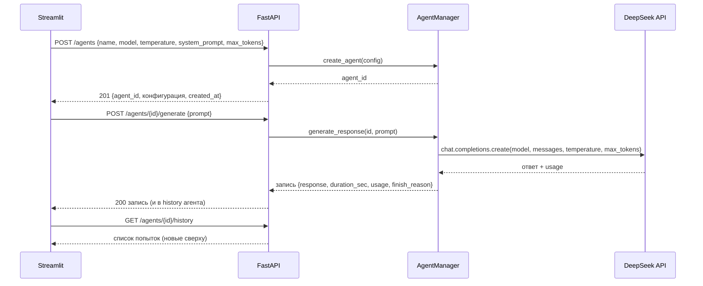

# Архитектура дня 6 — «Менеджер агентов DeepSeek»

## Роль и компоненты

Приложение — учебный «хаб» LLM-агентов: агенты живут на **бэкенде** (FastAPI),
а пользователь управляет ими через **фронтенд** (Streamlit), который общается с
бэкендом по HTTP. Сам вызов модели делает только агент на бэкенде — фронтенд
про ключи DeepSeek не знает.

```
┌──────────────┐   HTTP (requests)   ┌──────────────────┐   HTTPS (openai SDK)
│  Streamlit   │ ──────────────────► │     FastAPI      │ ──────────────────► DeepSeek API
│  app.py      │ ◄────────────────── │  backend/main.py │ ◄────────────────── https://api.deepseek.com
│  порт 8501   │   JSON              │    порт 8000     │   Chat Completions
└──────────────┘                     └──────────────────┘
                                             │
                                     владеет всеми агентами
                                             ▼
                              ┌─────────────────────────────┐
                              │  AgentManager (синглтон)    │
                              │  dict[agent_id -> Agent]    │
                              └─────────────────────────────┘
                                             │ создаёт/хранит
                                     ┌───────┴────────┐
                                     ▼                ▼
                              Agent «A»           Agent «B»
                              (модель, temp,      (своя модель,
                               промпт, история)     temp, промпт,
                                                    история)
```

## Классы

```mermaid
classDiagram
    class AgentConfig {
        +str name
        +str model = "deepseek-chat"
        +float temperature = 0.7
        +str system_prompt = ""
        +int max_tokens = 2048
    }
    class Agent {
        +str agent_id
        +AgentConfig config
        +datetime created_at
        +list history  "попытки, новые сверху"
        +generate(prompt) dict  "ответ/ошибка + метрики"
        -_make_client()  "openai-клиент DeepSeek"
    }
    class AgentManager {
        -dict _agents
        -Lock _lock
        +create_agent(cfg) str  "id"
        +get_agent(id) Agent
        +list_agents() list
        +remove_agent(id) bool
        +generate_response(id, prompt) dict
    }
    class FastAPI {
        POST /agents
        GET /agents
        GET /agents/{id}
        DELETE /agents/{id}
        POST /agents/{id}/generate
        GET /agents/{id}/history
    }
    AgentManager "1" o-- "*" Agent : хранит
    FastAPI --> AgentManager : get_manager()
    Agent ..> AgentConfig : конфигурация
```

Ключевые решения:

- **Agent** инкапсулирует всё про одного агента: конфигурация, фабрика клиента
  DeepSeek, `generate(prompt)` (сборка messages system+user, замер времени,
  метрики `finish_reason`/`usage`) и собственную историю попыток (успех и
  ошибки). Клиент создаётся фабрикой `_make_client()`, поэтому код тестируется
  офлайн подменой фабрики на фейк.
- **AgentManager** — синглтон на процесс бэкенда: модульный объект +
  `get_manager()`. Внутри словарь агентов; мутации (create/remove) защищены
  `threading.Lock`, потому что FastAPI обрабатывает запросы в пуле потоков.
  Создание агента **не обращается к сети** — только кладёт объект в словарь.
- **Pydantic-схемы** (`backend/models.py`) — единый контракт API: валидация
  температуры 0–2, `max_tokens` 1–8192, непустых имени и промпта (пробелы тоже
  отсекаются). Ответы/ошибки сериализуются через те же схемы.
- **Ключ** `DEEPSEEK_API_KEY` резолвится бэкендом в момент генерации:
  `day6/.env` → переменная окружения → ошибка «ключ не задан» без вызова сети.
  Так поведение без ключа проверяемо офлайн и не требует рестарта при смене
  окружения.

## Потоки взаимодействия



## Модель данных записи попытки

Каждая попытка генерации — словарь (и JSON в API):

| Поле | Тип | Смысл |
| --- | --- | --- |
| `agent_id` | str | чей агент |
| `status` | `"ok"`/`"error"` | чем закончилась попытка |
| `prompt` | str | что отправляли |
| `response` | str? | текст ответа (при `ok`) |
| `error` | str? | понятное сообщение (при `error`) |
| `model` | str | какая модель отвечала |
| `finish_reason` | str? | `stop`/`length`/… |
| `usage` | dict? | `prompt_tokens`, `completion_tokens`, `total_tokens` |
| `duration_sec` | float? | время запроса |
| `timestamp` | datetime | момент попытки |

## Контракт ошибок API

- `404` — неизвестный `agent_id` (тело `{"detail": "Агент … не найден"}`);
- `422` — невалидное тело (Pydantic/FastAPI);
- `502` — сбой генерации (сеть, DeepSeek, «ключ не задан»): тело
  `{agent_id, status: "error", error: "…", ...}` — без traceback, агент и сервер
  продолжают работать.

## Как масштабировать до 100 агентов

«100 агентов» — это **не** 100 серверов: это 100 экземпляров `Agent` в
словаре одного `AgentManager`. Создание экземпляра — операция в памяти без
сетевых вызовов, поэтому спавн пула из 100 агентов с разными конфигурациями
практически мгновенен (в UI — кнопка «Заспавнить N» до 100; в API — N вызовов
`POST /agents` с разными телами). У каждого агента своя конфигурация и своя
история; при генерации менеджер делегирует запрос конкретному агенту.

Ограничения такого подхода и пути развития:

- **State в памяти** — рестарт бэкенда стирает агентов. Для продакшена —
  персистентность (SQLite/Postgres/Redis), объекты `Agent` пересоздаются по
  конфигурации из БД при старте.
- **Синхронная генерация** — FastAPI держит поток на время вызова DeepSeek.
  Для сотен одновременных запросов — асинхронные endpoint'ы/очередь задач.
- **Один процесс** — при необходимости горизонтального роста менеджер можно
  вынести в отдельный сервис (или в Redis), сохранив тот же HTTP-контракт.
