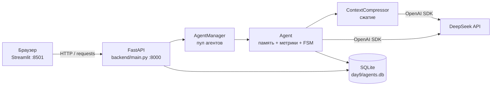

# Архитектура дня 9 — «Управление контекстом: сжатие истории»

День 9 развивает день 8 (`day8/` не изменяется) и добавляет **сжатие истории
диалога**: последние N реплик отправляются «как есть», а всё более старое
заменяется конспектом. Конспект хранится отдельной таблицей и подставляется в
запрос вместо полной истории, поэтому в контекст модели уходит существенно
меньше токенов.

Стек: Python 3.14, FastAPI + uvicorn (порт 8000), Streamlit (порт 8501),
SQLite + SQLAlchemy 2.0, tiktoken, OpenAI SDK → DeepSeek
(`https://api.deepseek.com`), pytest.



## Компоненты

| Файл | Зона ответственности |
| --- | --- |
| `day9/app.py` | Streamlit-чат: панель сжатия, панель токенов, блок сравнения режимов, маркер сжатия в истории, форма агента и PATCH-переключатель сжатия |
| `backend/config.py` | URL и модели DeepSeek, дефолты агента, диапазоны валидации, лимиты контекста (`MODEL_TOKEN_LIMITS`), тарифы (`MODEL_PRICES`), настройки сжатия, путь БД и `.env`, чтение ключа |
| `backend/context_fsm.py` | Стейт-машина процесса сжатия: Enum состояний и событий, классы состояний (паттерн State), таблица переходов, `ContextMachine` |
| `backend/context_policy.py` | Чистая арифметика: `CompressionPolicy`, `CompressionPlan`, `plan_compression`, `split_uncovered` — без HTTP, БД и UI |
| `backend/database.py` | SQLAlchemy: `make_engine`, `SessionLocal`, `init_db`, `make_session_factory`; ORM-таблицы `agents`, `messages`, `summaries`, `token_usage` |
| `backend/models.py` | Pydantic-схемы API: конфигурация/патч агента, запросы, `GenerateResponse`, `TokenMetrics`, `CompressionInfo`, `ContextInfo`, `SummaryInfo`, `CompareResult`, `UsageSummary` |
| `backend/compressor.py` | `ContextCompressor`: план сжатия, сборка промпта суммаризации, вызов модели, запись строки в `summaries`, экономика |
| `backend/agent.py` | `Agent`: память диалога, подсчёт токенов, сборка двух payload (`build_payloads`), аварийный предохранитель, FSM, `generate`, `compare_modes`, `summary_state` |
| `backend/agent_manager.py` | `AgentManager` (синглтон): пул агентов, `restore_from_db`, PATCH, сжатие, SQL-агрегаты `token_usage` |
| `backend/main.py` | FastAPI: 13 эндпоинтов, `GET /`, обработка 404/422/502 |
| `tests/` | Офлайн-тесты (фейковый клиент DeepSeek + временная SQLite) по всем слоям |

Схема потоков одного хода:

```
Streamlit app.py ──HTTP──▶ FastAPI main.py ──▶ AgentManager ──▶ Agent
                                                                │
                        ┌───────────────────────────────────────┤
                        ▼                                       ▼
              ContextCompressor ──▶ DeepSeek          SQLite agents.db
              (конспект в summaries)                  messages / summaries / token_usage
```

## Схема БД (`day9/agents.db`)

Четыре таблицы; от агента — три связи один-ко-многим с каскадным удалением:

```
agents (1) ──< messages     (N)   полный диалог user/assistant
    │        ──< summaries   (N)   конспекты, append-only
    └────────< token_usage  (N)   метрики каждого успешного хода
             (agent_id FK → agents.agent_id, ondelete CASCADE, index)
```

**`agents`** — конфигурация агента.
`agent_id` (PK, String), `name` (String(100)), `model` (String(100)),
`temperature` (Float), `system_prompt` (Text, default `""`),
`max_tokens` (Integer), `created_at` (DateTime),
`summary_enabled` (Boolean, default `True`), `keep_last_messages` (Integer,
default `6`), `summarize_every` (Integer, default `10`).

**`messages`** — реплики диалога.
`id` (Integer PK, autoincrement), `agent_id` (FK→`agents.agent_id`, CASCADE,
index), `role` (String(16)), `content` (Text), `timestamp` (DateTime).
Это **полная** история: при сжатии реплики **НЕ удаляются**. Конспект заменяет
их только в запросе к модели; в БД они остаются для аудита и восстановления, а
фронтенд помечает их флагом `summarized`.

**`summaries`** — конспекты, **append-only**.
`id` (Integer PK), `agent_id` (FK, CASCADE, index), `content` (Text),
`covered_from_message_id` / `covered_to_message_id` (Integer — границы и
watermark), `covered_messages`, `source_tokens`, `summary_tokens`,
`prompt_tokens`, `completion_tokens` (Integer), `cost` (Float),
`created_at` (DateTime).
Каждая успешная суммаризация добавляет новую строку, старые не изменяются;
**текущий конспект = последняя строка** (`ORDER BY id DESC`). Всё, что старше
`covered_to_message_id`, считается покрытым и в запрос не уходит. Append-only
сохраняет историю сжатий для UI и позволяет посчитать суммарную стоимость
конспектов.

**`token_usage`** — одна запись на успешный ход.
Базовые поля дня 8: `id` (PK), `agent_id` (FK, CASCADE, index), `timestamp`,
`prompt_tokens`, `completion_tokens`, `total_tokens`, `history_tokens`,
`response_tokens` (Integer), `cost` (Float).
Поля дня 9: `mode` (String(16), `"full"` | `"compressed"`),
`full_context_tokens`, `sent_context_tokens`, `saved_tokens`, `summary_tokens`,
`summarized_messages` (Integer), `summary_used` (Boolean).

Каскады включены и на уровне ORM (`cascade="all, delete-orphan"`), и на уровне
БД (`PRAGMA foreign_keys=ON` в `make_engine`). `DELETE /agents/{id}` удаляет
агента вместе с `messages`, `summaries` и `token_usage`; `DELETE
/agents/{id}/history` очищает диалог, конспекты и метрики, не трогая
конфигурацию агента. Таблицы создаются при старте бэкенда (`init_db` →
`create_all`), файл `agents.db` в git не попадает (правило `*.db`).

## Правило сжатия

Вся арифметика — в `context_policy.py`, без побочных эффектов.
`CompressionPolicy(enabled, keep_last, summarize_every)` — настройки агента,
`plan_compression(policy, uncovered_count)` считает:

| Величина | Формула |
| --- | --- |
| `backlog` | `uncovered_count − keep_last` |
| `should_compress` | `enabled and backlog >= summarize_every` |
| `summarize_count` (при сжатии) | `backlog` — самые старые непокрытые реплики |
| `keep_count` (при сжатии) | `keep_last` — последние непокрытые реплики |
| `summarize_count` / `keep_count` (без сжатия) | `0` / `uncovered_count` |

Инварианты проверяются явно: `uncovered_count < 0`, `keep_last < 1` или
`summarize_every < 1` → `ValueError`. `split_uncovered(rows, plan)` режет
последовательность на «в конспект» и «оставить» и требует, чтобы
`len(rows) == plan.uncovered_count` (иначе `ValueError`, а не молчаливая
потеря реплик).

**Пример расчёта** при `keep_last = 6`, `summarize_every = 10`,
`uncovered_count = 17`:

```
backlog = 17 − 6 = 11
should_compress = True   (11 >= 10)
summarize_count = 11     → 11 самых старых реплик уходят в конспект
keep_count = 6           → 6 последних уходят в запрос как есть
```

Граница среза выравнивается по паре реплик (`_compress_slice`): если первый
оставляемый остаток — ответ `assistant`, он тоже уходит в конспект, чтобы
«хвост» всегда начинался с реплики пользователя.

**Payload запроса при включённом сжатии:**

```
[system: system_prompt + «Конспект предыдущей части диалога …»]
+ последние keep_last НЕПОКРЫТЫХ конспектом реплик
+ новое сообщение пользователя
```

Конспект вкладывается в **существующее** system-сообщение, а не добавляется
вторым: так поведение не зависит от того, как провайдер обрабатывает несколько
system-сообщений подряд. Если нет ни конспекта, ни `system_prompt`, отдельного
system-сообщения в payload нет вовсе. Без конспекта и с выключенным сжатием
payload равен «системный промпт + вся история + промпт» — поведение дня 8.

## Стейт-машина сжатия

`ContextState`: `IDLE="idle"`, `TRACKING="tracking"`,
`SUMMARY_PENDING="summary_pending"`, `SUMMARIZING="summarizing"`,
`ERROR="error"`.
`ContextEvent`: `TURN_ADDED`, `THRESHOLD_REACHED`, `SUMMARY_REQUESTED`,
`SUMMARY_READY`, `SUMMARY_FAILED`, `RESET`, `DISABLED`, `ENABLED`.

| Состояние | TURN_ADDED | THRESHOLD_REACHED | SUMMARY_REQUESTED | SUMMARY_READY | SUMMARY_FAILED | RESET | DISABLED | ENABLED |
| --- | --- | --- | --- | --- | --- | --- | --- | --- |
| IDLE | TRACKING | — | — | — | — | IDLE | IDLE | IDLE |
| TRACKING | TRACKING | SUMMARY_PENDING | — | — | — | IDLE | IDLE | — |
| SUMMARY_PENDING | SUMMARY_PENDING | — | SUMMARIZING | — | — | IDLE | IDLE | — |
| SUMMARIZING | — | — | — | TRACKING | ERROR | — | — | — |
| ERROR | TRACKING | — | — | — | — | IDLE | IDLE | — |

Прочерк — не «тихое зависание», а явная ошибка `UnknownContextEvent`: базовое
состояние поднимает исключение для любого не переопределённого события. Пока
идёт вызов суммаризации, `SUMMARIZING` принимает только его исход
(`SUMMARY_READY`/`SUMMARY_FAILED`) — прерывать полёт нечем, поэтому даже
`RESET` в этом состоянии считается ошибкой.

Экспортируемые имена (`__all__`): `ContextState`, `ContextEvent`,
`UnknownContextEvent`, `ContextStateBase`, `IdleState`, `TrackingState`,
`SummaryPendingState`, `SummarizingState`, `ErrorState`, `ContextMachine`,
`STATE_BY_VALUE`, `STATE_CLASS_BY_STATE`, `state_from_value`.
`ContextMachine(state=None)` стартует в `IDLE`; методы — `dispatch(event)`,
`reset()`, `state_value()`, `is_idle()`; свойство — `state` (объект состояния).
`state_from_value(value)` восстанавливает объект состояния по строке и кидает
`ValueError` на неизвестное значение (никакого «тихого» отката в IDLE).

**Состояние НЕ хранится в БД.** Оно полностью выводимо из watermark
(`covered_to_message_id`), числа непокрытых реплик и порога, поэтому
рестарт бэкенда не может его «испортить». Синхронизацию выполняет
`Agent.refresh_context_state()`: выключенное сжатие → IDLE; план требует
сжатия → TRACKING и `THRESHOLD_REACHED` → SUMMARY_PENDING; есть непокрытые
реплики → TRACKING; иначе → IDLE. Метод вызывается при создании агента,
после `restore_from_db`, после PATCH и при чтении `summary_state()`.

## Поток одного запроса

`POST /agents/{agent_id}/generate` → `Agent.generate(prompt)`:

1. **Реплика пользователя** добавляется в `self.messages` (в памяти; в БД — не
   раньше успеха).
2. **Сборка двух payload** (`build_payloads`): полный (system + вся история +
   промпт) и сжатый (system с конспектом + последние `keep_last` непокрытых
   реплик + промпт). Считаются токены обоих — полный нужен как «что было бы
   без сжатия» для метрик экономии. Фактически в модель уходит сжатый.
3. **Аварийный предохранитель** (`_emergency_trim`): если даже сжатый payload
   больше лимита модели, самые старые **целые пары** реплик не отправляются в
   этом запросе (`context.trimmed_messages`), но в БД остаются. Если и пустая
   история не влезает — `status: "error"` **без вызова API** и без изменения БД.
4. **Вызов DeepSeek.** При сбое (нет ключа, сеть, лимиты) реплика пользователя
   откатывается, ответ `status: "error"`, история не меняется.
5. **Сохранение.** При успехе считаются метрики (фактический `usage` API, иначе
   оценки tiktoken, плюс экономия сжатия) и пара реплик `user`+`assistant`
   вместе с записью `token_usage` сохраняются **одной транзакцией**.
6. **Сжатие после хода** (`compress_now()`): FSM идёт
   `TRACKING → SUMMARY_PENDING → SUMMARIZING → TRACKING` (успех) либо `ERROR`
   (сбой). Ошибка сжатия **не отменяет** ответ — она видна в
   `context.compression.error`, а повтор произойдёт на следующем ходу.

## Экономика токенов

Для каждого хода считаются две величины:

| Метрика | Смысл |
| --- | --- |
| `saved_tokens` | `full_context_tokens − sent_context_tokens` (оценка tiktoken, не меньше 0) — сколько токенов контекста сэкономил конспект в этом запросе |
| `net_saved_tokens` | сэкономленные токены ходов минус собственные токены вызовов суммаризации (`prompt_tokens + completion_tokens` из таблицы `summaries`) |

Стоимость (`cost`) приблизительная и считается по тарифам `MODEL_PRICES`:

```
cost = prompt_tokens / 1_000_000 * IN  +  completion_tokens / 1_000_000 * OUT
```

(округление до 6 знаков). Для `deepseek-chat` — 0.27 / 1.10, для
`deepseek-reasoner` — 0.55 / 2.19 $ за 1 млн токенов.

При коротких репликах net-экономия может оказаться **отрицательной**: вызов
суммаризации сам тратит токены на вход (старые реплики + предыдущий конспект)
и выход (текст конспекта), а заменяемые реплики в демо-диалоге короткие. Это
ожидаемое поведение, а не ошибка: сжатие окупается на длинных репликах, а
порог `summarize_every` и `keep_last_messages` подбираются под их типичную
длину. В `/summary` обе метрики возвращаются рядом (`saved_tokens`,
`net_saved_tokens`), поэтому в интерфейсе видно и «грязную», и честную экономию.

## Интерфейс

Streamlit-приложение (`app.py`) ходит в бэкенд по
`DAY9_BACKEND_URL` (по умолчанию `http://127.0.0.1:8000`), таймаут 90 с
(сравнение с вызовами API делает два запроса к DeepSeek). Ключ фронтенду не
нужен — его читает бэкенд.

| Элемент | Что показывает / делает |
| --- | --- |
| Сайдбар | Статус бэкенда, «🔄 Обновить список», форма нового агента (имя, модель, температура, системный промпт, `max_tokens`, чекбокс сжатия, слайдеры «Последних реплик как есть» 2–20 и «Сжимать каждые N новых реплик» 2–40) |
| Список агентов | Подпись «имя · модель · N сообщений · 🗜 сжатие / 📜 полная история» |
| Панель «🗜 Сжатие контекста» | Состояние процесса словами, метрики (Конспектов, Реплик в конспекте, Сэкономлено, Чистая экономия), прогресс покрытия, текст текущего конспекта в expander, кнопки «🗜 Сжать сейчас» и «⏸ Отключить сжатие» / «▶️ Включить сжатие» (PATCH) |
| Панель «📊 Токены диалога» | 4 метрики (использовано, запросов, стоимость, сэкономлено сжатием), прогресс контекста, предупреждение при остатке < 10%, график (накопленные `total`, накопленная экономия, отправлено в последнем запросе), таблица `token_usage` с колонками «без сжатия», «отправлено», «сэкономлено», «режим» |
| «⚖️ Сравнить режимы» (expander) | Промпт, чекбокс «Вызвать DeepSeek дважды», кнопка «⚖️ Сравнить», две колонки (📜 без сжатия / 🗜 со сжатием) с токенами, usage, стоимостью и ответами; итог — экономия в токенах и процентах. История диалога не меняется |
| Диалог | Маркер «🗜 выше N реплик заменены конспектом» на границе покрытых конспектом реплик и отправляемого хвоста |
| Сводка после хода | Одна плашка: время, токены, стоимость, `finish_reason`, экономия сжатия, предупреждения (`context.warning`, `compression.error`) |

При недоступном бэкенде приложение не падает: сверху появляется
предупреждение с командой запуска
(`uvicorn backend.main:app --port 8000`), панели молча пропускаются.

## Тесты

Все тесты офлайн: фейковый клиент DeepSeek (`tests/support.py`), временная
SQLite-БД (фикстуры `session_factory` и `make_agent`). Всего **167** тестов,
зелёные. Запуск из папки `day9`:

```
.venv/Scripts/python -m pytest -q
```

| Файл | Что проверяет |
| --- | --- |
| `tests/test_context_fsm.py` | Таблица переходов всех состояний, включая негативные (неизвестное событие → `UnknownContextEvent`), и `state_from_value` |
| `tests/test_context_policy.py` | Границы порога, инварианты плана, `ValueError` на некорректных входах |
| `tests/test_storage.py` | Таблица `summaries`, watermark, каскадное удаление, метрики |
| `tests/test_compressor.py` | План сжатия, вызов суммаризации, деградация при сбое |
| `tests/test_agent_compression.py` | Сборка payload, экономия, FSM, аварийный предохранитель |
| `tests/test_api.py` | Контракты всех эндпоинтов через `TestClient` |

## Сценарий демонстрации (видео)

1. Создать агента `deepseek-chat` со сжатием: `keep_last = 6`,
   `summarize_every = 10`.
2. Задать 3–4 вопроса — в панели токенов растут счётчик и график, состояние
   сжатия остаётся «накопление реплик».
3. Продолжать диалог до порога — после ~10 непокрытых реплик в панели сжатия
   появляется конспект, видно «до следующего сжатия осталось N», а в истории —
   маркер «🗜 выше N реплик заменены конспектом».
4. Открыть блок «⚖️ Сравнить режимы», ввести тот же вопрос, поставить
   «Вызвать DeepSeek дважды» и показать две колонки: токены, стоимость и
   ответы без сжатия и со сжатием.
5. Нажать «⏸ Отключить сжатие» (PATCH), задать вопрос — снова уходит вся
   история; вернуть «▶️ Включить сжатие».
6. Показать таблицу `token_usage` с колонками «без сжатия / отправлено /
   сэкономлено / режим» и при желании открыть `day9/agents.db` в SQLite-клиенте
   (таблицы `messages` и `summaries`).

## Ограничения

- **Один процесс бэкенда и один файл `day9/agents.db`.** Несколько процессов
  на одну базу не рассчитаны (менеджер — синглтон в памяти).
- **Оценки tiktoken приблизительны.** Используется кодировка `cl100k_base`,
  тогда как у DeepSeek свой токенизатор. Для запроса и ответа приоритет —
  фактические значения `usage` API; локальные оценки нужны там, где API их не
  вернул, и для сравнения режимов без вызова сети.
- **Лимиты контекста демонстрационные:** `MODEL_TOKEN_LIMITS` — 8 000 для
  `deepseek-chat` и 32 000 для `deepseek-reasoner` (как в задании дня 8).
  Реальный контекст DeepSeek шире; увеличить лимит — поправить одну константу
  в `backend/config.py`.
- **`deepseek-reasoner`** может игнорировать `temperature`, а его скрытые
  рассуждения попадают в `completion_tokens`. Суммаризация всегда идёт на
  `deepseek-chat` (`SUMMARY_MODEL`).
- **Сжатие коротких реплик невыгодно:** конспект может оказаться дороже
  заменяемых реплик, и `net_saved_tokens` будет отрицательным. Порог
  `summarize_every` и `keep_last_messages` подбираются под длину сообщений.
- **Стоимость приблизительная:** тарифы `MODEL_PRICES` не учитывают кэширование
  и скидки провайдера.
