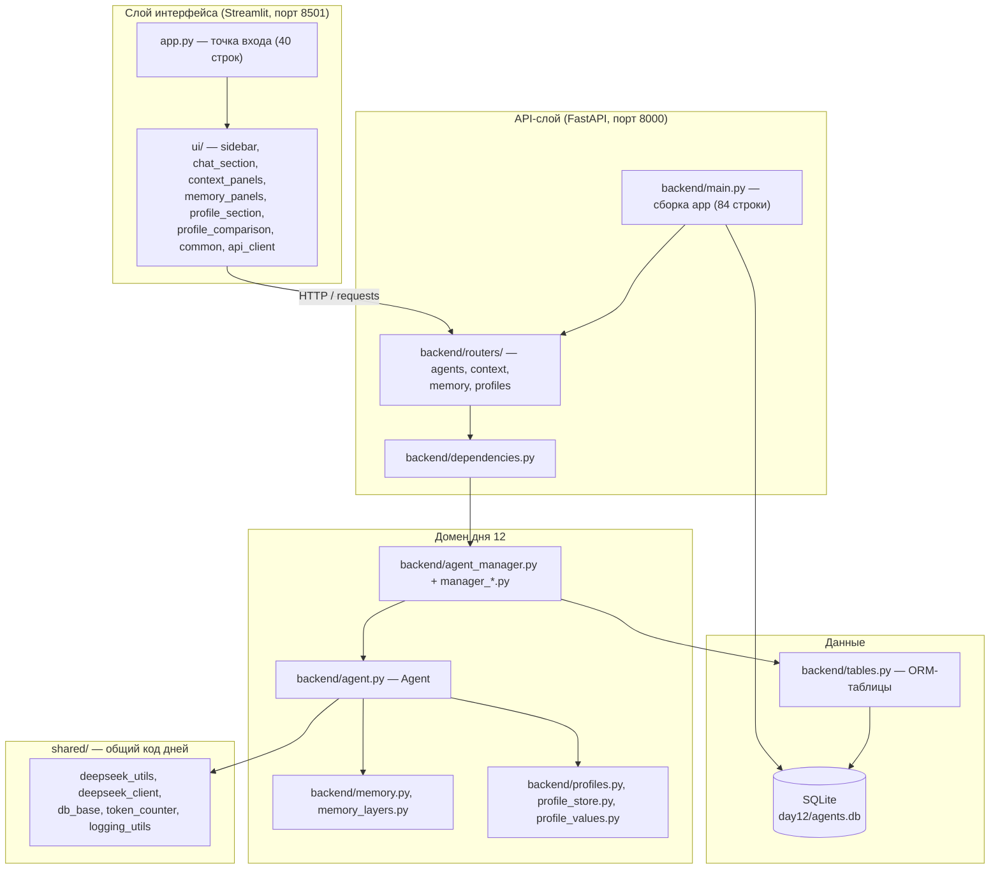

# Архитектура проекта

Документ описывает **междневные** слои репозитория: общий пакет
[`shared/`](../shared/), политику папок `dayN/` и модульную раскладку активного
дня 12. Устройство конкретного дня — в `docs/` внутри его папки (день 12:
[`../day12/docs/architecture.md`](../day12/docs/architecture.md)); карта модулей
дня — [`../day12/STRUCTURE.md`](../day12/STRUCTURE.md).

## Политика папок: снимки и активная разработка

| Папка | Статус | Что это значит |
|---|---|---|
| `day1/`–`day11/` | **снимки** | код сдан и не изменяется; правка — только по прямому запросу пользователя |
| `day12/` | **активная разработка** | здесь применяются правила структуры из [`AGENTS.md`](../AGENTS.md) |
| `shared/` | общий пакет | код, не меняющийся между днями; дни импортируют его, а не копируют |

## Модульная структура

До рефакторинга (коммит `9c7021c`, 2026-09-15) приложение дня было набором
крупных файлов: `day12/app.py` — 1852 строки, `backend/main.py` — 660,
`backend/agent_manager.py` — 637, `backend/models.py` — 845,
`backend/database.py` — 425, `backend/profiles.py` — 343. Логика интерфейса,
эндпоинты, схемы и ORM лежали в одном слое, а общий код дублировался по дням.
**Сейчас архитектура дня 12 — модульная**: интерфейс разложен по секциям
(`ui/`), эндпоинты — по доменам (`backend/routers/`), схемы API — по доменам
(`backend/models/`), ORM вынесена в `backend/tables.py`, класс менеджера собран
из миксинов `backend/manager_*.py`, а междневный код живёт в `shared/`.

### `shared/` — общие утилиты, используемые днями

| Модуль | Публичные имена | Назначение |
|---|---|---|
| `shared/deepseek_utils.py` | `DEEPSEEK_BASE_URL`, `read_key_from_env_file`, `parse_stop_sequences`, `usage_to_dict` | Endpoint DeepSeek (OpenAI-совместимый), чтение `DEEPSEEK_API_KEY` из `.env`, разбор stop-строк из UI, объект `Usage` → обычный dict |
| `shared/deepseek_client.py` | `make_client`, `DEFAULT_TIMEOUT` | Клиент OpenAI SDK для DeepSeek; пакет `openai` импортируется лениво внутри функции |
| `shared/db_base.py` | `Base`, `make_engine`, `init_db`, `make_session_factory` | Декларативная база SQLAlchemy, движок SQLite (`check_same_thread=False`, `PRAGMA foreign_keys=ON`), создание таблиц, фабрика сессий |
| `shared/token_counter.py` | `count_tokens`, `get_tokenizer` | Локальная оценка токенов через tiktoken (`cl100k_base`), кодировка кэшируется на процесс, `tiktoken` импортируется лениво |
| `shared/logging_utils.py` | `get_logger`, `configure_logging`, `DEFAULT_FORMAT` | Единственный источник настроек логирования: `get_logger` не добавляет хендлеров (вывод по умолчанию выключен), включение — явный `configure_logging()` |

Кто подключает `shared/` сегодня: `day2/app.py` и `day3/app.py`
(`deepseek_utils`), `day12/backend/*` (все пять модулей). Дни 1, 4–11 автономны.
Для новых дней `shared/` — обязательное место для междневного кода
(см. [`AGENTS.md`](../AGENTS.md), раздел «Структура файлов»).

### `day12/ui/` — Streamlit UI, разбитый по секциям

| Модуль | Строк | Зона ответственности |
|---|---|---|
| `ui/__init__.py` | 6 | Описание пакета; ни один модуль не выполняет `st.*` на импорте |
| `ui/api_client.py` | 267 | HTTP-транспорт к бэкенду: `requests`, `BACKEND_URL` (переопределяется `DAY12_BACKEND_URL`), ошибка `BackendError`; не зависит от Streamlit и pandas |
| `ui/common.py` | 180 | Подписи, форматтеры, `st.session_state`: инициализация, флеш-сообщения, список агентов и активный агент |
| `ui/sidebar.py` | 191 | Боковая панель: список агентов, создание агента, стратегия, задача и сессия (`render_sidebar()`) |
| `ui/chat_section.py` | 254 | Раздел «💬 Чат и память»: карточка агента, панели, диалог, форма ввода (`render_main_area()`) |
| `ui/context_panels.py` | 324 | Панели контекста: токены диалога, сжатие, сравнение режимов, ветки, факты |
| `ui/memory_panels.py` | 229 | Панели трёх слоёв памяти и индикатор «что ушло в последний запрос» |
| `ui/profile_section.py` | 322 | Раздел «👤 Профиль пользователя»: CRUD профилей, предпросмотр блока промпта, сравнение |
| `ui/profile_comparison.py` | 129 | Сравнение двух профилей на одном вопросе через временных агентов |

Точка входа `day12/app.py` (40 строк) не содержит логики панелей: он вызывает
`common.init_state()`, `sidebar.render_sidebar()`, `chat_section.render_main_area()`.

### `day12/backend/routers/` — FastAPI-роутеры по доменам

| Роутер | Строк | Эндпоинтов | Домен |
|---|---|---|---|
| `routers/agents.py` | 243 | 11 | CRUD агентов, генерация, диалог, статистика токенов |
| `routers/context.py` | 140 | 9 | Сжатие истории, стратегии, ветки, факты |
| `routers/memory.py` | 180 | 10 | Три слоя памяти: `/memory/short-term`, `/memory/working`, `/memory/long-term`, сессия и задача |
| `routers/profiles.py` | 126 | 6 | Профили пользователей (`/users...`) и `GET /agents/{id}/profile` |

Всего — **36 эндпоинтов**. Пути внутри роутеров абсолютные (`/agents/...`),
префиксы не используются; подключение — в `backend/main.py`
(`app.include_router(...)`). Доступ к менеджеру агентов и обработка «агента нет»
(404) — в `backend/dependencies.py`, поэтому тесты подменяют одну точку
(`main.get_manager`).

### `day12/backend/models/` — схемы API по доменам

| Модуль | Строк | Домен |
|---|---|---|
| `models/agent.py` | 315 | Конфигурация/патч агента, тела и ответы генерации, метрики токенов |
| `models/context.py` | 218 | Сжатие истории, стратегии, ветки, факты |
| `models/memory.py` | 173 | Три слоя памяти агента |
| `models/profile.py` | 170 | Профиль пользователя и его вклад в промпт |
| `models/__init__.py` | 122 | Реэкспорт всех схем — остальной код импортирует их из `backend.models` |

`backend/models/` содержит **Pydantic-схемы API**, а не ORM. **SQLAlchemy-модели
(таблицы)** дня 12 лежат в `backend/tables.py` (383 строки: `AgentRecord`,
`ShortTermMessage`, `WorkingMemory`, `LongTermMemory`, `Summary`, `TokenUsage`,
`Fact`, `Checkpoint`, `UserProfile`) и реэкспортируются через
`backend/database.py`, который создаёт движок и фабрику сессий общими
помощниками `shared/db_base.py`. Такое распределение имён (`models/` — схемы,
`tables.py` — таблицы) — известное расхождение с целевой раскладкой `AGENTS.md`
(`models/` — ORM, `schemas/` — Pydantic), зафиксированное в разделе «Известные
расхождения со снимками».

### Остальные модули дня 12

| Модуль | Строк | Назначение |
|---|---|---|
| `backend/config.py` | 148 | URL и модели DeepSeek, дефолты агента, лимиты и цены, настройки сжатия/стратегий/памяти/профиля, путь к `day12/agents.db` и `.env` |
| `backend/strategies.py` | 62 | `Enum Strategy` (`sliding_window` / `sticky_facts` / `branching` / `summary`) и проверка значения |
| `backend/context_fsm.py` | 256 | Стейт-машина сжатия: `Enum` + паттерн State (цель `AGENTS.md`) |
| `backend/context_policy.py` | 173 | Чистая арифметика «когда сжимать и что оставить» |
| `backend/fact_extractor.py` | 96 | Эвристика извлечения фактов «ключ → значение» |
| `backend/memory_layers.py` | 143 | Словари-представления слоёв памяти и их тексты |
| `backend/memory.py` | 286 | `MemoryManager`: хранение трёх слоёв памяти |
| `backend/profile_values.py` | 335 | Перечисления и нормализация значений профиля |
| `backend/profiles.py` | 204 | Сборка блока персонализации для системного промпта |
| `backend/profile_store.py` | 291 | Чтение/запись профиля пользователя в SQLite |
| `backend/demo_profiles.py` | 107 | Демонстрационные профили для UI и отчёта |
| `backend/compressor.py` | 326 | `ContextCompressor`: план сжатия, суммаризация, запись конспекта |
| `backend/agent.py` | 1515 | `Agent`: память, токены, `prepare_context`, стратегии, факты, ветки, профиль (⚠️ превышает лимит 400 строк) |
| `backend/manager_*.py` | 88–233 | Миксины `AgentManager`: агенты, контекст, память, профили, статистика |
| `backend/agent_manager.py` | 71 | `AgentManager` — синглтон из миксинов |
| `backend/dependencies.py` | 25 | Зависимости API-слоя: `get_manager`, `agent_or_404` |
| `backend/main.py` | 84 | Сборка `app`: `lifespan` (создание таблиц + восстановление агентов), CORS, `include_router` |

## Как день 12 использует `shared/`

Корень репозитория добавляется в `sys.path` в `day12/backend/__init__.py`
(`Path(__file__).resolve().parents[2]`), поэтому модули дня импортируют общий
пакет напрямую, без правок в тестах и без копий кода:

| Модуль дня | Импорт из `shared/` | Зачем |
|---|---|---|
| `backend/agent.py` | `deepseek_client.make_client`, `token_counter.count_tokens` | Клиент DeepSeek на каждый агент и локальный подсчёт токенов контекста |
| `backend/config.py` | `deepseek_utils.DEEPSEEK_BASE_URL`, `read_key_from_env_file` | Адрес API и чтение `DEEPSEEK_API_KEY` из `.env` дня |
| `backend/database.py` | `db_base.Base`, `init_db`, `make_engine`, `make_session_factory` | Движок и сессии SQLite (`check_same_thread=False`, `PRAGMA foreign_keys=ON`) |
| `backend/tables.py` | `db_base.Base` | База для ORM-классов дня |
| `backend/main.py` | `logging_utils.get_logger` | Логгер бэкенда; вывод включается только явным `configure_logging()` |

## Инварианты структуры

- Любой `.py` — **не больше 400 строк**; `app.py` ≤ 100, `backend/main.py` ≤ 80
  (команда проверки — в `AGENTS.md`, раздел «Структура файлов»).
- `shared/` — единственное место для кода, не меняющегося между днями; копия
  того же кода в `dayN/` и `dayN+1/` запрещена.
- Снимки `day1/`–`day11/` не переписываются под новые правила.
- Каждый новый день ведёт `STRUCTURE.md` со списком модулей; междневные
  изменения фиксируются в [`../CHANGELOG.md`](../CHANGELOG.md).
