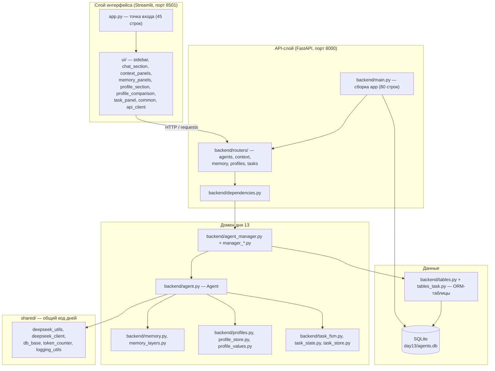

# Архитектура проекта

Документ описывает **междневные** слои репозитория: общий пакет
[`shared/`](../shared/), политику папок `dayN/` и модульную раскладку активного
дня 13. Устройство конкретного дня — в `docs/` внутри его папки (день 13:
[`../day13/docs/architecture.md`](../day13/docs/architecture.md)); карта модулей
дня — [`../day13/STRUCTURE.md`](../day13/STRUCTURE.md).

## Политика папок: снимки и активная разработка

| Папка | Статус | Что это значит |
|---|---|---|
| `day1/`–`day12/` | **снимки** | код сдан и не изменяется; правка — только по прямому запросу пользователя |
| `day13/` | **активная разработка** | здесь применяются правила структуры из [`AGENTS.md`](../AGENTS.md) |
| `shared/` | общий пакет | код, не меняющийся между днями; дни импортируют его, а не копируют |

## Модульная структура

Модульная раскладка пришла в день 13 из дня 12: до рефакторинга (коммит
`9c7021c`, 2026-09-15) приложение дня было набором крупных файлов
(`day12/app.py` — 1852 строки, `backend/main.py` — 660,
`backend/agent_manager.py` — 637, `backend/models.py` — 845,
`backend/database.py` — 425, `backend/profiles.py` — 343). Логика интерфейса,
эндпоинты, схемы и ORM лежали в одном слое, а общий код дублировался по дням.
**Сейчас архитектура дня 13 — модульная**: интерфейс разложен по секциям
(`ui/`), эндпоинты — по доменам (`backend/routers/`), схемы API — по доменам
(`backend/models/`), ORM вынесена в `backend/tables.py` и
`backend/tables_task.py`, класс менеджера собран из миксинов
`backend/manager_*.py`, состояние задачи живёт в `backend/task_*.py`, а
междневный код — в `shared/`.

### `shared/` — общие утилиты, используемые днями

| Модуль | Публичные имена | Назначение |
|---|---|---|
| `shared/deepseek_utils.py` | `DEEPSEEK_BASE_URL`, `read_key_from_env_file`, `parse_stop_sequences`, `usage_to_dict` | Endpoint DeepSeek (OpenAI-совместимый), чтение `DEEPSEEK_API_KEY` из `.env`, разбор stop-строк из UI, объект `Usage` → обычный dict |
| `shared/deepseek_client.py` | `make_client`, `DEFAULT_TIMEOUT` | Клиент OpenAI SDK для DeepSeek; пакет `openai` импортируется лениво внутри функции |
| `shared/db_base.py` | `Base`, `make_engine`, `init_db`, `make_session_factory` | Декларативная база SQLAlchemy, движок SQLite (`check_same_thread=False`, `PRAGMA foreign_keys=ON`), создание таблиц, фабрика сессий |
| `shared/token_counter.py` | `count_tokens`, `get_tokenizer` | Локальная оценка токенов через tiktoken (`cl100k_base`), кодировка кэшируется на процесс, `tiktoken` импортируется лениво |
| `shared/logging_utils.py` | `get_logger`, `configure_logging`, `DEFAULT_FORMAT` | Единственный источник настроек логирования: `get_logger` не добавляет хендлеров (вывод по умолчанию выключен), включение — явный `configure_logging()` |

Кто подключает `shared/` сегодня: `day2/app.py` и `day3/app.py`
(`deepseek_utils`), `day13/backend/*` (все пять модулей). Дни 1, 4–11
автономны, `day12/` — снимок той же архитектуры, что и день 13.
Для новых дней `shared/` — обязательное место для междневного кода
(см. [`AGENTS.md`](../AGENTS.md), раздел «Структура файлов»).

### `day13/ui/` — Streamlit UI, разбитый по секциям

| Модуль | Строк | Зона ответственности |
|---|---|---|
| `ui/__init__.py` | 6 | Описание пакета; ни один модуль не выполняет `st.*` на импорте |
| `ui/api_client.py` | 327 | HTTP-транспорт к бэкенду: `requests`, `BACKEND_URL` (переопределяется `DAY13_BACKEND_URL`), ошибка `BackendError`; функции состояния задачи (`api_*_task*`); не зависит от Streamlit и pandas |
| `ui/common.py` | 190 | Подписи (включая `TASK_STAGE_LABELS`), форматтеры, `st.session_state`: инициализация, флеш-сообщения, список агентов и активный агент |
| `ui/sidebar.py` | 191 | Боковая панель: список агентов, создание агента, стратегия, задача и сессия (`render_sidebar()`) |
| `ui/chat_section.py` | 260 | Основная область: переключатель трёх разделов («💬 Чат и память», «👤 Профиль пользователя», «🧭 Состояние задачи») и сборка страницы (`render_main_area()`) |
| `ui/context_panels.py` | 324 | Панели контекста: токены диалога, сжатие, сравнение режимов, ветки, факты |
| `ui/memory_panels.py` | 229 | Панели трёх слоёв памяти и индикатор «что ушло в последний запрос» |
| `ui/profile_section.py` | 322 | Раздел «👤 Профиль пользователя»: CRUD профилей, предпросмотр блока промпта, сравнение |
| `ui/profile_comparison.py` | 129 | Сравнение двух профилей на одном вопросе через временных агентов |
| `ui/task_panel.py` | 200 | Раздел «🧭 Состояние задачи»: этап, шаг, ожидаемое действие, ASCII-схема FSM, пять кнопок, журнал переходов |

Точка входа `day13/app.py` (45 строк) не содержит логики панелей: он вызывает
`common.init_state()`, `sidebar.render_sidebar()`, `chat_section.render_main_area()`.

### `day13/backend/routers/` — FastAPI-роутеры по доменам

| Роутер | Строк | Эндпоинтов | Домен |
|---|---|---|---|
| `routers/agents.py` | 253 | 11 | CRUD агентов, генерация, диалог, статистика токенов |
| `routers/context.py` | 140 | 9 | Сжатие истории, стратегии, ветки, факты |
| `routers/memory.py` | 180 | 10 | Три слоя памяти: `/memory/short-term`, `/memory/working`, `/memory/long-term`, сессия и задача |
| `routers/profiles.py` | 126 | 6 | Профили пользователей (`/users...`) и `GET /agents/{id}/profile` |
| `routers/tasks.py` | 183 | 9 | Состояние задачи: создание и список (`/agents/{id}/tasks`), чтение, журнал, пауза, продолжение, шаг, откат, переход |

Всего — **45 эндпоинтов** (36 унаследованных от дня 12 + 9 новых). Пути внутри
роутеров абсолютные (`/agents/...`), префиксы не используются; подключение — в
`backend/main.py` (`app.include_router(...)`). Доступ к менеджеру агентов,
обработка «агента нет» (404) и «задачи нет» (404) — в
`backend/dependencies.py` (`get_manager`, `agent_or_404`, `task_or_404`),
поэтому тесты подменяют одну точку (`main.get_manager`). Недопустимый переход
состояния задачи (`InvalidTaskTransition`/`UnknownTaskEvent`) роутер отдаёт
кодом 400, повторный `task_id` (`TaskExistsError`) — 409.

### `day13/backend/models/` — схемы API по доменам

| Модуль | Строк | Домен |
|---|---|---|
| `models/agent.py` | 319 | Конфигурация/патч агента, тела и ответы генерации (включая поле `task_state`), метрики токенов |
| `models/context.py` | 218 | Сжатие истории, стратегии, ветки, факты |
| `models/memory.py` | 173 | Три слоя памяти агента |
| `models/profile.py` | 170 | Профиль пользователя и его вклад в промпт |
| `models/task.py` | 122 | Состояние задачи: этап, шаг, ожидаемое действие, переходы, журнал |
| `models/__init__.py` | 138 | Реэкспорт всех схем — остальной код импортирует их из `backend.models` |

`backend/models/` содержит **Pydantic-схемы API**, а не ORM. **SQLAlchemy-модели
(таблицы)** дня 13 лежат в `backend/tables.py` (393 строки: `AgentRecord`,
`ShortTermMessage`, `WorkingMemory`, `LongTermMemory`, `Summary`, `TokenUsage`,
`Fact`, `Checkpoint`, `UserProfile`) и `backend/tables_task.py` (102 строки:
`TaskState` — `task_states`, `TaskTransition` — `task_transitions`); обе группы
реэкспортируются через `backend/database.py`, который создаёт движок и фабрику
сессий общими помощниками `shared/db_base.py`.

ORM дня 13 разложен на два модуля из-за лимита 400 строк: добавление двух таблиц
состояния задачи вывело бы `tables.py` за лимит, поэтому по скиллу
`fastapi-streamlit-day-structure` домен разделён (`tables.py` — агент, память,
профиль; `tables_task.py` — состояние задачи). Такое же распределение имён
(`models/` — схемы, `tables*.py` — таблицы) — известное расхождение с целевой
раскладкой `AGENTS.md` (`models/` — ORM, `schemas/` — Pydantic),
зафиксированное в разделе «Известные расхождения со снимками».

### Остальные модули дня 13

| Модуль | Строк | Назначение |
|---|---|---|
| `backend/config.py` | 156 | URL и модели DeepSeek, дефолты агента, лимиты и цены, настройки сжатия/стратегий/памяти/профиля, границы полей состояния задачи, путь к `day13/agents.db` и `.env` |
| `backend/strategies.py` | 62 | `Enum Strategy` (`sliding_window` / `sticky_facts` / `branching` / `summary`) и проверка значения |
| `backend/context_fsm.py` | 256 | Стейт-машина сжатия: `Enum` + паттерн State (цель `AGENTS.md`) |
| `backend/task_fsm.py` | 387 | Стейт-машина состояния задачи: `TaskStage`/`TaskStep`/`TaskEvent`, классы-этапы с `handle(event, step)`, таблицы `STAGE_STEPS`/`STAGE_TRANSITIONS` (цель `AGENTS.md`) |
| `backend/task_prompt.py` | 174 | Тексты блока состояния для системного промпта: ожидаемые действия, завершённые этапы, `render_task_state_block` |
| `backend/task_intent.py` | 89 | Распознавание намерения в реплике (`пауза` / `продолжи` / `откат` / `подтверждаю`) по таблице фраз с приоритетом групп |
| `backend/task_store.py` | 209 | `TaskStateStore` — единственное место работы с таблицами `task_states`/`task_transitions` (чтение, журнал, запись перехода) |
| `backend/task_state.py` | 268 | `TaskStateMachine`: публичный контракт переходов (`create`/`pause`/`resume`/`advance`/`rollback`/`transition_to`) и валидация |
| `backend/context_policy.py` | 173 | Чистая арифметика «когда сжимать и что оставить» |
| `backend/fact_extractor.py` | 96 | Эвристика извлечения фактов «ключ → значение» |
| `backend/memory_layers.py` | 143 | Словари-представления слоёв памяти и их тексты |
| `backend/memory.py` | 286 | `MemoryManager`: хранение трёх слоёв памяти |
| `backend/profile_values.py` | 335 | Перечисления и нормализация значений профиля |
| `backend/profiles.py` | 204 | Сборка блока персонализации для системного промпта |
| `backend/profile_store.py` | 291 | Чтение/запись профиля пользователя в SQLite |
| `backend/demo_profiles.py` | 107 | Демонстрационные профили для UI и отчёта |
| `backend/compressor.py` | 326 | `ContextCompressor`: план сжатия, суммаризация, запись конспекта |
| `backend/agent.py` | 1597 | `Agent`: память, токены, `prepare_context`, стратегии, факты, ветки, профиль, состояние задачи (`task_state`, `task_state_block`, `apply_task_intent`) (⚠️ превышает лимит 400 строк) |
| `backend/manager_*.py` | 88–249 | Миксины `AgentManager`: агенты, контекст, память, профили, статистика, задачи |
| `backend/agent_manager.py` | 74 | `AgentManager` — синглтон из миксинов |
| `backend/dependencies.py` | 34 | Зависимости API-слоя: `get_manager`, `agent_or_404`, `task_or_404` |
| `backend/main.py` | 80 | Сборка `app`: `lifespan` (создание таблиц + восстановление агентов), CORS, `include_router` |

## Как день 13 использует `shared/`

Корень репозитория добавляется в `sys.path` в `day13/backend/__init__.py`
(`Path(__file__).resolve().parents[2]`), поэтому модули дня импортируют общий
пакет напрямую, без правок в тестах и без копий кода:

| Модуль дня | Импорт из `shared/` | Зачем |
|---|---|---|
| `backend/agent.py` | `deepseek_client.make_client`, `token_counter.count_tokens`, `logging_utils.get_logger` | Клиент DeepSeek на каждый агент, локальный подсчёт токенов контекста, лог неприменимого намерения из реплики |
| `backend/config.py` | `deepseek_utils.DEEPSEEK_BASE_URL`, `read_key_from_env_file` | Адрес API и чтение `DEEPSEEK_API_KEY` из `.env` дня |
| `backend/database.py` | `db_base.Base`, `init_db`, `make_engine`, `make_session_factory` | Движок и сессии SQLite (`check_same_thread=False`, `PRAGMA foreign_keys=ON`) |
| `backend/tables.py` | `db_base.Base` | База для ORM-классов дня |
| `backend/tables_task.py` | `db_base.Base` | База для ORM-классов состояния задачи |
| `backend/task_store.py` | `logging_utils.get_logger` | Отладочный лог записанного перехода |
| `backend/main.py` | `logging_utils.get_logger` | Логгер бэкенда; вывод включается только явным `configure_logging()` |

## Инварианты структуры

- Любой `.py` — **не больше 400 строк**; `app.py` ≤ 100, `backend/main.py` ≤ 80
  (команда проверки — в `AGENTS.md`, раздел «Структура файлов»).
- `shared/` — единственное место для кода, не меняющегося между днями; копия
  того же кода в `dayN/` и `dayN+1/` запрещена.
- Снимки `day1/`–`day12/` не переписываются под новые правила.
- Каждый новый день ведёт `STRUCTURE.md` со списком модулей; междневные
  изменения фиксируются в [`../CHANGELOG.md`](../CHANGELOG.md).
